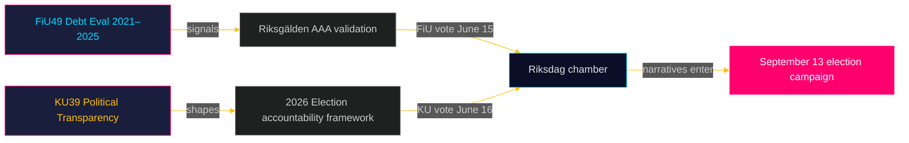

<!-- dir: rtl -->
# תקציר מנהלים: דוחות ועדות הריקסדאג — 5 במאי 2026
**מחבר**: ג'יימס פת'ר סורלינג  
**תאריך**: 2026-05-05  
**סיווג**: ציבורי — תקנת GDPR סעיף 9(2)(ה)(ו)  
**רמת ביטחון**: גבוהה [B2]

---

## 🎯 BLUF

שני דוחות מתוכננים מוועדת האוצר (FiU49) ומוועדת החוקה (KU39) מסמנים את סדר היום החקיקתי של שוודיה בספרינט האחרון לפני בחירות הריקסדאג ב-13 בספטמבר 2026. הערכת FiU49 של הלוואות המדינה וניהול החוב 2021–2025 מאמתת את החוסן הפיננסי השוודי בתקופת סערה מוניטרית יוצאת דופן; מחויבות KU39 ל"שקיפות מוגברת בתהליכים פוליטיים" היא המסמך המשמעותי ביותר בציקל זה לאור השלכותיו על אחריותיות דמוקרטית ארבעה חודשים לפני יום הבחירות. שני הדוחות עדיין לא פורסמו (מצב: מתוכנן), אך כינוייהם הוועדתיים, הדיונים המתוכננים (15–16 ביוני) וההקשר החקיקתי מאפשרים הערכת מודיעין ברמת ביטחון גבוהה.

---

## 🧭 3 החלטות שתקציר זה תומך בהן

1. **מעקב אחר החברה האזרחית והאופוזיציה**: היקף השקיפות של KU39 — האם הוא מכסה מימון מפלגות, רישומי לוביסטים או תקשורת פוליטית דיגיטלית — יקבע אילו מנגנוני אחריותיות יהיו קיימים לקמפיין הבחירות בספטמבר 2026. עקוב אחר פרסום טקסט KU39 (מוערך 2026-06-09) כעדיפות מודיעינית ראשית.

2. **בעלי עניין בשווקים פיסקאליים ושווקי אגרות חוב**: הערכת FiU49 של ביצועי ריקסגולדן 2021–2025 מכסה את תקופת הלחץ הפיננסי החריף ביותר שלאחר המגיפה בשוודיה. מסקנות הוועדה לגבי עלויות אשראי ואסטרטגיית חוב יסמנו האם דירוג האשראי AAA של שוודיה נשאר בלתי מעורער לקראת המחזור הבחירותי.

3. **עבודת מודיעין לקמפיין בחירות**: הדיון בלשכה ב-15–16 ביוני על FiU49 ו-KU39 — חמישה שבועות לפני הפגרה הקיצית ושמונה שבועות לפני שיא הקמפיין — מייצג את ההזדמנות הפרלמנטרית הגדולה האחרונה לעצב נרטיבים פיסקאליים ושל אחריותיות דמוקרטית לפני ה-13 בספטמבר. עקוב אחר נאומים והסתייגויות מפלגתיות לאותות מסרי קמפיין.

---

## ⚡ תקציר מודיעיני ב-60 שניות

- **FiU49 (ועדת האוצר)**: הערכה פרלמנטרית של חוב המדינה השוודית 2021–2025. מתייחס ל-Skrivelse 2025/26:104. מכסה פעילויות ריקסגולדן במהלך הלוואות חירום של COVID (2021), גל האינפלציה (2022), הידוק הריקסבנק ל-4% (2022–2023) והרפיה הדרגתית (2024–2025). החוב הברוטו השוודי (WEO: GGXWDG_NGDP) הגיע לשיא של ~39% מהתמ"ג ב-2022, עם מגמה לכיוון ~35% עד 2025. אישור ועדתי כמעט פה-אחד צפוי; המשמעות טמונה בפיקוח ובאחריותיות, לא בשינויי מדיניות.

- **KU39 (ועדת החוקה)**: "שקיפות מוגברת בתהליכים פוליטיים" — הכותרת לבדה מסמנת היקף חוקתי. עיקרון הפומביות השוודי (offentlighetsprincipen) מעוגן ב-TF (חוק חופש העיתונות). כל הרחבה למפלגות פוליטיות, מימון קמפיינים, לוביזם או פרסום פוליטי דיגיטלי נכנסת לתחום ה-RF (צורת הממשל). לוח זמנים: הוכרז 4 חודשים לפני הבחירות. הסתייגויות מיעוט מ-S ו-SD צפויות (הגנת מסגרות אטימות מימון המפלגות הנוכחיות). תמיכה רחבה צפויה מ-C, L, MP, V בצעדי שקיפות ליבה.

- **קרבה לבחירות**: 2026-05-05 הוא 131 ימים לפני 2026-09-13. מכפיל DIW 1.5× מיושם עבור KU39 (הצעות אופוזיציה / תחום מדיניות שנוי במחלוקת). KU39 מקבל דירוג מודיעיני L3.

---

## 🔮 טריגר עתידי מוביל

**[2026-06-09, גבוה, KU39]** — פרסום KU39: טקסט רפורמת השקיפות החוקתית חושף את ההיקף. אם הוא כולל רישום לוביסטים מחייב או דרישות לדיווח על מימון מפלגות, הסתייגות משותפת של SD/S וסערת תקשורת צפויות. אם מוגבל לשיפורים פרוצדורליים, צפוי אישור שקט. עקוב אחר `riksdagen.se/betankanden` לפרסום.

---

## תוספות מעבר 2 — הערכת מודיעין משופרת

### הקשר כלכלי (מקור קרן המטבע הבינלאומית)
המצב הפיננסי של שוודיה בתחילת מחזור ועדות KU39/FiU49:
- **חוב ברוטו ~35% מהתמ"ג** (WEO אוקטובר 2025؛ economicProvenance.provider: imf؛ vintage: WEO-Oct-2025؛ note: live fetch partial failure)
- **KPIF התייצב על ~2%** (חזר ליעד משיא של 10.9% בדצמבר 2022)
- **ריבית ריקסבנק ~2%** (נרמלה משיא של 4% במאי 2023)
- **נטיית שוודיה לעודפים פיסקאליים**: התקציב מתגבש לאחר המגיפה
- **לחץ הוצאות ביטחון**: מחויבות נאט"ו ל-2% דורשת 80–120 מיליארד כתר שוודי נוסף בשנה עד 2028 — לא משתקף בחלון הערכה של FiU49

### הערכת אותות משולבת
שילוב FiU49 (יציבות פיננסית מאושרת) + KU39 (ארכיטקטורה דמוקרטית מוסדרת) מייצג את הריקסדאג ממלא בו-זמנית שתי פונקציות אחריותיות חיוניות שלפני הבחירות: אישור ניהול כלכלת הממשלה ועיצוב מחדש של הכללים שלפיהם תידרש הממשלה הבאה לאחריותיות. עצם השלמתן בישיבה האחרונה לפני הפגרה הקיצית (15–16 ביוני) משמעותית מבחינה חוקתית.

<!-- source-sha: b5d10858f4d82b9b502512cd3ecbf7e174e813ae -->
