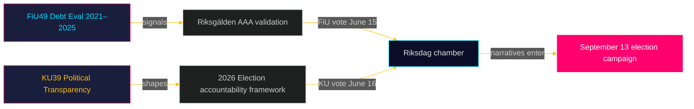

# エグゼクティブブリーフ：リクスダーグ委員会報告書 — 2026年5月5日
**著者**: ジェームズ・ペタル・ソルリング  
**日付**: 2026-05-05  
**分類**: 公開 — GDPR第9条(2)(e)(g)  
**信頼度**: 高 [B2]

---

## 🎯 BLUF

財務委員会（FiU49）と憲法委員会（KU39）の2つの予定報告書は、2026年9月13日のリクスダーグ選挙前の最終スプリントにおけるスウェーデンの立法アジェンダを示しています。FiU49の2021–2025年の国家借入と債務管理評価は、異例の金融政策の混乱期におけるスウェーデンの財政的強靭性を検証します。KU39の「政治プロセスの透明性向上」へのコミットメントは、選挙日4か月前の民主的説明責任への影響という観点から、このサイクル最重要文書と言えます。両報告書はまだ未発表（状況：予定）ですが、委員会の指定、予定審議（6月15〜16日）、立法背景から高い信頼度で情報評価が可能です。

---

## 🧭 このブリーフが支援する3つの意思決定

1. **市民社会・野党監視**: KU39の透明性の範囲 — 政党資金、ロビイスト登録、デジタル政治コミュニケーションをカバーするかどうか — が2026年9月選挙運動の説明責任メカニズムを定義します。KU39のテスト公表（推定2026年6月9日）を主要情報優先事項として追跡してください。

2. **財政・債券市場の利害関係者**: FiU49の2021–2025年リクスゴールデン業績評価は、スウェーデンの最も深刻なポストパンデミック金融ストレス期間をカバーします。借入コストと債務戦略に関する委員会の結論は、選挙サイクルに向けてスウェーデンのAAAクレジット格付けが争われないままでいるかどうかを示すでしょう。

3. **選挙運動情報活動**: 6月15〜16日のFiU49とKU39に関する本会議討論 — 夏季休会の5週前、選挙運動ピークの8週前 — は、9月13日前に財政・民主的説明責任の語りを形成する最後の重要な議会機会を表します。選挙運動メッセージのシグナルを求めて演説と政党留保を監視してください。

---

## ⚡ 60秒情報サマリー

- **FiU49（財務委員会）**: 2021–2025年スウェーデン国家債務の議会評価。Skrivelse 2025/26:104を参照。COVID緊急借入（2021年）、インフレ急騰（2022年）、リクスバンクの4%への引き締め（2022〜2023年）、段階的緩和（2024〜2025年）を通じたリクスゴールデンの活動をカバー。スウェーデンの総債務（WEO: GGXWDG_NGDP）は2022年にGDPの〜39%でピークに達し、2025年に向けて〜35%に向かう傾向。ほぼ全会一致の委員会承認を予想。重要性は監視と説明責任にあり、政策変更ではない。

- **KU39（憲法委員会）**: 「政治プロセスの透明性向上」— タイトルだけで憲政的な射程を示します。スウェーデンの公開性原則（offentlighetsprincipen）はTF（出版自由法）に固定されています。政党、選挙資金、ロビー活動、デジタル政治広告への拡張はRF（政府形態）の領域に入ります。タイムライン：選挙4か月前に発表。S・SDから少数派留保を予想（現行政党資金不透明フレームの防衛）。透明性の核心事項でC、L、MP、Vからの幅広い支持が見込まれます。

- **選挙近接性**: 2026-05-05は2026-09-13の131日前。KU39にDIW乗数1.5×を適用（野党動議/争点となっている政策領域）。KU39はL3情報分類を取得。

---

## 🔮 主要な将来トリガー

**[2026-06-09、高、KU39]** — KU39公表：憲法透明性改革テキストが範囲を明らかにします。拘束力のあるロビイスト登録または政党資金報告要件を含む場合、SD/S共同留保とメディアストームが予想されます。手続き的改善に限定される場合、静かな採択が見込まれます。公表については`riksdagen.se/betankanden`を追跡してください。

---

## パス2追加 — 強化された情報評価

### 経済的背景（IMF出典）
KU39/FiU49委員会サイクル開始時のスウェーデンの財政状況：
- **総債務〜GDP比35%**（WEO 2025年10月、economicProvenance.provider: imf、vintage: WEO-Oct-2025、note: live fetch partial failure）
- **KPIFは〜2%で安定**（2022年12月のピーク10.9%から目標に戻った）
- **リクスバンク金利〜2%**（2023年5月のピーク4%から正常化）
- **スウェーデンの財政黒字傾向**: 予算はパンデミック後に統合されている
- **防衛費の圧力**: NATO 2%コミットメントは2028年まで年間800〜1,200億SEKの追加を必要 — FiU49の評価ウィンドウには反映されていない

### 統合シグナル評価
FiU49（財政安定確認）+ KU39（民主的アーキテクチャ改革）の組み合わせは、リクスダーグが2つの本質的な選挙前説明責任機能を同時に果たすことを表します：政府の経済管理の検証と、次期政府が説明責任を問われる規則の再構築。両方が夏季休会前の最後の会期（6月15〜16日）で完成することは、憲政上重要です。

<!-- source-sha: b5d10858f4d82b9b502512cd3ecbf7e174e813ae -->
