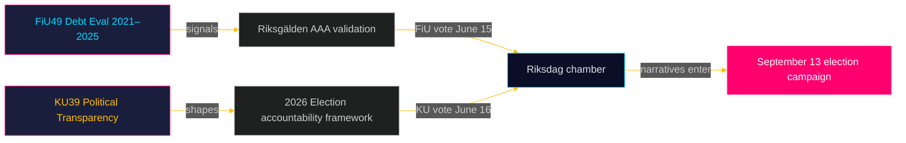

# 집행 브리핑: 릭스다그 위원회 보고서 — 2026년 5월 5일
**저자**: 제임스 페테르 소를링  
**날짜**: 2026-05-05  
**분류**: 공개 — GDPR 제9조(2)(e)(g)  
**신뢰도**: 높음 [B2]

---

## 🎯 BLUF

재정위원회(FiU49)와 헌법위원회(KU39)의 두 예정 보고서는 2026년 9월 13일 릭스다그 선거를 앞둔 마지막 스프린트에서 스웨덴의 입법 의제를 알립니다. FiU49의 2021–2025년 국가 차입 및 부채 관리 평가는 이례적인 통화 혼란 속에서 스웨덴의 재정 회복력을 검증합니다. KU39의 "정치 과정에서의 투명성 강화" 약속은 선거일 4개월 전 민주적 책임에 미치는 영향을 고려할 때 이 사이클에서 가장 중요한 단일 문서입니다. 두 보고서 모두 아직 미발표(상태: 예정)이지만, 위원회 지정, 예정된 토론(6월 15–16일), 입법 맥락이 높은 신뢰도의 정보 평가를 가능하게 합니다.

---

## 🧭 이 브리핑이 지원하는 3가지 결정

1. **시민 사회 및 야당 모니터링**: KU39의 투명성 범위 — 정당 자금, 로비스트 등록부, 디지털 정치 커뮤니케이션을 포함하는지 — 가 2026년 9월 선거 운동에 어떤 책임 메커니즘이 존재할지를 정의합니다. KU39 텍스트 발행(예상 2026-06-09)을 주요 정보 우선순위로 추적하세요.

2. **재정 및 채권 시장 이해관계자**: FiU49의 2021–2025년 릭스골덴 성과 평가는 스웨덴의 가장 급격한 포스트 팬데믹 재정 스트레스 기간을 다룹니다. 차입 비용과 부채 전략에 대한 위원회 결론은 스웨덴의 AAA 신용 등급이 선거 사이클에 들어가며 논란 없이 유지되는지를 알릴 것입니다.

3. **선거 운동 정보 활동**: 6월 15–16일 FiU49와 KU39에 대한 의회 토론 — 여름 휴회 5주 전, 선거 운동 절정 8주 전 — 은 9월 13일 전에 재정 및 민주적 책임 서사를 형성할 마지막 주요 의회 기회를 나타냅니다. 선거 운동 메시지 신호를 위한 연설과 정당 유보를 모니터링하세요.

---

## ⚡ 60초 정보 요약

- **FiU49 (재정위원회)**: 2021–2025년 스웨덴 국가 부채에 대한 의회 평가. Skrivelse 2025/26:104 참조. COVID 긴급 차입(2021년), 인플레이션 급등(2022년), 릭스방크의 4% 긴축(2022–2023년), 단계적 완화(2024–2025년)를 통한 릭스골덴 활동을 다룹니다. 스웨덴의 총 부채(WEO: GGXWDG_NGDP)는 2022년에 GDP의 약 39%로 정점에 달했으며, 2025년까지 약 35%를 향한 추세입니다. 거의 만장일치의 위원회 승인이 예상됩니다; 중요성은 정책 변화가 아닌 감독과 책임에 있습니다.

- **KU39 (헌법위원회)**: "정치 과정에서의 투명성 강화" — 제목만으로도 헌법적 범위를 신호합니다. 스웨덴의 공개성 원칙(offentlighetsprincipen)은 TF(출판 자유법)에 고정되어 있습니다. 정치 정당, 선거 자금, 로비, 디지털 정치 광고로의 확장은 RF(정부 형태)의 영역에 들어갑니다. 타임라인: 선거 4개월 전 발표됨. S와 SD의 소수 유보 예상(현재 정당 자금 불투명성 프레임워크 방어). 투명성 핵심 조치에 대해 C, L, MP, V의 광범위한 지지 가능.

- **선거 근접성**: 2026-05-05는 2026-09-13의 131일 전. KU39에 DIW 승수 1.5× 적용(야당 발의/분쟁 정책 영역). KU39는 L3 정보 분류를 받습니다.

---

## 🔮 선도적 미래 트리거

**[2026-06-09, 높음, KU39]** — KU39 발행: 헌법 투명성 개혁 텍스트가 범위를 드러냅니다. 구속력 있는 로비스트 등록 또는 정당 자금 보고 요건을 포함하는 경우, SD/S 공동 유보와 미디어 폭풍이 예상됩니다. 절차적 개선에 국한되는 경우, 조용한 채택이 예상됩니다. 발행은 `riksdagen.se/betankanden`을 추적하세요.

---

## 패스 2 추가 — 강화된 정보 평가

### 경제적 맥락 (IMF 출처)
KU39/FiU49 위원회 사이클 시작 시 스웨덴의 재정 상황:
- **총 부채 GDP의 약 35%** (WEO 2025년 10월; economicProvenance.provider: imf; vintage: WEO-Oct-2025; note: live fetch partial failure)
- **KPIF 약 2%로 안정화** (2022년 12월 최고치 10.9%에서 목표치로 복귀)
- **릭스방크 금리 약 2%** (2023년 5월 최고치 4%에서 정상화)
- **스웨덴의 재정 흑자 경향**: 예산이 팬데믹 이후 통합
- **국방비 압박**: NATO 2% 약속은 2028년까지 연간 800–1,200억 SEK 추가 필요 — FiU49 평가 기간에 반영되지 않음

### 통합 신호 평가
FiU49(재정 안정성 확인) + KU39(민주적 아키텍처 개혁)의 조합은 릭스다그가 두 가지 필수적인 선거 전 책임 기능을 동시에 수행하는 것을 나타냅니다: 정부의 경제 관리 검증과 차기 정부가 책임을 질 규칙의 재구성. 두 가지 모두 여름 휴회 전 마지막 회기(6월 15–16일)에 완성된다는 것은 헌법적으로 중요합니다.

<!-- source-sha: b5d10858f4d82b9b502512cd3ecbf7e174e813ae -->
