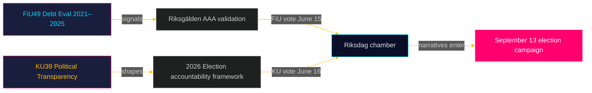

# Uitvoerend briefing: Riksdag commissierapporten — 5 mei 2026
**Auteur**: James Pether Sörling  
**Datum**: 2026-05-05  
**Classificatie**: OPENBAAR — AVG Art. 9(2)(e)(g)  
**Betrouwbaarheid**: HOOG [B2]

---

## 🎯 BLUF

Twee geplande rapporten van de Financiëncommissie (FiU49) en de Grondwetscommissie (KU39) signaleren Zweden's wetgevingsagenda in de laatste sprint voor de Riksdag-verkiezingen van 13 september 2026. FiU49's evaluatie van de staatsschuld en schuldbeheer 2021–2025 valideert Zweden's financiële veerkracht tijdens buitengewone monetaire turbulentie; KU39's engagement voor "verhoogde transparantie in politieke processen" is het afzonderlijk meest significante document van deze cyclus gezien de implicaties voor democratische verantwoording vier maanden voor verkiezingsdag. Beide rapporten zijn nog niet gepubliceerd (status: gepland), maar hun commissie-aanduidingen, geplande debatten (15–16 juni) en wetgevende context maken een hoge-vertrouwen inlichtingenbeoordeling mogelijk.

---

## 🧭 3 beslissingen die deze briefing ondersteunt

1. **Bewaking van het maatschappelijk middenveld en de oppositie**: De transparantiereikwijdte van KU39 — of het partijfinanciering, lobbyregisters of digitale politieke communicatie dekt — bepaalt welke verantwoordingsmechanismen beschikbaar zijn voor de verkiezingscampagne van september 2026. Volg de tekstpublicatie van KU39 (geschat 2026-06-09) als primaire inlichtingenprioriteit.

2. **Fiscale en obligatiemarktbelanghebbenden**: FiU49's evaluatie van de Riksgälden-prestaties 2021–2025 dekt de periode van Zweden's scherpste post-pandemische financiële stress. De conclusies van de commissie over leenkosten en schuld­strategie zullen aangeven of Zweden's AAA-kredietrating onbetwist blijft tot de verkiezingscyclus.

3. **Inlichtingenwerk voor de verkiezingscampagne**: Het kamerdebat van 15–16 juni over FiU49 en KU39 — vijf weken voor de zomerreces en acht weken voor de campagnepiek — vertegenwoordigt de laatste grote parlementaire gelegenheid om fiscale en democratische verantwoordingsnarrativen te vormen voor 13 september. Volg toespraken en partijvoorbehouden op campagneboodschapsignalen.

---

## ⚡ 60-seconden inlichtingensamenvatting

- **FiU49 (Financiëncommissie)**: Parlementaire evaluatie van de Zweedse staatsschuld 2021–2025. Verwijst naar Skrivelse 2025/26:104. Dekt Riksgälden's werkzaamheden tijdens COVID-noodleningen (2021), inflatie-opstoot (2022), Riksbank-verkrapping naar 4% (2022–2023) en geleidelijke versoepeling (2024–2025). Zweden's brutoschulden (WEO: GGXWDG_NGDP) piekte op ~39% van het bbp in 2022, met een trend naar ~35% in 2025. Nagenoeg unaniem commissie­akkoord verwacht; de betekenis ligt in toezicht en verantwoording, niet in beleidswijzigingen.

- **KU39 (Grondwetscommissie)**: "Verhoogde transparantie in politieke processen" — de titel alleen signaleert constitutionele reikwijdte. Zwedens openbaarheidsbeginsel (offentlighetsprincipen) is verankerd in de TF (Persvrijheidswet). Elke uitbreiding naar politieke partijen, campagnefinanciering, lobbying of digitale politieke reclame betreedt het territorium van de RF (Regeringsvorm). Tijdlijn: vier maanden voor de verkiezingen aangekondigd. Minderheidvoorbehouden van S en SD verwacht (verdediging van huidige partijfinancieringskaders). Brede steun waarschijnlijk van C, L, MP, V op kernthema's van transparantie.

- **Verkiezingsnabijheid**: 2026-05-05 is 131 dagen voor 2026-09-13. DIW-vermenigvuldiger 1,5× toegepast voor KU39 (oppositiemoties / betwist beleidsgebied). KU39 krijgt L3-inlichtingenclassificatie.

---

## 🔮 Leidende toekomstige trigger

**[2026-06-09, Hoog, KU39]** — KU39-publicatie: de tekst van de constitutionele transparantiehervormingen onthult de reikwijdte. Als het een bindend lobbyregister of partijfinancieringsrapportageverplichtingen bevat, worden een gezamenlijk SD/S-voorbehoud en een mediastorm verwacht. Als beperkt tot procedurele verbeteringen, wordt stille aanvaarding verwacht. Volg `riksdagen.se/betankanden` voor publicatie.

---

## Pass 2-aanvullingen — Verbeterde inlichtingenbeoordeling

### Economische context (IMF-bron)
Zweden's financiële positie bij aanvang van de KU39/FiU49-commissiecyclus:
- **Brutoschulden ~35% van het bbp** (WEO okt. 2025; economicProvenance.provider: imf; vintage: WEO-Oct-2025; note: live fetch partial failure)
- **KPIF gestabiliseerd ~2%** (teruggekeerd naar doel van piek van 10,9% in december 2022)
- **Riksbank-rente ~2%** (genormaliseerd van piek van 4% in mei 2023)
- **Zweden's neiging tot begrotingsoverschotten**: Het budget consolideert zich na de pandemie
- **Druk op defensie-uitgaven**: NAVO 2%-verbintenis vereist 80–120 miljard SEK extra per jaar tot 2028 — niet weerspiegeld in FiU49's evaluatievenster

### Geïntegreerde signaalbeoor­deling
De combinatie FiU49 (financiële stabiliteit bevestigd) + KU39 (democratische architectuur hervormd) vertegenwoordigt de Riksdag die gelijktijdig twee essentiële pre-verkiezingsverantwoordingsfuncties vervult: validatie van het economisch beheer van de regering en herschikking van de regels waaronder de volgende regering ter verantwoording wordt geroepen. Dat beide worden afgerond in de laatste zitting voor de zomerreces (15–16 juni) is grondwettelijk significant.

<!-- source-sha: b5d10858f4d82b9b502512cd3ecbf7e174e813ae -->
