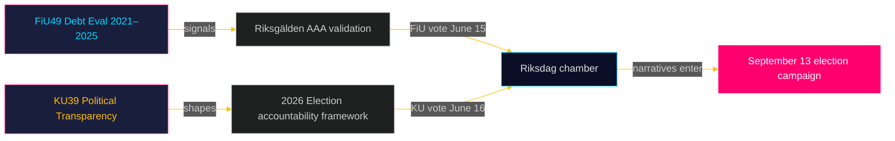

# Utøvende sammendrag: Riksdag-komitérapporter — 5. mai 2026
**Forfatter**: James Pether Sörling  
**Dato**: 2026-05-05  
**Klassifisering**: OFFENTLIG — GDPR Art. 9(2)(e)(g)  
**Konfidens**: HØY [B2]

---

## 🎯 BLUF

To planlagte betenkninger fra Finanskomiteen (FiU49) og Konstitusjonskomiteen (KU39) signaliserer Sveriges lovgivningsagenda i det siste spurtet frem mot Riksdag-valget 13. september 2026. FiU49s evaluering av statens låneopptak og gjeldsforvaltning 2021–2025 validerer Sveriges finansielle robusthet under ekstraordinær monetær turbulens; KU39s forpliktelse om «økt åpenhet i politiske prosesser» er det enkelt mest betydningsfulle dokumentet i denne syklusen gitt dets demokratiske ansvarlighetsmessige implikasjoner fire måneder før valgdagen. Begge betenkninger er ennå upubliserte (status: planlagt), men deres komitédesignasjoner, planlagte debatter (15.–16. juni) og lovgivningsmessige kontekst muliggjør en etterretningsvurdering med høy konfidens.

---

## 🧭 3 beslutninger dette briefet støtter

1. **Overvåking av sivilsamfunn og opposisjon**: KU39s åpenhetsomfang — om det dekker partifinansering, lobbyregistre eller digital politisk kommunikasjon — definerer hvilke ansvarlighetmekanismer som vil eksistere for valgkampen i september 2026. Følg KU39s tekstoffentliggjøring (est. 2026-06-09) som primær etterretningsprioritet.

2. **Finansielle og obligasjonsmarkedsinteressenter**: FiU49s vurdering av Riksgäldens prestasjoner 2021–2025 dekker perioden med Sveriges skarpeste post-pandemiske finansielle stress. Komiteens konklusjoner om lånekostnader og gjeldsstrategi vil signalisere om Sveriges AAA-kreditvurdering forblir uomtvistet inn i valgsyklusen.

3. **Etterretningsarbeid i valgkampen**: Kammerdebatten 15.–16. juni om FiU49 og KU39 — fem uker før sommerrecess og åtte uker før kampanjen topper — representerer den siste store parlamentariske muligheten til å forme finans- og demokratisk-ansvarlighetsnarra­tiver før 13. september. Overvåk taler og partiforbehold for kampanjebudskapssignaler.

---

## ⚡ 60-sekunders etterretningssammendrag

- **FiU49 (Finanskomiteen)**: Parlamentarisk evaluering av Sveriges statsgjeld 2021–2025. Refererer til Skrivelse 2025/26:104. Dekker Riksgäldens innsats gjennom COVID-nødlåneopptak (2021), inflasjonsstigning (2022), Riksbankens innstramming til 4 % (2022–2023), gradvis lempelse (2024–2025). Sveriges bruttogjeld (WEO: GGXWDG_NGDP) toppet ~39 % av BNP i 2022, med trend mot ~35 % innen 2025. Nesten enstemmig komitégodkjennelse forventes; signifikansen er overvåking og ansvarlighet, ikke politikkendring.

- **KU39 (Konstitusjonskomiteen)**: «Økt åpenhet i politiske prosesser» — tittelen alene signaliserer konstitusjonell rekkevidde. Sveriges offentlighetsprinsipp (offentlighetsprincipen) er nedfelt i TF (Trykkfrihetsloven). Enhver utvidelse til politiske partier, kampanjefinansiering, lobbyvirksomhet eller digital politisk annonsering trer inn på RF (Regjeringsskjemaets) territorium. Tidspunkt: kunngjort 4 måneder før valget. Mindretallsforbehold fra S og SD forventes (forsvar av nåværende partifinansieringsopasitet). Tversektorstøtte sannsynlig fra C, L, MP, V på kjernetransparensmål.

- **Valgproksimitet**: 2026-05-05 er 131 dager fra 2026-09-13. DIW-multiplikator 1,5× anvendt for KU39 (opposisjonsmotioner / omstridt politikkområde). KU39 tildeles L3 etterretningsklassifisering.

---

## 🔮 Ledende fremtidig trigger

**[2026-06-09, Høy, KU39]** — KU39-offentliggjøring: konstitusjonell transparensreformtekst avslører omfang. Hvis den inkluderer bindende lobbyregister eller partifinansieringsrapportering, forventes felles SD/S-reservasjon og mediastorm. Hvis begrenset til prosedyremessige forbedringer, forventes stille vedtakelse. Følg `riksdagen.se/betankanden` for offentliggjøring.

---

## Tillegg fra Pass 2 — Forbedret etterretningsvurdering

### Økonomisk kontekst (IMF-kilde)
Sveriges finansielle posisjon ved innledningen av KU39/FiU49-komitésyklusen:
- **Bruttogjeld ~35 % av BNP** (WEO Oct-2025; economicProvenance.provider: imf; vintage: WEO-Oct-2025; note: live fetch partial failure)
- **KPIF stabilisert ~2 %** (returnert til mål fra topp på 10,9 % desember 2022)
- **Riksbank-rente ~2 %** (normalisert fra topp på 4 % mai 2023)
- **Sveriges tendens til finansielt overskudd**: Budsjettet konsolideres etter pandemien
- **Forsvarsutgiftspress**: NATO 2 %-forpliktelse krever 80–120 mrd. SEK ekstra per år til 2028 — ikke reflektert i FiU49s evalueringsvindu

### Integrert signalvurdering
Kombinasjonen av FiU49 (finansiell stabilitet bekreftet) + KU39 (demokratisk arkitektur reformeres) representerer Riksdagen som fullfører to essensielle forvalgansvarlighetsfunksjoner simultant: validering av regjeringens økonomiske forvaltning og omforming av reglene som neste regjering vil bli holdt ansvarlig under. At begge fullføres i siste session før sommerrecess (15.–16. juni) er konstitusjonelt signifikant.

<!-- source-sha: b5d10858f4d82b9b502512cd3ecbf7e174e813ae -->
