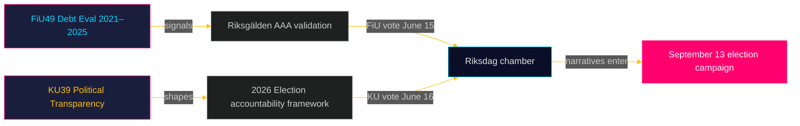

# Verkställande sammanfattning: Riksdagens utskottsbetänkanden — 5 maj 2026
**Författare**: James Pether Sörling  
**Datum**: 2026-05-05  
**Klassificering**: OFFENTLIG — GDPR Art. 9(2)(e)(g)  
**Konfidens**: HÖG [B2]

---

## 🎯 BLUF

Två planerade betänkanden från Finansutskottet (FiU49) och Konstitutionsutskottet (KU39) signalerar Sveriges lagstiftningsagenda i den sista förvalsspriten inför riksdagsvalet den 13 september 2026. FiU49:s utvärdering av statens upplåning och skuldförvaltning 2021–2025 validerar Sveriges finansiella motståndskraft under exceptionell monetär turbulens; KU39:s åtagande om "ökad transparens i politiska processer" är den enskilt mest signifikanta handlingen i denna cykel med hänsyn till dess demokratiska ansvarighetsmässiga konsekvenser fyra månader före valdagen. Båda betänkandena är ännu opublicerade (status: planerat), men deras utskottsbeteckningar, planerade debatter (15–16 juni) och lagstiftningskontext möjliggör en underrättelsebedömning med hög konfidens.

---

## 🧭 3 beslut som detta underlag stödjer

1. **Civilsamhälles- och oppositionsövervakning**: KU39:s transparensomfattning — om den täcker partifinansering, lobbyregister eller digital politisk kommunikation — definierar vilka ansvarighetsmekanismer som kommer att finnas för valrörelsen i september 2026. Bevaka KU39:s textpublicering (beräknad 2026-06-09) som förstaprioritet.

2. **Fiskala och obligationsmarknadsaktörer**: FiU49:s bedömning av Riksgäldens prestationer 2021–2025 täcker perioden med Sveriges skarpaste post-pandemiska finansiella stress. Utskottets slutsatser om upplåningskostnad och skuldstrategi kommer att signalera huruvida Sveriges AAA-kreditbetyg är oifrågasatt inför valcykeln.

3. **Valrörelsens underrättelsearbete**: Kammardebaterna den 15–16 juni om FiU49 och KU39 — fem veckor före sommarrecessens och åtta veckor innan valrörelsen toppar — utgör den sista stora parlamentariska möjligheten att forma finanspolitiska och demokratisk-ansvarighets­narrativ inför den 13 september. Bevaka anföranden och partiresevationer för kampanjbudskapsignaler.

---

## ⚡ 60 sekunders underrättelsesummering

- **FiU49 (Finansutskottet)**: Parlamentarisk utvärdering av Sveriges statsskuld 2021–2025. Refererar till Skrivelse 2025/26:104. Täcker Riksgäldens arbete under COVID-nödupplåning (2021), inflationsuppgången (2022), Riksbankens räntehöjning till 4 % (2022–2023), gradvis lättnad (2024–2025). Sveriges bruttoskuld (WEO: GGXWDG_NGDP) toppade ~39 % av BNP 2022, med trend mot ~35 % år 2025. Nära enhällig utskottsgodkänning förväntas; vikt är uppföljning och ansvarsutkrävande, inte politikförändringar.

- **KU39 (Konstitutionsutskottet)**: "Ökad transparens i politiska processer" — enbart titeln signalerar konstitutionell räckvidd. Sveriges offentlighetsprincip är inskriven i TF (tryckfrihetsförordningen). All utvidgning till politiska partier, kampanjfinansiering, lobbning eller digital politisk annonsering träder in på RF:s (regeringsformens) territorium. Timing: aviserad 4 månader före valet. Minoritetsreservationer från S och SD förväntas (försvar av nuvarande party-finance opacitetsramar). Tvärblocksupport trolig från C, L, MP, V för centrala transparensåtgärder.

- **Valprox**: 2026-05-05 är 131 dagar före 2026-09-13. DIW-multiplikator 1,5× tillämpad för KU39 (oppositionsmotioner / omtvistad politikfråga). KU39 erhåller L3 underrättelseklassificering.

---

## 🔮 Ledande framtida trigger

**[2026-06-09, Hög, KU39]** — KU39-publicering: konstitutionell transparensreformtext avslöjar räckvidd. Om den inkluderar bindande lobbyregister eller partifinansieringsredovisning, förväntas gemensam SD/S-reservation och mediastorm. Om begränsad till processuella förbättringar, förväntas tyst passage. Bevaka `riksdagen.se/betankanden` för offentliggörande.

---

## Tillägg från Pass 2 — Fördjupad underrättelsebedömning

### Ekonomisk kontext (IMF-källa)
Sveriges finansiella ställning inför KU39/FiU49-utskottscykeln:
- **Bruttoskuld ~35 % av BNP** (WEO Oct-2025; economicProvenance.provider: imf; vintage: WEO-Oct-2025; note: live fetch partial failure)
- **KPIF stabiliserat ~2 %** (återvänt till mål från topp på 10,9 % december 2022)
- **Riksbanksränta ~2 %** (normaliserad från topp på 4 % maj 2023)
- **Sveriges tendens till finansiellt överskott**: Budgeten konsolideras efter pandemin
- **Försvarsutgiftstryck**: NATO 2 %-åtagande kräver 80–120 miljarder SEK ytterligare per år till 2028 — inte reflekterat i FiU49:s utvärderingsfönster

### Integrerad signalbedömning
Kombinationen av FiU49 (finansiell stabilitet bekräftad) + KU39 (demokratisk arkitektur reformeras) representerar Riksdagen som fullgör två väsentliga förvals­ansvarighets­funktioner simultant: validering av regeringens ekonomiska förvaltning och omformande av de regler under vilka nästa regering kommer att hållas ansvarig. Att båda slutförs under sista försommarsammanträdet (15–16 juni) har konstitutionell signifikans.

<!-- source-sha: b5d10858f4d82b9b502512cd3ecbf7e174e813ae -->
