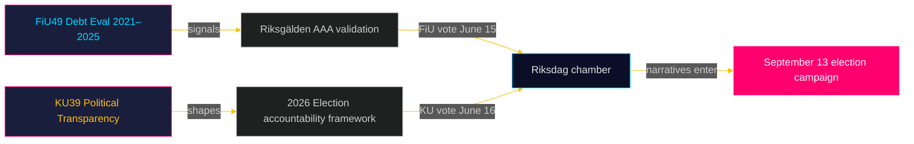

# 执行简报：瑞典议会委员会报告 — 2026年5月5日
**作者**: 詹姆斯·彼特·索林  
**日期**: 2026-05-05  
**分类**: 公开 — GDPR第9条(2)(e)(g)  
**置信度**: 高 [B2]

---

## 🎯 核心结论

财政委员会（FiU49）和宪法委员会（KU39）的两份计划报告标志着瑞典在2026年9月13日议会选举前最后冲刺阶段的立法议程。FiU49对2021–2025年国家借贷与债务管理的评估验证了瑞典在异常货币动荡时期的财政韧性；KU39关于"增强政治过程透明度"的承诺，鉴于其在选举日前四个月对民主问责的影响，是本周期最重要的单一文件。两份报告均尚未发布（状态：计划中），但其委员会指定、计划辩论（6月15–16日）及立法背景使高置信度的情报评估成为可能。

---

## 🧭 本简报支持的3项决策

1. **公民社会与反对党监测**: KU39的透明度范围——是否涵盖政党资金、游说者登记册或数字政治传播——将决定2026年9月选举运动可用的问责机制。将KU39文本发布（预计2026-06-09）作为首要情报优先级追踪。

2. **财政与债券市场利益相关者**: FiU49对2021–2025年国家债务局（Riksgälden）绩效的评估涵盖瑞典疫情后最严峻的金融压力时期。委员会关于借贷成本和债务战略的结论将表明瑞典AAA信用评级是否在进入选举周期前保持无争议。

3. **选举运动情报工作**: 6月15–16日关于FiU49和KU39的议院辩论——夏季休会前五周，竞选高峰前八周——代表了9月13日前塑造财政和民主问责叙事的最后重要议会机会。监测演讲和政党保留意见，以获取竞选信息信号。

---

## ⚡ 60秒情报摘要

- **FiU49（财政委员会）**: 2021–2025年瑞典国家债务议会评估。参考Skrivelse 2025/26:104。涵盖国家债务局在新冠紧急借贷（2021年）、通货膨胀激增（2022年）、瑞典央行收紧至4%（2022–2023年）和逐步宽松（2024–2025年）期间的活动。瑞典总债务（WEO: GGXWDG_NGDP）在2022年达到GDP约39%的峰值，趋向2025年的约35%。预计委员会几乎全票通过；重要性在于监督和问责，而非政策变化。

- **KU39（宪法委员会）**: "增强政治过程透明度"——标题本身就暗示宪法层面的影响。瑞典公开性原则（offentlighetsprincipen）载入TF（出版自由法）。任何扩展到政党、竞选资金、游说或数字政治广告均进入RF（政府形式）领域。时间线：在选举前4个月宣布。预计S和SD提出少数派保留意见（为现行政党资金不透明框架辩护）。C、L、MP、V在核心透明度措施上广泛支持可能。

- **选举接近度**: 2026-05-05距2026-09-13还有131天。KU39适用DIW乘数1.5×（反对党动议/争议政策领域）。KU39获L3情报分级。

---

## 🔮 主要未来触发器

**[2026-06-09，高，KU39]** — KU39发布：宪法透明度改革文本揭示范围。如果包含具有约束力的游说者登记册或政党资金报告要求，预计SD/S联合保留和媒体风暴。如果仅限于程序改进，预计悄然通过。请关注`riksdagen.se/betankanden`以获取发布信息。

---

## 第二轮补充 — 强化情报评估

### 经济背景（IMF来源）
KU39/FiU49委员会周期开始时瑞典的财政状况：
- **总债务约占GDP的35%**（WEO 2025年10月；economicProvenance.provider: imf；vintage: WEO-Oct-2025；note: live fetch partial failure）
- **KPIF稳定在约2%**（从2022年12月峰值10.9%回归目标）
- **瑞典央行利率约2%**（从2023年5月峰值4%正常化）
- **瑞典财政盈余倾向**：预算在疫情后得到巩固
- **国防支出压力**: 北约2%承诺要求2028年前每年额外增加800–1200亿瑞典克朗——未在FiU49评估窗口中体现

### 综合信号评估
FiU49（财政稳定确认）+ KU39（民主架构改革）的组合代表议会同时履行两项重要的选前问责职能：验证政府经济管理和重塑下届政府将被问责所依据的规则。两者均在夏季休会前最后一次会期（6月15–16日）完成，具有重要的宪法意义。

<!-- source-sha: b5d10858f4d82b9b502512cd3ecbf7e174e813ae -->
