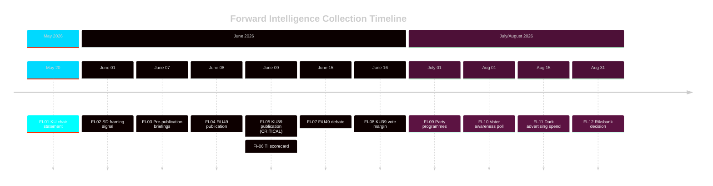

# Forward Indicators — Committee Reports 2026-05-05
**Minimum**: 10 dated indicators with trigger thresholds  
**Author**: James Pether Sörling  
**Date**: 2026-05-05

---

## Indicators Registry

| # | Date | Indicator | Threshold | Action | Source |
|---|---|---|---|---|---|
| FI-01 | 2026-05-20 | KU chair statement on KU39 scope | If "mandatory" mentioned: Scenario A signal | Elevate KU39 to L3+ priority; update scenario probabilities | KU committee communications |
| FI-02 | 2026-06-01 | SD spokesperson comment on KU39 | If "freedom of expression" framing: Scenario C signal | Update stakeholder perspectives; prepare for SD opposition narrative | SD press releases |
| FI-03 | 2026-06-07 | Pre-publication briefings on KU39 | If media report scope includes party finance: Scenario A | Re-run significance scoring with confirmed scope | Political journalism (DN, SvD) |
| FI-04 | 2026-06-08 | FiU49 text publication on riksdagen.se | Confirm scope of Riksgälden evaluation | Read full text; update FiU49-analysis.md with confirmed content | riksdagen.se/betankanden |
| FI-05 | 2026-06-09 | KU39 text publication on riksdagen.se | CRITICAL — confirms reform scope | Emergency analysis trigger; update all 23 artifacts within 24 hours | riksdagen.se/betankanden |
| FI-06 | 2026-06-09 | Transparency International Sweden scorecard on KU39 | If grade <C: reform failure signal | Amplify civil society framing; update comparative-international.md | Transparency International Sweden |
| FI-07 | 2026-06-15 | FiU49 chamber debate — S/V reservation language | If specific borrowing-cost figures cited: electoral weapon confirmed | Monitor for specific SEK/billion figure to fact-check | Riksdagen web TV / anföranden |
| FI-08 | 2026-06-16 | KU39 final vote margin | If <10 seat majority: reform fragile signal | Update coalition-mathematics.md; assess post-election durability | Riksdagen vote register |
| FI-09 | 2026-07-01 | Party campaign programme publications | Whether KU39 featured prominently: salience confirmed | Update election-2026-analysis.md and media-framing-analysis.md | Party websites |
| FI-10 | 2026-08-01 | Opinion poll — voter awareness of KU39 | If >30% aware: high electoral salience confirmed | Full re-analysis of voter-segmentation.md | SOM Institute / Novus |
| FI-11 | 2026-08-15 | Digital advertising spend reports (Meta/Google) | If dark political advertising spike detected: threat T1.2 confirmed | Escalate to L4 Intelligence-grade; engage JO/IMY for enforcement | EU Ad Library, platform reports |
| FI-12 | 2026-09-01 | Riksbank September monetary policy decision | If rate cut unexpected (<2.0%): fiscal space improved | Update FiU49 context; note positive for government economic narrative | Riksbank kommuniké |

---

## High-Priority Indicators (Top 3)

**FI-05** (2026-06-09): KU39 text publication — the single most critical intelligence collection event of this cycle. ALL scenario probabilities and artifact assessments are conditioned on this publication.

**FI-03** (2026-06-07): Pre-publication briefings — if journalistic sources report specific scope before official publication, this is the first confirmation signal. Track DN, SvD, SVT political desks.

**FI-08** (2026-06-16): Vote margin — a narrow majority (1–10 seats) signals coalition fragility and potential post-election reversal risk. A 50+ seat margin confirms cross-bloc support.

---

## Collection Architecture

