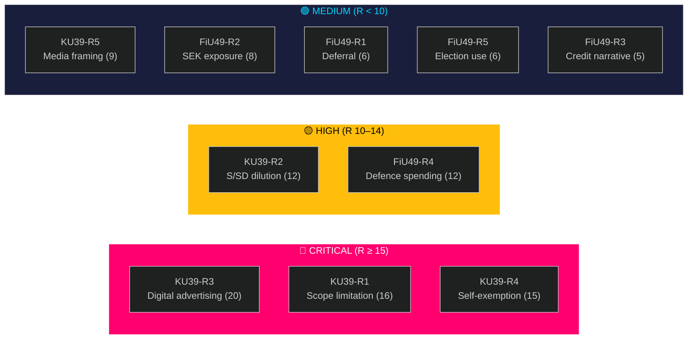

# Risk Assessment — Committee Reports 2026-05-05
**Framework**: 5-Dimension Risk Register (Likelihood × Impact)  
**Author**: James Pether Sörling  
**Date**: 2026-05-05

---

## Risk Dimensions
- **L**: Likelihood (1–5; 5 = very probable)  
- **I**: Impact (1–5; 5 = critical democratic/fiscal harm)  
- **R = L × I**: Risk Score (1–25)  
- **Trend**: ↑ Escalating | → Stable | ↓ Decreasing

---

## Risk Register: HD01KU39 (Priority)

| ID | Risk | L | I | R | Trend | Mitigation |
|---|---|---|---|---|---|---|
| KU39-R1 | Scope limited to procedural changes — no binding lobbying register | 4 | 4 | **16** | → | Monitor KU text publication; track committee chair statements |
| KU39-R2 | S and SD joint reservation forces dilution of party-finance disclosure | 3 | 4 | **12** | → | Monitor party spokesperson statements post-publication |
| KU39-R3 | Digital advertising provisions weak/absent — campaign micro-targeting unregulated | 4 | 5 | **20** | ↑ | EU-DSA provides baseline; but national supplement needed for enforcement |
| KU39-R4 | Self-exemption: parties exempt own political communications from transparency | 3 | 5 | **15** | → | Constitutional amendment required for full scope — higher threshold |
| KU39-R5 | Media framing captures narrative as procedural; reduces public accountability pressure | 3 | 3 | **9** | → | Civil society communications; comparative framing vs. Denmark/Germany |

**Highest risk**: KU39-R3 (digital advertising) → Score 20 / Critical

---

## Risk Register: HD01FiU49

| ID | Risk | L | I | R | Trend | Mitigation |
|---|---|---|---|---|---|---|
| FiU49-R1 | Committee defers key conclusions to next parliament post-election | 2 | 3 | **6** | → | Standard procedure if contentious items found |
| FiU49-R2 | Riksgälden's SEK currency exposure critique signals structural vulnerability | 2 | 4 | **8** | ↑ | SEK recovery since 2024; Riksbank coordination improved |
| FiU49-R3 | Negative assessment triggers credit market narrative despite AAA | 1 | 5 | **5** | ↓ | Sweden fundamentals strong; no evidence of committee negativity |
| FiU49-R4 | Defence spending increase (NATO 2% commitment) strains future borrowing envelope | 4 | 3 | **12** | ↑ | Budget discussions ongoing; FiU49 covers 2021–2025 only, not forward |
| FiU49-R5 | Election use: S/V weaponise debt-cost increases during Riksbank hike period | 3 | 2 | **6** | → | Government response prepared via Skr. 2025/26:104 |

**Highest risk**: FiU49-R4 (defence spending pressure) → Score 12 / High

---

## Combined Risk Heat Map

---

## Risk Owner Assignments

| Risk | Owner | Review Date |
|---|---|---|
| KU39-R3 (Digital advertising) | KU rapporteur | 2026-06-09 (text publication) |
| KU39-R1 (Scope limitation) | KU rapporteur | 2026-06-09 |
| FiU49-R4 (Defence spending) | Budget Office | 2026-09-01 (budget proposal) |

