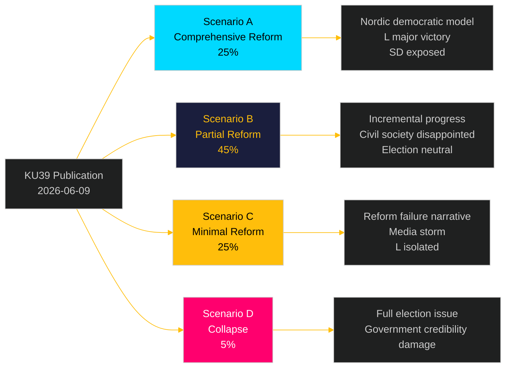

# Scenario Analysis — Committee Reports 2026-05-05
**Framework**: Scenario-Tree with Confidence-Weighted Probability  
**Author**: James Pether Sörling  
**Date**: 2026-05-05  
**Horizon**: T+42d (KU39 text publication 2026-06-09) / T+90d (election campaign entry)

---

## KU39 Scenario Tree: Political Transparency Reform

### Parent Question: What scope will KU39 "Ökad insyn i politiska processer" actually achieve?

---

### Scenario A: Comprehensive Transparency Reform (25%)
**Definition**: KU39 includes mandatory lobbying register, enhanced party-finance disclosure, binding digital advertising transparency rules, and independent enforcement mechanism.

**Trigger conditions**:
- L and M override SD resistance within coalition
- S accepts compromise (e.g., phased party-finance disclosure)
- EU-DSA Art. 39 explicitly named as implementation vehicle

**Consequences**:
- Sweden becomes Nordic model for democratic accountability
- Significant civil society and media acclaim
- SD faces potential exposure of dark advertising networks
- Election campaign subject to new transparency rules (if entry into force before Sep 13)
- L can claim major policy victory; strengthens position in election

**Impact on 2026 election**: HIGH positive for democratic accountability; difficult for SD; opportunity for L to differentiate.

**WEP Assessment**: "Reforms will likely reshape campaign dynamics in the run-up to the September 2026 election" [Likely, High confidence]

---

### Scenario B: Partial Reform — Procedural Plus Lobbying Register (45%)
**Definition**: KU39 establishes voluntary-to-mandatory lobbying register (with sunset clause) and procedural transparency improvements (MP asset declarations, conflict-of-interest rules), but excludes party-finance disclosure and digital advertising provisions.

**Trigger conditions**:
- Coalition compromise: SD accepts lobbying register if scope excludes party communications
- S supports procedural measures but blocks party-finance disclosure
- EU-DSA cited as sufficient for digital advertising

**Consequences**:
- Moderate positive assessment from civil society; disappointment on party finance
- Transparency International grades as C+ (meets minimum standards)
- OECD notes as progress but incomplete
- Electoral impact neutral — no major campaign behaviour change before September

**WEP Assessment**: "It is likely that KU39 will deliver incremental improvements to parliamentary transparency without addressing the fundamental party-finance opacity challenge" [Likely]

---

### Scenario C: Minimal Reform — Procedural Adjustments Only (25%)
**Definition**: KU39 makes minor adjustments to existing transparency rules (annual reports, public documents) but creates no binding new obligations for parties, lobbyists, or political advertisers.

**Trigger conditions**:
- SD vetoes lobbying register in coalition negotiations
- S and SD joint reservation forces majority to water down scope
- KU chair opts for consensus over ambition

**Consequences**:
- Strong civil society criticism; Transparency International scorecard: D
- Media narrative: "Sweden fails democracy test before election"
- L isolated; reform credibility damaged
- No implementation before September election

**WEP Assessment**: "A minimal reform outcome is plausible if coalition parties prioritise political self-interest over democratic accountability" [Roughly even odds]

---

### Scenario D: Reform Collapse — No Betänkande Published (5%)
**Definition**: KU39 text is not published before summer recess; vote deferred to autumn (post-election) parliament.

**Trigger conditions**:
- Irreconcilable coalition divisions
- Constitutional legal challenge to scope causes committee to pause
- Extraordinary political crisis (government fall, snap election) disrupts schedule

**Consequences**:
- Democratic accountability narrative becomes major election issue
- Failure to deliver undermines government's reform credibility
- Civil society and opposition will campaign on "government blocked transparency"

**WEP Assessment**: "Collapse is unlikely given scheduled dates, but cannot be excluded in the context of political crisis" [Unlikely]

---

## FiU49 Scenario: Debt Management Evaluation

### Scenario A: Positive with Minor Reservations (70%)
Committee endorses Riksgälden's performance; S/V file minor reservations on rate-spike impact and green bond delay. No structural criticism.

### Scenario B: Mixed Assessment — SEK Exposure Critique (25%)
Committee identifies SEK currency management as a specific weakness; recommends review of foreign-currency borrowing strategy. S/V use as election ammunition.

### Scenario C: Significant Criticism — Duration Strategy Questioned (5%)
Committee questions whether long-duration strategy was appropriate during 2022 rate spike; unusual cross-party consensus around specific technical critique.

---

## Scenario Tree Visualization

