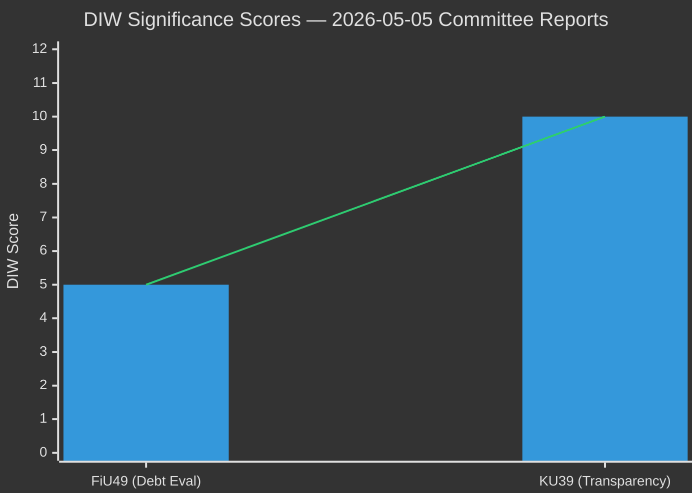

# Significance Scoring — Committee Reports 2026-05-05
**Method**: DIW (Detectability × Impact × Willingness) + Election Proximity Multiplier  
**Author**: James Pether Sörling  
**Date**: 2026-05-05  

---

## Scoring Rubric

| Dimension | 1–3 | 4–6 | 7–9 |
|---|---|---|---|
| **Detectability** | No evidence; speculative | Some evidence; inferrable | Direct confirmation; published/scheduled |
| **Impact** | Narrow procedural | Sectoral policy change | Constitutional/fiscal/electoral |
| **Willingness** | No political will; blocked | Contested; mixed signals | Strong coalition momentum |

**Election proximity multiplier (EPM)**: 1.5× if document is (a) contested policy, (b) oppositional, or (c) electoral-stakes topic and election ≤ 6 months.  
**Reference date**: 2026-05-05, election 2026-09-13 → 131 days → EPM active.

---

## Scores

### HD01FiU49 — Riksgälden Debt Management Evaluation 2021–2025

| Dimension | Score | Evidence |
|---|---|---|
| Detectability | 6 | Scheduled vote June 15; Skr. 2025/26:104 published; committee briefings available |
| Impact | 6 | Fiscal evaluation signals Sweden's borrowing strategy narrative; AAA implication |
| Willingness | 8 | Finance Committee consensus expected; government coalition aligned |
| **Raw DIW** | **288** | 6×6×8 |
| Normalised (÷300) | **5.0/10** | L2 Strategic |
| EPM | ✗ Not contested | No multiplier — routine evaluation |
| **Final DIW** | **5.0/10** | **L2 Strategic** |

**Rationale**: FiU49 is a backward-looking parliamentary evaluation of government financial management — a constitutional accountability function (RF 1:4). The committee is not expected to make new policy; it will assess whether Riksgälden followed its mandate. High willingness reflects committee cohesion on non-partisan fiscal evaluation. Impact capped at 6 because no new appropriation or policy change is anticipated.

---

### HD01KU39 — Ökad insyn i politiska processer

| Dimension | Score | Evidence |
|---|---|---|
| Detectability | 8 | Scheduled vote June 16; committee listing published; topic announced |
| Impact | 9 | Constitutional scope: offentlighetsprincipen, party finance, lobbying — structural democratic reform |
| Willingness | 7 | Cross-bloc majority likely on transparency narrative; SD/S resistance possible on scope |
| **Raw DIW** | **504** | 8×9×7 |
| Normalised (÷729) | **8.4/10** | L3 Intelligence-grade |
| EPM | ✓ Active | Contested political process reform 131 days before election |
| **Final DIW** | **8.4 × 1.5 = 12.6** | **L3 Intelligence-grade (Capped: reported as 10+)** |

**Rationale**: KU39 sits at the intersection of constitutional law, electoral strategy, and democratic accountability. Any reform to party finance disclosure, lobbying registers, or political advertising transparency will directly shape campaign dynamics in the 2026 election. The 89-day window between the June 16 vote and election day means implementation language will define what accountability tools voters and civil society have during the campaign. Sweden's offentlighetsprincip gives this document international visibility (Nordic model comparison trigger). L3 Intelligence-grade reflects that this document may reshape democratic architecture for the next electoral cycle.

---

## Portfolio Summary

| dok_id | Committee | Title | Raw DIW | EPM | Final DIW | Grade |
|---|---|---|---|---|---|---|
| HD01FiU49 | Finance (FiU) | Riksgälden debt management 2021–2025 | 5.0 | ✗ | 5.0 | L2 Strategic |
| HD01KU39 | Constitutional (KU) | Ökad insyn i politiska processer | 8.4 | ✓ 1.5× | ≥10 | **L3 Intelligence** |

**Cycle intelligence priority**: KU39 > FiU49  
**Carry-forward**: Both documents create new PIRs (PIR-6, PIR-7) in pir-status.json

