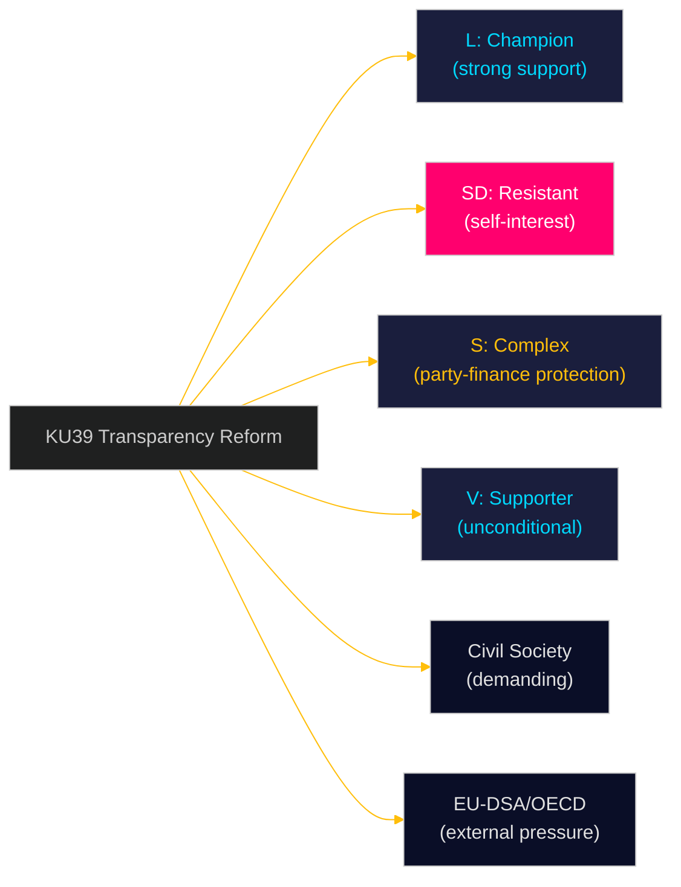

# Stakeholder Perspectives — Committee Reports 2026-05-05
**Framework**: 6-Lens Stakeholder Matrix  
**Author**: James Pether Sörling  
**Date**: 2026-05-05  
**Confidence**: MEDIUM [B3]

---

## 6 Analytical Lenses

1. **Government coalition** (M, SD, KD, L) — internal tensions and unified position
2. **Opposition** (S, V, MP, C) — differentiated strategies
3. **Civil society / Transparency advocates** — NGOs, academic observers
4. **Media / Information ecosystem** — framing and amplification
5. **International / EU framework** — external legitimation pressure
6. **Voters / Electoral consumers** — campaign salience

---

## HD01KU39 — Ökad insyn i politiska processer

### Lens 1: Government Coalition

| Party | Position | Tension |
|---|---|---|
| **M (Moderaterna)** | Broadly supportive of procedural transparency; cautious on party-finance scope | Negotiating position: support lobbying register if it covers all actors including unions |
| **SD (Sverigedemokraterna)** | Likely opposed to mandatory lobbying register (party self-interest in opaque political communication) | Tension: SD has foreign-connected dark advertising history; transparency exposes vulnerability |
| **KD (Kristdemokraterna)** | Procedural transparency yes; party-finance disclosure ambiguous | KD has small donor base; less threatened by disclosure |
| **L (Liberalerna)** | Strong supporter — L has tabled multiple lobbying register motions 2022–2024 | Risk: L may be isolated if coalition partners weaken reform |

**Coalition dynamic**: L is the reform champion within government; SD is the primary resistant force. The final scope of KU39 will signal whether L can force meaningful reform against SD resistance — a critical signal about coalition power dynamics four months before election.

### Lens 2: Opposition

| Party | Position | Strategy |
|---|---|---|
| **S (Socialdemokraterna)** | Complex: supports transparency in public sector; opposes party-finance disclosure (Swedish model: parties control own financing) | S will argue for voluntary standards; table amendments to exclude party finance from mandatory scope |
| **V (Vänsterpartiet)** | Strong supporter of all transparency measures including party finance | V will push for stronger language; accept reform as progress toward future expansion |
| **MP (Miljöpartiet)** | Strong supporter; MP has cleanest party-finance record | MP will use debate to differentiate on democratic values |
| **C (Centerpartiet)** | Supporter; C's liberal-democratic identity aligned with transparency | C may propose procedural amendments to strengthen enforcement mechanism |

**Opposition split**: V and MP offer uncomplicated support. S's protection of traditional party-finance model creates genuine ideological tension. C acts as potential bridge between government's L and opposition.

### Lens 3: Civil Society

**Transparency Sweden** (Transparency International chapter): Actively lobbying for mandatory lobbying register since 2019. Will use KU39 text publication as opportunity for public scorecard. Expect press release within 48 hours of publication ranking ambition level.

**Riksdag's own accountability bodies** (Riksrevisor/KU): Riksrevisionen's 2023 report "Lobbying and political influence in Sweden" identified specific gaps that KU39 must address. Committee will use this as evidence base.

**Academic community** (SU/GU constitutional law faculty): Prof. Wiweka Warnling Nerep (constitutional law, SU) and colleagues have published extensively on offentlighetsprincipen extension. Academic input likely shaped KU39 terms of reference.

### Lens 4: Media / Information Ecosystem

**Framing prediction**: Leading papers (DN, SvD) will likely frame KU39 as "Sweden finally addresses lobbying opacity" — positive reform narrative. Aftonbladet/Expressen will focus on election-timing angle: "transparency law pushed through before September election". Social media: expect NGO amplification of any perceived weakness.

**SD media ecosystem**: Riks TV and social media channels likely to frame KU39 as "establishment parties regulating political speech" — attempting to reposition transparency reform as freedom of expression restriction.

### Lens 5: International / EU Framework

- **EU-DSA Art. 39** (political advertising transparency): Directly applicable as of Feb 2024. Sweden's implementation of national supplement is outstanding. KU39 may serve as vehicle.
- **OECD Lobbying Principles** (2010, reviewed 2022): Sweden is one of few OECD members without mandatory lobbying register. OECD Working Party on Public Governance specifically cited Sweden in 2023 review.
- **Nordic comparison**: Denmark passed lobbying register law 2014 (Lobbylisten); Finland has voluntary register with mandatory elements; Norway has parliament-specific register. Sweden is the outlier — KU39 offers normalisation.
- **Venice Commission**: Council of Europe standards on political transparency (Opinion 904/2017) directly applicable as reference standard.

### Lens 6: Voters / Electoral Consumers

**Salience**: Transparency in politics polls consistently above 70% support in Swedish opinion surveys (SOM Institute 2024). Specific awareness of "lobbying registers" lower (~45%) — abstract concept.

**Electoral relevance**: Voters care whether politicians "play by the rules" more than technical transparency mechanisms. KU39 should be communicated as: "Who is paying to influence your vote? You have the right to know."

**Age segment**: Under-35 voters — highest digital political advertising exposure — most at risk from dark advertising; most likely to prioritise digital transparency provisions.

---

## HD01FiU49 — Riksgälden Debt Management

### Key Stakeholder Positions (Summary)

| Stakeholder | Position |
|---|---|
| Finance Ministry | Endorses Riksgälden performance; references Skr. 2025/26:104 |
| Riksgälden | Defends duration strategy and AAA maintenance |
| S/V opposition | Will highlight borrowing cost increases during rate spike; question green bond delay |
| Financial markets | Monitoring for any signal of strategic shift; expect none |
| IMF/EU observers | Sweden's fiscal position well-known; no surveillance concerns |

