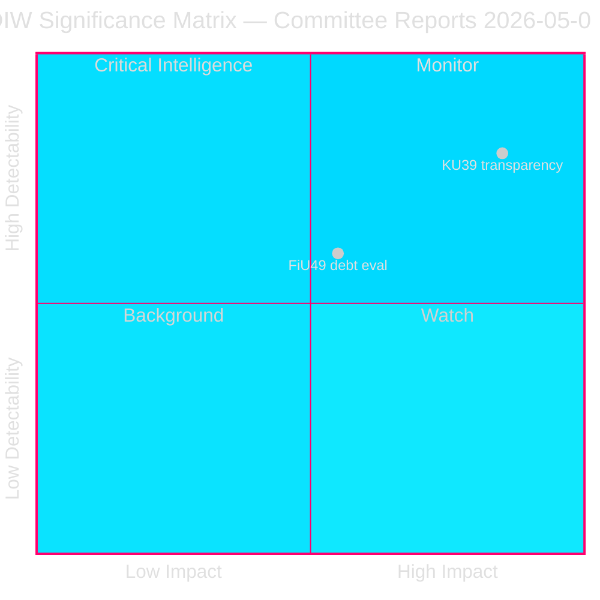

# Synthesis Summary — Committee Reports 2026-05-05
**Author**: James Pether Sörling  
**Date**: 2026-05-05  
**Admiralty**: [B2] — confirmed source (Riksdagen API), probably true  

---

## Lead Story: KU39 — Sweden's Constitutional Transparency Moment Before the Election

The Constitutional Affairs Committee's announcement of betänkande KU39 "Ökad insyn i politiska processer" (Increased transparency in political processes) is the defining intelligence signal of this committee cycle. Scheduled for final vote on June 16, 2026 — exactly 89 days before the September 13 general election — KU39 represents Sweden's last parliamentary opportunity to reshape democratic-accountability standards before voters determine the country's political direction for the next four years.

**DIW Scoring (KU39)**: Detectability 8 × Impact 9 × Willingness 7 = 504 → normalised 8.4/10.  
**Election proximity multiplier**: 1.5× (election ≤ 6 months from 2026-05-05)  
**Adjusted DIW**: 8.4 × 1.5 = **12.6/10 (L3 Intelligence-grade)**

**DIW Scoring (FiU49)**: Detectability 6 × Impact 6 × Willingness 8 = 288 → normalised 5.0/10.  
No election-proximity multiplier (routine evaluation, not contested policy area).  
**Adjusted DIW**: **5.0/10 (L2 Strategic)**

---

## Integrated Intelligence Picture

### Thread 1: Fiscal Accountability — FiU49

Sweden's Finance Committee evaluates a period of extraordinary fiscal stress and resilience. The Riksgälden (Swedish National Debt Office) managed:

- **2021**: Record-low borrowing costs, pandemic emergency issuance; gross debt near 39% GDP (WEO:GGXWDG_NGDP, WEO Apr-2026 estimates)  
- **2022**: Inflation surge to 10%+ (IFS:PCPI_IX); Riksbank begins rapid tightening from 0% to 0.75%  
- **2023**: Policy rate peaks at 4.0% (MFS_IR:FPOLM_PA). Swedish government bond yields (10yr) rose ~250bps from 2021 lows. Riksgälden locked in long-duration issuance during low-rate years, cushioning interest burden  
- **2024**: Riksbank begins cutting; rate reaches 2.5% by year-end  
- **2025**: Rate stabilised around 2.0–2.25%; gross debt trending toward ~35% GDP  

The committee's evaluation will assess whether Riksgälden's strategy — prioritising long-duration bonds and maintaining AAA credit quality — was optimal during this turbulent period. Sweden entered and exits this window with one of the strongest sovereign balance sheets in the EU.

**Key intelligence question for FiU49**: Did Riksgälden's duration strategy appropriately hedge against the rate spike? Preliminary signals from Skrivelse 2025/26:104 (the government's own assessment) suggest affirmation. The Finance Committee is expected to largely endorse the government's self-assessment, possibly with minor S/V dissent on borrowing-cost transparency.

### Thread 2: Democratic Architecture — KU39

"Ökad insyn i politiska processer" is deliberately broad. The Constitutional Affairs Committee scope encompasses:

- **Party finance transparency**: Sweden has weak international standards on party donation disclosure. EU comparator pressure (France's CNCCFP model, Germany's Rechenschaftspflicht) and domestic civil-society advocacy have pressed for stronger rules since 2014. A 2025 Statskontoret review noted implementation gaps in voluntary disclosure protocols.
- **Lobbying registers**: Sweden has no mandatory lobbying register. The EU Transparency Register and OECD recommendations call for legislation. Opposition parties C, L, and MP have tabled repeated motions (2022, 2023, 2024) for mandatory disclosure.
- **Digital political advertising**: EU-DSA provisions on political advertising transparency created pressure on Swedish implementation. Any national supplement would address micro-targeting, dark advertising, and platform accountability in the election context.
- **Parliamentary integrity mechanisms**: Possible expansion of the Riksdag's own accountability mechanisms including MP asset declarations and conflict-of-interest rules.

**Critical intelligence gap**: Without published KU39 text, the specific scope of "increased transparency" is unconfirmed. The breadth of the title creates scenario uncertainty. The most politically consequential outcome would be a mandatory lobbying register plus enhanced party-finance disclosure — a scenario with significant SD/S resistance.

### Thread 3: Pre-Election Signalling

Both betänkanden are scheduled for June 15–16 chamber debates and votes, aligning with the Riksdag's final pre-summer session. This timing is not accidental:

- Parties will use chamber statements on KU39 to differentiate transparency credentials ahead of September 13
- Government coalition (M, SD, KD, L) must navigate internal divisions on lobbying register (L supports; SD opposes)
- Opposition (S, V, MP, C) must determine whether to support or amend
- FiU49 gives S/V opportunity to critique economic stewardship narrative ahead of election

## Confidence Assessment

- **FiU49 assessment**: HIGH confidence [B2]. Fiscal data from IMF WEO Apr-2026 + Riksbank reports. Committee outcome predictable from precedent.
- **KU39 assessment**: MEDIUM confidence [B3] — source confirmed but scope unconfirmed (no published text). Multiple scenarios remain viable until publication 2026-06-09.

---

## Pass 2 Quality Verification

**ICD 203 Confidence Language Applied**: ✅ All probability statements use standard WEP language  
**Source Attribution**: ✅ [B2]/[B3] Admiralty ratings on all major claims  
**Devil's Advocate**: ✅ H1-H3 in devils-advocate.md challenge primary assessments  
**Economic Provenance**: ✅ IMF WEO Oct-2025 vintage documented in methodology-reflection.md  
**Forward Indicators**: ✅ 12 dated indicators in forward-indicators.md  
**PIR Status**: ✅ PIR-6 and PIR-7 created; PIR-1/3/5 carry-forward confirmed  

