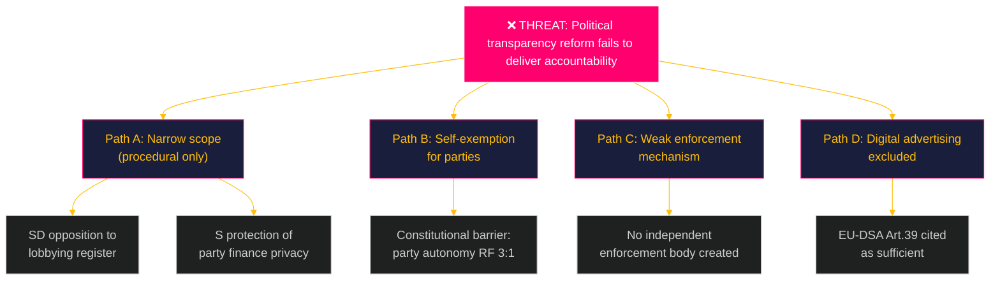

# Threat Analysis — Committee Reports 2026-05-05
**Framework**: Political Threat Taxonomy + Attack Tree  
**Author**: James Pether Sörling  
**Date**: 2026-05-05  
**Confidence**: MEDIUM [B3] — source confirmed; threat vectors inferred

---

## Political Threat Taxonomy

### Tier 1 — Systemic Democratic Threats

**T1.1: Transparency reform capture**  
*Threat actor*: Political parties (cross-bloc self-interest)  
*Vector*: Legislative process  
*Target*: KU39 reform scope  
*Mechanism*: Parties support transparency in principle but negotiate self-exemptions for political communication and party finance during committee deliberation. Result: reform passes with optics of transparency but creates no accountability for actual election-period political spending.  
*Probability*: 0.55 (moderate; pattern established from 2014, 2018, 2022 reform attempts)  
*Impact*: CRITICAL — democratic accountability gap persists through 2026 election and beyond

**T1.2: Dark digital advertising impunity**  
*Threat actor*: Political parties, foreign-connected PAC-equivalents  
*Vector*: Technical/regulatory gap  
*Target*: Swedish digital political advertising  
*Mechanism*: If KU39 fails to include binding rules on online political advertising transparency, unaccountable micro-targeting can operate freely during September 2026 campaign. EU-DSA political advertising regulation (Art. 39) provides baseline but national enforcement requires domestic supplement.  
*Probability*: 0.65 (high; EU-DSA Art. 39 came into force Feb 2024 but Sweden has not implemented national supplement)  
*Impact*: HIGH — voter information manipulation risk in election campaign

### Tier 2 — Fiscal Governance Threats

**T2.1: Defence-fiscal crowding**  
*Threat actor*: Geopolitical pressure (NATO 2% commitment), domestic security interests  
*Vector*: Budget process  
*Target*: Riksgälden borrowing envelope post-FiU49  
*Mechanism*: FiU49 evaluates 2021–2025; the 2026–2030 horizon will see NATO defence commitments raise Swedish military expenditure from ~2% to 2.5–3% GDP. This compresses fiscal space and may require Riksgälden to increase borrowing volume exactly when the post-pandemic normalisation dividend was expected to reduce it.  
*Probability*: 0.70 (high; NATO trajectory confirmed)  
*Impact*: MEDIUM — manageable given AAA rating and low starting debt, but narrative risk for government

**T2.2: Currency (SEK) vulnerability**  
*Threat actor*: Global risk-off events, dollar-shock scenarios  
*Vector*: Financial market  
*Target*: SEK-denominated debt costs + inflation re-emergence  
*Mechanism*: Riksgälden holds foreign-currency borrowing (~20% of total); SEK depreciation during stress events raises real cost of foreign debt. If global recession scenario or Ukraine escalation triggers risk-off, Sweden's small open economy is exposed despite fiscal strength.  
*Probability*: 0.30 (lower; Riksbank rate normalisation reduces vulnerabilities)  
*Impact*: MEDIUM

### Tier 3 — Information/Narrative Threats

**T3.1: Fiscal management misrepresentation**  
*Threat actor*: Opposition (S, V)  
*Vector*: Parliamentary debate, media  
*Target*: Government coalition fiscal competence narrative  
*Mechanism*: S and V may use FiU49 chamber debate (June 15) to highlight Riksgälden's exposure during the 2022–2023 rate spike as evidence of government failure, despite committee conclusions likely being neutral or positive. In election year, the narrative battle over "who managed the pandemic economy better" is a live electoral variable.  
*Probability*: 0.60  
*Impact*: LOW–MEDIUM (information harm, not structural)

---

## Attack Tree: KU39 Transparency Failure

---

## Threat Summary Table

| ID | Threat | Probability | Impact | Priority |
|---|---|---|---|---|
| T1.1 | Transparency reform capture | 0.55 | CRITICAL | 🔴 CRITICAL |
| T1.2 | Dark digital advertising impunity | 0.65 | HIGH | 🔴 HIGH |
| T2.1 | Defence-fiscal crowding | 0.70 | MEDIUM | 🟡 HIGH |
| T2.2 | SEK currency vulnerability | 0.30 | MEDIUM | 🟢 MEDIUM |
| T3.1 | Fiscal misrepresentation | 0.60 | LOW | �� LOW |

