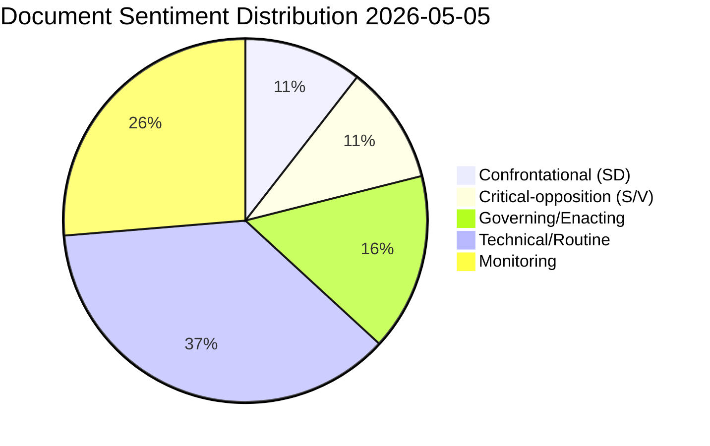

# Classification Results — Evening Analysis 2026-05-05

**Author**: James Pether Sörling  
**Date**: 2026-05-05  
**Method**: DIW × Election-proximity → Tier assignment  

---

## Document Classification Table

| dok_id | Type | Topic | Tier | Priority | Election-relevance | Sentiment |
|--------|------|-------|------|----------|--------------------|-----------|
| HD10464 | ip | Foreign aid / Sida abolition | L3 | P1 | HIGH — direct coalition positioning | Confrontational |
| HD01JuU30 | bet | Juvenile justice / youth custody | L2+ | P1 | HIGH — government crime deliverable | Governing |
| HD10466 | ip | Administrative state / civil servants | L2+ | P1 | HIGH — governance accountability | Confrontational |
| HD10465 | ip | Regional state services | L2+ | P1 | HIGH — S election narrative | Critical-opposition |
| HD03255 | prop | Financial surveillance / household debt | L3 | P1 | MEDIUM — data privacy dimension | Technical |
| HD11787 | fr | Nuclear disarmament / NPT | L2 | P2 | MEDIUM — V/L/MP foreign policy divide | Oppositional |
| HD01SkU25 | bet | VAT / dance events | L2 | P2 | LOW — populist adjacent | Neutral |
| HD01SkU26 | bet | Coupon tax / sovereign wealth funds | L2 | P2 | LOW — technical | Neutral |
| HD01SkU27 | bet | Eurovinjette / transport law | L1 | P3 | NONE | Neutral |
| HD10467 | ip | Tax office Vetlanda | L1 | P3 | LOW — local | Reactive |
| HD10468 | ip | Taxi regulation | L1 | P3 | NONE | Reactive |
| HD10469 | ip | Parental insurance | L1 | P3 | LOW | Reactive |
| HD11781 | fr | Single-use plastics | L1 | P3 | NONE | Environmental |
| HD11782 | fr | Silc extremist classification | L1 | P3 | LOW | Security |
| HD11783 | fr | Taiwan flight permit | L1 | P3 | LOW | Foreign |
| HD11784 | fr | Ostlänken Linköping | L1 | P3 | LOW (PIR-007 tracker) | Regional |
| HD11785 | fr | Police / football hooliganism | L1 | P3 | NONE | Security |
| HD11786 | fr | Research icebreaker | L1 | P3 | NONE | Research |
| HD11788 | fr | Muslim community insurance | L1 | P3 | LOW | Social |

## Thematic Clustering

**Cluster 1 — Administrative State Reform (L3+L2+)**:
HD10464, HD10466, HD10465 — the dominant narrative cluster for this cycle.

**Cluster 2 — Criminal Justice / Security (L2+)**:
HD01JuU30 + cross-reference: PIR-001 (gang crime) from interpellations sibling.

**Cluster 3 — International Relations (L2)**:
HD11787 (NPT) + HD11783 (Taiwan) — foreign policy/security signals.

**Cluster 4 — Tax/Fiscal (L2–L3)**:
HD03255, HD01SkU25/26/27 — technical legislative outputs.

**Cluster 5 — Monitoring tier (L1)**:
All remaining written questions — low substantive intelligence value, monitored for emerging signals.

## Sentiment Distribution

