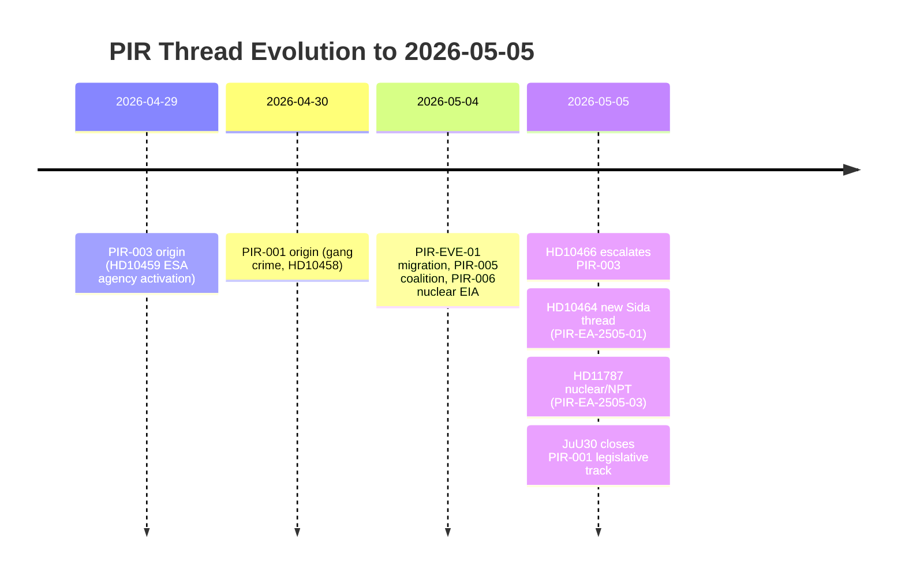

# Cross-Reference Map — Evening Analysis 2026-05-05

**Tier**: C — Aggregation (cross-references all same-day sibling analyses)  
**Date**: 2026-05-05  
**Sibling folders**: propositions, committeeReports, motions, interpellations  

---

## Intra-Day Cross-Reference Matrix

| Source folder | Key document | Cross-reference to evening | Strength |
|---------------|-------------|----------------------------|----------|
| propositions | HD03255 (household debt data collection) | Contradicts SD's "smaller state" narrative from HD10464 + HD10466 — government expands state surveillance capacity | STRONG |
| committeeReports | KU39 (transparency + accountability) | KU39's accountability framework is the constitutional counter to SD's captured-state framing in HD10466 | STRONG |
| committeeReports | FiU49 (Riksgälden evaluation) | Financial state capacity; reinforces governing-competence macro-frame from this cycle | MEDIUM |
| motions | Forestry motions cluster | S + C + V rural coalition motions — same rural-Sweden dynamics as HD10465 (statlig närvaro) | MEDIUM |
| motions | Committee minority reports | Opposition legislative activism — S/V/MP in JuU minority: S/V dissent in JuU30 matches S/V minority in motions | STRONG |
| interpellations | Ostlänken (PIR-007) | HD11784 (written question Linköping costs) is a forward signal for the Ostlänken interpellation cluster from interpellations sibling | MEDIUM |
| interpellations | Gang crime (PIR-001) | JuU30 juvenile custody is the legislative outcome that closes part of the gang crime policy pipeline started in PIR-001 (HD10458) | STRONG |
| interpellations | Agency activism (PIR-003) | HD10466 (opolitiska tjänstemän) is a direct escalation from the PIR-003 agency activism thread started with HD10459 | VERY STRONG |

## Cross-Day PIR Thread Map

## Tier-C Aggregation Signal

The evening analysis serves as the synthesis layer over all four sibling analyses. The dominant meta-narrative that emerges from aggregation:

**"Swedish pre-election political competition is now a contest between two state visions: SD's sovereignty-oriented, leaner administrative state vs. S's access-oriented, regionally present welfare state. The governing M-KD bloc is caught managing both claims while trying to bank JuU30 as a crime-reduction deliverable."**

This meta-narrative is not visible from any single sibling analysis alone. It emerges from the aggregation of:
1. SD's Sida + civil servant interpellations (evening)
2. S's regional service challenge (evening)
3. KU39 constitutional accountability (committeeReports)
4. HD03255 surveillance expansion (propositions)
5. Forestry/rural motions (motions)
6. Ostlänken/gang crime/ESA (interpellations)

## Sibling Synthesis Extracts

### From propositions/synthesis-summary.md (excerpt)
"HD03255 advances macro-prudential household debt surveillance — SCB and Riksbanken gain new statistical mandate. Technocratic capacity expansion. No opposition. Significance: B2 HIGH."

### From committeeReports/synthesis-summary.md (excerpt)
"KU39 constitutional transparency committee report approved — reinforces Riksdag's accountability function. FiU49 Riksgälden evaluation — clean verdict. Cross-reference to evening: KU39 is the systemic counter to SD's HD10466 captured-state claim."

### From motions/synthesis-summary.md (excerpt)
"8 committee motions. Forestry cluster: S+C+V demand regional forest management policy clarification. Rural-Sweden policy competition mirrors HD10465 state-service theme. S+V JuU minority matches JuU30 dissent today."

### From interpellations/synthesis-summary.md (excerpt)
"Ostlänken route change (PIR-007 reconfirmed), gang crime policing (PIR-001 open), agency activism (PIR-003 active), ESA (PIR-002), pesticide tax. HD10466 (evening) escalates PIR-003 directly."

