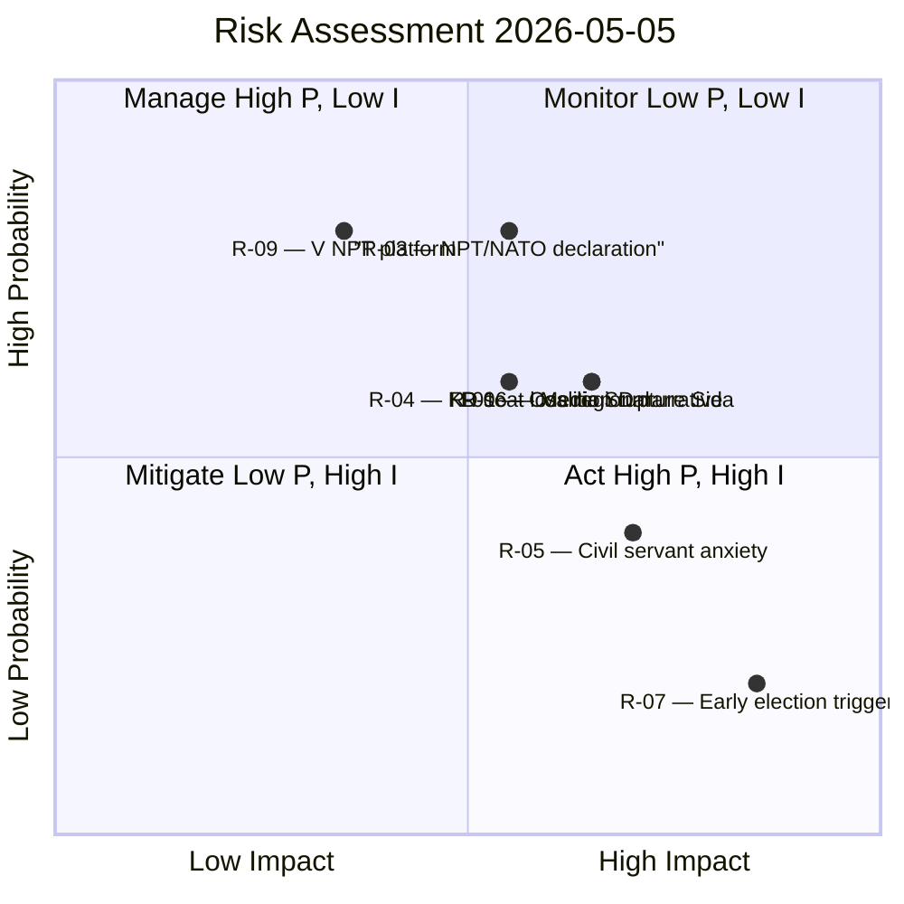

# Risk Assessment — Evening Analysis 2026-05-05

**Date**: 2026-05-05  
**Scope**: Pre-election governance risks from today's parliamentary record  
**Admiralty**: [B2]  
**Probability Scale**: 1 (unlikely) – 5 (near certain)  
**Impact Scale**: 1 (negligible) – 5 (systemic)  

---

## Risk Register

| ID | Risk | P | I | Score | Horizon | Mitigation |
|----|------|---|---|-------|---------|------------|
| R-01 | Coalition public rupture: SD/M over Sida (HD10464) forces public disagreement | 3 | 4 | 12 | T+14 | M government signals deliberation without commitment |
| R-02 | JuU30 legal challenge: UNCRC / proportionality challenge in administrative court | 2 | 3 | 6 | T+180 | Constitutional review via Lagrådet yttrande already mitigates severity |
| R-03 | Sweden's NPT position reveals NATO nuclear-sharing commitment | 4 | 3 | 12 | T+21 | Formulaic diplomatic answer (Sweden "supports disarmament in verifiable steps") |
| R-04 | KD regional service exposure (HD10465) costs KD seats in small-city constituencies | 3 | 3 | 9 | T+131 | KD can frame closures as digital service modernisation |
| R-05 | SD civil servant campaign (HD10466) triggers Riksdag staff anxiety / institutional damage | 2 | 4 | 8 | T+30 | Speaker / Riksdag administration can issue clarifying statement |
| R-06 | Administrative state narrative adopted by major Swedish media | 3 | 4 | 12 | T+30 | Counter-narrative from KU39 transparency committee outcome |
| R-07 | Early election trigger: coalition partner walkout after Sida/civil servant escalation | 1 | 5 | 5 | T+60 | Both M and SD remain electorally incentivised to complete full term |
| R-08 | Ostlänken cost question (HD11784 + PIR-007) triggers media controversy on infrastructure | 3 | 2 | 6 | T+14 | Government can deflect to Trafikverket technical review |
| R-09 | NPT conference gives V high-visibility platform during campaign period | 4 | 2 | 8 | T+17 | V constituency bounded; limited swing-voter impact |
| R-10 | Hushållsskulder law (HD03255) challenged as privacy overreach | 2 | 3 | 6 | T+90 | EU mandate basis reduces domestic legal risk |

## Top Risks Summary

## Scenario Risk Ladder

**Worst-case path** (probability ~12%): R-01 materialises (SD/M public rupture on Sida) → M refuses response → SD signals post-election flexibility towards S → coalition durability R-07 elevated. Combined impact: early election or Tidöavtalet renegotiation before September.

**Base case** (probability ~65%): M gives formulaic answer on HD10464 and HD10466; JuU30 adopted; NPT answer is standard diplomatic. Coalition survives; SD adds to its "state reform" manifesto; KD faces regional seat pressure.

**Best-case path** (probability ~23%): Government uses JuU30 passage as lead story, drowning out SD interpellations in media. NPT answer reinforces Sweden-as-NATO-member. Coalition enters election campaign from position of deliverable strength.

