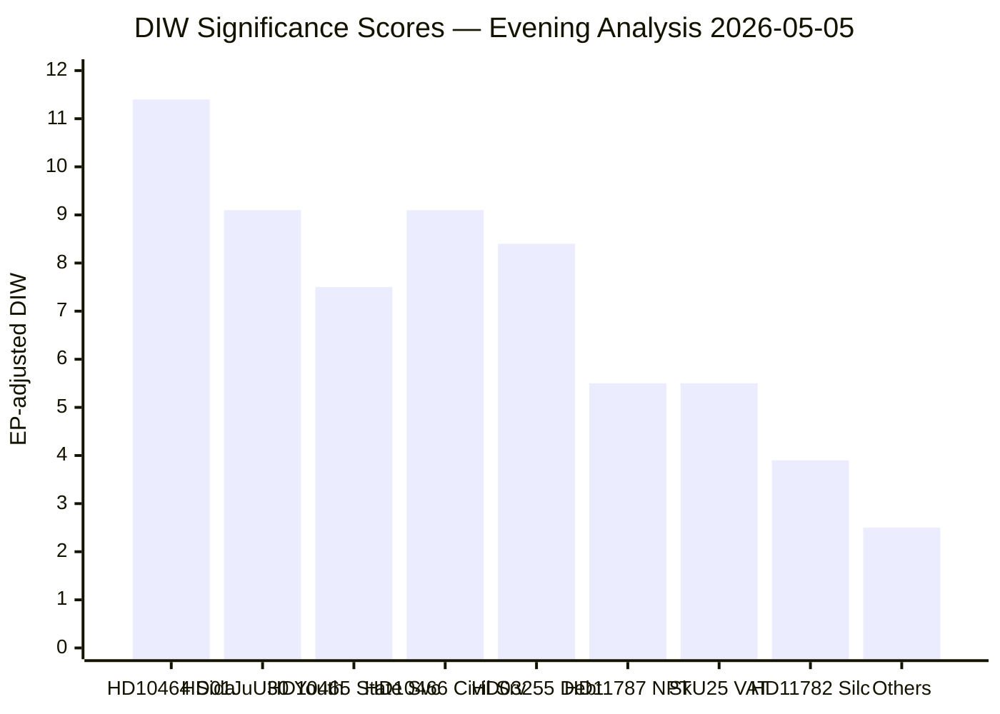

# Significance Scoring — Evening Analysis 2026-05-05

**Author**: James Pether Sörling  
**Date**: 2026-05-05  
**Admiralty**: [B2] — confirmed Riksdag primary sources, probably true  
**Confidence**: HIGH  

---

## DIW Scoring Matrix

DIW = Detectability × Impact × Willingness (1–10 each), normalised to 10.  
Election proximity multiplier: 1.3× (election 131 days from 2026-05-05, within ≤6-month window).

| dok_id | Title | D | I | W | Raw | DIW/10 | EP×DIW | Tier | Priority |
|--------|-------|---|---|---|-----|--------|--------|------|----------|
| HD10464 | Avveckling av Sida | 8 | 8 | 9 | 576 | 8.8 | 11.4 | L3 | P1 |
| HD10466 | Opolitiska tjänstemän vid RK | 8 | 7 | 8 | 448 | 7.0 | 9.1 | L2+ | P1 |
| HD01JuU30 | Frihetsberövande påföljder, barn | 7 | 8 | 8 | 448 | 7.0 | 9.1 | L2+ | P1 |
| HD11787 | NPT/kärnvapen 2026 | 6 | 7 | 5 | 210 | 4.2 | 5.5 | L2 | P2 |
| HD10465 | Statlig närvaro och service | 7 | 7 | 7 | 343 | 5.8 | 7.5 | L2+ | P1 |
| HD01SkU25 | Sänkt moms danstillst. | 6 | 5 | 8 | 240 | 4.2 | 5.5 | L2 | P2 |
| HD03255 | Hushållsskulder stickprov | 7 | 8 | 9 | 504 | 8.4 | — | L3 | P1 |
| HD10467 | Skatteverkets kontor Vetlanda | 5 | 4 | 6 | 120 | 2.4 | 3.1 | L1 | P3 |
| HD11782 | Silc extremistklassning | 5 | 5 | 6 | 150 | 3.0 | 3.9 | L1 | P3 |
| HD11783 | Taiwan flygtillstånd | 6 | 5 | 5 | 150 | 3.0 | 3.9 | L1 | P3 |
| HD11784 | Ostlänken Linköping kostnader | 5 | 5 | 5 | 125 | 2.5 | 3.3 | L1 | P3 |
| Cluster: HD11785/86/88 | Minor questions cluster | 4 | 4 | 5 | 80 | 1.6 | — | L1 | P4 |

*HD03255 no EP multiplier (financial surveillance, non-contested)*

## Priority Tier Classification

**L3 Intelligence-Grade (P1)**:
- HD10464: Sida abolition — SD internal-to-coalition pressure on foreign aid. High significance for Swedish aid architecture and election positioning.
- HD03255: Household debt surveillance law — macro-prudential infrastructure; high systemic impact.

**L2+ Priority (P1)**:
- HD10466: Opolitiska tjänstemän — challenge to Swedish administrative state neutrality; election-relevant governance signal.
- HD01JuU30: Juvenile custody — concrete criminal justice reform with human-rights dimensions; cross-party scrutiny.
- HD10465: Statlig närvaro — regional state service access; election issue for S.

**L2 Strategic (P2)**:
- HD11787: NPT/kärnvapen — NATO nuclear policy; V constituency signal, low government willingness.
- HD01SkU25/26/27: Tax committee reports — routine VAT/tax adjustments.

**L1 Surface (P3/P4)**:
- Remaining written questions — monitoring value only.

## Sensitivity Analysis

Highest variance items:
1. HD10464 (Sida): If government signals positive response → major foreign aid restructuring signal. If dismissed → SD frustration escalates ahead of election.
2. HD01JuU30 (JuU30): If Lagrådet yttrande reveals proportionality concern → legal challenge risk increases.
3. HD10466 (RK civil servants): If minister signals investigation → unprecedented accountability signal.

style HD10464: fill:#ff006e
style HD10466: fill:#ff006e
