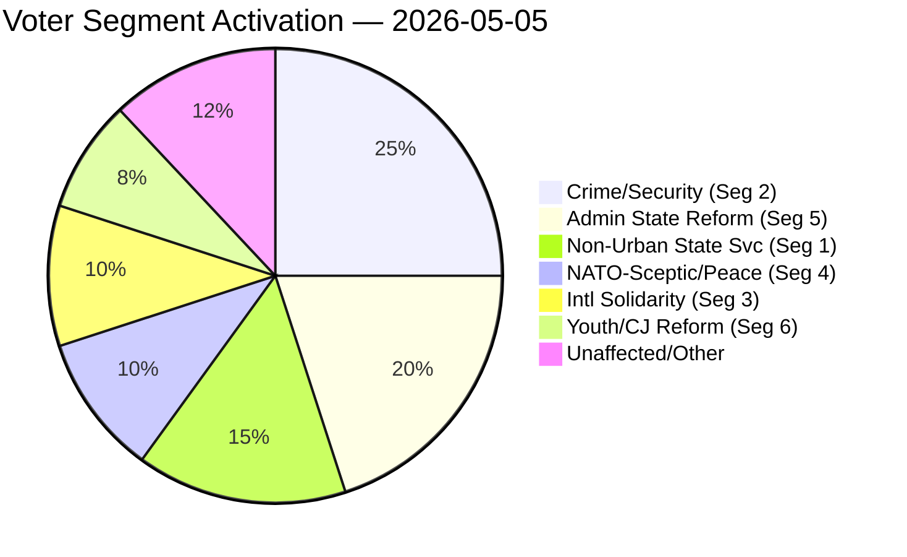

# Voter Segmentation Analysis — Evening Analysis 2026-05-05

**Date**: 2026-05-05  
**Admiralty**: [B2]  

---

## Voter Segment Impact Assessment

Today's parliamentary record activates six distinct voter segments with measurable policy salience.

### Segment 1: Non-Urban State-Service Dependent Voters

**Profile**: Ages 45+, regional/rural Sweden, reliant on in-person Skatteverket, Försäkringskassan access; small business owners and employees of local authority services.

**Today's signal**: HD10465 (S/Björk) + HD10467 (Vetlanda Skatteverket) — both address this segment directly.

**Party activation**: S (defender), SD (ambiguous — Vetlanda question is defensive for SD constituency), KD (exposed).

**Estimated size**: ~15% of electorate in competitive non-urban seats (Småland, Norrland, inland districts).

**Electoral vulnerability**: HD10465 + Vetlanda interpellation confirm this segment is in play. S can gain 1–3 seats in non-urban constituencies if the narrative takes hold.

---

### Segment 2: Crime and Security Priority Voters

**Profile**: Ages 35–65, suburban and urban, concerns about gang crime, shootings, explosive attacks, and juvenile offenders.

**Today's signal**: JuU30 (juvenile custody tightening) advances.

**Party activation**: M + SD (deliverers), S (mild dissent on proportionality).

**Estimated size**: ~25% of electorate — largest swing-segment in this election cycle.

**Electoral vulnerability**: M+SD gain a concrete deliverable. S's JuU30 dissent (UNCRC) risks appearing weak on crime. Net: positive for M+SD in this segment.

---

### Segment 3: Foreign Aid and International Solidarity Voters

**Profile**: Ages 25–55, urban, higher education, support for Sweden's international development role; concentrated in Stockholm, Göteborg, Malmö.

**Today's signal**: HD10464 (Sida abolition demand) — direct threat to this segment's values.

**Party activation**: S + V + MP (defenders), M (silent), SD (proposer).

**Estimated size**: ~10% of electorate; concentrated in urban seats that are largely safe S/V territory.

**Electoral vulnerability**: Low — this segment is already fully captured by S+V+MP. HD10464 reinforces existing preference, does not create new swing.

---

### Segment 4: NATO-Sceptic Peace and Security Voters

**Profile**: Ages 25–50, academic/professional, historically MP and V voters, now also some S voters uncomfortable with full NATO integration.

**Today's signal**: HD11787 (NPT nuclear — V challenge to Sweden's NATO nuclear posture).

**Party activation**: V (mobiliser), MP (quiet co-beneficiary).

**Estimated size**: ~8–12% of electorate; partially overlapping with Segment 3.

**Electoral vulnerability**: This segment keeps V above 7% and MP at/above threshold. HD11787 helps V consolidate; helps MP avoid threshold collapse if they signal alignment.

---

### Segment 5: Administrative State Reform Sympathisers

**Profile**: Ages 35–65, non-urban and suburban, "too much bureaucracy" sentiment, distrust of public sector expansion.

**Today's signal**: HD10464 (Sida abolition) + HD10466 (civil servant neutrality) — SD's reformist framing activates this segment.

**Party activation**: SD (dominant), M (weaker resonance), C (partial).

**Estimated size**: ~18–22% of electorate; heavily overlapping with SD's core base but extending to C and disillusioned M voters.

**Electoral vulnerability**: SD gains from this narrative even if no policy outcome results.

---

### Segment 6: Youth and Criminal Justice Reform Voters

**Profile**: Ages 18–30, urban, concerned about UNCRC compliance and over-criminalization of youth; also concerned about juvenile gang recruitment.

**Today's signal**: JuU30 — splits this segment (some want tougher response to youth crime; others cite UNCRC proportionality).

**Party activation**: S + V (UNCRC dissent), M + SD (tougher stance).

**Estimated size**: ~8% of electorate; youth vote turnout variable.

**Electoral vulnerability**: This segment's behaviour depends on whether JuU30 generates visible human rights controversy (which would activate the UNCRC-concern sub-segment).

---

## Segment Activation Summary

