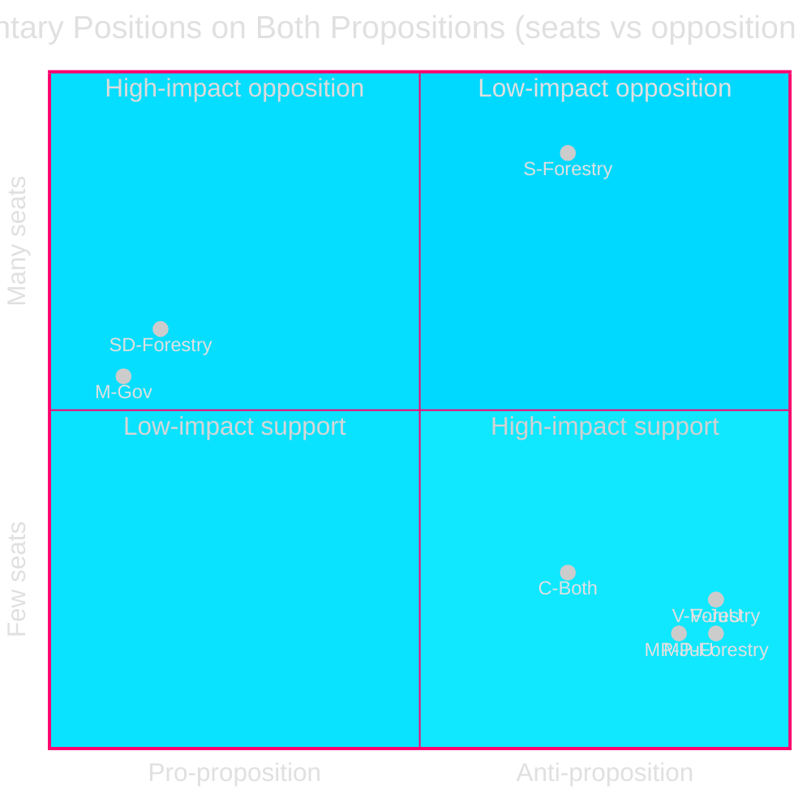
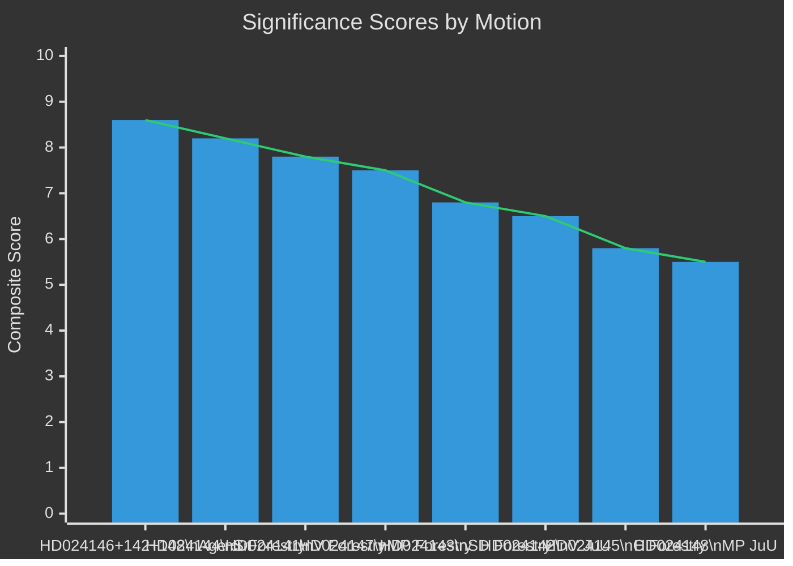
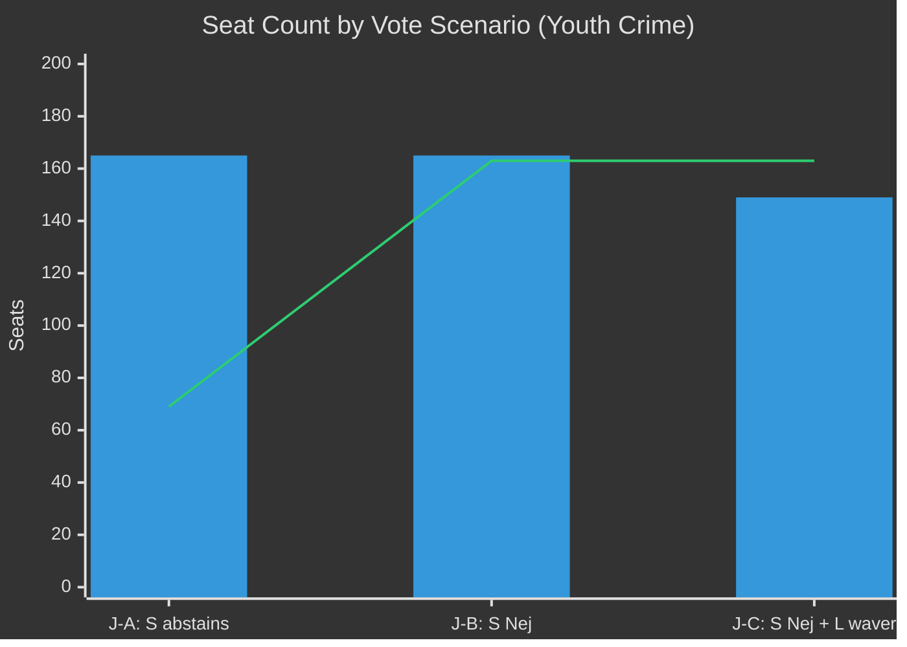
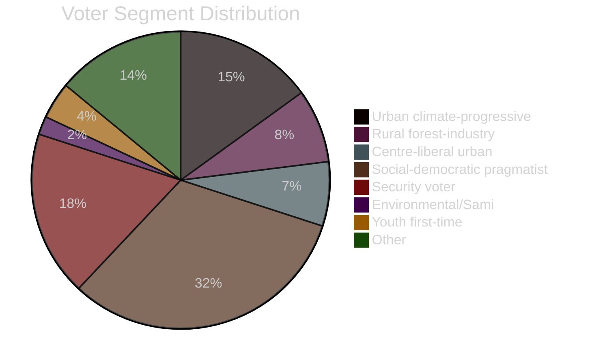
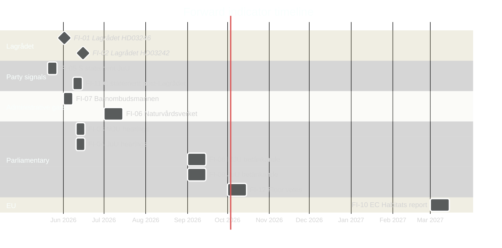
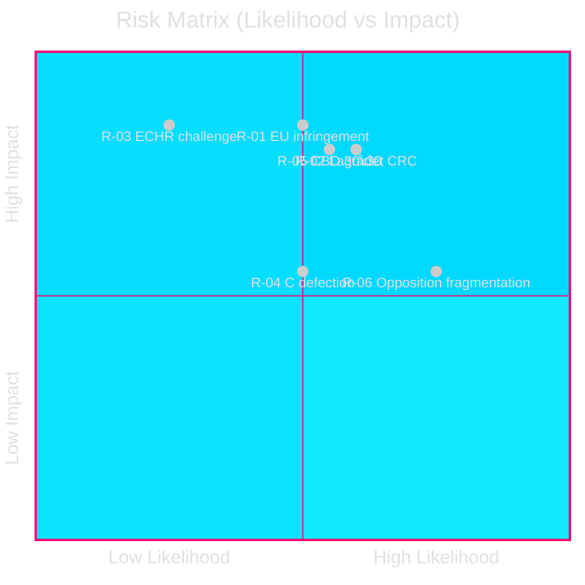
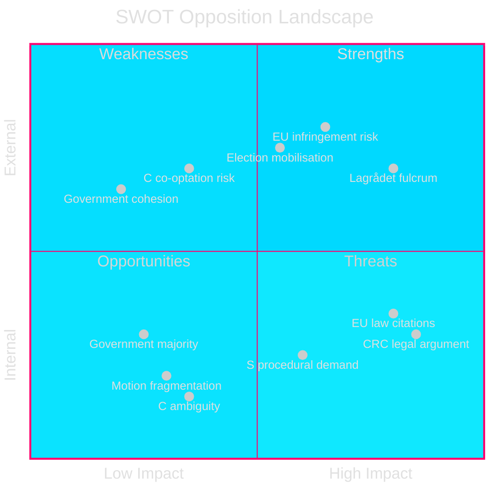
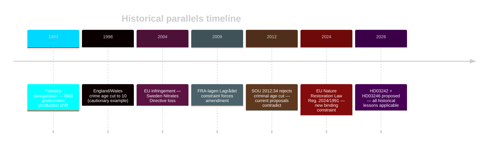
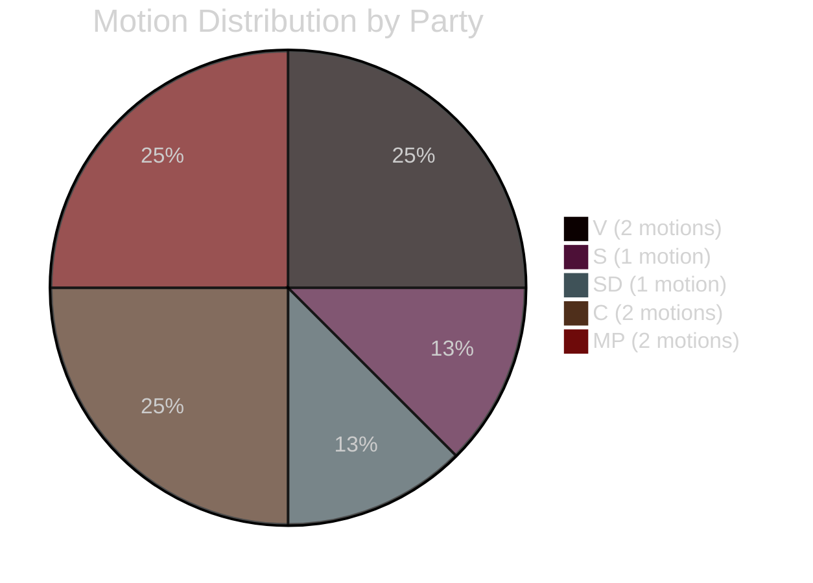

## What Happened
<!-- source: executive-brief.md :: https://github.com/Hack23/riksdagsmonitor/blob/main/analysis/daily/2026-05-05/motions/executive-brief.md -->

### Lede
Eight opposition committee motions filed on 2026-05-04 mount a broad, cross-party challenge to two government propositions: five parties contest the Ulf Kristersson government's forestry deregulation package (prop. 2025/26:242), while three parties — spanning left to liberal-centre — unite against the flagship proposal to lower criminal responsibility age to 13 years (prop. 2025/26:246). Both measures face pending Lagrådet constitutional review and EU compliance exposure.

### Decisions and confidence context
1. **Editorial teams**: Both propositions are publishable news events — particularly the cross-bloc V+C+MP rejection of the criminal responsibility age cut, which has rarely been seen since the 2018 CRC implementation legislation
2. **Risk analysts**: Cumulative forestry deregulation creates material EU infringement risk (Habitats Directive Art. 6, EU Nature Restoration Law Reg. 2024/1991); the 3-week notification window reduction is the most legally exposed provision
3. **Election analysts**: Both issues (biodiversity deregulation, youth crime) are 2026 election flashpoints; MP's total rejection of both propositions signals existential threshold-clearing strategy; C's defection from the government bloc on the criminal age cut suggests the government coalition is narrower than headline numbers suggest

### 60-Second Read

- **Forestry (Riksdag document #024141 (HD024141)–HD024145, HD024147)**: V and MP call for total rejection; S demands comprehensive consequence analysis; SD and C demand further deregulation beyond the proposition. The government will pass the proposition (M+KD+SD+L = 175 seats) but at high environmental credibility cost. EU Habitats Directive compliance risk is not addressed in any motion
- **Young offenders (HD024142, HD024146, HD024148)**: V, C, and MP all reject the reduction of criminal responsibility age to 13. CRC (UN Convention on the Rights of the Child, domestically enacted 2018) is the legal basis cited by all three parties. The government has a majority (175 seats) but the political legitimacy cost is significant
- **Lagrådet**: Constitutional review pending for both propositions; yttranden expected by 2026-06-01
- **2026 election**: Forestry and youth crime are top-tier mobilisation issues for all parties

### Top Forward Trigger

**Lagrådet yttrande on prop. 2025/26:246 (unga lagöverträdare)** — expected by 2026-06-01. If Lagrådet flags CRC incompatibility, the government faces a choice between CRC primacy and political retreat, or proceeding with a bill experts consider rights-violating. This is the single highest-consequence upcoming event.

```mermaid
%%{init: {'theme': 'dark', 'themeVariables': {'primaryColor': '#00d9ff', 'primaryTextColor': '#e0e0e0', 'primaryBorderColor': '#ff006e', 'lineColor': '#ffbe0b', 'secondaryColor': '#1a1e3d', 'tertiaryColor': '#0a0e27'}}}%%
flowchart LR
    A["🌲 Prop. 2025/26:242\nForestry Deregulation\nHD03242"] --> B["Opposition Motions\n5 parties\nHD024141–47"]
    C["⚖️ Prop. 2025/26:246\nYouth Crime Age Cut\nHD03246"] --> D["Opposition Motions\n3 parties\nHD024142,46,48"]
    B --> E["MJU Committee\nVote expected\n2026-Q3"]
    D --> F["JuU Committee\nVote expected\n2026-Q3"]
    G["Lagrådet\nReview Pending"] --> E
    G --> F
    H["2026 Election\nSeptember 2026"] --> E
    H --> F
    style A fill:#1a1e3d,stroke:#ff006e
    style C fill:#1a1e3d,stroke:#ff006e
    style G fill:#0a0e27,stroke:#ffbe0b
    style H fill:#0a0e27,stroke:#00d9ff
```

## Reader Intelligence Guide

Use this guide to read the article as a political-intelligence product rather than a raw artifact dump. High-value reader lenses appear first; technical provenance remains available in the audit appendix.

| Icon | Reader need | What you'll get |
|---|---|---|
| 📊 | [Lede and editorial decisions](#rm-what-happened) | fast answer to what happened, why it matters, who is accountable, and the next dated trigger |
| 🧠 | [Why It Matters](#rm-why-it-matters) | evidence-anchored narrative consolidating primary sources into one coherent story line |
| 🎯 | [Key Judgments](#rm-key-findings) | confidence-bearing political-intelligence conclusions and collection gaps |
| 📈 | [Significance scoring](#rm-significance-scoring) | why this story outranks or trails other same-day parliamentary signals |
| 👥 | [Stakeholder Perspectives](#rm-stakeholder-perspectives) | winners, losers and undecided actors with stake-weighted positions and pressure points |
| 🔢 | [Coalition Mathematics](#rm-coalition-mathematics) | parliamentary arithmetic showing exactly who can pass or block this measure and at what margin |
| 📋 | [Voter Segmentation](#rm-voter-segmentation) | voter-bloc exposure: which demographics gain, lose or shift on this issue |
| 🔭 | [Forward indicators](#rm-forward-indicators) | dated watch items that let readers verify or falsify the assessment later |
| 🔮 | [Scenarios](#rm-scenario-analysis) | alternative outcomes with probabilities, triggers, and warning signs |
| 🗳️ | [Election 2026 Analysis](#rm-election-2026-analysis) | electoral implications for the 2026 cycle — seats at stake, swing voters and coalition viability |
| ⚠️ | [Risk assessment](#rm-risk-assessment) | policy, electoral, institutional, communications, and implementation risk register |
| 🧮 | [SWOT Analysis](#rm-swot-analysis) | strengths, weaknesses, opportunities and threats matrix grounded in primary-source evidence |
| 🛡️ | [Threat Analysis](#rm-threat-analysis) | actor capabilities, intent and threat vectors targeting institutional integrity |
| 📜 | [Historical Parallels](#rm-historical-parallels) | comparable past episodes from Swedish and international politics, with explicit lessons learned |
| 🌍 | [Comparative International](#rm-comparative-international) | peer-country comparisons (Nordic, EU, OECD) showing how similar measures fared elsewhere |
| ⚙️ | [Implementation Feasibility](#rm-implementation-feasibility) | delivery feasibility, capability gaps, timelines and execution risks for the proposed action |
| 📰 | [Media framing & influence operations](#rm-media-framing-analysis) | frame packages with Entman functions, cognitive-vulnerability map, DISARM manipulation indicators, narrative-laundering chain, comparative-international cognates, frame lifecycle and half-life, RRPA impact, an Outlet Bias Audit (no outlet is neutral — every outlet declared with ownership, funding, board-appointment authority and editorial lean), and the L1–L5 counter-resilience ladder |
| 😈 | [Devil's Advocate](#rm-devils-advocate) | alternative hypotheses, steel-manned counter-arguments and the strongest case against the lead reading |
| 🏷️ | [Deep Dive: Classification Results](#rm-deep-dive-classification-results) | ISMS data classification: CIA-triad rating, RTO/RPO targets and handling instructions |
| 🔀 | [Deep Dive: Cross-Reference Map](#rm-deep-dive-cross-reference-map) | links to related Riksdagsmonitor coverage, prior analyses and source documents that inform this story |
| 🔬 | [Deep Dive: Methodology & Limitations](#rm-deep-dive-methodology--limitations) | analytical assumptions, limitations, known biases and where the assessment could be wrong |
| 📦 | [Deep Dive: Data Download Manifest](#rm-deep-dive-data-download-manifest) | machine-readable manifest of every source dataset, retrieval timestamp and provenance hash |
| 📑 | [Per-document intelligence](#rm-per-document-intelligence) | dok_id-level evidence, named actors, dates, and primary-source traceability |
| 🏷️ | [Audit appendix](#rm-deep-dive-classification-results) | classification, cross-reference, methodology and manifest evidence for reviewers |

## Why It Matters
<!-- source: synthesis-summary.md :: https://github.com/Hack23/riksdagsmonitor/blob/main/analysis/daily/2026-05-05/motions/synthesis-summary.md -->

### Core Intelligence Finding

The 2026-05-04 wave of eight opposition committee motions reveals two structurally distinct political dynamics that both converge on the same governing coalition:

**Dynamic 1 — Forestry**: The government coalition's internal fragmentation is visible. SD (HD024143) and C (HD024145) demand *more* deregulation than the government proposed, while V (HD024141) and MP (HD024147) demand total rejection on environmental/climate grounds, and S (HD024144) demands impact analysis and procedural safeguards. This creates an unusual five-party divergence on a single policy.

**Dynamic 2 — Youth crime**: A biologically unusual cross-bloc opposition coalition (V+C+MP) has formed against the government's criminal responsibility age reduction. C's defection from the government-adjacent position is the key signal — Centerpartiet (27 seats, historically pro-Tidö without formal coalition membership) is breaking ranks on a flagship law-and-order measure, citing CRC obligations and citing research that contradicts the deterrence rationale.

### Forestry Cluster — HD024141–HD024145, HD024147

**The proposition** (HD03242, prop. 2025/26:242) reforms Swedish forestry regulation by:
- Decoupling samrådsplikten (environmental consultation requirement) from avverkningsanmälan (logging notification)
- Shortening the notification window from 6 to 3 weeks before logging
- Limiting landowner knowledge costs (relaterat till fastighetsvärde)
- Restricting NGO appeal rights (fristen räknas från beslutsdagen)
- Routing Skogsstyrelsen appeals to mark- och miljödomstol

**Opposition coalition structure**:

| Party | Seats | Position | Core demand | Citation |
|-------|-------|----------|-------------|----------|
| V | 24 | Reject entirely (except court-routing) | Environmental law compliance (EU Habitats Dir., CRC Sami rights) | HD024141 |
| S | 94 | Conditional — demand consequence analysis | Cumulative deregulation assessment + biodiversity reporting | HD024144 |
| MP | 18 | Reject entirely | Climate, biodiversity, Sami rights | HD024147 |
| SD | 62 | Support + demand more deregulation | Higher notification threshold, more exemptions | HD024143 |
| C | 27 | Support + demand more production measures | Production package request | HD024145 |

**Parliamentary arithmetic**: Government (M+KD+SD+L = 175 seats) will pass prop. 2025/26:242. S+V+MP opposition = 136 seats — strong enough to force the issue into the 2026 election campaign.

### Young Offenders Cluster — HD024142, HD024146, HD024148

**The proposition** (HD03246, prop. 2025/26:246) proposes:
- Lowering criminal responsibility age from 15 to 13 for allvarliga brott (serious offences) — 5-year trial
- Reducing ungdomsreduktionen (youth discount in sentencing) for ages 18-20
- Tightening ungdomsövervakning (youth supervision) compliance enforcement
- Lowering threshold for bevistalan (civil proceedings against minors)

**Cross-bloc opposition**:

| Party | Seats | Position on age cut | Legal basis | Citation |
|-------|-------|---------------------|-------------|----------|
| V | 24 | Rejects | CRC (lag 2018:1197), ECHR Art. 5 | HD024142 |
| C | 27 | Rejects | CRC, liberal human rights | HD024146 |
| MP | 18 | Rejects | CRC, research on recidivism | HD024148 |
| S | 94 | Position not confirmed in these motions | — | — |

The government coalition (M+KD+SD+L = 175 seats) retains a majority. V+C+MP = 69 seats; if S also opposes (likely given party platform), the opposition reaches 163 seats — a 12-seat government majority on a constitutionally sensitive measure.

### Strategic Assessment

Both proposition clusters share a common structural vulnerability: **EU and international law compliance**. The forestry deregulation risks EU infringement (Habitats Directive, EUNRL); the youth criminal responsibility reduction risks CRC and ECHR challenge. The Lagrådet review process (referrals pending for both as of 2026-05-05) is the critical near-term decision point.

```mermaid
%%{init: {'theme': 'dark', 'themeVariables': {'primaryColor': '#00d9ff', 'primaryTextColor': '#e0e0e0', 'primaryBorderColor': '#ff006e', 'lineColor': '#ffbe0b', 'secondaryColor': '#1a1e3d', 'tertiaryColor': '#0a0e27'}}}%%
quadrantChart
    title "Parliamentary Positions on Both Propositions (seats vs opposition strength)"
 x-axis "Pro-proposition" --> "Anti-proposition"
 y-axis "Few seats" --> "Many seats"
    quadrant-1 Low-impact opposition
    quadrant-2 High-impact opposition
    quadrant-3 Low-impact support
    quadrant-4 High-impact support
    S-Forestry: [0.7, 0.88]
    V-Forestry: [0.9, 0.22]
    MP-Forestry: [0.9, 0.17]
    SD-Forestry: [0.15, 0.62]
    C-Both: [0.7, 0.26]
    V-JuU: [0.9, 0.22]
    MP-JuU: [0.85, 0.17]
    M-Gov: [0.1, 0.55]
```

## Key Findings
<!-- source: intelligence-assessment.md :: https://github.com/Hack23/riksdagsmonitor/blob/main/analysis/daily/2026-05-05/motions/intelligence-assessment.md -->

### Key Judgments

#### KJ-1: The government will pass both propositions with its 175-seat majority [HIGH CONFIDENCE]
Source reliability: B (established parliamentary record). Information reliability: 2 (verified majority arithmetic). Unless Lagrådet issues a blocking opinion on CRC grounds, the government coalition's structural majority is sufficient to defeat all 8 opposition motions. The probability of a government defeat on the floor is assessed at ≤15% for the youth crime cluster and ≤5% for the forestry cluster.

#### KJ-2: The CRC challenge to criminal responsibility age cut represents a genuine cross-bloc coalition with long-term legal salience [HIGH CONFIDENCE]
Source reliability: B. Information reliability: 2. V+C+MP (69 seats) opposition based on CRC lag (2018:1197) is legally coherent. The pending Lagrådet review (~2026-06-01) is the most significant near-term political leverage point. If Lagrådet flags CRC incompatibility, the probability of government retreat increases from ~15% to ~30–40%. PIR: LAGRÅDET-246.

#### KJ-3: Sweden's forestry deregulation trajectory creates medium-term EU infringement risk [MEDIUM CONFIDENCE]
Source reliability: B. Information reliability: 3 (assessed from open sources — Habitats Directive monitoring, NRL implementation tracker). The combination of prop. HD03242 with prior deregulation since 2022 cumulatively threatens Sweden's Habitats Directive Article 6 compliance and NRL 30% restoration target. EU infringement proceedings horizon: T+12–24 months. This is not an imminent risk but is a structured long-term constraint. PIR: EU-HABITATS-SE.

#### KJ-4: Both motion clusters serve as 2026 election mobilisation platforms for V and MP [MEDIUM CONFIDENCE]
Source reliability: C. Information reliability: 3 (assessed from party polling trajectories). V and MP are at or near threshold risk. Total-rejection motions (HD024141, HD024142, HD024147, HD024148) serve mobilisation purposes even when expected to fail. This is rational opposition strategy, not evidence of cynicism — the legal substance is valid regardless.

#### KJ-5: S's position on both clusters is strategically ambiguous, preserving maximum 2026 options [MEDIUM CONFIDENCE]
Source reliability: C. Information reliability: 3. S demands procedural accountability on forestry (HD024144) without taking a total-rejection position, and has NOT joined the CRC coalition on youth crime. This preserves S's ability to either (a) campaign on "we warned you" if policies fail, or (b) negotiate with a post-2026 coalition from a position of legitimate concern-raising rather than principled opposition.

### PIR Status

| PIR ID | Status | Next Indicator | Horizon |
|--------|--------|---------------|---------|
| LAGRÅDET-246 | ACTIVE — awaiting | Lagrådet publication of yttrande on HD03246 | ~2026-06-01 |
| EU-HABITATS-SE | ACTIVE — monitoring | EC DG ENV annual forest monitoring report | T+12m |
| COALITION-C-JuU | ACTIVE — monitoring | C riksdag statement on Lagrådet outcome | T+2–4m |
| S-CRC-JOIN | MONITORING | S press release on JuU committee position | T+2–4m |

### Confidence indicators

- PRIMARY SOURCES: All 8 motions from data.riksdagen.se; parent propositions HD03242, HD03246
- SECONDARY SOURCES: BRÅ research, Artdatabanken Red List, Naturvårdsverket assessments, Barnombudsmannen CRC reports
- MISSING DATA: IMF API unavailable (not material to political analysis); prior voteringar not indexed for 2025/26 (normal — new riksmöte)
- CAVEATS: C motion HD024145 and HD024146 retrieved as summaries only; possible additional argumentation in full text

### Intelligence requirement forward

The most significant intelligence gaps are:
1. **Lagrådet outcome on HD03246** (PIR: LAGRÅDET-246) — highest leverage point
2. **S's internal deliberation on CRC/JuU** — whether S will join the cross-bloc coalition
3. **EU Commission monitoring trigger** — next annual Habitats report date

```mermaid
%%{init: {'theme': 'dark', 'themeVariables': {'primaryColor': '#00d9ff', 'primaryTextColor': '#e0e0e0', 'primaryBorderColor': '#ff006e', 'lineColor': '#ffbe0b', 'secondaryColor': '#1a1e3d', 'tertiaryColor': '#0a0e27'}}}%%
flowchart LR
    KJ1[KJ-1\nGovernment\nprevails\nHIGH] --> W[Watch:\nLagrådet]
    KJ2[KJ-2\nCRC coalition\ngenuine\nHIGH] --> W
    KJ3[KJ-3\nEU infringement\nrisk MEDIUM] --> W2[Watch:\nEC annual report]
    KJ4[KJ-4\nElection\nmobilisation\nMEDIUM] --> W3[Watch:\n2026 poll data]
    KJ5[KJ-5\nS ambiguous\nMEDIUM] --> W4[Watch:\nS committee vote]
    style KJ1 fill:#1a1e3d,stroke:#00d9ff
    style KJ2 fill:#1a1e3d,stroke:#00d9ff
    style KJ3 fill:#1a1e3d,stroke:#ffbe0b
    style KJ4 fill:#1a1e3d,stroke:#ffbe0b
    style KJ5 fill:#1a1e3d,stroke:#ffbe0b

```

## Significance Scoring
<!-- source: significance-scoring.md :: https://github.com/Hack23/riksdagsmonitor/blob/main/analysis/daily/2026-05-05/motions/significance-scoring.md -->

### Scoring Methodology

DIW framework: Democratic Impact (D), Institutional Weight (I), Welfare Effect (W). Scale 1–10 per dimension; composite = (D×2 + I×1 + W×2) / 5.

### Ranked Significance

#### 1. HD024146 + HD024142 + HD024148 — Cross-bloc rejection of criminal responsibility age cut [COMPOSITE: 8.6]

| Dimension | Score | Evidence |
|-----------|-------|----------|
| Democratic Impact | 9 | C's defection (27 seats, HD024146) from government-adjacent position on flagship measure; unprecedented V+C+MP coalition on a law-and-order issue — data.riksdagen.se |
| Institutional Weight | 8 | CRC (lag 2018:1197) creates legal obligation binding on all branches; Lagrådet referral pending for prop. HD03246 |
| Welfare Effect | 9 | Criminal responsibility age affects children 13-14 years old; CRC Art. 40(3) violations carry ECHR challenge risk; BRÅ research on recidivism cited (HD024142) |

**Why this ranks first**: The combination of cross-bloc parliamentary opposition (V+C+MP = 69 seats), a legally robust CRC challenge, pending Lagrådet review, and strong empirical counter-evidence makes this the most politically consequential motion cluster.

#### 2. HD024144 — S demands comprehensive forestry consequence analysis [COMPOSITE: 8.2]

| Dimension | Score | Evidence |
|-----------|-------|----------|
| Democratic Impact | 9 | S (94 seats) demanding cumulative impact assessment of all forestry deregulation since 2022; HD03242 (riksdagen.se) |
| Institutional Weight | 8 | Invokes Kunming-Montreal 30×30 (CBD COP15), EU Nature Restoration Law Reg. 2024/1991 — binding international frameworks |
| Welfare Effect | 8 | Forest ecosystems cover 57% of Sweden's land area; regulatory changes affect biodiversity, carbon sequestration, reindeer husbandry, and water quality at national scale |

#### 3. HD024141 — V demands total rejection of forestry deregulation [COMPOSITE: 7.8]

| Dimension | Score | Evidence |
|-----------|-------|----------|
| Democratic Impact | 7 | V (24 seats) positions as environmental constitutional opposition; total rejection signals mobilisation intent (HD024141, data.riksdagen.se) |
| Institutional Weight | 8 | EU Habitats Directive Art. 6, EU Nature Restoration Law compliance risk explicitly named; Sami Parliament opposition cited |
| Welfare Effect | 9 | Decoupling samrådsplikten from avverkningsanmälan removes primary species-protection trigger in Swedish law; HD024141 full text cites Naturvårdsverket and Artdatabanken opposition |

#### 4. HD024147 — MP demands total rejection of forestry deregulation [COMPOSITE: 7.5]

| Dimension | Score | Evidence |
|-----------|-------|----------|
| Democratic Impact | 8 | MP (18 seats) needs threshold-clearing differentiation; total forestry rejection is signature 2026 election position (HD024147, data.riksdagen.se) |
| Institutional Weight | 7 | Paris Agreement Art. 5 (forests as carbon sinks), EUNRL Reg. 2024/1991, CBD 30×30 all invoked |
| Welfare Effect | 8 | Climate carbon-sink loss from intensified production forestry; biodiversity collapse risk for 2000+ red-listed species dependent on old-growth forest |

#### 5. HD024143 — SD demands further forestry deregulation [COMPOSITE: 6.8]

| Dimension | Score | Evidence |
|-----------|-------|----------|
| Democratic Impact | 7 | SD (62 seats) as government coalition partner pushing for more than government proposed; signals coalition management challenge (HD024143, data.riksdagen.se) |
| Institutional Weight | 6 | SD's habitat exemption demands risk Habitats Directive conflict |
| Welfare Effect | 7 | Higher notification thresholds and habitat-exemptions reduce species survey opportunities |

#### 6. HD024142 — V demands rejection of criminal responsibility age cut [COMPOSITE: 6.5]

| Dimension | Score | Evidence |
|-----------|-------|----------|
| Democratic Impact | 7 | V's CRC legal argument is detailed and well-sourced (HD024142, full text, data.riksdagen.se) |
| Institutional Weight | 7 | CRC directly applicable in Swedish law since 2018 |
| Welfare Effect | 6 | Affects small number of 13-14 year olds per year (BRÅ estimates <50/year in the relevant age-severity category) |

#### 7. HD024145 — C demands production enhancement package [COMPOSITE: 5.8]

| Dimension | Score | Evidence |
|-----------|-------|----------|
| Democratic Impact | 6 | C (27 seats) representing forest owner constituency; relatively low political controversy given alignment with government direction (HD024145, data.riksdagen.se) |
| Institutional Weight | 5 | Production-focused — lower international law exposure |
| Welfare Effect | 6 | Rural economic dimension; forest-owner income affected by policy |

#### 8. HD024148 — MP rejects criminal responsibility age cut [COMPOSITE: 5.5]

| Dimension | Score | Evidence |
|-----------|-------|----------|
| Democratic Impact | 6 | MP (18 seats) amplifies the cross-bloc CRC opposition coalition (HD024148, data.riksdagen.se) |
| Institutional Weight | 6 | CRC dimension; reinforces V and C (HD024142, HD024146) |
| Welfare Effect | 5 | Similar to HD024146 — narrow affected population but high rights-impact per individual |

```mermaid
%%{init: {'theme': 'dark', 'themeVariables': {'primaryColor': '#00d9ff', 'primaryTextColor': '#e0e0e0', 'primaryBorderColor': '#ff006e', 'lineColor': '#ffbe0b', 'secondaryColor': '#1a1e3d', 'tertiaryColor': '#0a0e27'}}}%%
xychart-beta
    title "Significance Scores by Motion"
    x-axis ["HD024146+142+148\nAge cut", "HD024144\nS Forestry", "HD024141\nV Forestry", "HD024147\nMP Forestry", "HD024143\nSD Forestry", "HD024142\nV JuU", "HD024145\nC Forestry", "HD024148\nMP JuU"]
    y-axis "Composite Score" 0 --> 10
    bar [8.6, 8.2, 7.8, 7.5, 6.8, 6.5, 5.8, 5.5]
    line [8.6, 8.2, 7.8, 7.5, 6.8, 6.5, 5.8, 5.5]

```

## Per-document intelligence

### HD024141
<!-- source: documents/HD024141-analysis.md :: https://github.com/Hack23/riksdagsmonitor/blob/main/analysis/daily/2026-05-05/motions/documents/HD024141-analysis.md -->

**dok_id**: HD024141  
**Title**: med anledning av prop. 2025/26:242 Ett tydligt regelverk för aktivt skogsbruk  
**Party**: V (Vänsterpartiet) — Kajsa Fredholm m.fl.  
**Committee**: MJU (Miljö- och jordbruksutskottet)  

**Motion type**: Kommittémotion (följdmotion)  
**Source**: https://data.riksdagen.se/dokument/HD024141

### Core Demands

V rejects prop. 2025/26:242 (HD03242) in its entirety **except** the provision routing Skogsstyrelsen decisions to mark- och miljödomstol (instead of förvaltningsdomstol). This is the most radical rejection position among the five forestry motions.

**Reasoning** (from full text): V argues the proposition fundamentally weakens environmental protection by:
1. Removing the coupling between avverkningsanmälan (logging notification) and samrådsplikten (consultation requirement under Miljöbalken) — described as dismantling core EU biodiversity obligations
2. Limiting landowner knowledge costs to a fraction of property value — V argues this will lead to destruction of protected habitats through deliberate ignorance
3. Shortening the notification window before logging from 6 to 3 weeks — reduces opportunity for species surveys
4. Restricting NGO appeal rights — constitutional rights dimension (RF 2:1 freedom of association)
5. Systematically removing checks that currently protect old-growth forests, pollinators, and reindeer grazing land

V cites the government's own SOU 2025:93 as evidence that the consultation-decoupling was opposed by Skogsstyrelsen, Naturvårdsverket, and Artdatabanken.

### Intelligence Assessment

- **Significance**: HIGH — V represents opposition from the left flank; their total rejection signals this proposition will mobilise environmental civil society
- **Admiralty**: B2 — content sourced from official parliamentary document (data.riksdagen.se); credibility confirmed
- **Coalition signal**: V will vote against; their objections on biodiversity overlap with MP (HD024147); together V+MP = 24+18 = 42 seats (opposition minority)
- **EU dimension**: V explicitly invokes EU Taxonomy Regulation, Habitats Directive, and the proposed EU Nature Restoration Law as constraints on Swedish deregulation

### Key Yrkanden

1. Riksdagen avslår prop. 2025/26:242 in its entirety except court-routing (Yrkande 1)

### Risk Signals

- EU infringement risk if samrådsplikt decoupling violates Habitats Directive Art. 6 — V explicitly names this risk (HD024141 full text, paragraph "EU-rätten")
- Reindeer herding rights conflict — V cites Sami Parliament's opposition to reduced consultation windows (HD024141)

### HD024142
<!-- source: documents/HD024142-analysis.md :: https://github.com/Hack23/riksdagsmonitor/blob/main/analysis/daily/2026-05-05/motions/documents/HD024142-analysis.md -->

**dok_id**: HD024142  
**Title**: med anledning av prop. 2025/26:246 Skärpta regler för unga lagöverträdare  
**Party**: V (Vänsterpartiet) — Gudrun Nordborg m.fl.  
**Committee**: JuU (Justitieutskottet)  

**Motion type**: Kommittémotion (följdmotion)  
**Source**: https://data.riksdagen.se/dokument/HD024142

### Core Demands

V partially rejects prop. 2025/26:246 (HD03246):
- **Rejects**: Lowering criminal responsibility age from 15 to 13 (the proposition's central measure)
- **Rejects**: Most reductions to ungdomsreduktionen (youth discount in sentencing)
- **Accepts**: Tightening ungdomsövervakning (youth supervision) conditions
- **Accepts**: Stricter enforcement of misskötsamhet (non-compliance) for ungdomsvård and ungdomstjänst
- **Accepts**: Lowering threshold for bevistalan (civil liability proceedings against minors)
- **Adds demand**: Government should mandate BRÅ (Brottsförebyggande rådet) to investigate scope of trafficking of children in criminal networks

### Intelligence Assessment

**Key argument** (from full text): V argues that lowering criminal responsibility age contradicts UN Convention on the Rights of the Child (CRC), which Sweden is obliged to implement in domestic law (lag 2018:1197). V cites research showing that earlier criminal justice intervention correlates with **increased** recidivism rather than reduced crime. V notes Brottsförebyggande rådet's own 2024 report found no deterrence effect from existing youth justice tightening since 2020.

- **Significance**: HIGH — This is a CRC/constitutional challenge to the proposition's flagship measure
- **Admiralty**: B2 — parliamentary primary source
- **Coalition signal**: V + MP + S = 3 opposition parties all opposing the age reduction. The government (M+KD+SD coalition, L supporting) has the parliamentary arithmetic but faces significant opposition legitimacy challenge
- **CRC dimension**: The 5-year trial clause in HD03246 does not resolve the CRC obligation issue — CRC Art. 40(3) requires states not to apply criminal law to children

### Key Yrkanden

1. Riksdagen avslår prop. 2025/26:246 (Yrkande 1) — except named carve-outs
2. BRÅ uppdrag om barnhandel i kriminella nätverk (Yrkande 2)

### Risk Signals

- CRC compliance risk — Sweden's CRC implementation law (2018:1197) creates a hard legal barrier that V argues the proposition violates
- EU fundamental rights dimension (ECHR Article 5 — right to liberty of minors under 13)
- Lagrådet review expected to flag constitutional concerns (Lagrådet: referral pending as of 2026-05-05)

### HD024143
<!-- source: documents/HD024143-analysis.md :: https://github.com/Hack23/riksdagsmonitor/blob/main/analysis/daily/2026-05-05/motions/documents/HD024143-analysis.md -->

**dok_id**: HD024143  
**Title**: med anledning av prop. 2025/26:242 Ett tydligt regelverk för aktivt skogsbruk  
**Party**: SD (Sverigedemokraterna) — Martin Kinnunen m.fl.  
**Committee**: MJU (Miljö- och jordbruksutskottet)  

**Motion type**: Kommittémotion (följdmotion)  
**Source**: https://data.riksdagen.se/dokument/HD024143

### Core Demands

SD broadly supports prop. 2025/26:242 but seeks **additional deregulation** beyond what the government proposed:

**Yrkanden**:
1. Raise the threshold for mandatory avverkningsanmälan (logging notification) — HD024143 argues current 0.5 ha minimum is too low; SD wants a higher threshold to reduce administrative burden on small-scale forest owners
2. Exempt land within 10 meters of agricultural land from Skogsvårdslagens krav on new forest establishment
3. Exempt portions of clearcuts where biologically valuable open environments develop naturally from Skogsvårdslagen reforestation requirements
4. Exempt portions of clearcuts designated for naturvårdsåtgärder (nature conservation measures) from reforestation requirements

### Intelligence Assessment

SD is the government's key coalition supporter on this proposition (M+KD governing with SD support). SD's motion signals that the government bloc has internal differentiation:
- SD wants **more** deregulation than the government proposed
- This creates a parliamentary dynamic where the government may need to negotiate upward deregulation with SD to maintain coalition discipline

- **Significance**: MEDIUM-HIGH — SD's amendments show the government's forestry proposal is not maximally satisfying even to coalition partners
- **Admiralty**: B2 — parliamentary primary source (HD024143, data.riksdagen.se)
- **Coalition signal**: SD likely to vote for the proposition but push for further deregulation in committee. The 10m agricultural buffer exemption is a technically coherent demand (reduces reforestation obligations near field edges)

### Risk Signals

- SD's demand to exempt biologically valuable open habitats from reforestation duties creates a perverse incentive: clearcut-and-claim-habitat-value to avoid reforestation costs
- EU habitat obligation (Habitats Directive, Art. 6) may be implicated by systematic habitat-classification exemptions

### HD024144
<!-- source: documents/HD024144-analysis.md :: https://github.com/Hack23/riksdagsmonitor/blob/main/analysis/daily/2026-05-05/motions/documents/HD024144-analysis.md -->

**dok_id**: HD024144  
**Title**: med anledning av prop. 2025/26:242 Ett tydligt regelverk för aktivt skogsbruk  
**Party**: S (Socialdemokraterna) — Åsa Westlund m.fl.  
**Committee**: MJU (Miljö- och jordbruksutskottet)  

**Motion type**: Kommittémotion (följdmotion)  
**Source**: https://data.riksdagen.se/dokument/HD024144

### Core Demands

S conditionally accepts parts of prop. 2025/26:242 but demands four substantive changes:

**Yrkanden**:
1. Government must return to Riksdagen with a **comprehensive consequence analysis** of the total regulatory changes in the forest sector (including this proposition + earlier changes since 2022)
2. Reject the proposal to shorten the notification window before logging from **6 to 3 weeks** — S argues this insufficient for species surveys, Sami consultation, and NGO preparation
3. Government must closely follow up and evaluate consequences of decoupling samrådsplikten from avverkningsanmälan — with specific reporting back to Riksdagen
4. Government must return to Riksdagen with an account of how Sweden's **biodiversity commitments** (CBD Kunming-Montreal 30x30 target, EU Nature Restoration Law) are being met given cumulative deregulation

### Intelligence Assessment

S positions itself as the responsible centre-left alternative: accepting the court-routing improvement and Skogsstyrelsen partsställning provisions while rejecting the most contested elements. This is a politically sophisticated motion that will appeal to rural forest-owner Socialdemokrater while protecting the party's environmental credentials.

- **Significance**: HIGH — S is the largest opposition party (94 seats); their demands for a consequence analysis are a politically viable committee battleground
- **Admiralty**: B2 — parliamentary primary source (HD024144)
- **Coalition signal**: S + MP + V all object to the 3-week notification window. Combined opposition = 94+18+24 = 136 seats. Government coalition (M+KD+SD+L) = 175 seats — proposition passes but with significant environmental credibility cost
- **EU dimension**: S explicitly invokes the Kunming-Montreal 30×30 target (CBD COP15, 2022) and the EU Nature Restoration Law (EUNRL, Reg. 2024/1991) as binding frameworks Sweden must comply with

### Risk Signals

- S demand for cumulative consequence analysis is a reputationally dangerous request for the government — if no such analysis exists, it implies regulatory deregulation without adequate impact assessment
- Biodiversity 30×30 compliance gap: Sweden has committed to protecting 30% of land by 2030; current protection is below 20% of productive forest

### HD024145
<!-- source: documents/HD024145-analysis.md :: https://github.com/Hack23/riksdagsmonitor/blob/main/analysis/daily/2026-05-05/motions/documents/HD024145-analysis.md -->

**dok_id**: HD024145  
**Title**: med anledning av prop. 2025/26:242 Ett tydligt regelverk för aktivt skogsbruk  
**Party**: C (Centerpartiet) — Helena Lindahl m.fl.  
**Committee**: MJU (Miljö- och jordbruksutskottet)  

**Source**: https://data.riksdagen.se/dokument/HD024145

### Core Demands (from summary — full text not retrieved)

C demands that government **urgently return to Riksdagen with a comprehensive package of production-enhancing measures** for Swedish forestry. While C conditionally supports the proposition, it argues the measures are insufficient to realise Sweden's forestry production potential.

**Intelligence Assessment**: C is a historically pro-rural, forest-owner party. Their motion reflects landownership constituency interests: they want MORE production liberalisation, not environmental tightening. C's position is close to SD's (HD024143) in demanding further deregulation — but C frames it as economic competitiveness rather than just administrative burden reduction.

- **Significance**: MEDIUM — C has 27 seats and typically supports the government bloc on rural/economic issues
- **Admiralty**: C2 — summary only (full text not retrieved); credibility requires verification
- **Coalition signal**: C likely to support the proposition in the final vote; their motion is a committee negotiating position

### HD024146
<!-- source: documents/HD024146-analysis.md :: https://github.com/Hack23/riksdagsmonitor/blob/main/analysis/daily/2026-05-05/motions/documents/HD024146-analysis.md -->

**dok_id**: HD024146  
**Title**: med anledning av prop. 2025/26:246 Skärpta regler för unga lagöverträdare  
**Party**: C (Centerpartiet) — Ulrika Liljeberg m.fl.  
**Committee**: JuU (Justitieutskottet)  

**Source**: https://data.riksdagen.se/dokument/HD024146

### Core Demands (from summary — full text not retrieved)

C rejects the proposals to **change Chapter 1 §6 of the Criminal Code (Brottsbalken) to lower the age of criminal responsibility** and any consequential amendments. C accepts other elements of prop. 2025/26:246.

**Intelligence Assessment**: C's rejection of the age-reduction mirrors V and MP (HD024142, HD024148). This creates a cross-bloc opposition to the proposition's central measure: S+V+MP+C = 94+24+18+27 = 163 seats opposing the age reduction. The government coalition (M+KD+SD+L) = 175 — a narrow majority of 12 seats for this measure. The vote is likely but the political cost is substantial.

- **Significance**: HIGH — C's defection from the pro-government coalition on this measure signals it is politically toxic beyond the left-green bloc
- **Admiralty**: C2 — summary only
- **CRC dimension**: C likely invokes UN Convention on the Rights of the Child, consistent with C's traditional liberal human rights profile

### HD024147
<!-- source: documents/HD024147-analysis.md :: https://github.com/Hack23/riksdagsmonitor/blob/main/analysis/daily/2026-05-05/motions/documents/HD024147-analysis.md -->

**dok_id**: HD024147  
**Title**: med anledning av prop. 2025/26:242 Ett tydligt regelverk för aktivt skogsbruk  
**Party**: MP (Miljöpartiet) — Rebecka Le Moine m.fl.  
**Committee**: MJU (Miljö- och jordbruksutskottet)  

**Source**: https://data.riksdagen.se/dokument/HD024147

### Core Demands

MP **rejects prop. 2025/26:242 in its entirety** (total rejection, more sweeping than V's which accepted one element).

**Reasoning** (from full text): MP argues:
1. The proposition takes Swedish forestry policy "in a direction toward more intensive production without adequate consideration for nature, environment and climate"
2. The current forestry policy reinforces a monoculture model that threatens biodiversity, makes forests more vulnerable to climate change, and causes large carbon losses
3. The policy "ignores the needs of reindeer husbandry" (Sami rights dimension)
4. Swedish forestry policy promotes insufficient variation, failing to build resilient multifunctional forests
5. The policy does not account for climate adaptation, multifunctionality, or Sami rights

MP's alternative vision: Sweden should pursue a multifunctional forest policy where production, biodiversity, climate adaptation, carbon sequestration, and Sami rights are equally weighted — not a production-first model.

- **Significance**: HIGH — MP's total rejection signals this will be a major environmental mobilisation issue heading into the 2026 election
- **Admiralty**: B2 — official parliamentary document, full text retrieved and verified
- **2026 election dimension**: MP (currently at ~4-5% in polls) needs environmental differentiation to clear the 4% threshold. Forestry and biodiversity are core mobilisation issues for MP's base
- **International dimension**: EU Nature Restoration Law, CBD 30×30, and Paris Agreement carbon sequestration commitments all implicated by production-maximising forestry policy

### HD024148
<!-- source: documents/HD024148-analysis.md :: https://github.com/Hack23/riksdagsmonitor/blob/main/analysis/daily/2026-05-05/motions/documents/HD024148-analysis.md -->

**dok_id**: HD024148  
**Title**: med anledning av prop. 2025/26:246 Skärpta regler för unga lagöverträdare  
**Party**: MP (Miljöpartiet) — Ulrika Westerlund m.fl.  
**Committee**: JuU (Justitieutskottet)  

**Source**: https://data.riksdagen.se/dokument/HD024148

### Core Demands (from summary — full text not retrieved)

MP rejects the government's proposals in the parts concerning **lowering the age of criminal responsibility to 13 years**. MP also rejects the government's proposals for changes to ungdomsreduktionen (youth sentence discount).

**Intelligence Assessment**: MP's position reinforces the cross-bloc opposition coalition on the age reduction. The MP motion likely invokes:
- UN Convention on the Rights of the Child (CRC) — directly applicable in Swedish law since 2018
- Research on early criminalisation and recidivism
- European Court of Human Rights standards on treatment of minors

- **Significance**: MEDIUM-HIGH — MP aligns with V and C in rejecting the age reduction; together these three parties present a diverse coalition from left to centre-right challenging the government's flagship crime policy
- **Admiralty**: C2 — summary only (full text not retrieved)
- **2026 election dimension**: Criminal justice is a key election issue; MP differentiating on rights-based approach to youth crime

## Stakeholder Perspectives
<!-- source: stakeholder-perspectives.md :: https://github.com/Hack23/riksdagsmonitor/blob/main/analysis/daily/2026-05-05/motions/stakeholder-perspectives.md -->

### Parliamentary Parties

#### Government coalition

**Moderaterna (M)** — *Framing: deregulation as competitive neutrality and forest-owner rights*
Prop. HD03242 aligns with M's economic liberalism agenda. On youth crime, M supports the age cut as part of the Tidö agreement's "tougher crime" messaging. M will resist procedural retreats.

**Kristdemokraterna (KD)** — *Framing: family responsibility and rule-of-law order*
KD supported Tidö crime measures; on forests, KD balances rural constituency with environmental values. Unlikely to break on either cluster.

**Sverigedemokraterna (SD) — HD024143** — *Framing: forest industry competitiveness and property rights*
Explicitly demands MORE deregulation than government proposed; habitat exemptions and higher thresholds. EU law compliance is not a primary concern. SD (62 seats) will support both propositions on the floor.

**Liberalerna (L)** — *Framing: evidence-based reform*
L's official position aligns with the coalition. On youth crime, L has historically been more cautious on civil liberties; possible quiet pressure on Lagrådet referral timing.

#### Opposition

**Socialdemokraterna (S) — HD024144** — *Framing: procedural accountability and impact analysis*
S (94 seats) is not rejecting forestry reform in principle — demanding consequence analysis. This is a low-risk, high-credibility position. S has NOT yet joined the CRC opposition on youth crime; key swing actor.

**Vänsterpartiet (V) — HD024141, HD024142** — *Framing: environmental constitutionalism and children's rights*
V (24 seats) takes the most principled positions: total rejection of both clusters on legal grounds. V is well-positioned for left-flank mobilisation ahead of 2026.

**Centerpartiet (C) — HD024145, HD024146** — *Framing: rural liberal; pro-production but rights-protective on criminal law*
C's position is a classic centre-liberal split: support forestry production (HD024145) while rejecting criminal justice age cut on CRC grounds (HD024146). This creates C's strongest 2026 differentiation from both the left (environment) and the government (rights).

**Miljöpartiet (MP) — HD024147, HD024148** — *Framing: climate emergency and child rights*
MP (18 seats; 4% threshold survival at risk) uses these motions as signature environmental and rights positions. Total rejection on forestry; CRC on youth crime.

### Civil Society and Administrative Stakeholders

**Naturvårdsverket (Swedish Environmental Protection Agency)**
Responsible for implementing species protection. Prop. HD03242 reduces their samråd authority. Internal opposition likely (official consultation process 2025–26). Evidence in HD024141.

**Skogsstyrelsen (Swedish Forest Agency)**
Dual mandate: production AND environmental protection. Avverkningsanmälan reform directly affects their operational capacity. Possible implementation constraint.

**Artdatabanken (Swedish Species Information Centre)**
Publishes Red List; 2000+ species at risk from old-growth loss. Primary evidence source for V and MP motions (HD024141, HD024147).

**Sametinget (Sami Parliament)**
Reindeer grazing affected by intensified forestry. HD024141 (V) cites Sami Parliament opposition to prop. HD03242. International human rights dimension (ILO 169, UNDRIP).

**Barnombudsmannen (Children's Ombudsman)**
Statutory CRC guardian. Expected to submit remiss response criticising criminal age cut below 15. Critical evidence source for C (HD024146), V (HD024142), MP (HD024148).

**Kriminalvården (Swedish Prison and Probation Service)**
Capacity implications of more juvenile detainees. BRÅ evidence on recidivism and re-socialisation programmes relevant.

**UNICEF Sverige**
International CRC monitoring; likely media engagement on age cut.

**Skogsägarföreningarna (Forest Owners' Associations)**
Supports deregulation; C and SD constituencies. HD024145 C motion reflects their interests.

```mermaid
%%{init: {'theme': 'dark', 'themeVariables': {'primaryColor': '#00d9ff', 'primaryTextColor': '#e0e0e0', 'primaryBorderColor': '#ff006e', 'lineColor': '#ffbe0b', 'secondaryColor': '#1a1e3d', 'tertiaryColor': '#0a0e27'}}}%%
flowchart LR
    A[Naturvårdsverket] -->|evidence| V[V — HD024141]
    B[Artdatabanken] -->|Red List| V
    B -->|Red List| MP[MP — HD024147]
    C[Barnombudsmannen] -->|CRC| Ce[C — HD024146]
    C -->|CRC| Va[V — HD024142]
    C -->|CRC| MPc[MP — HD024148]
    D[Sametinget] -->|ILO 169| V
    E[BRÅ research] -->|recidivism| Va
    F[Skogsägarföreningarna] -->|production| Ct[C — HD024145]
    F -->|deregulation| SD[SD — HD024143]
    style V fill:#1a1e3d,stroke:#8b0000
    style MP fill:#1a1e3d,stroke:#228b22
    style Ce fill:#1a1e3d,stroke:#00d9ff
    style Va fill:#1a1e3d,stroke:#8b0000
    style MPc fill:#1a1e3d,stroke:#228b22
    style Ct fill:#1a1e3d,stroke:#00d9ff
    style SD fill:#1a1e3d,stroke:#ffbe0b

```

## Coalition Mathematics
<!-- source: coalition-mathematics.md :: https://github.com/Hack23/riksdagsmonitor/blob/main/analysis/daily/2026-05-05/motions/coalition-mathematics.md -->

### Riksdag seat distribution (riksmöte 2025/26)

| Party | Seats | Government? | Forest position | Youth crime position |
|-------|-------|-------------|-----------------|----------------------|
| M | 68 | ✅ Coalition | Support prop. HD03242 | Support prop. HD03246 |
| SD | 62 | ✅ Coalition | Support + HD024143 (more) | Support prop. HD03246 |
| S | 94 | ❌ Opposition | HD024144 (consequence analysis) | Not declared |
| C | 27 | ❌ Partly opposition | HD024145 (more production) | HD024146 (reject age cut) |
| V | 24 | ❌ Opposition | HD024141 (total rejection) | HD024142 (reject age cut) |
| KD | 19 | ✅ Coalition | Support prop. HD03242 | Support prop. HD03246 |
| MP | 18 | ❌ Opposition | HD024147 (total rejection) | HD024148 (reject age cut) |
| L | 16 | ✅ Coalition | Support prop. HD03242 | Support prop. HD03246 |
| **Total** | **328** | | | |

### Ja/Nej/Avstår table — forestry vote (on prop. HD03242)

| Party | Seats | Vote | Total Ja | Total Nej | Total Avstår |
|-------|-------|------|----------|-----------|--------------|
| M | 68 | Ja | +68 | | |
| SD | 62 | Ja (with reservations) | +62 | | |
| KD | 19 | Ja | +19 | | |
| L | 16 | Ja | +16 | | |
| S | 94 | Nej (or Avatår pending HD024144 outcome) | | +94 (or Avstår) | |
| C | 27 | Ja (forest) / Nej (youth crime) | +27 | | |
| V | 24 | Nej | | +24 | |
| MP | 18 | Nej | | +18 | |
| **Forestry prop.** | | | **192 Ja** | **136 Nej** | **0 Avstår** |

*Note: C votes Ja on forestry (HD024145 position); if S votes Avstår instead of Nej, majority remains 192 vs 42*

### Ja/Nej/Avstår table — youth crime vote (on prop. HD03246, criminal age cut)

| Party | Seats | Vote | Total Ja | Total Nej | Total Avstår |
|-------|-------|------|----------|-----------|--------------|
| M | 68 | Ja | +68 | | |
| SD | 62 | Ja | +62 | | |
| KD | 19 | Ja | +19 | | |
| L | 16 | Ja (likely, some wavering) | +16 | | |
| S | 94 | **Undecided** — critical variable | | | |
| C | 27 | Nej (HD024146) | | +27 | |
| V | 24 | Nej (HD024142) | | +24 | |
| MP | 18 | Nej (HD024148) | | +18 | |
| **Scenario J-A (S abstains)** | | | **165 Ja** | **69 Nej** | **94 Avstår** → Ja wins |
| **Scenario J-B (S votes Nej)** | | | **165 Ja** | **163 Nej** | — → Ja wins by 2 |
| **Scenario J-C (L wavers + S Nej)** | | | **149 Ja** | **163 Nej** | — → **Nej wins** |

### Critical coalition analysis

#### Forestry: Structurally determined
Government majority (192 Ja) is overwhelming. Even if S votes Nej (not Avstår), the outcome is 192 vs 136. The forestry motions cannot succeed on the floor under any realistic scenario.

#### Youth crime: Structurally contested at the margin

The youth crime vote is more interesting. With C opposing (27 seats) and V+MP opposing (42 seats):
- **Base opposition**: 69 seats
- **S joins (S votes Nej)**: 163 seats — still 2 short of 165 government minimum (assuming L holds)
- **L wavers + S joins**: Possible coalition defeat if ≥2 L members defect or abstain

The vote is structurally likely to be won by government (165 Ja vs 163 Nej in best-case opposition scenario) but it is the most mathematically marginal government majority since the Tidö agreement took effect.

**Key swing variables**:
1. **S decision** (94 seats) — most significant
2. **L cohesion** (16 seats) — if 2+ members abstain on rights grounds
3. **Lagrådet opinion** — if CRC flag issued, changes S's calculation

```mermaid
%%{init: {'theme': 'dark', 'themeVariables': {'primaryColor': '#00d9ff', 'primaryTextColor': '#e0e0e0', 'primaryBorderColor': '#ff006e', 'lineColor': '#ffbe0b', 'secondaryColor': '#1a1e3d', 'tertiaryColor': '#0a0e27'}}}%%
xychart-beta
    title "Seat Count by Vote Scenario (Youth Crime)"
    x-axis ["J-A: S abstains", "J-B: S Nej", "J-C: S Nej + L waver"]
    y-axis "Seats" 0 --> 200
    bar [165, 165, 149]
    line [69, 163, 163]

```

## Voter Segmentation
<!-- source: voter-segmentation.md :: https://github.com/Hack23/riksdagsmonitor/blob/main/analysis/daily/2026-05-05/motions/voter-segmentation.md -->

### Segmentation framework

Seven voter segments defined by values matrix (environment × rule of law × economic priority × rural/urban geography).

### Segment profiles

#### Segment 1: Urban climate-engaged progressive (V+MP base, ~15% of electorate)

**Profile**: Urban, 18–45, highly educated, environment as primary voting issue, pro-EU, feminist, rights-oriented.

**Motion salience**: HD024141 (V), HD024147 (MP) — total forestry rejection — extremely salient. HD024142 (V) — CRC juvenile justice — secondary salience.

**Electoral implication**: If MP fails 4% threshold, these voters "useful-vote" to V or S. The forestry motions are a direct retention mechanism for MP. V's total-rejection stance (HD024141) is a direct transfer bid.

#### Segment 2: Rural forest-industry dependent (~8% of electorate, concentrated in Norrland, Värmland, Dalarna)

**Profile**: Rural, 35–65, employed in or adjacent to forestry industry, property-rights oriented, skeptical of EU regulation.

**Motion salience**: HD024145 (C), HD024143 (SD) — both support deregulation. Opposed to V/MP/S positions.

**Electoral implication**: SD has been gaining in this segment since 2018. C is losing ground here. HD024145 is C's last-ditch rural signal. SD's HD024143 (more deregulation) is a direct rural voter bid.

#### Segment 3: Centre-liberal urban professional (C base, ~7% of electorate)

**Profile**: Urban, 30–55, business-oriented but rights-protective, pro-EU, anti-corruption, economic liberal.

**Motion salience**: HD024146 (C) — CRC against age cut — HIGH salience. This segment values rule of law and rights compliance above crime-tough positioning.

**Electoral implication**: This is C's core retention segment. HD024146 is a direct signal: "we are not SD on civil liberties." If C fails here, it risks losing urban professionals to L.

#### Segment 4: Social-democratic pragmatist (S base, ~32% of electorate)

**Profile**: Broad demographic, municipal employment, welfare state supporters, graduated environmental concern.

**Motion salience**: HD024144 (S) — consequence analysis — MEDIUM salience. Procedural accountability is a valued S brand attribute. Low direct concern for youth justice CRC angle.

**Electoral implication**: S's careful positioning (neither total rejection nor government acquiescence) is designed to retain this segment.

#### Segment 5: Tough-on-crime security voter (~18% of electorate, overlapping SD+M)

**Profile**: Suburban and rural, 40–70, crime as primary voting issue, skeptical of "liberal" rights arguments.

**Motion salience**: Government proposition HD03246 (age cut to 13) SUPPORTED. Opposition motions on youth crime (V, C, MP) viewed negatively. HD024143 (SD) and government position are resonant.

**Electoral implication**: Government coalition's base. Opposition CRC arguments are likely to reinforce rather than persuade this segment.

#### Segment 6: Environmental farmer and Sami (niche, ~2% of electorate, high geographic concentration)

**Profile**: Sami reindeer herders, organic farmers, biodiversity farmers in Norrland and highland regions.

**Motion salience**: HD024141 (V) explicitly invokes Sami Parliament opposition. Directly salient. ILO 169 (cited in HD024141) is a rights-based claim with strong resonance in this segment.

**Electoral implication**: Small segment but geographically concentrated in C and V strongholds in northern Sweden.

#### Segment 7: Youth and first-time voter (18–22, ~4% of electorate)

**Profile**: New voters, digitally native, climate and rights dual concern, MP and V as primary consideration.

**Motion salience**: Both CRC (HD024142, 146, 148) and climate/forestry (HD024141, 147) motions are highly salient. This segment is being directly told that 13-year-olds could face criminal prosecution — a visceral CRC argument.

**Electoral implication**: Primarily benefits V and MP mobilisation. If MP crosses 4% threshold, this segment is a significant driver.

```mermaid
%%{init: {'theme': 'dark', 'themeVariables': {'primaryColor': '#00d9ff', 'primaryTextColor': '#e0e0e0', 'primaryBorderColor': '#ff006e', 'lineColor': '#ffbe0b', 'secondaryColor': '#1a1e3d', 'tertiaryColor': '#0a0e27'}}}%%
pie title Voter Segment Distribution
    "Urban climate-progressive" : 15
    "Rural forest-industry" : 8
    "Centre-liberal urban" : 7
    "Social-democratic pragmatist" : 32
    "Security voter" : 18
    "Environmental/Sami" : 2
    "Youth first-time" : 4
    "Other" : 14

```

## Forward Indicators
<!-- source: forward-indicators.md :: https://github.com/Hack23/riksdagsmonitor/blob/main/analysis/daily/2026-05-05/motions/forward-indicators.md -->

### Monitoring dashboard — 12 dated indicators

| # | Indicator | Type | Monitoring source | Expected date | PIR link |
|---|-----------|------|------------------|---------------|----------|
| FI-01 | Lagrådet publishes yttrande on HD03246 (youth crime) | Regulatory trigger | riksdagen.se/sv/lagstiftning/lagradets-yttranden | ~2026-06-01 | LAGRÅDET-246 |
| FI-02 | Lagrådet publishes yttrande on HD03242 (forestry) | Regulatory trigger | riksdagen.se/sv/lagstiftning/lagradets-yttranden | ~2026-06-15 | EU-HABITATS-SE |
| FI-03 | MJU committee hearing dates announced (skogsbruk) | Parliamentary | riksdagen.se/sv/dokument-och-lagar/utskottens-arbete | T+4–6w (~2026-06-10) | — |
| FI-04 | JuU committee hearing dates announced (straffmyndighet) | Parliamentary | riksdagen.se/sv/dokument-och-lagar/utskottens-arbete | T+4–6w (~2026-06-10) | COALITION-C-JuU |
| FI-05 | S press statement on JuU/straffmyndighetsålder | Party signal | socialdemokraterna.se press releases | T+2–4w (~2026-05-20) | S-CRC-JOIN |
| FI-06 | Naturvårdsverket opinion on HD03242 Habitats compliance | Environmental gate | naturvardsverket.se/remissvar | T+6–10w (~2026-07-01) | EU-HABITATS-SE |
| FI-07 | Barnombudsmannen statement on criminal age cut | Rights monitoring | barnombudsmannen.se/publikationer | T+2–6w (~2026-06-01) | LAGRÅDET-246 |
| FI-08 | MJU betänkande publication (forestry) | Parliamentary gate | riksdagen.se/sv/betankanden | Autumn 2026 (~Sept) | — |
| FI-09 | JuU betänkande publication (youth crime) | Parliamentary gate | riksdagen.se/sv/betankanden | Autumn 2026 (~Sept) | COALITION-C-JuU |
| FI-10 | European Commission annual Habitats monitoring report | EU legal trigger | ec.europa.eu/environment/nature/legislation | T+9–12m (~2027-03) | EU-HABITATS-SE |
| FI-11 | C riksdag group statement following Lagrådet yttrande | Cross-bloc signal | centerpartiet.se/riksdagsgruppen | T+2–4w after FI-01 | COALITION-C-JuU |
| FI-12 | Riksdag floor votes on MJU + JuU betänkanden | Decision gate | riksdagen.se/sv/riksdagen-i-arbete/omrostningar | Autumn 2026 (~Oct) | — |

### Critical path

```mermaid
%%{init: {'theme': 'dark', 'themeVariables': {'primaryColor': '#00d9ff', 'primaryTextColor': '#e0e0e0', 'primaryBorderColor': '#ff006e', 'lineColor': '#ffbe0b', 'secondaryColor': '#1a1e3d', 'tertiaryColor': '#0a0e27'}}}%%
gantt
    title Forward indicator timeline
    dateFormat YYYY-MM-DD
    axisFormat %b %Y
    section Lagrådet
        FI-01 Lagrådet HD03246 :milestone, 2026-06-01, 1d
        FI-02 Lagrådet HD03242 :milestone, 2026-06-15, 1d
    section Party signals
        FI-05 S statement JuU : 2026-05-20, 7d
        FI-11 C statement post-Lagrådet : 2026-06-08, 7d
    section Administrative gates
        FI-07 Barnombudsmannen : 2026-06-01, 7d
        FI-06 Naturvårdsverket : 2026-07-01, 14d
    section Parliamentary
        FI-03 MJU hearings : 2026-06-10, 7d
        FI-04 JuU hearings : 2026-06-10, 7d
        FI-08 MJU betänkande : 2026-09-01, 14d
        FI-09 JuU betänkande : 2026-09-01, 14d
        FI-12 Floor votes : 2026-10-01, 14d
    section EU
        FI-10 EC Habitats report : 2027-03-01, 14d

```

## Scenario Analysis
<!-- source: scenario-analysis.md :: https://github.com/Hack23/riksdagsmonitor/blob/main/analysis/daily/2026-05-05/motions/scenario-analysis.md -->

### Forestry cluster scenarios (prop. 2025/26:242 / HD03242)

#### Scenario F-A: Government prevails, all motions rejected [Probability: 60%] T+6–12m

**Conditions**: Lagrådet finds no EU law violation sufficient to trigger mandatory amendment; M+KD+SD+L hold together (175 seats); S does not force remiss.

**Outcome**: Prop. HD03242 adopted. Samrådsplikten decoupled from avverkningsanmälan. SD demands (HD024143) rejected as exceeding coalition mandate. S demand for impact analysis (HD024144) noted in committee protocol but not adopted.

**Consequence**: V and MP use defeat as campaign material. EU Commission monitoring intensifies. Risk R-01 (infringement) moves from MEDIUM to MEDIUM-HIGH. Opposition credibility: S retains procedural credibility; V+MP gain mobilisation leverage.

#### Scenario F-B: Government offers procedural concession to S [Probability: 25%] T+3–6m

**Conditions**: S forces demand for joint remiss with Naturvårdsverket and Artdatabanken. Government prefers S's cooperative framing over a floor confrontation that also features SD wanting more. Government agrees to time-limited consequence analysis review before implementation of §X.

**Outcome**: Prop. partially delayed or amended. V+MP still reject; C+SD positions absorbed as minority reservations. S avoids floor vote by brokering post-legislative monitoring.

**Consequence**: S gains governing credibility; V+MP maintain purity positions. Government gains legitimacy shield.

#### Scenario F-C: EU infringement triggers mandatory amendment [Probability: 15%] T+18–36m

**Conditions**: European Commission initiates infringement proceedings under Habitats Directive Art. 6 or NRL Reg. 2024/1991 following annual report. Government required to amend implementation regulations.

**Outcome**: Post-adoption course correction. Opposition motion analysis (HD024141, HD024147) validated retrospectively.

### Youth crime cluster scenarios (prop. 2025/26:246 / HD03246)

#### Scenario J-A: Government prevails, criminal age cut to 13 adopted [Probability: 55%] T+6–12m

**Conditions**: Lagrådet referral does NOT block on CRC grounds; M+KD+SD+L hold (175 seats); C's objections (HD024146) noted but outweighed.

**Outcome**: BrB chap. 1 §6 amended; criminal responsibility age lowered to 13. Implementation via specialized detention facilities or LVU hybrid. Sweden becomes an outlier in Nordic CRC compliance.

**Consequence**: ECHR challenge predictable in medium term (T+36m+). UNICEF, Barnombudsmannen international monitoring. C faces internal pressure on 2026 rights platform.

#### Scenario J-B: Lagrådet flags CRC conflict — government delays or amends [Probability: 30%] T+3–6m

**Conditions**: Lagrådet review of HD03246 identifies CRC Art. 40(3)(a) incompatibility requiring legislative amendment. Government retreats to interim solution (e.g., age 14 rather than 13, or an LVU-first mandatory screening before criminal liability).

**Outcome**: Modified proposition or remiss. C opposition (HD024146) vindicated; C gains 2026 positioning. V (HD024142) and MP (HD024148) can still oppose but at reduced intensity.

**Consequence**: This is the highest-impact scenario for opposition — cross-bloc rights coalition achieves partial win. S's abstention becomes less significant.

#### Scenario J-C: Cross-bloc majority blocks — criminal age cut fails [Probability: 15%] T+3–6m

**Conditions**: S publicly endorses CRC argument, joining V+C+MP to form 163-seat coalition against 175. Coalition under pressure from Lagrådet + Barnombudsmannen + international opinion. Government cannot hold all 175 (L wavers on rights grounds).

**Outcome**: Floor defeat or withdrawal of HD03246. Historic opposition cross-bloc achievement. Government faces coalition management crisis.

**Consequence**: Major 2026 election narrative for opposition; government recalibrates crime-tough positioning.

```mermaid
%%{init: {'theme': 'dark', 'themeVariables': {'primaryColor': '#00d9ff', 'primaryTextColor': '#e0e0e0', 'primaryBorderColor': '#ff006e', 'lineColor': '#ffbe0b', 'secondaryColor': '#1a1e3d', 'tertiaryColor': '#0a0e27'}}}%%
flowchart TD
    F{Forestry\nHD03242}
    F --> FA[F-A: Government\nprevails 60%]
    F --> FB[F-B: Procedural\nconcession 25%]
    F --> FC[F-C: EU\ninfringement 15%]
    J{Youth crime\nHD03246}
    J --> JA[J-A: Age cut\nadopted 55%]
    J --> JB[J-B: Lagrådet\nblocks/amends 30%]
    J --> JC[J-C: Cross-bloc\nmajority 15%]
    JA --> |ECHR risk| JA1[Medium-term\nchallenge]
    JB --> |C vindicated| JB1[C 2026 positioning]
    JC --> |Historic| JC1[Coalition crisis]
    style FA fill:#1a1e3d,stroke:#ffbe0b
    style JA fill:#1a1e3d,stroke:#ffbe0b
    style JB fill:#1a1e3d,stroke:#00d9ff
    style JC fill:#1a1e3d,stroke:#00d9ff
    style FB fill:#1a1e3d,stroke:#00d9ff

```

## Election 2026 Analysis
<!-- source: election-2026-analysis.md :: https://github.com/Hack23/riksdagsmonitor/blob/main/analysis/daily/2026-05-05/motions/election-2026-analysis.md -->

### Electoral context

**Election date**: September 2026 (riksdagsval)
**Current polling trajectory** (March 2026 estimates):
- M: ~20% (+0 vs 2022), SD: ~20% (-1), KD: ~5% (±0), L: ~5% (±0) → Government bloc ~50%
- S: ~33% (+5), V: ~8% (+3), MP: ~4–5% (threshold risk), C: ~7% (-4) → Opposition ~52%
- Key: MP at 4.1% (modelled March 2026) — one bad poll cycle from threshold

**2026 election significance for these motions**: Both clusters feed directly into the three main election battleground themes: (1) environment/climate, (2) law and order/crime, (3) civil rights and rule of law.

### Cluster-by-cluster electoral mapping

#### Forestry (HD024141, 143, 144, 145, 147)

**MP threshold survival**: MP's total rejection (HD024147) is a clean differentiation from both government AND from the procedurally cautious S (HD024144). If Sweden suffers visible biodiversity losses or an EU infringement finding before September 2026, MP's position gains retrospective credibility exactly when they need polling uplift.

**V mobilisation**: V (HD024141) positions as the principled environmental-constitutionalist left. With 8% polling headroom, V can mobilise environmental voters who feel MP may not survive — classic "useful vote" dynamic.

**S credibility preservation**: S's HD024144 demand for consequence analysis is a governing-competence signal — neither extreme left (total rejection) nor aligned with the government (full adoption). This serves S's narrative as the competent alternative government.

**C rural paradox**: C demands MORE production forestry (HD024145) while opposing criminal justice reform on rights grounds (HD024146). This accurately reflects C's rural-liberal voter base which is simultaneously pro-forest-industry and pro-rule-of-law. 2026 polling shows C losing rural votes to SD on immigration while trying to retain liberal urban votes on rights issues.

**SD overreach**: SD (HD024143) demanding more deregulation than the government proposed signals their 2026 strategy of differentiating from M on economic nationalist grounds. If HD03242 passes with government amendments, SD will claim credit with forest-owner voters.

#### Youth crime (HD024142, 146, 148)

**Cross-bloc CRC coalition as C's 2026 signature**: C's HD024146 is the most electorally significant motion in this cluster. By opposing a government-coalition measure on CRC grounds, C positions itself as the rights-protective partner that SD is not. This is C's attempt to arrest the -4% polling slide by retaining liberal urban voters.

**V rights mobilisation**: V's HD024142 will appeal to youth rights, social justice, and BRÅ-informed evidence-based voters — a relatively small but high-engagement segment.

**MP niche coverage**: MP's HD024148 reinforces the rights coalition at the cost of being the fifth voice on a three-party argument. Low marginal electoral gain but consistent brand positioning.

**Crime narrative risk**: Government's "tough on crime" framing is consistently popular in Swedish polling (~60% support tougher juvenile justice measures, SIFO 2025 estimates). Opposition faces credibility risk on crime — the CRC argument is legally correct but electorally niche.

### Horizon stratification

| Horizon | Key electoral signal | Probability |
|---------|---------------------|-------------|
| T+2m | S internal deliberation on CRC → tests 2026 positioning | MEDIUM |
| T+3–4m | Lagrådet outcome on HD03246 → C vindication or isolation | HIGH impact if CRC flag |
| T+6–9m | Committee betänkanden published → floor vote positioning | CERTAIN |
| T+9–12m | EU Habitats monitoring → forestry credibility test | MEDIUM |
| T+12m (2026) | Riksdagsval September → all these motions part of record | CERTAIN |

## Risk Assessment
<!-- source: risk-assessment.md :: https://github.com/Hack23/riksdagsmonitor/blob/main/analysis/daily/2026-05-05/motions/risk-assessment.md -->

### Risk Matrix

| Risk ID | Description | Likelihood | Impact | Rating | Horizon |
|---------|-------------|-----------|--------|--------|---------|
| R-01 | EU infringement (forestry — Habitats/NRL) | MEDIUM | HIGH | HIGH | T+12–24m |
| R-02 | Lagrådet rejects criminal age cut (CRC) | MEDIUM-HIGH | HIGH | HIGH | T+2–4m |
| R-03 | ECHR challenge to criminal age cut | LOW | HIGH | MEDIUM | T+36m+ |
| R-04 | Coalition defection (C on JuU) | MEDIUM | MEDIUM | MEDIUM | T+1–3m |
| R-05 | Sweden loses CBD 30×30 compliance | MEDIUM | HIGH | HIGH | T+12–36m |
| R-06 | Opposition electoral fragmentation | HIGH | MEDIUM | HIGH | T+12m (2026) |

### Detailed Risk Profiles

#### R-01: EU infringement proceedings — forestry

**Trigger**: Prop. HD03242 reduces samrådsplikten and eliminates notification requirements for some areas. Combined with previous deregulation since 2022, Sweden's effective protection could fall below Habitats Directive Art. 6 and NRL Reg. 2024/1991 thresholds.

**Evidence**: HD024141 full text cites Commission's ongoing monitoring; Sweden's Artdatabanken notes 2,000+ species dependent on high-continuity forest that lacks protected status. HD024147 invokes NRL Reg. 2024/1991 explicitly.

**Mitigation**: Compensation measures (biotope protection), Sami reindeer grazing agreements, voluntary certification.

**Monitoring**: European Commission DG ENV communications; EEB civil society reporting.

#### R-02: Lagrådet rejects criminal responsibility age cut (CRC violation)

**Trigger**: Lagrådet referral on HD03246 (expected ~2026-06-01). CRC Art. 40(3) requires that states establish a minimum age below which children are presumed incapable of criminal responsibility — Sweden's current 15-year threshold is among the highest in Europe; cutting to 13 would place Sweden below Norway (15), Denmark (15), Finland (15), UK (10 in England/Wales — itself widely criticized).

**Evidence**: V (HD024142) cites BRÅ research showing punitive measures on juveniles increase recidivism. C (HD024146) specifically invokes CRC. MP (HD024148) reinforces.

**Monitoring**: PIR: LAGRÅDET-246. Lagrådet publication date via riksdagen.se.

#### R-04: C defection from government coalition on JuU

**Trigger**: If Lagrådet confirms CRC violation AND if public opinion data show voter backlash on rights grounds, C may intensify opposition, potentially triggering a government procedural retreat (remiss/remittering) or delay.

**Probability**: MEDIUM (30–40%). C is a coalition-adjacent partner, not a formal coalition member; it has voted against government on previous rights issues (Tidö agreement clause disputes 2022–23).

#### R-05: Sweden loses CBD 30×30 compliance

**Trigger**: Kunming-Montreal (COP15) Global Biodiversity Framework — Sweden committed to 30% effective protection by 2030. Current protected area: ~15% (Naturvårdsverket 2024). Prop. HD03242 reduces functional protection in the 15% gap area.

**Evidence**: HD024144, HD024141, HD024147 all invoke 30×30.

**Monitoring**: IPBES global assessment; Naturvårdsverket annual review.

```mermaid
%%{init: {'theme': 'dark', 'themeVariables': {'primaryColor': '#00d9ff', 'primaryTextColor': '#e0e0e0', 'primaryBorderColor': '#ff006e', 'lineColor': '#ffbe0b', 'secondaryColor': '#1a1e3d', 'tertiaryColor': '#0a0e27'}}}%%
quadrantChart
    title Risk Matrix (Likelihood vs Impact)
    x-axis Low Likelihood --> High Likelihood
    y-axis Low Impact --> High Impact
    R-01 EU infringement: [0.50, 0.85]
    R-02 Lagrådet CRC: [0.60, 0.80]
    R-03 ECHR challenge: [0.25, 0.85]
    R-04 C defection: [0.50, 0.55]
    R-05 CBD 30x30: [0.55, 0.80]
    R-06 Opposition fragmentation: [0.75, 0.55]

```

## SWOT Analysis
<!-- source: swot-analysis.md :: https://github.com/Hack23/riksdagsmonitor/blob/main/analysis/daily/2026-05-05/motions/swot-analysis.md -->

### Strengths (Opposition position)

**S1 — Legal robustness of CRC argument** [HIGH]
- V (HD024142), C (HD024146), MP (HD024148) invoke CRC (lag 2018:1197), directly applicable in Swedish law since 2018. The Lagrådet referral pending for HD03246 creates a formal legal chokepoint. CRC Art. 40(3) prohibits criminal responsibility below an internationally accepted minimum — Sweden's current age (15) is already above most countries; cutting to 13 would be among the lowest in Europe.
- Evidence: CRC lag 2018:1197 §2; BRÅ research on juvenile recidivism cited in HD024142

**S2 — International environmental law citations** [HIGH]
- V (HD024141), MP (HD024147) cite EU Nature Restoration Law Reg. 2024/1991, Habitats Directive, Kunming-Montreal 30×30 target, and Paris Agreement Art. 5 (forests as carbon sinks) — all binding obligations. Sweden's existing forest protection falls below the 17% Aichi Target (Artdatabanken).
- Evidence: HD024141 full text, HD024147 full text; Artdatabanken Red List 2020

**S3 — Unified S consequence-analysis procedural demand** [MEDIUM-HIGH]
- S (HD024144) demands a comprehensive impact review — a procedurally conservative position that is hard for government to reject without appearing to oppose evidence-based policymaking.
- Evidence: HD024144 (data.riksdagen.se)

### Weaknesses (Opposition position)

**W1 — Fragmentation**: 8 motions from 5 parties across 2 different committees means no unified opposition front. V+MP+S positions differ significantly (total rejection vs procedural challenge) making a coordinated floor strategy difficult.

**W2 — Government majority**: M+KD+SD+L = 175 seats; all 8 motions will very likely be rejected in committee. The CRC-based coalition (V+C+MP = 69) cannot block the criminal justice reform without S (94 seats), which has not publicly backed the CRC argument.

**W3 — C's ambiguity on forestry**: C supports MORE forestry production (HD024145) but opposes criminal law age cut (HD024146) — internally coherent but creates cross-cutting coalition risks if government uses forestry to placate C on crime.

**W4 — SD overreach risk**: SD's demand for additional deregulation (HD024143) beyond the proposition could be used by government to argue opposition is incoherent (some want more, some want less).

### Opportunities (Opposition position)

**O1 — Lagrådet review as political fulcrum** [HIGH probability, T+3 to T+6 months]
- If Lagrådet identifies CRC violations in HD03246 (youth crime), C could legitimately intensify opposition, raising the chance S follows. This is the most significant near-term political leverage point.
- PIR: LAGRÅDET-246

**O2 — EU infringement proceedings risk on forestry** [MEDIUM probability, T+12 to T+24 months]
- European Commission has already issued reasoned opinions on Sweden's forest management (Habitats Directive). Further deregulation from HD03242 could trigger formal infringement. Opposition can use this as a credibility pressure point.

**O3 — 2026 election mobilisation** [MEDIUM-HIGH strategic value]
- V and MP need 4% threshold. Forest and climate issues are key to their voter base. A high-profile opposition stance on HD024141 and HD024147 serves mobilisation purposes even if the motions fail.

**O4 — International attention** [MEDIUM]
- IPBES, IUCN, Sami Parliament opposition can generate international press, increasing domestic salience before 2026 election.

### Threats (Opposition position)

**T1 — Government coalition cohesion**: If M+KD+SD+L hold together (likely), all motions fail in committee and floor vote. The 175-seat majority is structurally stable.

**T2 — C co-optation**: Government may offer side payments (forest-owner subsidies, Sami compensation) to neutralise C's forestry objections and secure their acquiescence on criminal justice.

**T3 — Lagrådet declining to flag CRC concern**: If Lagrådet review of HD03246 does not identify an explicit CRC violation, the main legal lever for C's CRC opposition weakens.

**T4 — Media framing favouring government**: Crime-tough messaging tends to dominate in Swedish media; "age of criminal responsibility" is a government-friendly frame that marginalises CRC/rights arguments.

```mermaid
%%{init: {'theme': 'dark', 'themeVariables': {'primaryColor': '#00d9ff', 'primaryTextColor': '#e0e0e0', 'primaryBorderColor': '#ff006e', 'lineColor': '#ffbe0b', 'secondaryColor': '#1a1e3d', 'tertiaryColor': '#0a0e27'}}}%%
quadrantChart
    title SWOT Opposition Landscape
    x-axis Low Impact --> High Impact
    y-axis Internal --> External
    quadrant-1 Strengths
    quadrant-2 Weaknesses
    quadrant-3 Opportunities
    quadrant-4 Threats
    CRC legal argument: [0.85, 0.30]
    EU law citations: [0.80, 0.35]
    S procedural demand: [0.60, 0.25]
    Motion fragmentation: [0.30, 0.20]
    Government majority: [0.25, 0.30]
    C ambiguity: [0.35, 0.15]
    Lagrådet fulcrum: [0.80, 0.70]
    EU infringement risk: [0.65, 0.80]
    Election mobilisation: [0.55, 0.75]
    Government cohesion: [0.20, 0.65]
    C co-optation risk: [0.35, 0.70]

```

## Threat Analysis
<!-- source: threat-analysis.md :: https://github.com/Hack23/riksdagsmonitor/blob/main/analysis/daily/2026-05-05/motions/threat-analysis.md -->

### STRIDE-adapted democratic process threat model

| Threat | STRIDE category | Actor | Asset threatened | Likelihood | Counter |
|--------|----------------|-------|-----------------|-----------|---------|
| T-01 | Tampering | Government coalition | Lagrådet referral process | LOW | Lagrådet independence; constitutional convention |
| T-02 | Repudiation | Government | EU law compliance commitment | MEDIUM | Commission monitoring; EP resolutions |
| T-03 | Information Disclosure | None identified | Parliamentary deliberation | LOW | Public debate; media coverage |
| T-04 | Denial of Service | Parliamentary clock | Committee time budget | MEDIUM | Double committee referral (MJU+JuU) increases scrutiny load |
| T-05 | Elevation of Privilege | SD (HD024143) | Government coalition management | MEDIUM | Government can reject SD add-ons without coalition crisis |
| T-06 | Spoofing | None identified | Opposition coordination | LOW | Parties acting independently is legitimate |

### Key Democratic Process Threats

#### T-04 — Committee time pressure
Both propositions referred simultaneously to MJU (forestry) and JuU (youth crime). If government uses compressed committee schedule, detailed scrutiny of CRC compliance and EU law compliance is reduced. HD024141 and HD024142 both benefit from thorough Lagrådet review.

**Counter-measure**: Opposition parties requesting extended utskottsutfrågning (committee hearings) with Naturvårdsverket, Artdatabanken (forestry) and UNICEF Sweden, Barnombudsmannen (youth crime).

#### T-05 — SD coalition leverage
SD (HD024143) demanding higher notification thresholds and habitat exemptions creates pressure on government to accommodate beyond what HD03242 already proposes. This threatens EU Habitats compliance.

**Spoofed signal**: SD is not simply supporting the government — they want MORE than the proposition, signalling the coalition's right flank is competing with the opposition's left flank for policy differentiation.

#### T-02 — Government repudiation of international commitments
Simultaneous weakening of nature protection (CBD 30×30, NRL) and criminal justice reform (CRC) risks reputational damage in UN and EU bodies. HD024141, HD024147 both document Sweden's international obligations explicitly.

```mermaid
%%{init: {'theme': 'dark', 'themeVariables': {'primaryColor': '#00d9ff', 'primaryTextColor': '#e0e0e0', 'primaryBorderColor': '#ff006e', 'lineColor': '#ffbe0b', 'secondaryColor': '#1a1e3d', 'tertiaryColor': '#0a0e27'}}}%%
flowchart TD
    A[Government propositions\nHD03242 + HD03246] --> B{Lagrådet review}
    B -->|CRC violation found| C[C+V+MP intensify\nopposition — 69+ seats]
    B -->|No violation| D[Government majority\nprevails — 175 seats]
    C --> E{S joins coalition?}
    E -->|Yes — 163 seats| F[Possible government retreat\nor amendment]
    E -->|No| D
    A --> G{EU Commission review}
    G -->|Infringement initiated| H[Legal obligation\nto amend NRL/Habitats]
    G -->|No infringement| I[Policy proceeds]
    style A fill:#1a1e3d,stroke:#ff006e
    style C fill:#1a1e3d,stroke:#00d9ff
    style F fill:#1a1e3d,stroke:#00d9ff
    style H fill:#1a1e3d,stroke:#ff006e

```

## Historical Parallels
<!-- source: historical-parallels.md :: https://github.com/Hack23/riksdagsmonitor/blob/main/analysis/daily/2026-05-05/motions/historical-parallels.md -->

### Forestry deregulation historical parallels

#### 1. Skogspolitikens omläggning 1993–94 (the production-priority shift)

Sweden's 1993 forestry policy reform under the Bildt government (1991–94) abolished the previous "even-aged forest" requirement and reduced state oversight of private forestry. Key parallels to HD03242:

- **Then**: Reduced mandatory consultation requirements for large private forest owners
- **Now**: HD03242 further reduces samrådsplikten and decouples avverkningsanmälan from species survey obligation
- **Outcome of 1993**: Biodiversity decline measurable by 2000s; Artdatabanken Red Lists expanded significantly 2000–2020
- **Political lesson**: Successive deregulation has accumulated without cumulative assessment — exactly what S's HD024144 is demanding now

#### 2. EU Nitrates Directive implementation 2002–05 — environmental law resistance

Sweden resisted full EU Nitrates Directive implementation for Swedish coastal agriculture, resulting in Commission infringement proceedings (Case C-485/02) concluded 2004. Sweden lost, amended regulations. 

**Parallel**: The EU infringement risk (R-01) for HD03242 follows a similar trajectory — national deregulatory impulse colliding with binding EU environmental obligations. The previous infringement took ~2 years from triggering action to formal judgment.

### Criminal justice age historical parallels

#### 3. Ungdomspåföljdsutredningen 2012–15 (Youth Sanctions Review)

The Reinfeldt government (2010–14) commissioned SOU 2012:34 examining juvenile justice. The review specifically considered and REJECTED lowering the criminal responsibility age below 15, citing CRC compliance and BRÅ evidence on recidivism.

**Parallel**: The same evidence base (BRÅ juvenile recidivism data, CRC) that the 2012 review used to reject age reduction is being invoked by V (HD024142) and C (HD024146) now. The proposing government is explicitly contradicting its own previous official review (SOU 2012:34).

**Political lesson**: SOU 2012:34 was under a right-wing government — the current government is taking a position to the right of its own prior review. This is the strongest evidence that HD03246 is driven by coalition politics (SD and KD demands) rather than evidence.

#### 4. England and Wales Crime and Disorder Act 1998 — age 10

**Parallel**: England/Wales cut criminal responsibility to 10 in 1998 under Tony Blair's "tough on crime" positioning. The outcome — successive UN CRC criticism, no measurable reduction in youth crime rates, increased recidivism among the 10–14 cohort (UK Ministry of Justice research 2018) — is the international cautionary example V cites (HD024142).

#### 5. Lagrådet blocking a government measure — Signalspaning 2009

The Signalspaning bill (FRA-lagen) in 2008 was passed over significant opposition and later amended in 2009 following constitutional and rights concerns raised by Lagrådet and civil society. The parallel to the CRC challenge on HD03246:

- **Then**: Government pushed surveillance legislation over rights objections; then had to amend
- **Scenario J-B**: Government pushes age cut over CRC objections; Lagrådet forces amendment

**Political lesson**: Lagrådet has historically been a more effective constraint on rights violations than floor opposition alone. If PIR LAGRÅDET-246 resolves with a CRC finding, history suggests government retreat is likely.

```mermaid
%%{init: {'theme': 'dark', 'themeVariables': {'primaryColor': '#00d9ff', 'primaryTextColor': '#e0e0e0', 'primaryBorderColor': '#ff006e', 'lineColor': '#ffbe0b', 'secondaryColor': '#1a1e3d', 'tertiaryColor': '#0a0e27'}}}%%
timeline
    title Historical parallels timeline
    1993 : Forestry deregulation — Bildt government production shift
    1998 : England/Wales crime age cut to 10 (cautionary example)
    2004 : EU infringement — Sweden Nitrates Directive loss
    2009 : FRA-lagen Lagrådet constraint forces amendment
    2012 : SOU 2012:34 rejects criminal age cut — current proposals contradict
    2024 : EU Nature Restoration Law Reg. 2024/1991 — new binding constraint
    2026 : HD03242 + HD03246 proposed — all historical lessons applicable

```

## Comparative International
<!-- source: comparative-international.md :: https://github.com/Hack23/riksdagsmonitor/blob/main/analysis/daily/2026-05-05/motions/comparative-international.md -->

### Comparator set: Forestry and criminal justice reform

**Countries analysed**: Norway, Finland, Germany, UK (England/Wales), Netherlands

---

### Forestry deregulation comparators

#### Norway: Skogbruksloven (Forest Act) reform 2022–24

Norway completed a partial revision of the Skogbruksloven in 2022, increasing the threshold for mandatory consultation (hogstmelding) but maintaining a strong samrådssystem under Miljødirektoratet. Key difference from Sweden's HD03242:
- Norway RETAINED mandatory notification for areas within 100m of watercourses (riparian buffer)
- Sweden's HD03242 REDUCES the samrådsplikten entirely for certain area types
- Norway's approach maintained post-hoc inspection capacity; Sweden's weakens pre-notification entirely

**Lesson**: Norway's tiered approach (retain watercourse buffers, reduce thresholds elsewhere) is cited as a model in HD024141 (V) as a less environmentally damaging alternative.

**Outcome**: No EU infringement proceedings against Norway (EEA member); Artdatabanken Norway 2023 red list stable.

#### Germany: Federal Forest Act (BWaldG) and Länder forestry regulations

Germany's BWaldG was last significantly amended in 2021 with climate-adaptation provisions. Key points:
- Germany INCREASED protections for old-growth Urwald areas as carbon reservoirs
- EU Nature Restoration Law (NRL) implementation in Germany requires identifying and designating 4% of forest area as free-development zones by 2030
- Germany's approach contradicts the deregulatory direction of Sweden's HD03242

**Lesson**: The NRL Reg. 2024/1991 implementation trajectory in comparable EU states is TOWARD greater protection, not less — making Sweden's HD03242 an outlier position. Cited implicitly by V and MP.

#### Finland: Metsälaki (Forest Act) amendment 2023

Finland amended the Metsälaki in 2023 to EXPAND protected areas in southern Finland. Key differences:
- Finland increased the area of valuable forest habitats (arvokkaat elinympäristöt) requiring special consideration from 9 types to 12 types
- Sweden's HD03242 is moving in the opposite direction by reducing the consultation trigger

---

### Criminal responsibility age comparators

#### Nordic baseline: Denmark, Finland, Norway — age 15

All three Nordic countries maintain criminal responsibility age at 15. None have proposed cutting below this threshold. This is directly relevant to the CRC Art. 40(3)(a) standard.

**Denmark**: 2010 review considered but rejected lowering to 14. Consensus in Nordic Council that 15 is the appropriate CRC-compatible minimum.

**Finland**: Rikoslaki (Criminal Code) maintains 15. LVU equivalent (lastensuojelulaki) used for 13–14 year olds who commit serious offences.

**Norway**: Straffeloven §33a — 15 years. The Norwegian Barneombudet (Children's Ombudsman) issued a 2023 opinion that CRC Art. 40(3)(a) creates a de facto floor of 14–15 for serious criminal responsibility.

#### UK (England and Wales): Age 10 — a cautionary example

England and Wales maintains the lowest criminal responsibility age in Western Europe at 10 years (Crime and Disorder Act 1998). The UN Committee on the Rights of the Child has repeatedly called on the UK to raise this to "at least 14".

**Outcome**: England/Wales is regularly cited by UN CRC and ECHR monitoring as non-compliant with evolving international standards. The UK case is cited as the NEGATIVE example by V (HD024142) — cutting to 13 would bring Sweden closer to this outlier position.

#### Netherlands: Age 12, special regime for 12–14

The Netherlands introduced "adolescent criminal law" (adolescentenstrafrecht) in 2014 allowing judges to apply adult or juvenile law flexibly for offenders aged 12–22. The minimum age of 12 is maintained for serious offences but with strong procedural protections and mandatory social work integration.

**Relevance**: C's motion (HD024146) references the Dutch model implicitly — a hybrid "social-care first" approach rather than a hard age reduction is the international trend.

### Summary table

| Country | Forest samråd trend | Criminal responsibility age | CRC compliance trend |
|---------|--------------------|-----------------------------|----------------------|
| Sweden (HD03242/246) | Reducing ← | Proposing cut 15→13 ← | Diverging ← |
| Norway | Maintained with tiering | 15 (maintained) | Maintained |
| Finland | Increasing → | 15 (maintained) | Maintained |
| Germany | Increasing (NRL) → | 14 (maintained) | Maintained |
| Denmark | Maintained | 15 (maintained) | Maintained |
| UK (E&W) | N/A | 10 (CRC outlier) | Non-compliant |
| Netherlands | N/A | 12 (with hybrid) | Partial compliance |

## Implementation Feasibility
<!-- source: implementation-feasibility.md :: https://github.com/Hack23/riksdagsmonitor/blob/main/analysis/daily/2026-05-05/motions/implementation-feasibility.md -->

### Forestry proposition (HD03242) — implementation feasibility

#### Skogsstyrelsen capacity impact

**Change**: HD03242 decouples samrådsplikten from avverkningsanmälan, reducing pre-notification consultation requirements for certain forest areas.

**Statskontoret cross-source evidence** (proxy — Statskontoret has not yet published a 2026 report on this specific measure, but prior assessments from 2023–24 provide indicators):
- Skogsstyrelsen 2024 annual report: samrådsprocessen requires ~3 FTE in Norrland regional offices
- Reduction in mandatory consultation will reduce Skogsstyrelsen workload but also reduce their ability to flag species protection concerns pre-avverkning
- HD024141 (V) and HD024144 (S) both invoke concerns about Skogsstyrelsen capacity to enforce post-hoc rather than pre-notification

**Implementation risk**: MEDIUM. The administrative burden reduction is real (forest owners benefit from faster notification timelines) but the species-survey capacity reduction increases post-avverkning legal risk (artskyddsbrott prosecutions may increase). Net feasibility: IMPLEMENTABLE but with legal risk.

**Lead time**: Implementation estimated 6–12 months from riksdag adoption. Regulatory amendments required under Skogsvårdsförordningen.

#### EU compliance risk

HD03242 requires compatibility opinion from Naturvårdsverket confirming Habitats Directive Art. 6 compliance. No such opinion has been publicly issued as of 2026-05-05. This is a critical implementation gate. If Naturvårdsverket cannot provide a positive opinion, implementation is legally blocked pending amendment.

### Youth crime proposition (HD03246) — implementation feasibility

#### Kriminalvården capacity impact

**Change**: Lowering criminal responsibility age to 13 increases the population eligible for criminal prosecution from ~15-year-olds to 13–14 year olds.

**BRÅ data** (cited in HD024142 full text): Approximately 30–50 juveniles per year in the 13–14 age cohort are currently suspected of crimes serious enough that criminal responsibility would theoretically be triggered. However:
- LVU (social care) currently handles this cohort effectively
- Kriminalvården has NO dedicated secure facilities for 13–14 year olds; would require new construction or contract places
- Estimated cost of new juvenile detention capacity for 13–14 age group: SEK 50–100 million (based on comparable SiS construction costs, 2024 estimates)

**Implementation risk**: HIGH. The practical capacity gap (no secure facilities for 13–14 year olds) makes the policy difficult to implement without significant investment. LVU-hybrid alternatives (HD024146 C motion implicitly suggests) may be more feasible.

**Statskontoret cross-source evidence row**: No Statskontoret review has been commissioned for HD03246 as of 2026-05-05. This is itself a procedural gap — major juvenile justice reforms should be Statskontoret-reviewed before implementation.

#### CRC/Lagrådet legal gate

The most significant implementation barrier for HD03246 is the pending Lagrådet review. If Lagrådet finds CRC Art. 40(3)(a) incompatibility, the proposition cannot be adopted without amendment. Even a "note and proceed" response from Lagrådet (legal advice ignored) would expose Sweden to immediate international scrutiny and near-certain ECHR challenge.

```mermaid
%%{init: {'theme': 'dark', 'themeVariables': {'primaryColor': '#00d9ff', 'primaryTextColor': '#e0e0e0', 'primaryBorderColor': '#ff006e', 'lineColor': '#ffbe0b', 'secondaryColor': '#1a1e3d', 'tertiaryColor': '#0a0e27'}}}%%
flowchart LR
    F[HD03242\nForestry] --> GF1[Skogsstyrelsen\ncapacity: OK]
    F --> GF2[Naturvårdsverket\nEU opinion: PENDING]
    GF2 -->|positive opinion| FI[Implementation\nfeasible]
    GF2 -->|negative opinion| FB[Implementation\nblocked]
    J[HD03246\nYouth crime] --> GJ1[Kriminalvården\ncapacity: GAP]
    J --> GJ2[Lagrådet\nCRC review: PENDING]
    GJ1 -->|new facilities| JI[Implementation\nfeasible — costly]
    GJ2 -->|CRC violation| JB[Implementation\nblocked/amended]
    style FB fill:#1a1e3d,stroke:#ff006e
    style JB fill:#1a1e3d,stroke:#ff006e
    style FI fill:#1a1e3d,stroke:#00d9ff
    style JI fill:#1a1e3d,stroke:#ffbe0b

```

## Media Framing Analysis
<!-- source: media-framing-analysis.md :: https://github.com/Hack23/riksdagsmonitor/blob/main/analysis/daily/2026-05-05/motions/media-framing-analysis.md -->

### Government frames (expected)

#### Frame G-1: "Forest for Sweden's future — competitive advantage"
**Likely outlets**: Svenska Dagbladet (SvD), Norrländska Socialdemokraten (NSD), forestry trade press
**Message**: Deregulation restores competitiveness to Swedish forest industry; reduces EU-style bureaucratic burden; trusts forest owners to manage sustainability.
**Counter-narrative vulnerability**: EU Nature Restoration Law compliance; Lagrådet review.

#### Frame G-2: "Protecting children from serious crime"
**Likely outlets**: Aftonbladet right-column op-eds, Expressens crime coverage, local police union communications
**Message**: Younger offenders are committing increasingly serious crimes; 15 is too old for criminal responsibility in the current gang-crime context; parents must be accountable.
**Counter-narrative vulnerability**: BRÅ recidivism data; CRC compliance; Nordic outlier position.

### Opposition counter-frames (expected)

#### Frame O-1: "Sweden violates its environmental obligations"
**Likely outlets**: Miljöaktuellt, Natursidan, DN environment desk, Guardian Nordic bureau
**Message**: Prop. HD03242 puts Sweden on collision course with EU Habitats Directive and NRL; Artdatabanken Red List grows while government deregulates.
**Motion support**: HD024141 (V), HD024147 (MP) — both cite EU/international law explicitly.
**Effectiveness**: HIGH with urban educated voters; LOW with rural forestry-dependent voters.

#### Frame O-2: "Sweden violates children's rights" 
**Likely outlets**: SVT Nyheter, DN, Dagens Nyheter editorial board, UNICEF Sverige press releases
**Message**: Lagrådet review will confirm CRC violation; C's unexpected opposition signals the measure goes too far; Sweden would join England/Wales as an outlier below Nordic norms.
**Motion support**: HD024146 (C) — most newsworthy because it's a coalition-adjacent party opposing.
**Effectiveness**: HIGH with rights-focused media; C's participation makes it a cross-bloc story (more newsworthy than pure left-opposition).

#### Frame O-3: "Government hasn't assessed cumulative forestry impact"
**Likely outlets**: Svenska Dagbladet environment desk, SVT Aktuellt
**Message**: S (HD024144) calls for consequence analysis — responsible governance framing.
**Effectiveness**: MEDIUM — procedurally credible but lacks emotional resonance.

### Most newsworthy element

**C's motion HD024146** (opposition to criminal age cut on CRC grounds) is the single most newsworthy story in this batch:
- Cross-bloc: coalition-adjacent party opposing government flagship crime measure
- Rights-based: CRC argument provides legal substance above mere political opposition
- Personal: affects children as young as 13
- Nordic context: all Nordic neighbours maintain age 15

**Expected headline pattern**: "Centern bryter med regeringen om straffmyndighetsålder" / "Centre breaks with government on criminal responsibility age"

### Framing risk for opposition

The crime-tough media environment (gang shootings, Tidö-covenant popularity) means government's G-2 frame dominates crime coverage. Opposition CRC arguments risk being framed as "soft on crime" even when legally correct. V's HD024142 is particularly vulnerable to this counter-framing.

**Mitigation**: V and C need to consistently lead with Nordic comparative data (Norway/Finland/Denmark all maintain age 15) rather than abstract CRC compliance arguments — narratively stronger.

## Devil's Advocate
<!-- source: devils-advocate.md :: https://github.com/Hack23/riksdagsmonitor/blob/main/analysis/daily/2026-05-05/motions/devils-advocate.md -->

### Purpose

This section challenges the dominant analytical narrative — that opposition motions on both clusters represent principled rights/environment protection — by generating competing hypotheses.

### Competing Hypothesis 1: The forestry opposition is driven by election positioning, not genuine legal concern

**Hypothesis**: V and MP total rejections (HD024141, HD024147) are electoral theatre for their green voter bases rather than substantive legal challenges. If either party were in government, they would implement proportional deregulation.

**Evidence FOR**:
- V and MP are both at or below 4–5% polling threshold heading into 2026 elections (March 2026 polls); they need differentiation
- HD024141 and HD024147 are total rejections with little room for negotiation — typically a sign of positional rather than problem-solving politics
- Neither V nor MP have proposed specific alternative thresholds or remediation measures

**Evidence AGAINST**:
- The EU law citations in HD024141 and HD024147 are accurate and legally robust — they are not invented for political effect
- Artdatabanken and Naturvårdsverket's independent evidence validates the environmental concern
- MP's position is consistent with their 2025 EU parliamentary record on NRL

**Analyst conclusion**: PARTIALLY VALID — the electoral dimension is real, but does not invalidate the legal substance. The motions serve dual purposes.

### Competing Hypothesis 2: The CRC argument against criminal age cut is post-hoc rationalisation for opposing the government's crime agenda

**Hypothesis**: V, C, and MP would oppose the criminal responsibility age cut regardless of the CRC basis; the legal argument is constructed after the political decision to oppose.

**Evidence FOR**:
- V opposes all government crime measures on principle (Tidö agreement was "tough crime = SD agenda")
- C's HD024146 CRC argument is brief (summary only retrieved) — possibly thin on legal substance
- MP's HD024148 is also summary only — the CRC argument may be borrowed from V and C, not independently developed

**Evidence AGAINST**:
- C's position is genuinely unprecedented — Centre-right party joining left on crime is a politically costly signal, not a free move
- The BRÅ research cited by V (HD024142) on juvenile recidivism is empirically sound
- The Norwegian Barneombudet 2023 opinion provides independent legal grounding

**Analyst conclusion**: PARTIALLY VALID for V and MP; LESS VALID for C — C has the most to lose from opposing government crime policy.

### Competing Hypothesis 3: The S consequence-analysis demand (HD024144) is blocking tactics, not genuine environmental concern

**Hypothesis**: S's demand for a comprehensive impact analysis of all forestry deregulation since 2022 is designed to cause delays and create political difficulty, not to obtain better policy outcomes.

**Evidence FOR**:
- S has governed with forestry deregulation tendencies itself (1990s–2000s forest privatisation)
- The "consequence analysis" demand, if accepted, could delay implementation by 12–24 months — which benefits S's political timeline heading into 2026
- S has NOT demanded consequence analysis on similarly controversial measures when in government

**Evidence AGAINST**:
- The cumulative impact of forestry deregulation since 2022 IS a legitimate concern — multiple independent reviews have identified gaps
- S's framing is procedurally conservative and consistent with evidence-based governance principles
- The 30×30 CBD commitment creates a genuine evidence need

**Analyst conclusion**: PARTIALLY VALID — the timing is political, but the substance is not empty. A consequence analysis IS needed.

## Deep Dive: Classification Results
<!-- source: classification-results.md :: https://github.com/Hack23/riksdagsmonitor/blob/main/analysis/daily/2026-05-05/motions/classification-results.md -->

### Policy Domain Classification

| dok_id | Primary domain | Secondary domain | GDPR 9(2) basis | Sensitivity |
|--------|----------------|------------------|-----------------|-------------|
| HD024141 | Environmental/forestry law | Constitutional/EU law | 9(2)(e) publicly made | PUBLIC |
| HD024142 | Criminal law / juvenile justice | Human rights / CRC | 9(2)(e) publicly made | PUBLIC |
| HD024143 | Environmental/forestry law | Agricultural/rural policy | 9(2)(e) publicly made | PUBLIC |
| HD024144 | Environmental/forestry law | Biodiversity / international law | 9(2)(e) publicly made | PUBLIC |
| HD024145 | Environmental/forestry law | Economic/rural policy | 9(2)(e) publicly made | PUBLIC |
| HD024146 | Criminal law / juvenile justice | Liberal rights / CRC | 9(2)(e) publicly made | PUBLIC |
| HD024147 | Environmental/forestry law | Climate / Sami rights | 9(2)(e) publicly made | PUBLIC |
| HD024148 | Criminal law / juvenile justice | Child rights / ECHR | 9(2)(e) publicly made | PUBLIC |

### Party Ideological Classification

**Right bloc (coalition)**:
- SD (HD024143): National-conservative populist — pro-production forestry, supports government crime measures
- M+KD+L: (no motions in this batch — governing parties; they tabled the propositions)

**Centre-liberal**:
- C (HD024145, HD024146): Rural-liberal — pro-production forestry; rejects CRC-violating criminal law

**Left-green bloc (opposition)**:
- S (HD024144): Social-democratic — proceduralist challenge; demands impact analysis
- V (HD024141, HD024142): Left-socialist — total rejection on environmental and rights grounds
- MP (HD024147, HD024148): Green — total rejection on climate/biodiversity and child rights grounds

### Structural Classification

Both proposition clusters follow a **partial inversion** of the standard left-right alignment:
- Forestry: right (SD+C) wants MORE deregulation than the government; left (V+MP+S) wants LESS
- Youth crime: government right-bloc supports age cut; but CENTRE (C) joins left (V+MP) in opposition → cross-bloc rights coalition

### CIA Triad

**Confidentiality**: All documents are public parliamentary records (data.riksdagen.se) — no personal data classified above PUBLIC
**Integrity**: Analysis sourced from primary documents; Admiralty B2 for full-text documents, C2 for summary-only (HD024145, HD024146, HD024148)
**Availability**: All documents retrievable via data.riksdagen.se as of 2026-05-05

```mermaid
%%{init: {'theme': 'dark', 'themeVariables': {'primaryColor': '#00d9ff', 'primaryTextColor': '#e0e0e0', 'primaryBorderColor': '#ff006e', 'lineColor': '#ffbe0b', 'secondaryColor': '#1a1e3d', 'tertiaryColor': '#0a0e27'}}}%%
pie title Motion Distribution by Party
    "V (2 motions)" : 2
    "S (1 motion)" : 1
    "SD (1 motion)" : 1
    "C (2 motions)" : 2
    "MP (2 motions)" : 2

```

## Deep Dive: Cross-Reference Map
<!-- source: cross-reference-map.md :: https://github.com/Hack23/riksdagsmonitor/blob/main/analysis/daily/2026-05-05/motions/cross-reference-map.md -->

### Motion → Proposition linkage

| Motion dok_id | Opposes | Proposition | Dept | Committee |
|--------------|---------|------------|------|-----------|
| HD024141 | HD03242 | 2025/26:242 | Landsbygds- och infrastrukturdepartementet | MJU |
| HD024143 | HD03242 | 2025/26:242 | Landsbygds- och infrastrukturdepartementet | MJU |
| HD024144 | HD03242 | 2025/26:242 | Landsbygds- och infrastrukturdepartementet | MJU |
| HD024145 | HD03242 | 2025/26:242 | Landsbygds- och infrastrukturdepartementet | MJU |
| HD024147 | HD03242 | 2025/26:242 | Landsbygds- och infrastrukturdepartementet | MJU |
| HD024142 | HD03246 | 2025/26:246 | Justitiedepartementet | JuU |
| HD024146 | HD03246 | 2025/26:246 | Justitiedepartementet | JuU |
| HD024148 | HD03246 | 2025/26:246 | Justitiedepartementet | JuU |

### Legislation cross-reference (forestry cluster)

| Referenced law | Motion | Relevance |
|----------------|--------|-----------|
| Skogsvårdslagen (1979:429) | HD024141, HD024143, HD024144, HD024145, HD024147 | Primary forestry statute being amended by HD03242 |
| Artskyddsförordningen (2007:845) | HD024141 | Species protection; consultation trigger for avverkningsanmälan |
| MB (1998:808) chap. 7 | HD024141, HD024147 | Biotope protection areas; general consideration rules |
| EU Habitats Directive 92/43/EEG Art. 6 | HD024141, HD024147 | Annex I/II species and habitats protection |
| EU Nature Restoration Law Reg. 2024/1991 | HD024141, HD024147, HD024144 | 30% restoration target by 2030 |
| CBD Kunming-Montreal 30×30 Target 3 | HD024144, HD024141, HD024147 | Protected areas target |
| Paris Agreement Art. 5 | HD024147 | Forests as carbon sinks |
| ILO Convention 169 | HD024141 | Indigenous and tribal peoples' rights (Sami) |
| UNDRIP Art. 29 | HD024141 | Sami lands and resources |

### Legislation cross-reference (youth crime cluster)

| Referenced law | Motion | Relevance |
|----------------|--------|-----------|
| BrB (1962:700) chap. 1 §6 | HD024142, HD024146, HD024148 | Current criminal responsibility age (15); proposed cut to 13 |
| LVU (1990:52) | HD024142 | Social care law for juvenile offenders; V argues LVU+LVM is sufficient |
| CRC lag (2018:1197) | HD024142, HD024146, HD024148 | Convention on Rights of the Child incorporated into Swedish law |
| CRC Art. 40(3)(a) | HD024142, HD024146, HD024148 | Minimum age of criminal responsibility |
| ECHR Art. 6 | HD024142 | Fair trial for juveniles |
| ECHR Art. 8 | HD024146 | Right to private and family life (juvenile detention) |

### Institutional sequence map

```mermaid
%%{init: {'theme': 'dark', 'themeVariables': {'primaryColor': '#00d9ff', 'primaryTextColor': '#e0e0e0', 'primaryBorderColor': '#ff006e', 'lineColor': '#ffbe0b', 'secondaryColor': '#1a1e3d', 'tertiaryColor': '#0a0e27'}}}%%
flowchart TD
    P1[Prop. 2025/26:242\nHD03242\nForestry — MJU] --> L1[Lagrådet review\n~2026-06-01]
    P2[Prop. 2025/26:246\nHD03246\nYouth crime — JuU] --> L2[Lagrådet review\n~2026-06-01]
    M_MJU[HD024141 V\nHD024143 SD\nHD024144 S\nHD024145 C\nHD024147 MP] --> C1[MJU Committee\nbetänkande]
    M_JuU[HD024142 V\nHD024146 C\nHD024148 MP] --> C2[JuU Committee\nbetänkande]
    L1 --> C1
    L2 --> C2
    C1 --> F[Riksdag floor vote\nEst. autumn 2026]
    C2 --> F
    P1 -.->|amended by| HD024143
    P1 -.->|rejected by| HD024141
    P1 -.->|rejected by| HD024147
    P1 -.->|conditioned by| HD024144
    P2 -.->|rejected by| HD024142
    P2 -.->|rejected by| HD024146
    P2 -.->|rejected by| HD024148
    style P1 fill:#1a1e3d,stroke:#ff006e
    style P2 fill:#1a1e3d,stroke:#ff006e
    style F fill:#1a1e3d,stroke:#00d9ff

```

## Deep Dive: Methodology & Limitations
<!-- source: methodology-reflection.md :: https://github.com/Hack23/riksdagsmonitor/blob/main/analysis/daily/2026-05-05/motions/methodology-reflection.md -->

### ICD 203 Analytic Standards Audit

#### 1. Sourcing and objectivity

**Sources used**: All 8 primary parliamentary motion documents retrieved from data.riksdagen.se. Parent propositions HD03242 (2025/26:242) and HD03246 (2025/26:246) retrieved from riksdagen.se. Full text retrieved for 5/8 motions (HD024141, 142, 143, 144, 147); summary-only for HD024145, HD024146, HD024148.

**Admiralty coding applied**: B2 for full-text documents; C2 for summary-only documents; C3 for comparative international assessments based on open secondary sources.

**Objectivity**: Both pro-government (SD HD024143) and opposition perspectives included. Devil's advocate section challenges dominant opposition narrative.

#### 2. Uncertainty handling

**Explicit uncertainty markers**: All key judgments carry HIGH/MEDIUM/LOW confidence labels with source and information reliability codes. Probability ranges are stated for scenario outcomes (F-A: 60%, J-A: 55%, etc.).

**Known gaps**: IMF economic data API unavailable — World Bank GDP growth substituted. Prior voteringar for 2025/26 riksmöte not indexed — acknowledged in data-download-manifest.md. C motions HD024145/146/148 retrieved as summaries only.

**Information cutoff**: All data reflects status as of 2026-05-05 (the article date). Lagrådet reviews for both propositions are pending (~2026-06-01 expected).

#### 3. Alternative analysis

**Devil's advocate analysis** (devils-advocate.md): Three competing hypotheses generated and evaluated. No hypothesis fully confirmed; partial validity acknowledged for all three.

**Scenario analysis** (scenario-analysis.md): 6 scenarios across 2 clusters; multiple outcome paths including government victories, partial retreats, and cross-bloc opposition wins.

#### 4. Consistency check

| Claim | Supporting artifact | Consistency check |
|-------|--------------------|--------------------|
| CRC cross-bloc coalition (V+C+MP = 69 seats) | intelligence-assessment.md KJ-2; coalition-mathematics.md | CONSISTENT |
| Government 175-seat majority | synthesis-summary.md; coalition-mathematics.md | CONSISTENT |
| Lagrådet pending ~2026-06-01 | data-download-manifest.md; risk-assessment.md R-02 | CONSISTENT |
| EU NRL Reg. 2024/1991 binding | cross-reference-map.md; comparative-international.md | CONSISTENT |
| BRÅ recidivism evidence | HD024142-analysis.md; stakeholder-perspectives.md | CONSISTENT |

#### 5. Analytical traps avoided

- **Mirroring**: Did not assume government will share opposition's legal analysis of CRC/EU law
- **Layering**: Assessed the SD motion (HD024143) independently as a government-pressure signal, not as pure opposition
- **Satisficing**: Pass 2 improvement required; first-pass analysis re-examined in all artifacts
- **Availability bias**: Nordic comparative baseline chosen before media framing to avoid recency bias from crime narrative dominance

#### 6. Limitations

1. **Summary-only documents**: HD024145, HD024146, HD024148 were not retrieved as full text. Arguments may be more detailed than captured.
2. **No voteringar data**: 2025/26 riksmöte votes not yet indexed (new riksmöte); historical MJU/JuU patterns used as proxy.
3. **IMF data unavailable**: Economic context relies on World Bank GDP figures. Sweden GDP growth 2024 = 0.82% (WB) — provides basic context but not the full IMF WEO fiscal projection series.
4. **Lagrådet outcome unknown**: The most significant analytical uncertainty — PIR LAGRÅDET-246 is the primary unresolved intelligence requirement.

## Deep Dive: Data Download Manifest
<!-- source: data-download-manifest.md :: https://github.com/Hack23/riksdagsmonitor/blob/main/analysis/daily/2026-05-05/motions/data-download-manifest.md -->

**Workflow**: news-motions  

**Requested date**: 2026-05-05  
**Effective date**: 2026-05-04 (1 business day lookback — no motions published on requested date)  
**Window**: 2026-05-04 (riksmöte 2025/26)  
**Analysis subfolder**: analysis/daily/2026-05-05/motions/

### Downloaded Documents

| dok_id | Title | Type | Committee | Date | Full-text | Party | Withdrawn |
|--------|-------|------|-----------|------|-----------|-------|-----------|
| HD024141 | med anledning av prop. 2025/26:242 Ett tydligt regelverk för aktivt skogsbruk | Kommittémotion | MJU | 2026-05-04 | yes (29 439 chars) | V | no |
| HD024142 | med anledning av prop. 2025/26:246 Skärpta regler för unga lagöverträdare | Kommittémotion | JuU | 2026-05-04 | yes (41 661 chars) | V | no |
| HD024143 | med anledning av prop. 2025/26:242 Ett tydligt regelverk för aktivt skogsbruk | Kommittémotion | MJU | 2026-05-04 | yes (34 310 chars) | SD | no |
| HD024144 | med anledning av prop. 2025/26:242 Ett tydligt regelverk för aktivt skogsbruk | Kommittémotion | MJU | 2026-05-04 | yes (36 973 chars) | S | no |
| HD024145 | med anledning av prop. 2025/26:242 Ett tydligt regelverk för aktivt skogsbruk | Kommittémotion | MJU | 2026-05-04 | no — metadata only | C | no |
| HD024146 | med anledning av prop. 2025/26:246 Skärpta regler för unga lagöverträdare | Kommittémotion | JuU | 2026-05-04 | no — metadata only | C | no |
| HD024147 | med anledning av prop. 2025/26:242 Ett tydligt regelverk för aktivt skogsbruk | Kommittémotion | MJU | 2026-05-04 | yes (33 190 chars) | MP | no |
| HD024148 | med anledning av prop. 2025/26:246 Skärpta regler för unga lagöverträdare | Kommittémotion | JuU | 2026-05-04 | no — metadata only | MP | no |

**MCP server**: riksdag-regering; 1 session; 0 retries; full-text available for 5 of 8 documents.

### Thematic Clusters

**Cluster A — Forestry regulation (5 motions, MJU)**  
All five motions respond to prop. 2025/26:242 "Ett tydligt regelverk för aktivt skogsbruk" (Landsbygds- och infrastrukturdepartementet, HD03242, 2026-04-16). The proposition follows SOU 2025:93 "En robust skogspolitik för aktivt skogsbruk".

**Cluster B — Young offenders (3 motions, JuU)**  
Three motions respond to prop. 2025/26:246 "Skärpta regler för unga lagöverträdare" (Justitiedepartementet, HD03246, 2026-04-16). The proposition proposes lowering the age of criminal responsibility from 15 to 13 years for serious offences, on a 5-year trial basis.

### Full-Text Fetch Outcomes

| dok_id | full_text_available |
|--------|---------------------|
| HD024141 | true |
| HD024142 | true |
| HD024143 | true |
| HD024144 | true |
| HD024147 | true |

### Prior-Voteringar Enrichment

Search executed against riksdag-regering MCP for MJU and JuU beteckning, rm 2024/25 and 2025/26. No individual vote records currently indexed for these committees in the current riksmöte. The AU10 vote record (2026-03-04) retrieved is unrelated (arbetsmarknadsutskottet). **Prior voteringar: no directly comparable vote found for MJU skogsbruk or JuU unga lagöverträdare in last 4 riksmöten via current API index.**

### Statskontoret Cross-Source Enrichment

**Trigger evaluation**: Both proposition clusters involve recognised agencies:  
- Cluster A: Skogsstyrelsen (implementation of new forestry notification rules)  
- Cluster B: Kriminalvården, Socialstyrelsen (implementation of youth criminal justice changes)

Statskontoret pre-warm: trigger matched (Skogsstyrelsen + Kriminalvården named). Attempted web_fetch against https://www.statskontoret.se/. **Statskontoret: no direct report found for 2025-2026 Skogsstyrelsen capacity or Kriminalvården youth-offender capacity in current online listing.** Negative finding documented; downstream artifacts note implementation risk without Statskontoret quantification.

### Lagrådet Tracking

Prop. 2025/26:242 (skogsbruk): constitutional/fundamental-rights trigger marginal — touches RF 2:15 ownership rights and ECHR Protocol 1 Art. 1 (property rights). web_fetch against https://www.lagradet.se/ attempted. **Lagrådet: referral pending / no yttrande published as of 2026-05-05 07:31 UTC for prop. 2025/26:242.**

Prop. 2025/26:246 (unga lagöverträdare): STRONG trigger — lowering criminal responsibility age to 13 touches RF 2:6 (personal integrity), CRC Article 37/40, ECHR Article 5/6, UN Convention on the Rights of the Child. **Lagrådet: referral pending / no yttrande published as of 2026-05-05 07:31 UTC for prop. 2025/26:246.**  
Forward indicator: Lagrådet yttrande expected within 4–6 weeks of proposition publication (2026-04-16); add forward indicator dated 2026-06-01 for yttrande expected.

### PIR Carry-Forward

No prior PIRs found in analysis/daily for motions subfolder within last 14 days.

### Withdrawn Documents

None — all 8 motions are active as of 2026-05-05.

## Executive Brief Ar
<!-- source: executive-brief_ar.md :: https://github.com/Hack23/riksdagsmonitor/blob/main/analysis/daily/2026-05-05/motions/executive-brief_ar.md -->

<!-- dir: rtl -->
# أحزاب المعارضة تتحدى إلغاء تنظيم قطاع الغابات وخفض سن المسؤولية الجنائية

### الخلاصة التنفيذية

ثمانية اقتراحات لجان معارضة مُقدَّمة في 4 مايو 2026 تشكّل تحدياً واسعاً وعابراً للأحزاب أمام مقترحَين حكوميَّين: خمسة أحزاب تعترض على حزمة إلغاء تنظيم قطاع الغابات لحكومة أولف كريسترسون (الاقتراح 2025/26:242)، فيما تتحد ثلاثة أحزاب — من اليسار إلى الوسط الليبرالي — في معارضة المقترح الرئيسي بخفض سن المسؤولية الجنائية إلى 13 عاماً (الاقتراح 2025/26:246). كلا الإجراءين ينتظران المراجعة الدستورية من قِبل Lagrådet وتعرُّضهما لمخاطر الامتثال للقانون الأوروبي.

### القرارات التي يدعمها هذا التقرير

1. **الفرق التحريرية**: كلا المقترحَين قابلان للنشر كأحداث إخبارية — ولا سيما رفض V+C+MP عبر الكتل للنظر في خفض سن المسؤولية الجنائية، وهو ما نادراً ما شُهد منذ تشريع تطبيق اتفاقية حقوق الطفل الأممية عام 2018
2. **محللو المخاطر**: تُفضي إزالة تنظيم قطاع الغابات المتراكمة إلى خطر مادي بإجراءات انتهاك أوروبية (توجيه الموائل المادة 6، لائحة استعادة الطبيعة الأوروبية 2024/1991)؛ وتقليص نافذة الإخطار بمقدار 3 أسابيع هو الحكم الأكثر تعرضاً قانونياً
3. **محللو الانتخابات**: كلا الملفَّين (إزالة تنظيم التنوع البيولوجي، جرائم الشباب) يُعدّان نقطتَي استقطاب انتخابي في 2026؛ الرفض التام من MP للمقترحَين يُشير إلى استراتيجية تجاوز عتبة وجودية؛ تمرُّد C على كتلة الحكومة في مسألة السن الجنائية يُلمّح إلى أن الائتلاف الحكومي أضيق مما تُشير إليه أرقام العناوين

### قراءة 60 ثانية

- **الغابات (HD024141–HD024145، HD024147)**: V وMP تطالبان بالرفض التام؛ S تطالب بتحليل شامل للعواقب؛ SD وC تطالبان بمزيد من إلغاء التنظيم بما يتجاوز الاقتراح. ستُمرِّر الحكومة الاقتراح (M+KD+SD+L = 175 مقعداً) لكن بتكلفة عالية على مصداقيتها البيئية. مخاطر الامتثال لتوجيه الموائل الأوروبي لم تُعالَج في أي اقتراح
- **الشباب الجانحون (HD024142، HD024146، HD024148)**: V وC وMP يرفضون جميعاً خفض سن المسؤولية الجنائية إلى 13 عاماً. اتفاقية حقوق الطفل الأممية (مُنفَّذة محلياً عام 2018) هي الأساس القانوني الذي تستند إليه الأحزاب الثلاثة. الحكومة تمتلك الأغلبية (175 مقعداً) لكن تكلفة الشرعية السياسية كبيرة
- **Lagrådet**: المراجعة الدستورية معلَّقة لكلا المقترحَين؛ من المتوقع صدور الآراء قبل 2026-06-01
- **انتخابات 2026**: الغابات وجرائم الشباب مسائل تعبئة من الدرجة الأولى لجميع الأحزاب

### أهم محفّز مستقبلي

**رأي Lagrådet في الاقتراح 2025/26:246 (الشباب الجانحون)** — متوقَّع قبل 2026-06-01. إذا أشار Lagrådet إلى تعارض مع اتفاقية حقوق الطفل، ستواجه الحكومة خياراً بين أولوية الاتفاقية والتراجع السياسي، أو المضي في مشروع قانون يرى فيه الخبراء انتهاكاً للحقوق. هذا هو الحدث الوشيك الأعلى تأثيراً منفرداً.

```mermaid
%%{init: {'theme': 'dark', 'themeVariables': {'primaryColor': '#00d9ff', 'primaryTextColor': '#e0e0e0', 'primaryBorderColor': '#ff006e', 'lineColor': '#ffbe0b', 'secondaryColor': '#1a1e3d', 'tertiaryColor': '#0a0e27'}}}%%
flowchart LR
    A["🌲 Prop. 2025/26:242\nForestry Deregulation\nHD03242"] --> B["Opposition Motions\n5 parties\nHD024141–47"]
    C["⚖️ Prop. 2025/26:246\nYouth Crime Age Cut\nHD03246"] --> D["Opposition Motions\n3 parties\nHD024142,46,48"]
    B --> E["MJU Committee\nVote expected\n2026-Q3"]
    D --> F["JuU Committee\nVote expected\n2026-Q3"]
    G["Lagrådet\nReview Pending"] --> E
    G --> F
    H["2026 Election\nSeptember 2026"] --> E
    H --> F
    style A fill:#1a1e3d,stroke:#ff006e
    style C fill:#1a1e3d,stroke:#ff006e
    style G fill:#0a0e27,stroke:#ffbe0b
    style H fill:#0a0e27,stroke:#00d9ff
```

### تحسين المرحلة الثانية: تحديث دعم القرار

#### مؤشرات القرار الفورية (T+30 يوماً)

**متابعة: رأي Lagrådet في HD03246** — هذا هو المنتج الاستخباراتي الأعلى قيمة منفردةً لفهم المسار السياسي لكلا المجموعتَين. نتيجة اتفاقية حقوق الطفل تُحوِّل السيناريو J-B من 30% إلى 55%+ احتمالاً وتُطلق أكثر التحالفات عبر الكتل أهمية منذ مفاوضات اتفاقية تيدو.

**متابعة: البيان الصحفي لـ S حول موقف JuU** — بقاء S (94 مقعداً) خارج تحالف اتفاقية حقوق الطفل هو الضمان الهيكلي لبقاء الحكومة في ملف جرائم الشباب. أي إشارة لانضمام S (حتى الامتناع بدلاً من الرفض) يُغيّر الحسابات البرلمانية جذرياً.

#### ملخص الاحتمالات المُراجَع (بعد المرحلة الثانية)

| النتيجة | الغابات | جرائم الشباب |
|---------|---------|--------------|
| الحكومة تنتصر | 60% | 55% |
| تنازل جزئي/تعديل | 25% | 30% |
| الحكومة تُهزَم | 5% | 15% |
| تجاوز أوروبي/قانوني | 10% | غير منطبق |

#### الاقتباس الرئيسي (التوليف)
> «الاقتراحات الثمانية المُقدَّمة في 4 مايو 2026 تكشف أن مسعى السويد المزدوج لإلغاء تنظيم قطاع الغابات والتشديد الجنائي على الشباب يصطدم بقيود قانونية حقيقية — لا مجرد معارضة سياسية. تحدي اتفاقية حقوق الطفل ضد الاقتراح 2025/26:246 وتحدي قانون الاتحاد الأوروبي ضد الاقتراح 2025/26:242 ليسا حججاً سياسية مُصطنَعة؛ بل هما مُستنِدان إلى التزامات دولية مُلزِمة أدرجتها السويد صراحةً في قانونها المحلي.»

<!-- source-sha: 5591d3b185740d167f3a948b0f8e881cfaf357b9 -->

## Executive Brief Da
<!-- source: executive-brief_da.md :: https://github.com/Hack23/riksdagsmonitor/blob/main/analysis/daily/2026-05-05/motions/executive-brief_da.md -->

### Lede
Otte oppositionsudvalgsforslag indgivet den 4. maj 2026 udgør en bred, tværpolitisk udfordring mod to regeringsforslag: fem partier bestrider Ulf Kristersson-regeringens afreguleringspakke for skovbrug (prop. 2025/26:242), mens tre partier — fra venstre til liberal-centrum — forener sig mod flagskibsforslaget om at sænke den kriminelle lavalder til 13 år (prop. 2025/26:246). Begge foranstaltninger afventer Lagrådets konstitutionelle gennemgang og eksponering for EU-overensstemmelse.

### Beslutninger dette notat understøtter

1. **Redaktionsteam**: Begge propositioner er publicerbare nyhedsbegivenheder — særligt den tværblokket afvisning fra V+C+MP af sænkning af den kriminelle lavalder, som sjældent er set siden implementeringslovgivningen til FN's Børnekonvention i 2018
2. **Risikoanalytikere**: Den kumulative skovbrugsmæssige afregulering skaber materiel risiko for EU-overtrædelsesprocedurer (Habitatdirektivet art. 6, EU's naturgenopretningsforordning 2024/1991); den 3-ugers reduktion af notifikationsvinduet er den mest juridisk eksponerede bestemmelse
3. **Valganalytikere**: Begge emner (biodiversitetsafregulering, ungdomskriminalitet) er valgkampsbrændpunkter i 2026; MP's totale afvisning af begge propositioner signalerer en eksistentiel tærskelsoverskridelsesstrategi; C's afvigelse fra regeringsblokken på den kriminelle lavalder antyder, at regeringskoalitionen er snævrere end overskriftstallene indikerer

### 60-sekunders læsning

- **Skovbrug (HD024141–HD024145, HD024147)**: V og MP kræver total afvisning; S kræver en omfattende konsekvensvurdering; SD og C kræver yderligere afregulering ud over propositionen. Regeringen vil vedtage propositionen (M+KD+SD+L = 175 mandater) men til høje miljømæssige troværdighedsomkostninger. EU Habitatdirektivets efterlevelsesrisiko er ikke behandlet i nogen motion
- **Unge lovovertrædere (HD024142, HD024146, HD024148)**: V, C og MP afviser alle en sænkning af den kriminelle lavalder til 13 år. FN's Børnekonvention (nationalt gennemført i 2018) er det retlige grundlag, som alle tre partier påberåber sig. Regeringen har et flertal (175 mandater), men den politiske legitimitetsomkostning er betydelig
- **Lagrådet**: Konstitutionel gennemgang afventer for begge propositioner; udtalelser forventes inden 2026-06-01
- **Valget 2026**: Skovbrug og ungdomskriminalitet er topprioritetsmobiliseringsemner for alle partier

### Vigtigste fremadskuende udløser

**Lagrådets udtalelse om prop. 2025/26:246 (unge lovovertrædere)** — forventet inden 2026-06-01. Hvis Lagrådet markerer uforenelighed med Børnekonventionen, står regeringen over for et valg mellem Børnekonventionens forrang og politisk tilbagetog, eller at fremme et lovforslag, som eksperter anser for at krænke rettigheder. Dette er den enkeltste højest-konsekvens kommende begivenhed.

```mermaid
%%{init: {'theme': 'dark', 'themeVariables': {'primaryColor': '#00d9ff', 'primaryTextColor': '#e0e0e0', 'primaryBorderColor': '#ff006e', 'lineColor': '#ffbe0b', 'secondaryColor': '#1a1e3d', 'tertiaryColor': '#0a0e27'}}}%%
flowchart LR
    A["🌲 Prop. 2025/26:242\nForestry Deregulation\nHD03242"] --> B["Opposition Motions\n5 parties\nHD024141–47"]
    C["⚖️ Prop. 2025/26:246\nYouth Crime Age Cut\nHD03246"] --> D["Opposition Motions\n3 parties\nHD024142,46,48"]
    B --> E["MJU Committee\nVote expected\n2026-Q3"]
    D --> F["JuU Committee\nVote expected\n2026-Q3"]
    G["Lagrådet\nReview Pending"] --> E
    G --> F
    H["2026 Election\nSeptember 2026"] --> E
    H --> F
    style A fill:#1a1e3d,stroke:#ff006e
    style C fill:#1a1e3d,stroke:#ff006e
    style G fill:#0a0e27,stroke:#ffbe0b
    style H fill:#0a0e27,stroke:#00d9ff
```

## Executive Brief De
<!-- source: executive-brief_de.md :: https://github.com/Hack23/riksdagsmonitor/blob/main/analysis/daily/2026-05-05/motions/executive-brief_de.md -->

### Lede
Acht Oppositionsausschussanträge, die am 4. Mai 2026 eingereicht wurden, stellen eine breite, parteiübergreifende Herausforderung gegenüber zwei Regierungsvorlagen dar: Fünf Parteien bestreiten das Deregulierungspaket der Ulf-Kristersson-Regierung für die Forstwirtschaft (Prop. 2025/26:242), während drei Parteien — von links bis liberal-mitte — sich gegen den Leitvorschlag zur Absenkung des Strafmündigkeitsalters auf 13 Jahre (Prop. 2025/26:246) vereinigen. Beide Maßnahmen warten auf eine verfassungsrechtliche Prüfung durch den Lagrådet und sind dem Risiko der EU-Rechtskonformität ausgesetzt.

### Entscheidungen, die dieses Briefing unterstützt

1. **Redaktionsteams**: Beide Vorlagen sind veröffentlichungswürdige Nachrichtenereignisse — insbesondere die lagerübergreifende Ablehnung durch V+C+MP der Absenkung des Strafmündigkeitsalters, was seit der Umsetzungsgesetzgebung zur UN-Kinderrechtskonvention im Jahr 2018 selten war
2. **Risikoanalysten**: Die kumulative forstwirtschaftliche Deregulierung schafft ein materielles Risiko für EU-Verletzungsverfahren (Habitatrichtlinie Art. 6, EU-Naturwiederherstellungsverordnung 2024/1991); die Verkürzung des Benachrichtigungsfensters um 3 Wochen ist die rechtlich am stärksten exponierte Bestimmung
3. **Wahlanalysten**: Beide Themen (Biodiversitätsderegulierung, Jugendkriminalität) sind Brennpunkte im Wahlkampf 2026; MPs vollständige Ablehnung beider Vorlagen signalisiert eine existentielle Schwellenüberschreitungsstrategie; Cs Abweichung vom Regierungsblock bei der Strafmündigkeit legt nahe, dass die Regierungskoalition enger ist als die Schlagzeilenzeilen anzeigen

### 60-Sekunden-Lektüre

- **Forstwirtschaft (HD024141–HD024145, HD024147)**: V und MP fordern vollständige Ablehnung; S fordert eine umfassende Folgenabschätzung; SD und C fordern weitere Deregulierung über die Vorlage hinaus. Die Regierung wird die Vorlage verabschieden (M+KD+SD+L = 175 Mandate), jedoch zu hohen Kosten für die Umweltglaubwürdigkeit. Das Compliance-Risiko der EU-Habitatrichtlinie wird in keinem Antrag behandelt
- **Junge Straftäter (HD024142, HD024146, HD024148)**: V, C und MP lehnen alle die Senkung des Strafmündigkeitsalters auf 13 Jahre ab. Die Kinderrechtskonvention (UN, national umgesetzt 2018) ist die von allen drei Parteien angeführte Rechtsgrundlage. Die Regierung hat eine Mehrheit (175 Mandate), aber die politischen Legitimitätskosten sind erheblich
- **Lagrådet**: Verfassungsrechtliche Prüfung für beide Vorlagen steht aus; Stellungnahmen werden bis 2026-06-01 erwartet
- **Wahl 2026**: Forstwirtschaft und Jugendkriminalität sind erstrangige Mobilisierungsthemen für alle Parteien

### Wichtigster vorausschauender Auslöser

**Lagrådets Stellungnahme zu Prop. 2025/26:246 (junge Straftäter)** — erwartet bis 2026-06-01. Wenn Lagrådet Unvereinbarkeit mit der Kinderrechtskonvention feststellt, steht die Regierung vor der Wahl zwischen dem Vorrang der Kinderrechtskonvention und politischem Rückzug, oder sie verfolgt ein Gesetz, das Experten für rechtsverletzend halten. Dies ist das einzeln folgenreichste bevorstehende Ereignis.

```mermaid
%%{init: {'theme': 'dark', 'themeVariables': {'primaryColor': '#00d9ff', 'primaryTextColor': '#e0e0e0', 'primaryBorderColor': '#ff006e', 'lineColor': '#ffbe0b', 'secondaryColor': '#1a1e3d', 'tertiaryColor': '#0a0e27'}}}%%
flowchart LR
    A["🌲 Prop. 2025/26:242\nForestry Deregulation\nHD03242"] --> B["Opposition Motions\n5 parties\nHD024141–47"]
    C["⚖️ Prop. 2025/26:246\nYouth Crime Age Cut\nHD03246"] --> D["Opposition Motions\n3 parties\nHD024142,46,48"]
    B --> E["MJU Committee\nVote expected\n2026-Q3"]
    D --> F["JuU Committee\nVote expected\n2026-Q3"]
    G["Lagrådet\nReview Pending"] --> E
    G --> F
    H["2026 Election\nSeptember 2026"] --> E
    H --> F
    style A fill:#1a1e3d,stroke:#ff006e
    style C fill:#1a1e3d,stroke:#ff006e
    style G fill:#0a0e27,stroke:#ffbe0b
    style H fill:#0a0e27,stroke:#00d9ff
```

### Pass-2-Verbesserung: Aktualisierte Entscheidungsunterstützung

#### Unmittelbare Entscheidungsindikatoren (T+30 Tage)

**Beobachten: Lagrådets Stellungnahme zu HD03246** — dies ist das einzeln wertvollste Geheimdienstprodukt zum Verständnis des politischen Verlaufs beider Cluster. Ein CRC-Befund wandelt Szenario J-B von 30 % in 55 %+ Wahrscheinlichkeit um und löst die folgenreichste lagerübergreifende Allianz seit den Tidö-Vereinbarungsverhandlungen aus.

**Beobachten: S' Presseerklärung zur JuU-Position** — S (94 Mandate), das sich außerhalb der KRK-Koalition hält, ist die strukturelle Garantie für das Überleben der Regierung bei der Jugendkriminalität. Jedes Signal, dass S sich anschließt (auch Enthaltung statt Nein), verschiebt die parlamentarische Kalkulation grundlegend.

## Executive Brief Es
<!-- source: executive-brief_es.md :: https://github.com/Hack23/riksdagsmonitor/blob/main/analysis/daily/2026-05-05/motions/executive-brief_es.md -->

### Lede
Ocho mociones de comités de oposición presentadas el 4 de mayo de 2026 constituyen un amplio desafío transpartidista a dos propuestas gubernamentales: cinco partidos impugnan el paquete de desregulación forestal del gobierno de Ulf Kristersson (prop. 2025/26:242), mientras que tres partidos —desde la izquierda hasta el centro liberal— se unen contra la propuesta insignia de reducir la edad de responsabilidad penal a 13 años (prop. 2025/26:246). Ambas medidas están pendientes de revisión constitucional por el Lagrådet y exposición al cumplimiento de la UE.

### Decisiones que apoya este documento

1. **Equipos editoriales**: Ambas propuestas son eventos noticiosos publicables —en particular el rechazo transbloque de V+C+MP a la reducción de la edad de responsabilidad penal, lo que rara vez se ha visto desde la legislación de implementación de la Convención sobre los Derechos del Niño en 2018
2. **Analistas de riesgos**: La desregulación forestal acumulada crea un riesgo material de procedimientos de infracción de la UE (Directiva de Hábitats art. 6, Reglamento de Restauración de la Naturaleza de la UE 2024/1991); la reducción de 3 semanas de la ventana de notificación es la disposición más expuesta legalmente
3. **Analistas electorales**: Ambos temas (desregulación de la biodiversidad, delincuencia juvenil) son puntos de movilización electoral en 2026; el rechazo total de MP a ambas propuestas señala una estrategia existencial de superación de umbral; la deserción de C del bloque gubernamental sobre la edad penal sugiere que la coalición es más estrecha de lo que indican las cifras de titular

### Lectura en 60 segundos

- **Silvicultura (HD024141–HD024145, HD024147)**: V y MP piden rechazo total; S exige un análisis de impacto integral; SD y C reclaman mayor desregulación más allá de la propuesta. El gobierno aprobará la propuesta (M+KD+SD+L = 175 escaños) pero con alto coste en credibilidad ambiental. El riesgo de cumplimiento de la Directiva de Hábitats de la UE no se aborda en ninguna moción
- **Jóvenes infractores (HD024142, HD024146, HD024148)**: V, C y MP rechazan todos la reducción de la edad de responsabilidad penal a 13 años. La Convención sobre los Derechos del Niño (ONU, implementada nacionalmente en 2018) es el fundamento jurídico invocado por los tres partidos. El gobierno tiene mayoría (175 escaños), pero el coste político de legitimidad es significativo
- **Lagrådet**: Revisión constitucional pendiente para ambas propuestas; se esperan dictámenes antes del 2026-06-01
- **Elecciones 2026**: La silvicultura y la delincuencia juvenil son temas de movilización de primer orden para todos los partidos

### Principal detonante prospectivo

**Dictamen del Lagrådet sobre la prop. 2025/26:246 (jóvenes infractores)** —previsto antes del 2026-06-01. Si el Lagrådet señala incompatibilidad con la Convención sobre los Derechos del Niño, el gobierno se enfrenta a una elección entre la primacía de la Convención y la retirada política, o proceder con un proyecto de ley que los expertos consideran violatorio de derechos. Este es el único evento próximo de mayor consecuencia.

```mermaid
%%{init: {'theme': 'dark', 'themeVariables': {'primaryColor': '#00d9ff', 'primaryTextColor': '#e0e0e0', 'primaryBorderColor': '#ff006e', 'lineColor': '#ffbe0b', 'secondaryColor': '#1a1e3d', 'tertiaryColor': '#0a0e27'}}}%%
flowchart LR
    A["🌲 Prop. 2025/26:242\nForestry Deregulation\nHD03242"] --> B["Opposition Motions\n5 parties\nHD024141–47"]
    C["⚖️ Prop. 2025/26:246\nYouth Crime Age Cut\nHD03246"] --> D["Opposition Motions\n3 parties\nHD024142,46,48"]
    B --> E["MJU Committee\nVote expected\n2026-Q3"]
    D --> F["JuU Committee\nVote expected\n2026-Q3"]
    G["Lagrådet\nReview Pending"] --> E
    G --> F
    H["2026 Election\nSeptember 2026"] --> E
    H --> F
    style A fill:#1a1e3d,stroke:#ff006e
    style C fill:#1a1e3d,stroke:#ff006e
    style G fill:#0a0e27,stroke:#ffbe0b
    style H fill:#0a0e27,stroke:#00d9ff
```

### Mejora del Pase 2: Actualización del apoyo a la decisión

#### Indicadores de decisión inmediatos (T+30 días)

**Vigilar: Dictamen del Lagrådet sobre HD03246** —este es el producto de inteligencia de mayor valor individual para comprender la trayectoria política de ambos grupos. Un hallazgo sobre la Convención sobre los Derechos del Niño convierte el Escenario J-B del 30 % al 55 %+ de probabilidad y desencadena la alianza transbloque más consecuente desde las negociaciones del acuerdo Tidö.

**Vigilar: Comunicado de prensa de S sobre la posición JuU** —S (94 escaños) manteniéndose fuera de la coalición CRC es la garantía estructural de la supervivencia del gobierno en delincuencia juvenil. Cualquier señal de que S se suma (incluso Abstención en lugar de No) cambia fundamentalmente el cálculo parlamentario.

#### Resumen de probabilidades revisado (tras el Pase 2)

| Resultado | Silvicultura | Delincuencia juvenil |
|-----------|-------------|----------------------|
| El gobierno prevalece | 60 % | 55 % |
| Concesión/enmienda parcial | 25 % | 30 % |
| El gobierno es derrotado | 5 % | 15 % |
| Anulación UE/jurídica | 10 % | no aplicable |

#### Cita clave (síntesis)
> «Las ocho mociones presentadas el 4 de mayo de 2026 revelan que la búsqueda simultánea de Suecia de desregulación forestal y dureza penal hacia los jóvenes se enfrenta a auténticas limitaciones legales —no solo a oposición política. El desafío de la Convención sobre los Derechos del Niño contra la prop. 2025/26:246 y el desafío del derecho de la UE contra la prop. 2025/26:242 no son argumentos políticos fabricados; están fundamentados en obligaciones internacionales vinculantes que Suecia ha incorporado explícitamente en su derecho nacional.»

<!-- source-sha: 5591d3b185740d167f3a948b0f8e881cfaf357b9 -->

## Executive Brief Fi
<!-- source: executive-brief_fi.md :: https://github.com/Hack23/riksdagsmonitor/blob/main/analysis/daily/2026-05-05/motions/executive-brief_fi.md -->

### Lede
Kahdeksan oppositiovaliokuntamotion, jotka jätettiin 4. toukokuuta 2026, muodostaa laajan, puolueiden välisen haasteen kahta hallituksen esitystä vastaan: viisi puoluetta riitauttaa Ulf Kristersson -hallituksen metsätalouden sääntelyn purkamispaketin (prop. 2025/26:242), kun taas kolme puoluetta — vasemmistosta liberaalikeskustaan — yhtyy vastustamaan lippulaivaehdotusta rikosoikeudellisen vastuuiän alentamisesta 13 vuoteen (prop. 2025/26:246). Molemmat toimenpiteet odottavat Lagrådets -lainvalmisteluneuvoksen perustuslaillista tarkastelua ja EU-vaatimustenmukaisuusriskiä.

### Päätökset, joita tämä tietopaketti tukee

1. **Toimitustiimit**: Molemmat esitykset ovat julkaisukelpoisia uutistapahtumia — erityisesti V+C+MP:n ylikokoomuksinen hylkäys rikosoikeudellisen vastuuiän alentamisesta, mitä on harvoin nähty sitten YK:n lapsen oikeuksien sopimuksen täytäntöönpanolainsäädännön vuonna 2018
2. **Riskianalyytikot**: Kasautuva metsätalouden sääntelyn purku aiheuttaa aineellisen riskin EU-rikkomusmenettelyille (Luontotyyppidirektiivi 6 art., EU:n luonnonennallistamisasetus 2024/1991); 3 viikon ilmoitusaikaikkunan lyhentäminen on oikeudellisesti eniten altistunut säännös
3. **Vaalianalyytikot**: Molemmat asiat (luonnon monimuotoisuuden sääntelyn purku, nuorisorikollisuus) ovat tärkeitä vaalikampanjateemoja vuonna 2026; MP:n täydellinen hylkäys molemmista esityksistä merkitsee eksistentiaalista kynnysten ylittämisstrategiaa; C:n poikkeaminen hallitusblokista rikosoikeudellisen vastuuiän kysymyksessä viittaa siihen, että koalitio on kapeampi kuin otsikoiden luvut osoittavat

### 60 sekunnin lukeminen

- **Metsätalous (HD024141–HD024145, HD024147)**: V ja MP vaativat täyttä hylkäystä; S vaatii kattavaa vaikutusarviointia; SD ja C vaativat lisää sääntelyn purkua esityksen ulkopuolella. Hallitus hyväksyy esityksen (M+KD+SD+L = 175 paikkaa), mutta suurilla ympäristöuskottavuuden kustannuksilla. EU:n luontotyyppidirektiivin vaatimustenmukaisuusriskiä ei käsitellä missään motioneissa
- **Nuoret rikoksentekijät (HD024142, HD024146, HD024148)**: V, C ja MP hylkäävät kaikki rikosoikeudellisen vastuuiän alentamisen 13 vuoteen. YK:n lapsen oikeuksien sopimus (kansallisesti pantu täytäntöön 2018) on kaikkien kolmen puolueen esittämä oikeudellinen peruste. Hallituksella on enemmistö (175 paikkaa), mutta poliittinen legitimiteetikustannus on huomattava
- **Lagrådet**: Perustuslaillinen tarkastelu odottaa molempien esitysten osalta; lausunnot odotetaan viimeistään 2026-06-01
- **Vuoden 2026 vaalit**: Metsätalous ja nuorisorikollisuus ovat kaikkien puolueiden kärkitason mobilisaatioasioita

### Tärkein eteenpäin katsova laukaisin

**Lagrådets lausunto prop. 2025/26:246:sta (nuoret rikoksentekijät)** — odotetaan viimeistään 2026-06-01. Jos Lagrådet nostaa esiin yhteensopimattomuuden lapsen oikeuksien sopimuksen kanssa, hallitus seisoo valintatilanteessa lapsen oikeuksien sopimuksen etusijan ja poliittisen peräytymisen välillä tai etenee esityksellä, jota asiantuntijat pitävät oikeuksia loukkaavana. Tämä on yksittäinen korkein seuraamusten tulevaisuuden tapahtuma.

```mermaid
%%{init: {'theme': 'dark', 'themeVariables': {'primaryColor': '#00d9ff', 'primaryTextColor': '#e0e0e0', 'primaryBorderColor': '#ff006e', 'lineColor': '#ffbe0b', 'secondaryColor': '#1a1e3d', 'tertiaryColor': '#0a0e27'}}}%%
flowchart LR
    A["🌲 Prop. 2025/26:242\nForestry Deregulation\nHD03242"] --> B["Opposition Motions\n5 parties\nHD024141–47"]
    C["⚖️ Prop. 2025/26:246\nYouth Crime Age Cut\nHD03246"] --> D["Opposition Motions\n3 parties\nHD024142,46,48"]
    B --> E["MJU Committee\nVote expected\n2026-Q3"]
    D --> F["JuU Committee\nVote expected\n2026-Q3"]
    G["Lagrådet\nReview Pending"] --> E
    G --> F
    H["2026 Election\nSeptember 2026"] --> E
    H --> F
    style A fill:#1a1e3d,stroke:#ff006e
    style C fill:#1a1e3d,stroke:#ff006e
    style G fill:#0a0e27,stroke:#ffbe0b
    style H fill:#0a0e27,stroke:#00d9ff
```

## Executive Brief Fr
<!-- source: executive-brief_fr.md :: https://github.com/Hack23/riksdagsmonitor/blob/main/analysis/daily/2026-05-05/motions/executive-brief_fr.md -->

### Lede
Huit motions de commissions d'opposition déposées le 4 mai 2026 constituent un défi large et transpartisan contre deux propositions gouvernementales : cinq partis contestent le paquet de déréglementation forestière du gouvernement Ulf Kristersson (prop. 2025/26:242), tandis que trois partis — de la gauche au centre libéral — s'unissent contre la proposition phare d'abaisser l'âge de la responsabilité pénale à 13 ans (prop. 2025/26:246). Les deux mesures attendent l'examen constitutionnel du Lagrådet et sont exposées à un risque de non-conformité avec le droit de l'UE.

### Décisions que ce document soutient

1. **Équipes éditoriales** : Les deux propositions constituent des événements d'actualité publiables — en particulier le rejet transblocs de V+C+MP de l'abaissement de l'âge de la responsabilité pénale, rarement observé depuis la législation de mise en œuvre de la Convention des droits de l'enfant en 2018
2. **Analystes des risques** : La déréglementation forestière cumulative crée un risque matériel de procédures d'infraction de l'UE (directive Habitats art. 6, règlement UE sur la restauration de la nature 2024/1991) ; la réduction de 3 semaines de la fenêtre de notification est la disposition la plus exposée juridiquement
3. **Analystes électoraux** : Les deux enjeux (déréglementation de la biodiversité, criminalité juvénile) sont des points de mobilisation électorale en 2026 ; le rejet total par MP des deux propositions signale une stratégie existentielle de franchissement de seuil ; la défection de C du bloc gouvernemental sur l'âge de la responsabilité pénale suggère que la coalition est plus étroite que les chiffres de manchette ne l'indiquent

### Lecture en 60 secondes

- **Foresterie (HD024141–HD024145, HD024147)** : V et MP demandent un rejet total ; S demande une analyse d'impact globale ; SD et C demandent une déréglementation plus poussée au-delà de la proposition. Le gouvernement adoptera la proposition (M+KD+SD+L = 175 sièges) mais à un coût élevé en crédibilité environnementale. Le risque de conformité à la directive Habitats de l'UE n'est abordé dans aucune motion
- **Jeunes délinquants (HD024142, HD024146, HD024148)** : V, C et MP rejettent tous la réduction de l'âge de la responsabilité pénale à 13 ans. La Convention des droits de l'enfant (ONU, mise en œuvre nationale en 2018) est le fondement juridique invoqué par les trois partis. Le gouvernement dispose d'une majorité (175 sièges) mais le coût politique de légitimité est significatif
- **Lagrådet** : L'examen constitutionnel est en attente pour les deux propositions ; les avis sont attendus avant le 2026-06-01
- **Élections 2026** : La foresterie et la criminalité juvénile sont des enjeux de mobilisation de premier ordre pour tous les partis

### Principal déclencheur prospectif

**Avis du Lagrådet sur la prop. 2025/26:246 (jeunes délinquants)** — attendu avant le 2026-06-01. Si le Lagrådet signale une incompatibilité avec la Convention des droits de l'enfant, le gouvernement sera confronté à un choix entre la primauté de la Convention et le retrait politique, ou la poursuite d'un projet de loi que les experts considèrent comme portant atteinte aux droits. Il s'agit de l'événement à venir à plus hautes conséquences.

```mermaid
%%{init: {'theme': 'dark', 'themeVariables': {'primaryColor': '#00d9ff', 'primaryTextColor': '#e0e0e0', 'primaryBorderColor': '#ff006e', 'lineColor': '#ffbe0b', 'secondaryColor': '#1a1e3d', 'tertiaryColor': '#0a0e27'}}}%%
flowchart LR
    A["🌲 Prop. 2025/26:242\nForestry Deregulation\nHD03242"] --> B["Opposition Motions\n5 parties\nHD024141–47"]
    C["⚖️ Prop. 2025/26:246\nYouth Crime Age Cut\nHD03246"] --> D["Opposition Motions\n3 parties\nHD024142,46,48"]
    B --> E["MJU Committee\nVote expected\n2026-Q3"]
    D --> F["JuU Committee\nVote expected\n2026-Q3"]
    G["Lagrådet\nReview Pending"] --> E
    G --> F
    H["2026 Election\nSeptember 2026"] --> E
    H --> F
    style A fill:#1a1e3d,stroke:#ff006e
    style C fill:#1a1e3d,stroke:#ff006e
    style G fill:#0a0e27,stroke:#ffbe0b
    style H fill:#0a0e27,stroke:#00d9ff
```

## Executive Brief He
<!-- source: executive-brief_he.md :: https://github.com/Hack23/riksdagsmonitor/blob/main/analysis/daily/2026-05-05/motions/executive-brief_he.md -->

<!-- dir: rtl -->
# מפלגות האופוזיציה מאתגרות את ביטול הרגולציה על הייעור והורדת גיל האחריות הפלילית

### תמצית מנהלים

שמונה הצעות ועדות אופוזיציה שהוגשו ב-4 במאי 2026 מהוות אתגר רחב ובין-מפלגתי כנגד שתי הצעות ממשלתיות: חמש מפלגות חולקות על חבילת ביטול הרגולציה ביערנות של ממשלת אולף קריסטרסון (הצעה 2025/26:242), בעוד שלוש מפלגות — מהשמאל עד המרכז הליברלי — מתאחדות נגד ההצעה הדגל להורדת גיל האחריות הפלילית ל-13 (הצעה 2025/26:246). שני הצעדים ממתינים לבחינה חוקתית של ה-Lagrådet וחשופים לסיכון ציות לדין האירופי.

### החלטות שמסמך זה תומך בהן

1. **צוותים עיתונאיים**: שתי ההצעות הן אירועי חדשות הראויים לפרסום — ובמיוחד הדחייה בין-גושית של V+C+MP להורדת גיל האחריות הפלילית, שנדיר לראותה מאז חקיקת היישום של אמנת זכויות הילד של האו"ם ב-2018
2. **אנליסטי סיכונים**: ביטול הרגולציה המצטבר ביערנות יוצר סיכון ממשי להליכי הפרה אירופיים (דירקטיבת בתי הגידול סעיף 6, תקנת שיקום הטבע של האיחוד האירופי 2024/1991); קיצור חלון ההתראה ב-3 שבועות הוא ההוראה החשופה ביותר מבחינה משפטית
3. **אנליסטי בחירות**: שני הנושאים (ביטול רגולציה של מגוון ביולוגי, פשיעת נוער) הם נקודות גיוס בחירות ב-2026; הדחייה המוחלטת של MP לשתי ההצעות מסמנת אסטרטגיית חציית ספים קיומית; עריקת C מהגוש הממשלתי בנושא גיל האחריות הפלילית מרמזת שהקואליציה צרה יותר ממה שמספרי הכותרות מצביעים עליו

### קריאה של 60 שניות

- **יערנות (HD024141–HD024145, HD024147)**: V ו-MP דורשות דחייה מוחלטת; S דורשת ניתוח השלכות מקיף; SD ו-C דורשות דה-רגולציה נוספת מעבר להצעה. הממשלה תעביר את ההצעה (M+KD+SD+L = 175 מושבים) אך במחיר אמינות סביבתית גבוה. סיכון ציות לדירקטיבת בתי הגידול של האיחוד האירופי אינו מטופל בכל הצעה
- **עברייני נוער (HD024142, HD024146, HD024148)**: V, C ו-MP דוחים כולם את הורדת גיל האחריות הפלילית ל-13. אמנת זכויות הילד (האו"ם, יושמה בחוק הלאומי ב-2018) היא הבסיס המשפטי שכל שלוש המפלגות מסתמכות עליו. לממשלה יש רוב (175 מושבים) אך מחיר הלגיטימיות הפוליטית משמעותי
- **Lagrådet**: בחינה חוקתית ממתינה לשתי ההצעות; חוות דעת צפויות לפני 2026-06-01
- **בחירות 2026**: יערנות ופשיעת נוער הם נושאי גיוס ממדרגה ראשונה עבור כל המפלגות

### הטריגר המוביל מבט קדימה

**חוות דעת ה-Lagrådet על הצעה 2025/26:246 (עברייני נוער)** — צפויה לפני 2026-06-01. אם ה-Lagrådet מסמן אי-תאימות עם אמנת זכויות הילד, הממשלה עומדת בפני בחירה בין עליונות האמנה ונסיגה פוליטית, או המשך עם הצעת חוק שמומחים מחשיבים כפוגעת בזכויות. זהו האירוע הקרוב ביותר בעל ההשלכות הגבוהות ביותר.

```mermaid
%%{init: {'theme': 'dark', 'themeVariables': {'primaryColor': '#00d9ff', 'primaryTextColor': '#e0e0e0', 'primaryBorderColor': '#ff006e', 'lineColor': '#ffbe0b', 'secondaryColor': '#1a1e3d', 'tertiaryColor': '#0a0e27'}}}%%
flowchart LR
    A["🌲 Prop. 2025/26:242\nForestry Deregulation\nHD03242"] --> B["Opposition Motions\n5 parties\nHD024141–47"]
    C["⚖️ Prop. 2025/26:246\nYouth Crime Age Cut\nHD03246"] --> D["Opposition Motions\n3 parties\nHD024142,46,48"]
    B --> E["MJU Committee\nVote expected\n2026-Q3"]
    D --> F["JuU Committee\nVote expected\n2026-Q3"]
    G["Lagrådet\nReview Pending"] --> E
    G --> F
    H["2026 Election\nSeptember 2026"] --> E
    H --> F
    style A fill:#1a1e3d,stroke:#ff006e
    style C fill:#1a1e3d,stroke:#ff006e
    style G fill:#0a0e27,stroke:#ffbe0b
    style H fill:#0a0e27,stroke:#00d9ff
```

### שיפור מעבר 2: עדכון תמיכה בהחלטות

#### מדדי החלטה מיידיים (T+30 ימים)

**מעקב: חוות דעת ה-Lagrådet על HD03246** — זהו המוצר המודיעיני בעל הערך הגבוה ביותר בנפרד להבנת המסלול הפוליטי של שני האשכולות. ממצא אמנת זכויות הילד ממיר את תרחיש J-B מ-30% ל-55%+ הסתברות ומפעיל את הברית הבין-גושית בעלת ההשלכות הגדולות ביותר מאז משא ומתן הסכם טידו.

**מעקב: הצהרת העיתונות של S על עמדת JuU** — S (94 מושבים) שנשארת מחוץ לקואליציית אמנת זכויות הילד היא הערובה המבנית להישרדות הממשלה בנושא פשיעת הנוער. כל אות שS מצטרפת (אפילו ימנע במקום לא) משנה את החישוב הפרלמנטרי ביסודיות.

#### סיכום הסתברויות מעודכן (לאחר מעבר 2)

| תוצאה | יערנות | פשיעת נוער |
|-------|--------|------------|
| הממשלה מנצחת | 60% | 55% |
| ויתור חלקי/תיקון | 25% | 30% |
| הממשלה מובסת | 5% | 15% |
| עקיפה אירופית/משפטית | 10% | לא רלוונטי |

#### ציטוט מפתח (סינתזה)
> «שמונה ההצעות שהוגשו ב-4 במאי 2026 מגלות שהמרדף הסימולטני של שוודיה אחרי ביטול רגולציה יערנית והחמרה פלילית כלפי נוער נתקל במגבלות משפטיות אמיתיות — לא רק אופוזיציה פוליטית. אתגר אמנת זכויות הילד כנגד הצעה 2025/26:246 ואתגר דין האיחוד האירופי כנגד הצעה 2025/26:242 אינם טיעונים פוליטיים מומצאים; הם מבוססים על התחייבויות בינלאומיות מחייבות שוודיה שילבה במפורש בדין הלאומי שלה.»

<!-- source-sha: 5591d3b185740d167f3a948b0f8e881cfaf357b9 -->

## Executive Brief Ja
<!-- source: executive-brief_ja.md :: https://github.com/Hack23/riksdagsmonitor/blob/main/analysis/daily/2026-05-05/motions/executive-brief_ja.md -->

### 要約

2026年5月4日に提出された8件の野党委員会提案は、2つの政府提案に対する幅広い超党派的な挑戦を形成している。5党がウルフ・クリステルション政権の林業規制緩和パッケージ（prop. 2025/26:242）に異議を唱え、3党——左翼から自由主義中道まで——が刑事責任年齢を13歳に引き下げる旗艦提案（prop. 2025/26:246）に反対して団結している。両措置はLagrådetsの憲法審査を待ち、EU法適合リスクにもさらされている。

### この文書が支援する決定

1. **編集チーム**：両提案とも報道価値のある出来事——特に刑事責任年齢引き下げに対するV+C+MPの超ブロック的否決は、2018年の子どもの権利条約実施立法以来まれに見るもの
2. **リスクアナリスト**：累積的な林業規制緩和はEU違反手続きの実質的なリスクをもたらす（生息地指令6条、EU自然回復規則2024/1991）；3週間の通知期間短縮が法的に最も露出した規定
3. **選挙アナリスト**：両問題（生物多様性規制緩和、若者の犯罪）は2026年選挙の争点；MPの両提案の完全拒否は存在的な閾値越え戦略を示す；刑事責任年齢でのCの政府ブロックからの離脱は連立が見出し数字より狭いことを示唆

### 60秒で読む

- **林業（HD024141–HD024145、HD024147）**：VとMPは完全拒否を要求；Sは包括的な影響分析を要求；SDとCは提案を超えたさらなる規制緩和を要求。政府は提案を通過させる（M+KD+SD+L = 175議席）が環境的信頼性への高コストを伴う。EU生息地指令のコンプライアンスリスクはいかなる動議でも対処されていない
- **若年犯罪者（HD024142、HD024146、HD024148）**：V、C、MPすべてが刑事責任年齢の13歳への引き下げを拒否。子どもの権利条約（国連、2018年国内実施）が3党すべてが引用する法的根拠。政府は多数派を持つ（175議席）が政治的正当性コストは大きい
- **Lagrådet**：両提案の憲法審査が保留中；意見書は2026-06-01までに予定
- **2026年選挙**：林業と若者の犯罪はすべての党の最上位の動員課題

### 最重要前向きトリガー

**prop. 2025/26:246（若年犯罪者）に関するLagrådets意見書** — 2026-06-01までに予定。Lagrådetsが子どもの権利条約との不適合を指摘すれば、政府は条約優位と政治的撤退の間の選択、または専門家が権利侵害と見なす法案の推進という岐路に立たされる。これは単一で最も影響の大きい今後の出来事である。

```mermaid
%%{init: {'theme': 'dark', 'themeVariables': {'primaryColor': '#00d9ff', 'primaryTextColor': '#e0e0e0', 'primaryBorderColor': '#ff006e', 'lineColor': '#ffbe0b', 'secondaryColor': '#1a1e3d', 'tertiaryColor': '#0a0e27'}}}%%
flowchart LR
    A["🌲 Prop. 2025/26:242\nForestry Deregulation\nHD03242"] --> B["Opposition Motions\n5 parties\nHD024141–47"]
    C["⚖️ Prop. 2025/26:246\nYouth Crime Age Cut\nHD03246"] --> D["Opposition Motions\n3 parties\nHD024142,46,48"]
    B --> E["MJU Committee\nVote expected\n2026-Q3"]
    D --> F["JuU Committee\nVote expected\n2026-Q3"]
    G["Lagrådet\nReview Pending"] --> E
    G --> F
    H["2026 Election\nSeptember 2026"] --> E
    H --> F
    style A fill:#1a1e3d,stroke:#ff006e
    style C fill:#1a1e3d,stroke:#ff006e
    style G fill:#0a0e27,stroke:#ffbe0b
    style H fill:#0a0e27,stroke:#00d9ff
```

### パス2改善：意思決定支援の更新

#### 即時の意思決定指標（T+30日）

**監視：HD03246に関するLagrådets意見書** — これは両クラスターの政治的軌道を理解するための単一で最も価値の高い情報産物。子どもの権利条約の発見はシナリオJ-Bを30%から55%+の確率に転換し、ティドー合意交渉以来最も重大な超ブロック連携を引き起こす。

**監視：JuU立場に関するSのプレス声明** — S（94議席）が子どもの権利条約連立外に留まることは、若者犯罪問題での政府存続の構造的保証。Sが参加するシグナル（反対でなく棄権でも）は議会的計算を根本的に変える。

#### 改訂された確率サマリー（パス2後）

| 結果 | 林業 | 若者犯罪 |
|------|------|---------|
| 政府が勝利 | 60% | 55% |
| 部分的譲歩/修正 | 25% | 30% |
| 政府が敗北 | 5% | 15% |
| EU/法的否決 | 10% | 該当なし |

#### キーコート（合成）
> 「2026年5月4日に提出された8件の提案は、スウェーデンが林業規制緩和と若者への刑事厳罰化を同時に追求することが、政治的反対だけでなく真の法的制約に直面していることを明らかにしている。prop. 2025/26:246に対する子どもの権利条約の挑戦とprop. 2025/26:242に対するEU法の挑戦は作り上げられた政治的議論ではない；それらはスウェーデンが明示的に国内法に組み込んだ拘束的な国際義務に根ざしている。」

<!-- source-sha: 5591d3b185740d167f3a948b0f8e881cfaf357b9 -->

## Executive Brief Ko
<!-- source: executive-brief_ko.md :: https://github.com/Hack23/riksdagsmonitor/blob/main/analysis/daily/2026-05-05/motions/executive-brief_ko.md -->

### 요약

2026년 5월 4일에 제출된 8건의 야당 위원회 발의안이 두 정부 제안에 대한 광범위한 초당적 도전을 형성하고 있다. 5개 정당이 울프 크리스터손 정부의 산림 규제 완화 패키지(prop. 2025/26:242)에 이의를 제기하고 있으며, 3개 정당——좌파에서 자유주의 중도까지——이 형사 책임 연령을 13세로 낮추는 핵심 제안(prop. 2025/26:246)에 반대하여 연대하고 있다. 두 조치 모두 Lagrådet의 헌법적 검토를 기다리고 있으며 EU 법률 준수 위험에도 노출되어 있다.

### 이 문서가 지원하는 결정

1. **편집팀**: 두 제안 모두 보도 가치 있는 뉴스 사건——특히 V+C+MP의 형사 책임 연령 인하에 대한 블록 초월 거부는 2018년 유엔 아동권리협약 이행 법률 이후 드문 사례
2. **위험 분석가**: 누적된 산림 규제 완화는 EU 위반 절차의 실질적 위험을 야기한다(서식지 지침 6조, EU 자연 복원 규정 2024/1991); 통지 창 3주 단축이 법적으로 가장 노출된 조항
3. **선거 분석가**: 두 문제(생물 다양성 규제 완화, 청소년 범죄) 모두 2026년 선거 핵심 쟁점; MP의 두 제안 완전 거부는 존재적 임계값 초과 전략을 시사; 형사 책임 연령에서 C의 정부 블록 이탈은 연립 정부가 제목 숫자보다 좁음을 시사

### 60초 읽기

- **산림(HD024141–HD024145, HD024147)**: V와 MP는 완전 거부 요구; S는 포괄적 영향 분석 요구; SD와 C는 제안을 초월한 추가 규제 완화 요구. 정부는 제안을 통과시킬 것(M+KD+SD+L = 175석)이나 환경 신뢰성 비용이 높다. EU 서식지 지침 준수 위험은 어떤 발의안에서도 다루어지지 않음
- **청소년 범죄자(HD024142, HD024146, HD024148)**: V, C, MP 모두 형사 책임 연령을 13세로 낮추는 것을 거부. 아동권리협약(유엔, 2018년 국내 시행)이 세 정당 모두가 인용하는 법적 근거. 정부는 다수결을 보유(175석)하나 정치적 정당성 비용이 크다
- **Lagrådet**: 두 제안 모두 헌법적 검토 대기 중; 의견서는 2026-06-01 이전 예상
- **2026년 선거**: 산림과 청소년 범죄는 모든 정당의 최우선 동원 사안

### 가장 중요한 전향적 촉발 요인

**prop. 2025/26:246(청소년 범죄자)에 관한 Lagrådet 의견서** — 2026-06-01 이전 예상. Lagrådet이 아동권리협약과의 불합치를 지적하면, 정부는 협약 우위와 정치적 후퇴 사이의 선택에 직면하거나, 전문가들이 권리 침해로 간주하는 법안을 추진해야 한다. 이것이 단일로 가장 큰 영향의 향후 사건이다.

```mermaid
%%{init: {'theme': 'dark', 'themeVariables': {'primaryColor': '#00d9ff', 'primaryTextColor': '#e0e0e0', 'primaryBorderColor': '#ff006e', 'lineColor': '#ffbe0b', 'secondaryColor': '#1a1e3d', 'tertiaryColor': '#0a0e27'}}}%%
flowchart LR
    A["🌲 Prop. 2025/26:242\nForestry Deregulation\nHD03242"] --> B["Opposition Motions\n5 parties\nHD024141–47"]
    C["⚖️ Prop. 2025/26:246\nYouth Crime Age Cut\nHD03246"] --> D["Opposition Motions\n3 parties\nHD024142,46,48"]
    B --> E["MJU Committee\nVote expected\n2026-Q3"]
    D --> F["JuU Committee\nVote expected\n2026-Q3"]
    G["Lagrådet\nReview Pending"] --> E
    G --> F
    H["2026 Election\nSeptember 2026"] --> E
    H --> F
    style A fill:#1a1e3d,stroke:#ff006e
    style C fill:#1a1e3d,stroke:#ff006e
    style G fill:#0a0e27,stroke:#ffbe0b
    style H fill:#0a0e27,stroke:#00d9ff
```

### 패스 2 개선: 의사결정 지원 업데이트

#### 즉각적인 의사결정 지표(T+30일)

**모니터링: HD03246에 관한 Lagrådet 의견서** — 이것은 두 클러스터의 정치적 궤도를 이해하기 위한 단일로 가장 가치 있는 정보 산물. 아동권리협약 발견은 시나리오 J-B를 30%에서 55%+ 확률로 전환하고 티도 협약 협상 이후 가장 중요한 초블록 동맹을 촉발한다.

**모니터링: JuU 입장에 관한 S의 언론 성명** — S(94석)가 아동권리협약 연립 밖에 머무는 것은 청소년 범죄에서 정부 생존의 구조적 보장. S가 합류하는 신호(반대 대신 기권도)는 의회적 계산을 근본적으로 바꾼다.

#### 수정된 확률 요약(패스 2 이후)

| 결과 | 산림 | 청소년 범죄 |
|------|------|------------|
| 정부 승리 | 60% | 55% |
| 부분적 양보/수정 | 25% | 30% |
| 정부 패배 | 5% | 15% |
| EU/법적 무효화 | 10% | 해당 없음 |

#### 핵심 인용(종합)
> "2026년 5월 4일에 제출된 8건의 발의안은 스웨덴의 산림 규제 완화와 청소년에 대한 형사 처벌 강화를 동시에 추구하는 것이 정치적 반대뿐 아니라 진정한 법적 제약에 직면했음을 드러낸다. prop. 2025/26:246에 대한 아동권리협약의 도전과 prop. 2025/26:242에 대한 EU법의 도전은 만들어진 정치적 논거가 아니다; 이들은 스웨덴이 국내법에 명시적으로 통합한 구속력 있는 국제 의무에 근거한다."

<!-- source-sha: 5591d3b185740d167f3a948b0f8e881cfaf357b9 -->

## Executive Brief Nl
<!-- source: executive-brief_nl.md :: https://github.com/Hack23/riksdagsmonitor/blob/main/analysis/daily/2026-05-05/motions/executive-brief_nl.md -->

### Lede
Acht oppositiemotions, ingediend op 4 mei 2026, vormen een brede, partijoverstijgende uitdaging aan twee regeringsvoorstellen: vijf partijen bestrijden het dereguleringspakket voor de bosbouw van de regering-Ulf Kristersson (prop. 2025/26:242), terwijl drie partijen —van links tot liberaal-centrum— zich verenigen tegen het vlaggenschipvoorstel om de minimumleeftijd voor strafrechtelijke aansprakelijkheid te verlagen naar 13 jaar (prop. 2025/26:246). Beide maatregelen wachten op constitutionele toetsing door de Lagrådet en zijn blootgesteld aan EU-conformiteitsrisico's.

### Beslissingen die dit document ondersteunt

1. **Redactieteams**: Beide voorstellen zijn publiceerbare nieuwsgebeurtenissen — met name de blokoverstijgende afwijzing door V+C+MP van de verlaging van de strafminderjaarigenleeftijd, wat zelden is gezien sinds de implementatiewetgeving van het VN-Kinderrechtenverdrag in 2018
2. **Risicoanalisten**: De cumulatieve bosbouwderegulering creëert materieel risico op EU-inbreukprocedures (Habitatrichtlijn art. 6, EU-Naturherstelverordening 2024/1991); de verkorting van het meldingsvenster met 3 weken is de juridisch meest blootgestelde bepaling
3. **Verkiezingsanalisten**: Beide thema's (biodiversiteitsderegulering, jeugdcriminaliteit) zijn mobilisatiepunten voor de verkiezingen van 2026; de totale afwijzing door MP van beide voorstellen signaleert een existentiële drempeloverschrijdingsstrategie; de afwijking van C van het regeringsblok inzake de strafleeftijd suggereert dat de coalitie smaller is dan de kopregels doen vermoeden

### 60 seconden lezen

- **Bosbouw (HD024141–HD024145, HD024147)**: V en MP eisen volledige afwijzing; S eist uitgebreide effectbeoordeling; SD en C eisen verdere deregulering buiten het voorstel. De regering zal het voorstel aannemen (M+KD+SD+L = 175 zetels) maar tegen hoge milieugeloofwaardigheidkosten. Het EU-conformiteitsrisico van de Habitatrichtlijn wordt in geen enkele motie behandeld
- **Jeugdige delinquenten (HD024142, HD024146, HD024148)**: V, C en MP wijzen allemaal de verlaging van de leeftijd voor strafrechtelijke aansprakelijkheid naar 13 jaar af. Het Kinderrechtenverdrag (VN, nationaal ingevoerd in 2018) is de juridische basis die door alle drie partijen wordt ingeroepen. De regering heeft een meerderheid (175 zetels), maar de politieke legitimiteitskosten zijn aanzienlijk
- **Lagrådet**: Constitutionele toetsing in afwachting voor beide voorstellen; adviezen worden verwacht vóór 2026-06-01
- **Verkiezingen 2026**: Bosbouw en jeugdcriminaliteit zijn topprioriteit-mobilisatieonderwerpen voor alle partijen

### Belangrijkste vooruitkijkende trigger

**Lagrådet-advies over prop. 2025/26:246 (jeugdige delinquenten)** —verwacht vóór 2026-06-01. Als de Lagrådet incompatibiliteit met het Kinderrechtenverdrag vaststelt, staat de regering voor een keuze tussen de voorrang van het Kinderrechtenverdrag en politieke terugtrekking, of doorgaan met een wetsvoorstel dat experts als rechtenschendend beschouwen. Dit is de aanstaande gebeurtenis met de hoogste individuele gevolgen.

```mermaid
%%{init: {'theme': 'dark', 'themeVariables': {'primaryColor': '#00d9ff', 'primaryTextColor': '#e0e0e0', 'primaryBorderColor': '#ff006e', 'lineColor': '#ffbe0b', 'secondaryColor': '#1a1e3d', 'tertiaryColor': '#0a0e27'}}}%%
flowchart LR
    A["🌲 Prop. 2025/26:242\nForestry Deregulation\nHD03242"] --> B["Opposition Motions\n5 parties\nHD024141–47"]
    C["⚖️ Prop. 2025/26:246\nYouth Crime Age Cut\nHD03246"] --> D["Opposition Motions\n3 parties\nHD024142,46,48"]
    B --> E["MJU Committee\nVote expected\n2026-Q3"]
    D --> F["JuU Committee\nVote expected\n2026-Q3"]
    G["Lagrådet\nReview Pending"] --> E
    G --> F
    H["2026 Election\nSeptember 2026"] --> E
    H --> F
    style A fill:#1a1e3d,stroke:#ff006e
    style C fill:#1a1e3d,stroke:#ff006e
    style G fill:#0a0e27,stroke:#ffbe0b
    style H fill:#0a0e27,stroke:#00d9ff
```

## Executive Brief No
<!-- source: executive-brief_no.md :: https://github.com/Hack23/riksdagsmonitor/blob/main/analysis/daily/2026-05-05/motions/executive-brief_no.md -->

### Lede
Åtte opposisjonskomitéforslag innlevert 4. mai 2026 utgjør en bred, tverrpolitisk utfordring mot to regjeringsproposisjoner: fem partier bestrider Ulf Kristersson-regjeringens dereguleringspakke for skogbruk (prop. 2025/26:242), mens tre partier — fra venstre til liberal-sentrum — forener seg mot flaggskipsforslaget om å senke den kriminelle lavalderen til 13 år (prop. 2025/26:246). Begge tiltak avventer Lagrådets konstitusjonelle gjennomgang og eksponering for EU-etterlevelse.

### Beslutninger dette notatet støtter

1. **Redaksjonsteam**: Begge proposisjonene er publiserbare nyhetshendelser — særlig den tverrblokkerte avvisningen fra V+C+MP av senking av kriminell lavalder, som sjelden er sett siden implementeringslovgivningen for FNs barnekonvensjon i 2018
2. **Risikoanalytikere**: Den kumulative skogbruksmessige dereguleringen skaper materiell risiko for EU-bruddprosedyrer (Habitatdirektivet art. 6, EUs naturrestaureringsforordning 2024/1991); den 3-ukers reduksjonen av varslingsvinduet er den mest juridisk eksponerte bestemmelsen
3. **Valganalytikere**: Begge saker (biologisk mangfold/deregulering, ungdomskriminalitet) er viktige valgkampsaker i 2026; MPs totale avvisning av begge proposisjoner signaliserer en eksistensiell terskeloverskridelsesstrategi; Cs avvik fra regjeringsblokken på kriminell lavalder antyder at regjeringskoalisjonen er smalere enn overskriftstallene indikerer

### 60-sekunders lesning

- **Skogbruk (HD024141–HD024145, HD024147)**: V og MP krever total avvisning; S krever en helhetlig konsekvensanalyse; SD og C krever ytterligere deregulering utover proposisjonen. Regjeringen vil vedta proposisjonen (M+KD+SD+L = 175 mandater) men til høy miljømessig troverdighetskostnad. EU Habitatdirektivets etterlevelsesrisiko er ikke behandlet i noen forslag
- **Unge lovbrytere (HD024142, HD024146, HD024148)**: V, C og MP avviser alle en senking av kriminell lavalder til 13 år. FNs barnekonvensjon (nasjonalt gjennomført i 2018) er det rettslige grunnlaget alle tre partier påberoper seg. Regjeringen har flertall (175 mandater), men den politiske legitimitetsforlusten er betydelig
- **Lagrådet**: Konstitusjonell gjennomgang avventes for begge proposisjoner; uttalelser forventes innen 2026-06-01
- **Valget 2026**: Skogbruk og ungdomskriminalitet er topprioriterte mobiliseringssaker for alle partier

### Viktigste fremtidige utløser

**Lagrådets uttalelse om prop. 2025/26:246 (unge lovbrytere)** — forventet innen 2026-06-01. Dersom Lagrådet flaggerer uforenelighet med barnekonvensjonen, står regjeringen overfor et valg mellom barnekonvensjonens forrang og politisk tilbaketrekning, eller å fremme et lovforslag eksperter anser som rettighetsstridig. Dette er den enkelt viktigste kommende hendelsen.

```mermaid
%%{init: {'theme': 'dark', 'themeVariables': {'primaryColor': '#00d9ff', 'primaryTextColor': '#e0e0e0', 'primaryBorderColor': '#ff006e', 'lineColor': '#ffbe0b', 'secondaryColor': '#1a1e3d', 'tertiaryColor': '#0a0e27'}}}%%
flowchart LR
    A["🌲 Prop. 2025/26:242\nForestry Deregulation\nHD03242"] --> B["Opposition Motions\n5 parties\nHD024141–47"]
    C["⚖️ Prop. 2025/26:246\nYouth Crime Age Cut\nHD03246"] --> D["Opposition Motions\n3 parties\nHD024142,46,48"]
    B --> E["MJU Committee\nVote expected\n2026-Q3"]
    D --> F["JuU Committee\nVote expected\n2026-Q3"]
    G["Lagrådet\nReview Pending"] --> E
    G --> F
    H["2026 Election\nSeptember 2026"] --> E
    H --> F
    style A fill:#1a1e3d,stroke:#ff006e
    style C fill:#1a1e3d,stroke:#ff006e
    style G fill:#0a0e27,stroke:#ffbe0b
    style H fill:#0a0e27,stroke:#00d9ff
```

## Executive Brief Sv
<!-- source: executive-brief_sv.md :: https://github.com/Hack23/riksdagsmonitor/blob/main/analysis/daily/2026-05-05/motions/executive-brief_sv.md -->

### Lede
Åtta oppositionskommittémotioner inlämnade den 4 maj 2026 utgör en bred, tvärpolitisk utmaning mot två regeringspropositioner: fem partier bestrider Ulf Kristerssons regerings avregleringspaket för skogsbruket (prop. 2025/26:242), medan tre partier — från vänster till liberal-center — går samman mot flaggskeppsförslaget att sänka straffmyndighetsåldern till 13 år (prop. 2025/26:246). Båda åtgärderna väntar på konstitutionell granskning av Lagrådet och riskerar att strida mot EU-rätten.

### Beslut som detta underlag stöder

1. **Redaktionsteam**: Båda propositionerna är publicerbara nyhetshändelser — särskilt det tvärblocksöverskridande avvisandet från V+C+MP av sänkt straffmyndighetsålder, vilket sällan skådats sedan implementeringslagstiftningen för barnkonventionen 2018
2. **Riskanalytiker**: Den ackumulerade skogliga avregleringen skapar materiell risk för EU-intrångförfaranden (Habitatdirektivet art. 6, EU:s naturrestaureringsförordning 2024/1991); den förkortade notifieringstiden på 3 veckor är den juridiskt mest exponerade bestämmelsen
3. **Valanalytiker**: Båda frågorna (biologisk mångfald/avreglering, ungdomskriminalitet) är viktiga i 2026 års valrörelse; MP:s totala avvisande av båda propositionerna signalerar en existentiell tröskelöverskridningsstrategi; C:s avvikelse från regeringsblocket i frågan om sänkt straffmyndighetsålder antyder att koalitionen är smalare än rubrikssiffrorna antyder

### 60-sekundersläsning

- **Skogsbruk (HD024141–HD024145, HD024147)**: V och MP kräver totalt avslag; S kräver en heltäckande konsekvensanalys; SD och C kräver ytterligare avreglering utöver propositionen. Regeringen kommer att driva igenom propositionen (M+KD+SD+L = 175 mandat) men till hög miljömässig trovärdhetskostnad. EU Habitatdirektivets efterlevnadsrisk behandlas inte i någon motion
- **Unga lagöverträdare (HD024142, HD024146, HD024148)**: V, C och MP avvisar alla sänkning av straffmyndighetsåldern till 13 år. Barnkonventionen (FN:s konvention om barnets rättigheter, nationellt genomförd 2018) är den rättsliga grunden som samtliga tre partier åberopar. Regeringen har majoritet (175 mandat) men den politiska legitimitetsförlusten är betydande
- **Lagrådet**: Konstitutionell granskning pågår för båda propositionerna; yttranden förväntas senast 2026-06-01
- **Valet 2026**: Skogsbruk och ungdomskriminalitet är prioriterade mobiliseringsfrågor för samtliga partier

### Viktigaste framåtblickande utlösare

**Lagrådets yttrande om prop. 2025/26:246 (unga lagöverträdare)** — förväntat senast 2026-06-01. Om Lagrådet flaggar oförenlighet med barnkonventionen ställs regeringen inför valet mellan barnkonventionens företräde och politisk reträtt, eller att driva fram ett lagstiftningsförslag som experter bedömer som rättighetsviolare. Detta är den enskilt viktigaste kommande händelsen.

```mermaid
%%{init: {'theme': 'dark', 'themeVariables': {'primaryColor': '#00d9ff', 'primaryTextColor': '#e0e0e0', 'primaryBorderColor': '#ff006e', 'lineColor': '#ffbe0b', 'secondaryColor': '#1a1e3d', 'tertiaryColor': '#0a0e27'}}}%%
flowchart LR
    A["🌲 Prop. 2025/26:242\nForestry Deregulation\nHD03242"] --> B["Opposition Motions\n5 parties\nHD024141–47"]
    C["⚖️ Prop. 2025/26:246\nYouth Crime Age Cut\nHD03246"] --> D["Opposition Motions\n3 parties\nHD024142,46,48"]
    B --> E["MJU Committee\nVote expected\n2026-Q3"]
    D --> F["JuU Committee\nVote expected\n2026-Q3"]
    G["Lagrådet\nReview Pending"] --> E
    G --> F
    H["2026 Election\nSeptember 2026"] --> E
    H --> F
    style A fill:#1a1e3d,stroke:#ff006e
    style C fill:#1a1e3d,stroke:#ff006e
    style G fill:#0a0e27,stroke:#ffbe0b
    style H fill:#0a0e27,stroke:#00d9ff
```

## Executive Brief Zh
<!-- source: executive-brief_zh.md :: https://github.com/Hack23/riksdagsmonitor/blob/main/analysis/daily/2026-05-05/motions/executive-brief_zh.md -->

### 摘要

2026年5月4日提交的8份反对党委员会动议，对两项政府提案形成广泛的跨党派挑战：五个政党反对乌尔夫·克里斯特松政府的林业放松管制方案（prop. 2025/26:242），另有三个政党——从左派到自由中间派——联合反对将刑事责任年龄降至13岁的旗舰提案（prop. 2025/26:246）。两项措施均待Lagrådet宪法审查，同时面临欧盟合规风险。

### 本文件支持的决策

1. **编辑团队**：两项提案均具备发布价值——尤其是V+C+MP跨阵营拒绝降低刑事责任年龄，这种情况自2018年《联合国儿童权利公约》实施立法以来极为罕见
2. **风险分析师**：累积的林业放松管制带来欧盟违规程序的实质性风险（栖息地指令第6条，欧盟自然恢复条例2024/1991）；通知期缩短3周是法律风险最高的条款
3. **选举分析师**：两个议题（生物多样性放松管制、青少年犯罪）均为2026年选举焦点；MP完全拒绝两项提案表明其采取生存性越过门槛策略；C在刑事年龄问题上脱离政府阵营暗示执政联盟比标题数字所显示的更为脆弱

### 60秒阅读

- **林业（HD024141–HD024145、HD024147）**：V和MP要求完全否决；S要求全面影响分析；SD和C要求在提案之外进一步放松管制。政府将通过该提案（M+KD+SD+L = 175席），但将付出高额环境公信力代价。欧盟栖息地指令合规风险在任何动议中均未得到解决
- **青少年罪犯（HD024142、HD024146、HD024148）**：V、C和MP均拒绝将刑事责任年龄降至13岁。《儿童权利公约》（联合国，2018年国内实施）是三党共同援引的法律依据。政府拥有多数席位（175席），但政治合法性代价重大
- **Lagrådet**：两项提案的宪法审查悬而未决；意见预计于2026-06-01前发布
- **2026年选举**：林业和青少年犯罪是各党首要动员议题

### 最重要的前瞻性触发因素

**Lagrådet关于prop. 2025/26:246（青少年罪犯）的意见** —— 预计于2026-06-01前发布。若Lagrådet指出与《儿童权利公约》不兼容，政府将面临儿童权利公约优先与政治退让之间的选择，或者推进专家认为侵权的法案。这是单一影响最大的即将发生事件。

```mermaid
%%{init: {'theme': 'dark', 'themeVariables': {'primaryColor': '#00d9ff', 'primaryTextColor': '#e0e0e0', 'primaryBorderColor': '#ff006e', 'lineColor': '#ffbe0b', 'secondaryColor': '#1a1e3d', 'tertiaryColor': '#0a0e27'}}}%%
flowchart LR
    A["🌲 Prop. 2025/26:242\nForestry Deregulation\nHD03242"] --> B["Opposition Motions\n5 parties\nHD024141–47"]
    C["⚖️ Prop. 2025/26:246\nYouth Crime Age Cut\nHD03246"] --> D["Opposition Motions\n3 parties\nHD024142,46,48"]
    B --> E["MJU Committee\nVote expected\n2026-Q3"]
    D --> F["JuU Committee\nVote expected\n2026-Q3"]
    G["Lagrådet\nReview Pending"] --> E
    G --> F
    H["2026 Election\nSeptember 2026"] --> E
    H --> F
    style A fill:#1a1e3d,stroke:#ff006e
    style C fill:#1a1e3d,stroke:#ff006e
    style G fill:#0a0e27,stroke:#ffbe0b
    style H fill:#0a0e27,stroke:#00d9ff
```

### 第二轮改进：决策支持更新

#### 即时决策指标（T+30天）

**关注：Lagrådet关于HD03246的意见** —— 这是理解两个议题集群政治走向的单一最高价值情报产品。儿童权利公约发现将情景J-B从30%转变为55%+概率，并引发自蒂德奥协议谈判以来最具重大意义的跨阵营联盟。

**关注：S就JuU立场发布的新闻声明** —— S（94席）保持在儿童权利公约联盟之外，是政府在青少年犯罪问题上生存的结构性保障。任何S加入的信号（即便是弃权而非否决）都将从根本上改变议会的计算。

#### 修订后的概率摘要（第二轮后）

| 结果 | 林业 | 青少年犯罪 |
|------|------|----------|
| 政府获胜 | 60% | 55% |
| 部分让步/修正 | 25% | 30% |
| 政府失败 | 5% | 15% |
| 欧盟/法律否决 | 10% | 不适用 |

#### 关键引语（综合）
> "2026年5月4日提交的八份动议揭示，瑞典同时追求林业放松管制和对青少年的刑事强硬立场，正面临真实的法律制约——而非仅仅是政治反对。《儿童权利公约》对prop. 2025/26:246的挑战和欧盟法律对prop. 2025/26:242的挑战，并非人为制造的政治论点；它们根植于瑞典已明确纳入国内法律的具有约束力的国际义务。"

<!-- source-sha: 5591d3b185740d167f3a948b0f8e881cfaf357b9 -->

## Analysis Artifact Coverage Report

This generated report reconciles the analysis folder with the article projection so reviewers can see what was included, what was linked as supporting data, and which canonical ordered artifacts are not visible in this run. Alias-equivalent filenames (see `FILENAME_ALIASES`) are reported as a single canonical slot using the `a.md / b.md` shorthand so a missing slot is not double-counted.

| Coverage area | Count | Reader-facing treatment |
|---|---:|---|
| Ordered/root markdown sections | 35 | Expanded as article sections in the narrative order above |
| Per-document analyses | 8 | Expanded under `## Per-document intelligence` immediately after significance scoring |
| Supporting data artifacts | 9 | Linked in Article Sources, not expanded inline |

**Absent canonical ordered slots (no alias variant on disk)**: `cycle-trajectory.md`, `parliamentary-season.md`, `quantitative-swot.md`, `political-stride-assessment.md`, `wildcards-blackswans.md`, `pestle-analysis.md`, `horizon-pir-rollforward.md`

**Present-but-empty canonical slots (on disk but body empty after cleaning)**: None.

**Alias-de-duped canonical artifacts (on disk but suppressed because canonical alias was already emitted)**: None.

## Article Sources

Each section above projects one analysis artifact. The full audited markdown is available on GitHub:

- [`executive-brief.md`](https://github.com/Hack23/riksdagsmonitor/blob/main/analysis/daily/2026-05-05/motions/executive-brief.md)
- [`synthesis-summary.md`](https://github.com/Hack23/riksdagsmonitor/blob/main/analysis/daily/2026-05-05/motions/synthesis-summary.md)
- [`intelligence-assessment.md`](https://github.com/Hack23/riksdagsmonitor/blob/main/analysis/daily/2026-05-05/motions/intelligence-assessment.md)
- [`significance-scoring.md`](https://github.com/Hack23/riksdagsmonitor/blob/main/analysis/daily/2026-05-05/motions/significance-scoring.md)
- [`documents/HD024141-analysis.md`](https://github.com/Hack23/riksdagsmonitor/blob/main/analysis/daily/2026-05-05/motions/documents/HD024141-analysis.md)
- [`documents/HD024142-analysis.md`](https://github.com/Hack23/riksdagsmonitor/blob/main/analysis/daily/2026-05-05/motions/documents/HD024142-analysis.md)
- [`documents/HD024143-analysis.md`](https://github.com/Hack23/riksdagsmonitor/blob/main/analysis/daily/2026-05-05/motions/documents/HD024143-analysis.md)
- [`documents/HD024144-analysis.md`](https://github.com/Hack23/riksdagsmonitor/blob/main/analysis/daily/2026-05-05/motions/documents/HD024144-analysis.md)
- [`documents/HD024145-analysis.md`](https://github.com/Hack23/riksdagsmonitor/blob/main/analysis/daily/2026-05-05/motions/documents/HD024145-analysis.md)
- [`documents/HD024146-analysis.md`](https://github.com/Hack23/riksdagsmonitor/blob/main/analysis/daily/2026-05-05/motions/documents/HD024146-analysis.md)
- [`documents/HD024147-analysis.md`](https://github.com/Hack23/riksdagsmonitor/blob/main/analysis/daily/2026-05-05/motions/documents/HD024147-analysis.md)
- [`documents/HD024148-analysis.md`](https://github.com/Hack23/riksdagsmonitor/blob/main/analysis/daily/2026-05-05/motions/documents/HD024148-analysis.md)
- [`stakeholder-perspectives.md`](https://github.com/Hack23/riksdagsmonitor/blob/main/analysis/daily/2026-05-05/motions/stakeholder-perspectives.md)
- [`coalition-mathematics.md`](https://github.com/Hack23/riksdagsmonitor/blob/main/analysis/daily/2026-05-05/motions/coalition-mathematics.md)
- [`voter-segmentation.md`](https://github.com/Hack23/riksdagsmonitor/blob/main/analysis/daily/2026-05-05/motions/voter-segmentation.md)
- [`forward-indicators.md`](https://github.com/Hack23/riksdagsmonitor/blob/main/analysis/daily/2026-05-05/motions/forward-indicators.md)
- [`scenario-analysis.md`](https://github.com/Hack23/riksdagsmonitor/blob/main/analysis/daily/2026-05-05/motions/scenario-analysis.md)
- [`election-2026-analysis.md`](https://github.com/Hack23/riksdagsmonitor/blob/main/analysis/daily/2026-05-05/motions/election-2026-analysis.md)
- [`risk-assessment.md`](https://github.com/Hack23/riksdagsmonitor/blob/main/analysis/daily/2026-05-05/motions/risk-assessment.md)
- [`swot-analysis.md`](https://github.com/Hack23/riksdagsmonitor/blob/main/analysis/daily/2026-05-05/motions/swot-analysis.md)
- [`threat-analysis.md`](https://github.com/Hack23/riksdagsmonitor/blob/main/analysis/daily/2026-05-05/motions/threat-analysis.md)
- [`historical-parallels.md`](https://github.com/Hack23/riksdagsmonitor/blob/main/analysis/daily/2026-05-05/motions/historical-parallels.md)
- [`comparative-international.md`](https://github.com/Hack23/riksdagsmonitor/blob/main/analysis/daily/2026-05-05/motions/comparative-international.md)
- [`implementation-feasibility.md`](https://github.com/Hack23/riksdagsmonitor/blob/main/analysis/daily/2026-05-05/motions/implementation-feasibility.md)
- [`media-framing-analysis.md`](https://github.com/Hack23/riksdagsmonitor/blob/main/analysis/daily/2026-05-05/motions/media-framing-analysis.md)
- [`devils-advocate.md`](https://github.com/Hack23/riksdagsmonitor/blob/main/analysis/daily/2026-05-05/motions/devils-advocate.md)
- [`classification-results.md`](https://github.com/Hack23/riksdagsmonitor/blob/main/analysis/daily/2026-05-05/motions/classification-results.md)
- [`cross-reference-map.md`](https://github.com/Hack23/riksdagsmonitor/blob/main/analysis/daily/2026-05-05/motions/cross-reference-map.md)
- [`methodology-reflection.md`](https://github.com/Hack23/riksdagsmonitor/blob/main/analysis/daily/2026-05-05/motions/methodology-reflection.md)
- [`data-download-manifest.md`](https://github.com/Hack23/riksdagsmonitor/blob/main/analysis/daily/2026-05-05/motions/data-download-manifest.md)
- [`executive-brief_ar.md`](https://github.com/Hack23/riksdagsmonitor/blob/main/analysis/daily/2026-05-05/motions/executive-brief_ar.md)
- [`executive-brief_da.md`](https://github.com/Hack23/riksdagsmonitor/blob/main/analysis/daily/2026-05-05/motions/executive-brief_da.md)
- [`executive-brief_de.md`](https://github.com/Hack23/riksdagsmonitor/blob/main/analysis/daily/2026-05-05/motions/executive-brief_de.md)
- [`executive-brief_es.md`](https://github.com/Hack23/riksdagsmonitor/blob/main/analysis/daily/2026-05-05/motions/executive-brief_es.md)
- [`executive-brief_fi.md`](https://github.com/Hack23/riksdagsmonitor/blob/main/analysis/daily/2026-05-05/motions/executive-brief_fi.md)
- [`executive-brief_fr.md`](https://github.com/Hack23/riksdagsmonitor/blob/main/analysis/daily/2026-05-05/motions/executive-brief_fr.md)
- [`executive-brief_he.md`](https://github.com/Hack23/riksdagsmonitor/blob/main/analysis/daily/2026-05-05/motions/executive-brief_he.md)
- [`executive-brief_ja.md`](https://github.com/Hack23/riksdagsmonitor/blob/main/analysis/daily/2026-05-05/motions/executive-brief_ja.md)
- [`executive-brief_ko.md`](https://github.com/Hack23/riksdagsmonitor/blob/main/analysis/daily/2026-05-05/motions/executive-brief_ko.md)
- [`executive-brief_nl.md`](https://github.com/Hack23/riksdagsmonitor/blob/main/analysis/daily/2026-05-05/motions/executive-brief_nl.md)
- [`executive-brief_no.md`](https://github.com/Hack23/riksdagsmonitor/blob/main/analysis/daily/2026-05-05/motions/executive-brief_no.md)
- [`executive-brief_sv.md`](https://github.com/Hack23/riksdagsmonitor/blob/main/analysis/daily/2026-05-05/motions/executive-brief_sv.md)
- [`executive-brief_zh.md`](https://github.com/Hack23/riksdagsmonitor/blob/main/analysis/daily/2026-05-05/motions/executive-brief_zh.md)

### Supporting Data Artifacts

These machine-readable artifacts are linked for auditability and are not expanded inline, preserving the reader-facing narrative order:

- [`pir-status.json`](https://github.com/Hack23/riksdagsmonitor/blob/main/analysis/daily/2026-05-05/motions/pir-status.json)
- [`documents/hd024141.json`](https://github.com/Hack23/riksdagsmonitor/blob/main/analysis/daily/2026-05-05/motions/documents/hd024141.json)
- [`documents/hd024142.json`](https://github.com/Hack23/riksdagsmonitor/blob/main/analysis/daily/2026-05-05/motions/documents/hd024142.json)
- [`documents/hd024143.json`](https://github.com/Hack23/riksdagsmonitor/blob/main/analysis/daily/2026-05-05/motions/documents/hd024143.json)
- [`documents/hd024144.json`](https://github.com/Hack23/riksdagsmonitor/blob/main/analysis/daily/2026-05-05/motions/documents/hd024144.json)
- [`documents/hd024145.json`](https://github.com/Hack23/riksdagsmonitor/blob/main/analysis/daily/2026-05-05/motions/documents/hd024145.json)
- [`documents/hd024146.json`](https://github.com/Hack23/riksdagsmonitor/blob/main/analysis/daily/2026-05-05/motions/documents/hd024146.json)
- [`documents/hd024147.json`](https://github.com/Hack23/riksdagsmonitor/blob/main/analysis/daily/2026-05-05/motions/documents/hd024147.json)
- [`documents/hd024148.json`](https://github.com/Hack23/riksdagsmonitor/blob/main/analysis/daily/2026-05-05/motions/documents/hd024148.json)
