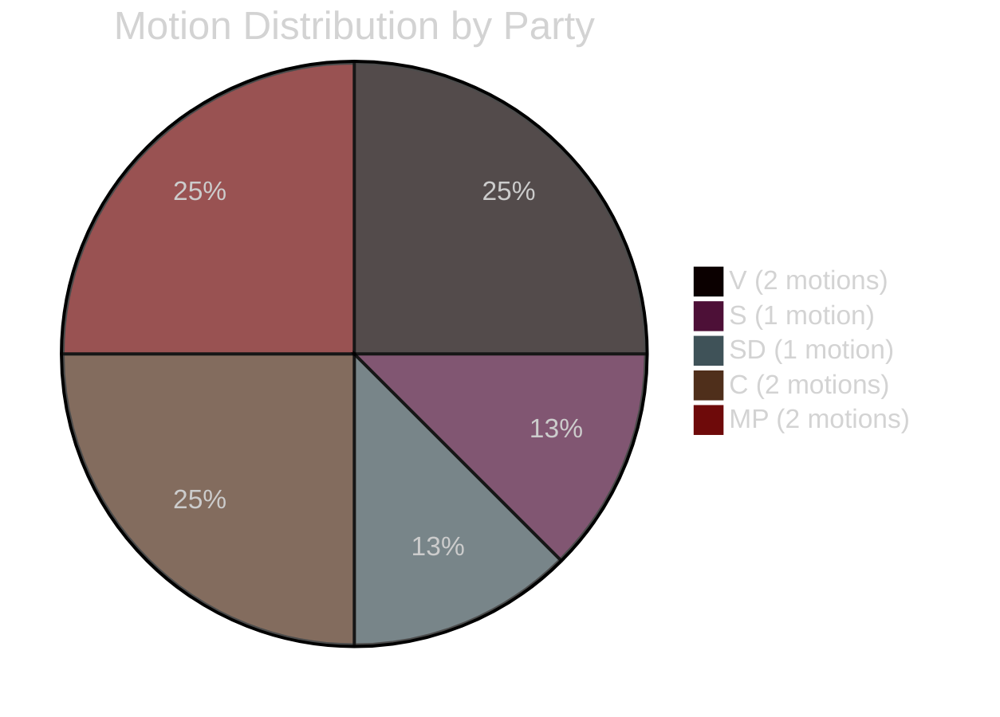

# Classification Results: Opposition Motions 2026-05-05

**Author**: James Pether Sörling | **Date**: 2026-05-05 | **Confidence**: HIGH [B2]

## Policy Domain Classification

| dok_id | Primary domain | Secondary domain | GDPR 9(2) basis | Sensitivity |
|--------|----------------|------------------|-----------------|-------------|
| HD024141 | Environmental/forestry law | Constitutional/EU law | 9(2)(e) publicly made | PUBLIC |
| HD024142 | Criminal law / juvenile justice | Human rights / CRC | 9(2)(e) publicly made | PUBLIC |
| HD024143 | Environmental/forestry law | Agricultural/rural policy | 9(2)(e) publicly made | PUBLIC |
| HD024144 | Environmental/forestry law | Biodiversity / international law | 9(2)(e) publicly made | PUBLIC |
| HD024145 | Environmental/forestry law | Economic/rural policy | 9(2)(e) publicly made | PUBLIC |
| HD024146 | Criminal law / juvenile justice | Liberal rights / CRC | 9(2)(e) publicly made | PUBLIC |
| HD024147 | Environmental/forestry law | Climate / Sami rights | 9(2)(e) publicly made | PUBLIC |
| HD024148 | Criminal law / juvenile justice | Child rights / ECHR | 9(2)(e) publicly made | PUBLIC |

## Party Ideological Classification

**Right bloc (coalition)**:
- SD (HD024143): National-conservative populist — pro-production forestry, supports government crime measures
- M+KD+L: (no motions in this batch — governing parties; they tabled the propositions)

**Centre-liberal**:
- C (HD024145, HD024146): Rural-liberal — pro-production forestry; rejects CRC-violating criminal law

**Left-green bloc (opposition)**:
- S (HD024144): Social-democratic — proceduralist challenge; demands impact analysis
- V (HD024141, HD024142): Left-socialist — total rejection on environmental and rights grounds
- MP (HD024147, HD024148): Green — total rejection on climate/biodiversity and child rights grounds

## Structural Classification

Both proposition clusters follow a **partial inversion** of the standard left-right alignment:
- Forestry: right (SD+C) wants MORE deregulation than the government; left (V+MP+S) wants LESS
- Youth crime: government right-bloc supports age cut; but CENTRE (C) joins left (V+MP) in opposition → cross-bloc rights coalition

## CIA Triad

**Confidentiality**: All documents are public parliamentary records (data.riksdagen.se) — no personal data classified above PUBLIC
**Integrity**: Analysis sourced from primary documents; Admiralty B2 for full-text documents, C2 for summary-only (HD024145, HD024146, HD024148)
**Availability**: All documents retrievable via data.riksdagen.se as of 2026-05-05

