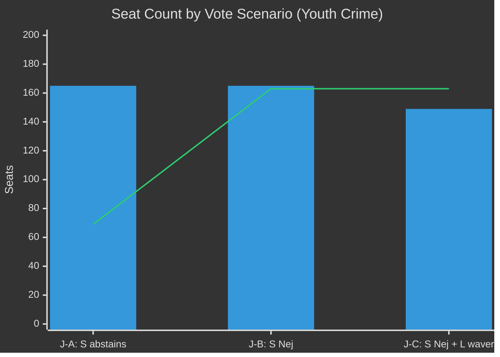

# Coalition Mathematics: Opposition Motions 2026-05-05

**Author**: James Pether Sörling | **Date**: 2026-05-05 | **Confidence**: HIGH [B2]

## Riksdag seat distribution (riksmöte 2025/26)

| Party | Seats | Government? | Forest position | Youth crime position |
|-------|-------|-------------|-----------------|----------------------|
| M | 68 | ✅ Coalition | Support prop. HD03242 | Support prop. HD03246 |
| SD | 62 | ✅ Coalition | Support + HD024143 (more) | Support prop. HD03246 |
| S | 94 | ❌ Opposition | HD024144 (consequence analysis) | Not declared |
| C | 27 | ❌ Partly opposition | HD024145 (more production) | HD024146 (reject age cut) |
| V | 24 | ❌ Opposition | HD024141 (total rejection) | HD024142 (reject age cut) |
| KD | 19 | ✅ Coalition | Support prop. HD03242 | Support prop. HD03246 |
| MP | 18 | ❌ Opposition | HD024147 (total rejection) | HD024148 (reject age cut) |
| L | 16 | ✅ Coalition | Support prop. HD03242 | Support prop. HD03246 |
| **Total** | **328** | | | |

## Ja/Nej/Avstår table — forestry vote (on prop. HD03242)

| Party | Seats | Vote | Total Ja | Total Nej | Total Avstår |
|-------|-------|------|----------|-----------|--------------|
| M | 68 | Ja | +68 | | |
| SD | 62 | Ja (with reservations) | +62 | | |
| KD | 19 | Ja | +19 | | |
| L | 16 | Ja | +16 | | |
| S | 94 | Nej (or Avatår pending HD024144 outcome) | | +94 (or Avstår) | |
| C | 27 | Ja (forest) / Nej (youth crime) | +27 | | |
| V | 24 | Nej | | +24 | |
| MP | 18 | Nej | | +18 | |
| **Forestry prop.** | | | **192 Ja** | **136 Nej** | **0 Avstår** |

*Note: C votes Ja on forestry (HD024145 position); if S votes Avstår instead of Nej, majority remains 192 vs 42*

## Ja/Nej/Avstår table — youth crime vote (on prop. HD03246, criminal age cut)

| Party | Seats | Vote | Total Ja | Total Nej | Total Avstår |
|-------|-------|------|----------|-----------|--------------|
| M | 68 | Ja | +68 | | |
| SD | 62 | Ja | +62 | | |
| KD | 19 | Ja | +19 | | |
| L | 16 | Ja (likely, some wavering) | +16 | | |
| S | 94 | **Undecided** — critical variable | | | |
| C | 27 | Nej (HD024146) | | +27 | |
| V | 24 | Nej (HD024142) | | +24 | |
| MP | 18 | Nej (HD024148) | | +18 | |
| **Scenario J-A (S abstains)** | | | **165 Ja** | **69 Nej** | **94 Avstår** → Ja wins |
| **Scenario J-B (S votes Nej)** | | | **165 Ja** | **163 Nej** | — → Ja wins by 2 |
| **Scenario J-C (L wavers + S Nej)** | | | **149 Ja** | **163 Nej** | — → **Nej wins** |

## Critical coalition analysis

### Forestry: Structurally determined
Government majority (192 Ja) is overwhelming. Even if S votes Nej (not Avstår), the outcome is 192 vs 136. The forestry motions cannot succeed on the floor under any realistic scenario.

### Youth crime: Structurally contested at the margin

The youth crime vote is more interesting. With C opposing (27 seats) and V+MP opposing (42 seats):
- **Base opposition**: 69 seats
- **S joins (S votes Nej)**: 163 seats — still 2 short of 165 government minimum (assuming L holds)
- **L wavers + S joins**: Possible coalition defeat if ≥2 L members defect or abstain

The vote is structurally likely to be won by government (165 Ja vs 163 Nej in best-case opposition scenario) but it is the most mathematically marginal government majority since the Tidö agreement took effect.

**Key swing variables**:
1. **S decision** (94 seats) — most significant
2. **L cohesion** (16 seats) — if 2+ members abstain on rights grounds
3. **Lagrådet opinion** — if CRC flag issued, changes S's calculation

