# Cross-Reference Map: Opposition Motions 2026-05-05

**Author**: James Pether Sörling | **Date**: 2026-05-05 | **Confidence**: HIGH [B2]

## Motion → Proposition linkage

| Motion dok_id | Opposes | Proposition | Dept | Committee |
|--------------|---------|------------|------|-----------|
| HD024141 | HD03242 | 2025/26:242 | Landsbygds- och infrastrukturdepartementet | MJU |
| HD024143 | HD03242 | 2025/26:242 | Landsbygds- och infrastrukturdepartementet | MJU |
| HD024144 | HD03242 | 2025/26:242 | Landsbygds- och infrastrukturdepartementet | MJU |
| HD024145 | HD03242 | 2025/26:242 | Landsbygds- och infrastrukturdepartementet | MJU |
| HD024147 | HD03242 | 2025/26:242 | Landsbygds- och infrastrukturdepartementet | MJU |
| HD024142 | HD03246 | 2025/26:246 | Justitiedepartementet | JuU |
| HD024146 | HD03246 | 2025/26:246 | Justitiedepartementet | JuU |
| HD024148 | HD03246 | 2025/26:246 | Justitiedepartementet | JuU |

## Legislation cross-reference (forestry cluster)

| Referenced law | Motion | Relevance |
|----------------|--------|-----------|
| Skogsvårdslagen (1979:429) | HD024141, HD024143, HD024144, HD024145, HD024147 | Primary forestry statute being amended by HD03242 |
| Artskyddsförordningen (2007:845) | HD024141 | Species protection; consultation trigger for avverkningsanmälan |
| MB (1998:808) chap. 7 | HD024141, HD024147 | Biotope protection areas; general consideration rules |
| EU Habitats Directive 92/43/EEG Art. 6 | HD024141, HD024147 | Annex I/II species and habitats protection |
| EU Nature Restoration Law Reg. 2024/1991 | HD024141, HD024147, HD024144 | 30% restoration target by 2030 |
| CBD Kunming-Montreal 30×30 Target 3 | HD024144, HD024141, HD024147 | Protected areas target |
| Paris Agreement Art. 5 | HD024147 | Forests as carbon sinks |
| ILO Convention 169 | HD024141 | Indigenous and tribal peoples' rights (Sami) |
| UNDRIP Art. 29 | HD024141 | Sami lands and resources |

## Legislation cross-reference (youth crime cluster)

| Referenced law | Motion | Relevance |
|----------------|--------|-----------|
| BrB (1962:700) chap. 1 §6 | HD024142, HD024146, HD024148 | Current criminal responsibility age (15); proposed cut to 13 |
| LVU (1990:52) | HD024142 | Social care law for juvenile offenders; V argues LVU+LVM is sufficient |
| CRC lag (2018:1197) | HD024142, HD024146, HD024148 | Convention on Rights of the Child incorporated into Swedish law |
| CRC Art. 40(3)(a) | HD024142, HD024146, HD024148 | Minimum age of criminal responsibility |
| ECHR Art. 6 | HD024142 | Fair trial for juveniles |
| ECHR Art. 8 | HD024146 | Right to private and family life (juvenile detention) |

## Institutional sequence map

```mermaid
%%{init: {'theme': 'dark', 'themeVariables': {'primaryColor': '#00d9ff', 'primaryTextColor': '#e0e0e0', 'primaryBorderColor': '#ff006e', 'lineColor': '#ffbe0b', 'secondaryColor': '#1a1e3d', 'tertiaryColor': '#0a0e27'}}}%%
flowchart TD
    P1[Prop. 2025/26:242\nHD03242\nForestry — MJU] --> L1[Lagrådet review\n~2026-06-01]
    P2[Prop. 2025/26:246\nHD03246\nYouth crime — JuU] --> L2[Lagrådet review\n~2026-06-01]
    M_MJU[HD024141 V\nHD024143 SD\nHD024144 S\nHD024145 C\nHD024147 MP] --> C1[MJU Committee\nbetänkande]
    M_JuU[HD024142 V\nHD024146 C\nHD024148 MP] --> C2[JuU Committee\nbetänkande]
    L1 --> C1
    L2 --> C2
    C1 --> F[Riksdag floor vote\nEst. autumn 2026]
    C2 --> F
    P1 -.->|amended by| HD024143
    P1 -.->|rejected by| HD024141
    P1 -.->|rejected by| HD024147
    P1 -.->|conditioned by| HD024144
    P2 -.->|rejected by| HD024142
    P2 -.->|rejected by| HD024146
    P2 -.->|rejected by| HD024148
    style P1 fill:#1a1e3d,stroke:#ff006e
    style P2 fill:#1a1e3d,stroke:#ff006e
    style F fill:#1a1e3d,stroke:#00d9ff

```

