# Opposition Parties Challenge Forestry Deregulation and Youth Crime Age Cut

**Author**: James Pether Sörling  
**Date**: 2026-05-05 | **Classification**: PUBLIC | **Confidence**: HIGH [B2]

## BLUF

Eight opposition committee motions filed on 2026-05-04 mount a broad, cross-party challenge to two government propositions: five parties contest the Ulf Kristersson government's forestry deregulation package (prop. 2025/26:242), while three parties — spanning left to liberal-centre — unite against the flagship proposal to lower criminal responsibility age to 13 years (prop. 2025/26:246). Both measures face pending Lagrådet constitutional review and EU compliance exposure.

## Decisions This Brief Supports

1. **Editorial teams**: Both propositions are publishable news events — particularly the cross-bloc V+C+MP rejection of the criminal responsibility age cut, which has rarely been seen since the 2018 CRC implementation legislation
2. **Risk analysts**: Cumulative forestry deregulation creates material EU infringement risk (Habitats Directive Art. 6, EU Nature Restoration Law Reg. 2024/1991); the 3-week notification window reduction is the most legally exposed provision
3. **Election analysts**: Both issues (biodiversity deregulation, youth crime) are 2026 election flashpoints; MP's total rejection of both propositions signals existential threshold-clearing strategy; C's defection from the government bloc on the criminal age cut suggests the government coalition is narrower than headline numbers suggest

## 60-Second Read

- **Forestry (HD024141–HD024145, HD024147)**: V and MP call for total rejection; S demands comprehensive consequence analysis; SD and C demand further deregulation beyond the proposition. The government will pass the proposition (M+KD+SD+L = 175 seats) but at high environmental credibility cost. EU Habitats Directive compliance risk is not addressed in any motion
- **Young offenders (HD024142, HD024146, HD024148)**: V, C, and MP all reject the reduction of criminal responsibility age to 13. CRC (UN Convention on the Rights of the Child, domestically enacted 2018) is the legal basis cited by all three parties. The government has a majority (175 seats) but the political legitimacy cost is significant
- **Lagrådet**: Constitutional review pending for both propositions; yttranden expected by 2026-06-01
- **2026 election**: Forestry and youth crime are top-tier mobilisation issues for all parties

## Top Forward Trigger

**Lagrådet yttrande on prop. 2025/26:246 (unga lagöverträdare)** — expected by 2026-06-01. If Lagrådet flags CRC incompatibility, the government faces a choice between CRC primacy and political retreat, or proceeding with a bill experts consider rights-violating. This is the single highest-consequence upcoming event.

```mermaid
%%{init: {'theme': 'dark', 'themeVariables': {'primaryColor': '#00d9ff', 'primaryTextColor': '#e0e0e0', 'primaryBorderColor': '#ff006e', 'lineColor': '#ffbe0b', 'secondaryColor': '#1a1e3d', 'tertiaryColor': '#0a0e27'}}}%%
flowchart LR
    A["🌲 Prop. 2025/26:242\nForestry Deregulation\nHD03242"] --> B["Opposition Motions\n5 parties\nHD024141–47"]
    C["⚖️ Prop. 2025/26:246\nYouth Crime Age Cut\nHD03246"] --> D["Opposition Motions\n3 parties\nHD024142,46,48"]
    B --> E["MJU Committee\nVote expected\n2026-Q3"]
    D --> F["JuU Committee\nVote expected\n2026-Q3"]
    G["Lagrådet\nReview Pending"] --> E
    G --> F
    H["2026 Election\nSeptember 2026"] --> E
    H --> F
    style A fill:#1a1e3d,stroke:#ff006e
    style C fill:#1a1e3d,stroke:#ff006e
    style G fill:#0a0e27,stroke:#ffbe0b
    style H fill:#0a0e27,stroke:#00d9ff
```

## Pass 2 enhancement: Decision-support update

### Immediate decision indicators (T+30 days)

**Watch: Lagrådet yttrande on HD03246** — this is the single highest-value intelligence product for understanding the political trajectory of both clusters. A CRC finding converts Scenario J-B from 30% to 55%+ probability and triggers the most consequential cross-bloc alignment since the Tidö agreement negotiations.

**Watch: S press statement on JuU position** — S (94 seats) holding out of the CRC coalition is the structural guarantee of government survival on youth crime. Any signal of S joining (even Avstår rather than Nej) shifts the parliamentary calculus fundamentally.

### Revised probability summary (post-Pass-2)

| Outcome | Forestry | Youth crime |
|---------|----------|-------------|
| Government prevails | 60% | 55% |
| Partial concession/amendment | 25% | 30% |
| Government defeated | 5% | 15% |
| EU/legal override | 10% | n/a |

### Key quote (synthesis)
> "The eight motions filed on 2026-05-04 reveal that Sweden's simultaneous pursuit of forestry deregulation and criminal justice toughening faces genuine legal constraints — not just political opposition. The CRC challenge to prop. 2025/26:246 and the EU law challenge to prop. 2025/26:242 are not manufactured political arguments; they are grounded in binding international obligations that Sweden has explicitly incorporated into domestic law."
