<!-- dir: rtl -->
# أحزاب المعارضة تتحدى إلغاء تنظيم قطاع الغابات وخفض سن المسؤولية الجنائية

**Author**: James Pether Sörling  
**Date**: 2026-05-05 | **Classification**: PUBLIC | **Confidence**: HIGH [B2]

## الخلاصة التنفيذية

ثمانية اقتراحات لجان معارضة مُقدَّمة في 4 مايو 2026 تشكّل تحدياً واسعاً وعابراً للأحزاب أمام مقترحَين حكوميَّين: خمسة أحزاب تعترض على حزمة إلغاء تنظيم قطاع الغابات لحكومة أولف كريسترسون (الاقتراح 2025/26:242)، فيما تتحد ثلاثة أحزاب — من اليسار إلى الوسط الليبرالي — في معارضة المقترح الرئيسي بخفض سن المسؤولية الجنائية إلى 13 عاماً (الاقتراح 2025/26:246). كلا الإجراءين ينتظران المراجعة الدستورية من قِبل Lagrådet وتعرُّضهما لمخاطر الامتثال للقانون الأوروبي.

## القرارات التي يدعمها هذا التقرير

1. **الفرق التحريرية**: كلا المقترحَين قابلان للنشر كأحداث إخبارية — ولا سيما رفض V+C+MP عبر الكتل للنظر في خفض سن المسؤولية الجنائية، وهو ما نادراً ما شُهد منذ تشريع تطبيق اتفاقية حقوق الطفل الأممية عام 2018
2. **محللو المخاطر**: تُفضي إزالة تنظيم قطاع الغابات المتراكمة إلى خطر مادي بإجراءات انتهاك أوروبية (توجيه الموائل المادة 6، لائحة استعادة الطبيعة الأوروبية 2024/1991)؛ وتقليص نافذة الإخطار بمقدار 3 أسابيع هو الحكم الأكثر تعرضاً قانونياً
3. **محللو الانتخابات**: كلا الملفَّين (إزالة تنظيم التنوع البيولوجي، جرائم الشباب) يُعدّان نقطتَي استقطاب انتخابي في 2026؛ الرفض التام من MP للمقترحَين يُشير إلى استراتيجية تجاوز عتبة وجودية؛ تمرُّد C على كتلة الحكومة في مسألة السن الجنائية يُلمّح إلى أن الائتلاف الحكومي أضيق مما تُشير إليه أرقام العناوين

## قراءة 60 ثانية

- **الغابات (HD024141–HD024145، HD024147)**: V وMP تطالبان بالرفض التام؛ S تطالب بتحليل شامل للعواقب؛ SD وC تطالبان بمزيد من إلغاء التنظيم بما يتجاوز الاقتراح. ستُمرِّر الحكومة الاقتراح (M+KD+SD+L = 175 مقعداً) لكن بتكلفة عالية على مصداقيتها البيئية. مخاطر الامتثال لتوجيه الموائل الأوروبي لم تُعالَج في أي اقتراح
- **الشباب الجانحون (HD024142، HD024146، HD024148)**: V وC وMP يرفضون جميعاً خفض سن المسؤولية الجنائية إلى 13 عاماً. اتفاقية حقوق الطفل الأممية (مُنفَّذة محلياً عام 2018) هي الأساس القانوني الذي تستند إليه الأحزاب الثلاثة. الحكومة تمتلك الأغلبية (175 مقعداً) لكن تكلفة الشرعية السياسية كبيرة
- **Lagrådet**: المراجعة الدستورية معلَّقة لكلا المقترحَين؛ من المتوقع صدور الآراء قبل 2026-06-01
- **انتخابات 2026**: الغابات وجرائم الشباب مسائل تعبئة من الدرجة الأولى لجميع الأحزاب

## أهم محفّز مستقبلي

**رأي Lagrådet في الاقتراح 2025/26:246 (الشباب الجانحون)** — متوقَّع قبل 2026-06-01. إذا أشار Lagrådet إلى تعارض مع اتفاقية حقوق الطفل، ستواجه الحكومة خياراً بين أولوية الاتفاقية والتراجع السياسي، أو المضي في مشروع قانون يرى فيه الخبراء انتهاكاً للحقوق. هذا هو الحدث الوشيك الأعلى تأثيراً منفرداً.

```mermaid
%%{init: {'theme': 'dark', 'themeVariables': {'primaryColor': '#00d9ff', 'primaryTextColor': '#e0e0e0', 'primaryBorderColor': '#ff006e', 'lineColor': '#ffbe0b', 'secondaryColor': '#1a1e3d', 'tertiaryColor': '#0a0e27'}}}%%
flowchart LR
    A["🌲 Prop. 2025/26:242\nForestry Deregulation\nHD03242"] --> B["Opposition Motions\n5 parties\nHD024141–47"]
    C["⚖️ Prop. 2025/26:246\nYouth Crime Age Cut\nHD03246"] --> D["Opposition Motions\n3 parties\nHD024142,46,48"]
    B --> E["MJU Committee\nVote expected\n2026-Q3"]
    D --> F["JuU Committee\nVote expected\n2026-Q3"]
    G["Lagrådet\nReview Pending"] --> E
    G --> F
    H["2026 Election\nSeptember 2026"] --> E
    H --> F
    style A fill:#1a1e3d,stroke:#ff006e
    style C fill:#1a1e3d,stroke:#ff006e
    style G fill:#0a0e27,stroke:#ffbe0b
    style H fill:#0a0e27,stroke:#00d9ff
```

## تحسين المرحلة الثانية: تحديث دعم القرار

### مؤشرات القرار الفورية (T+30 يوماً)

**متابعة: رأي Lagrådet في HD03246** — هذا هو المنتج الاستخباراتي الأعلى قيمة منفردةً لفهم المسار السياسي لكلا المجموعتَين. نتيجة اتفاقية حقوق الطفل تُحوِّل السيناريو J-B من 30% إلى 55%+ احتمالاً وتُطلق أكثر التحالفات عبر الكتل أهمية منذ مفاوضات اتفاقية تيدو.

**متابعة: البيان الصحفي لـ S حول موقف JuU** — بقاء S (94 مقعداً) خارج تحالف اتفاقية حقوق الطفل هو الضمان الهيكلي لبقاء الحكومة في ملف جرائم الشباب. أي إشارة لانضمام S (حتى الامتناع بدلاً من الرفض) يُغيّر الحسابات البرلمانية جذرياً.

### ملخص الاحتمالات المُراجَع (بعد المرحلة الثانية)

| النتيجة | الغابات | جرائم الشباب |
|---------|---------|--------------|
| الحكومة تنتصر | 60% | 55% |
| تنازل جزئي/تعديل | 25% | 30% |
| الحكومة تُهزَم | 5% | 15% |
| تجاوز أوروبي/قانوني | 10% | غير منطبق |

### الاقتباس الرئيسي (التوليف)
> «الاقتراحات الثمانية المُقدَّمة في 4 مايو 2026 تكشف أن مسعى السويد المزدوج لإلغاء تنظيم قطاع الغابات والتشديد الجنائي على الشباب يصطدم بقيود قانونية حقيقية — لا مجرد معارضة سياسية. تحدي اتفاقية حقوق الطفل ضد الاقتراح 2025/26:246 وتحدي قانون الاتحاد الأوروبي ضد الاقتراح 2025/26:242 ليسا حججاً سياسية مُصطنَعة؛ بل هما مُستنِدان إلى التزامات دولية مُلزِمة أدرجتها السويد صراحةً في قانونها المحلي.»

<!-- source-sha: 5591d3b185740d167f3a948b0f8e881cfaf357b9 -->
