# Oppositionspartier udfordrer skovbrugets afregulering og sænkning af den kriminelle lavalder

**Author**: James Pether Sörling  
**Date**: 2026-05-05 | **Classification**: PUBLIC | **Confidence**: HIGH [B2]

## BLUF

Otte oppositionsudvalgsforslag indgivet den 4. maj 2026 udgør en bred, tværpolitisk udfordring mod to regeringsforslag: fem partier bestrider Ulf Kristersson-regeringens afreguleringspakke for skovbrug (prop. 2025/26:242), mens tre partier — fra venstre til liberal-centrum — forener sig mod flagskibsforslaget om at sænke den kriminelle lavalder til 13 år (prop. 2025/26:246). Begge foranstaltninger afventer Lagrådets konstitutionelle gennemgang og eksponering for EU-overensstemmelse.

## Beslutninger dette notat understøtter

1. **Redaktionsteam**: Begge propositioner er publicerbare nyhedsbegivenheder — særligt den tværblokket afvisning fra V+C+MP af sænkning af den kriminelle lavalder, som sjældent er set siden implementeringslovgivningen til FN's Børnekonvention i 2018
2. **Risikoanalytikere**: Den kumulative skovbrugsmæssige afregulering skaber materiel risiko for EU-overtrædelsesprocedurer (Habitatdirektivet art. 6, EU's naturgenopretningsforordning 2024/1991); den 3-ugers reduktion af notifikationsvinduet er den mest juridisk eksponerede bestemmelse
3. **Valganalytikere**: Begge emner (biodiversitetsafregulering, ungdomskriminalitet) er valgkampsbrændpunkter i 2026; MP's totale afvisning af begge propositioner signalerer en eksistentiel tærskelsoverskridelsesstrategi; C's afvigelse fra regeringsblokken på den kriminelle lavalder antyder, at regeringskoalitionen er snævrere end overskriftstallene indikerer

## 60-sekunders læsning

- **Skovbrug (HD024141–HD024145, HD024147)**: V og MP kræver total afvisning; S kræver en omfattende konsekvensvurdering; SD og C kræver yderligere afregulering ud over propositionen. Regeringen vil vedtage propositionen (M+KD+SD+L = 175 mandater) men til høje miljømæssige troværdighedsomkostninger. EU Habitatdirektivets efterlevelsesrisiko er ikke behandlet i nogen motion
- **Unge lovovertrædere (HD024142, HD024146, HD024148)**: V, C og MP afviser alle en sænkning af den kriminelle lavalder til 13 år. FN's Børnekonvention (nationalt gennemført i 2018) er det retlige grundlag, som alle tre partier påberåber sig. Regeringen har et flertal (175 mandater), men den politiske legitimitetsomkostning er betydelig
- **Lagrådet**: Konstitutionel gennemgang afventer for begge propositioner; udtalelser forventes inden 2026-06-01
- **Valget 2026**: Skovbrug og ungdomskriminalitet er topprioritetsmobiliseringsemner for alle partier

## Vigtigste fremadskuende udløser

**Lagrådets udtalelse om prop. 2025/26:246 (unge lovovertrædere)** — forventet inden 2026-06-01. Hvis Lagrådet markerer uforenelighed med Børnekonventionen, står regeringen over for et valg mellem Børnekonventionens forrang og politisk tilbagetog, eller at fremme et lovforslag, som eksperter anser for at krænke rettigheder. Dette er den enkeltste højest-konsekvens kommende begivenhed.

```mermaid
%%{init: {'theme': 'dark', 'themeVariables': {'primaryColor': '#00d9ff', 'primaryTextColor': '#e0e0e0', 'primaryBorderColor': '#ff006e', 'lineColor': '#ffbe0b', 'secondaryColor': '#1a1e3d', 'tertiaryColor': '#0a0e27'}}}%%
flowchart LR
    A["🌲 Prop. 2025/26:242\nForestry Deregulation\nHD03242"] --> B["Opposition Motions\n5 parties\nHD024141–47"]
    C["⚖️ Prop. 2025/26:246\nYouth Crime Age Cut\nHD03246"] --> D["Opposition Motions\n3 parties\nHD024142,46,48"]
    B --> E["MJU Committee\nVote expected\n2026-Q3"]
    D --> F["JuU Committee\nVote expected\n2026-Q3"]
    G["Lagrådet\nReview Pending"] --> E
    G --> F
    H["2026 Election\nSeptember 2026"] --> E
    H --> F
    style A fill:#1a1e3d,stroke:#ff006e
    style C fill:#1a1e3d,stroke:#ff006e
    style G fill:#0a0e27,stroke:#ffbe0b
    style H fill:#0a0e27,stroke:#00d9ff
```

## Pass 2-forbedring: Opdateret beslutningsunderstøttelse

### Umiddelbare beslutningsindikatorer (T+30 dage)

**Overvåg: Lagrådets udtalelse om HD03246** — dette er det enkelt mest værdifulde efterretningsprodukt for at forstå det politiske forløb for begge klynger. Et Børnekonventionsfund konverterer Scenarie J-B fra 30 % til 55 %+ sandsynlighed og udløser den mest konsekvensfyldte tværblokkerede alliance siden Tidö-aftalens forhandlinger.

**Overvåg: S's pressemeddelelse om JuU-positionen** — S (94 mandater) der holder sig uden for Børnekonventionskoalitionen er den strukturelle garanti for regeringens overlevelse på ungdomskriminalitet. Ethvert signal om at S tilslutter sig (selv Hverken/Eller frem for Nej) skifter parlamentarisk kalkulation fundamentalt.

### Revideret sandsynlighedsoversigt (efter Pass 2)

| Udfald | Skovbrug | Ungdomskriminalitet |
|--------|----------|---------------------|
| Regeringen sejrer | 60 % | 55 % |
| Delvis indrømmelse/ændring | 25 % | 30 % |
| Regeringen besejres | 5 % | 15 % |
| EU/juridisk tilsidesættelse | 10 % | ikke relevant |

### Nøglecitat (syntese)
> "De otte forslag indgivet den 4. maj 2026 afslører, at Sveriges samtidige forfulgte skovbrugsafregulering og straf-skærpelse over for unge møder genuine juridiske begrænsninger — ikke kun politisk opposition. Børnekonventionsudfordringen mod prop. 2025/26:246 og EU-retsudfordringen mod prop. 2025/26:242 er ikke konstruerede politiske argumenter; de er forankret i bindende internationale forpligtelser, som Sverige eksplicit har inkorporeret i national ret."

<!-- source-sha: 5591d3b185740d167f3a948b0f8e881cfaf357b9 -->
