# Oppositionsparteien fordern Waldwirtschafts-Deregulierung und Absenkung des Strafmündigkeitsalters heraus

**Author**: James Pether Sörling  
**Date**: 2026-05-05 | **Classification**: PUBLIC | **Confidence**: HIGH [B2]

## BLUF

Acht Oppositionsausschussanträge, die am 4. Mai 2026 eingereicht wurden, stellen eine breite, parteiübergreifende Herausforderung gegenüber zwei Regierungsvorlagen dar: Fünf Parteien bestreiten das Deregulierungspaket der Ulf-Kristersson-Regierung für die Forstwirtschaft (Prop. 2025/26:242), während drei Parteien — von links bis liberal-mitte — sich gegen den Leitvorschlag zur Absenkung des Strafmündigkeitsalters auf 13 Jahre (Prop. 2025/26:246) vereinigen. Beide Maßnahmen warten auf eine verfassungsrechtliche Prüfung durch den Lagrådet und sind dem Risiko der EU-Rechtskonformität ausgesetzt.

## Entscheidungen, die dieses Briefing unterstützt

1. **Redaktionsteams**: Beide Vorlagen sind veröffentlichungswürdige Nachrichtenereignisse — insbesondere die lagerübergreifende Ablehnung durch V+C+MP der Absenkung des Strafmündigkeitsalters, was seit der Umsetzungsgesetzgebung zur UN-Kinderrechtskonvention im Jahr 2018 selten war
2. **Risikoanalysten**: Die kumulative forstwirtschaftliche Deregulierung schafft ein materielles Risiko für EU-Verletzungsverfahren (Habitatrichtlinie Art. 6, EU-Naturwiederherstellungsverordnung 2024/1991); die Verkürzung des Benachrichtigungsfensters um 3 Wochen ist die rechtlich am stärksten exponierte Bestimmung
3. **Wahlanalysten**: Beide Themen (Biodiversitätsderegulierung, Jugendkriminalität) sind Brennpunkte im Wahlkampf 2026; MPs vollständige Ablehnung beider Vorlagen signalisiert eine existentielle Schwellenüberschreitungsstrategie; Cs Abweichung vom Regierungsblock bei der Strafmündigkeit legt nahe, dass die Regierungskoalition enger ist als die Schlagzeilenzeilen anzeigen

## 60-Sekunden-Lektüre

- **Forstwirtschaft (HD024141–HD024145, HD024147)**: V und MP fordern vollständige Ablehnung; S fordert eine umfassende Folgenabschätzung; SD und C fordern weitere Deregulierung über die Vorlage hinaus. Die Regierung wird die Vorlage verabschieden (M+KD+SD+L = 175 Mandate), jedoch zu hohen Kosten für die Umweltglaubwürdigkeit. Das Compliance-Risiko der EU-Habitatrichtlinie wird in keinem Antrag behandelt
- **Junge Straftäter (HD024142, HD024146, HD024148)**: V, C und MP lehnen alle die Senkung des Strafmündigkeitsalters auf 13 Jahre ab. Die Kinderrechtskonvention (UN, national umgesetzt 2018) ist die von allen drei Parteien angeführte Rechtsgrundlage. Die Regierung hat eine Mehrheit (175 Mandate), aber die politischen Legitimitätskosten sind erheblich
- **Lagrådet**: Verfassungsrechtliche Prüfung für beide Vorlagen steht aus; Stellungnahmen werden bis 2026-06-01 erwartet
- **Wahl 2026**: Forstwirtschaft und Jugendkriminalität sind erstrangige Mobilisierungsthemen für alle Parteien

## Wichtigster vorausschauender Auslöser

**Lagrådets Stellungnahme zu Prop. 2025/26:246 (junge Straftäter)** — erwartet bis 2026-06-01. Wenn Lagrådet Unvereinbarkeit mit der Kinderrechtskonvention feststellt, steht die Regierung vor der Wahl zwischen dem Vorrang der Kinderrechtskonvention und politischem Rückzug, oder sie verfolgt ein Gesetz, das Experten für rechtsverletzend halten. Dies ist das einzeln folgenreichste bevorstehende Ereignis.

```mermaid
%%{init: {'theme': 'dark', 'themeVariables': {'primaryColor': '#00d9ff', 'primaryTextColor': '#e0e0e0', 'primaryBorderColor': '#ff006e', 'lineColor': '#ffbe0b', 'secondaryColor': '#1a1e3d', 'tertiaryColor': '#0a0e27'}}}%%
flowchart LR
    A["🌲 Prop. 2025/26:242\nForestry Deregulation\nHD03242"] --> B["Opposition Motions\n5 parties\nHD024141–47"]
    C["⚖️ Prop. 2025/26:246\nYouth Crime Age Cut\nHD03246"] --> D["Opposition Motions\n3 parties\nHD024142,46,48"]
    B --> E["MJU Committee\nVote expected\n2026-Q3"]
    D --> F["JuU Committee\nVote expected\n2026-Q3"]
    G["Lagrådet\nReview Pending"] --> E
    G --> F
    H["2026 Election\nSeptember 2026"] --> E
    H --> F
    style A fill:#1a1e3d,stroke:#ff006e
    style C fill:#1a1e3d,stroke:#ff006e
    style G fill:#0a0e27,stroke:#ffbe0b
    style H fill:#0a0e27,stroke:#00d9ff
```

## Pass-2-Verbesserung: Aktualisierte Entscheidungsunterstützung

### Unmittelbare Entscheidungsindikatoren (T+30 Tage)

**Beobachten: Lagrådets Stellungnahme zu HD03246** — dies ist das einzeln wertvollste Geheimdienstprodukt zum Verständnis des politischen Verlaufs beider Cluster. Ein CRC-Befund wandelt Szenario J-B von 30 % in 55 %+ Wahrscheinlichkeit um und löst die folgenreichste lagerübergreifende Allianz seit den Tidö-Vereinbarungsverhandlungen aus.

**Beobachten: S' Presseerklärung zur JuU-Position** — S (94 Mandate), das sich außerhalb der KRK-Koalition hält, ist die strukturelle Garantie für das Überleben der Regierung bei der Jugendkriminalität. Jedes Signal, dass S sich anschließt (auch Enthaltung statt Nein), verschiebt die parlamentarische Kalkulation grundlegend.

### Überarbeitete Wahrscheinlichkeitszusammenfassung (nach Pass 2)

| Ergebnis | Forstwirtschaft | Jugendkriminalität |
|----------|-----------------|-------------------|
| Regierung siegt | 60 % | 55 % |
| Teilweises Entgegenkommen/Änderung | 25 % | 30 % |
| Regierung unterliegt | 5 % | 15 % |
| EU/rechtliche Außerkraftsetzung | 10 % | nicht anwendbar |

### Schlüsselzitat (Synthese)
> „Die acht am 4. Mai 2026 eingereichten Anträge zeigen, dass Schwedens gleichzeitige Verfolgung von Forstwirtschaftsderegulierung und strafrechtlicher Härte gegenüber Jugendlichen auf echte rechtliche Einschränkungen stößt — nicht nur auf politischen Widerstand. Die Kinderrechtskonventionsherausforderung gegen Prop. 2025/26:246 und die EU-Rechtsherausforderung gegen Prop. 2025/26:242 sind keine konstruierten politischen Argumente; sie gründen sich auf bindende internationale Verpflichtungen, die Schweden ausdrücklich in nationales Recht übernommen hat."

<!-- source-sha: 5591d3b185740d167f3a948b0f8e881cfaf357b9 -->
