# Los partidos de la oposición cuestionan la desregulación forestal y el descenso de la edad de responsabilidad penal

**Author**: James Pether Sörling  
**Date**: 2026-05-05 | **Classification**: PUBLIC | **Confidence**: HIGH [B2]

## BLUF

Ocho mociones de comités de oposición presentadas el 4 de mayo de 2026 constituyen un amplio desafío transpartidista a dos propuestas gubernamentales: cinco partidos impugnan el paquete de desregulación forestal del gobierno de Ulf Kristersson (prop. 2025/26:242), mientras que tres partidos —desde la izquierda hasta el centro liberal— se unen contra la propuesta insignia de reducir la edad de responsabilidad penal a 13 años (prop. 2025/26:246). Ambas medidas están pendientes de revisión constitucional por el Lagrådet y exposición al cumplimiento de la UE.

## Decisiones que apoya este documento

1. **Equipos editoriales**: Ambas propuestas son eventos noticiosos publicables —en particular el rechazo transbloque de V+C+MP a la reducción de la edad de responsabilidad penal, lo que rara vez se ha visto desde la legislación de implementación de la Convención sobre los Derechos del Niño en 2018
2. **Analistas de riesgos**: La desregulación forestal acumulada crea un riesgo material de procedimientos de infracción de la UE (Directiva de Hábitats art. 6, Reglamento de Restauración de la Naturaleza de la UE 2024/1991); la reducción de 3 semanas de la ventana de notificación es la disposición más expuesta legalmente
3. **Analistas electorales**: Ambos temas (desregulación de la biodiversidad, delincuencia juvenil) son puntos de movilización electoral en 2026; el rechazo total de MP a ambas propuestas señala una estrategia existencial de superación de umbral; la deserción de C del bloque gubernamental sobre la edad penal sugiere que la coalición es más estrecha de lo que indican las cifras de titular

## Lectura en 60 segundos

- **Silvicultura (HD024141–HD024145, HD024147)**: V y MP piden rechazo total; S exige un análisis de impacto integral; SD y C reclaman mayor desregulación más allá de la propuesta. El gobierno aprobará la propuesta (M+KD+SD+L = 175 escaños) pero con alto coste en credibilidad ambiental. El riesgo de cumplimiento de la Directiva de Hábitats de la UE no se aborda en ninguna moción
- **Jóvenes infractores (HD024142, HD024146, HD024148)**: V, C y MP rechazan todos la reducción de la edad de responsabilidad penal a 13 años. La Convención sobre los Derechos del Niño (ONU, implementada nacionalmente en 2018) es el fundamento jurídico invocado por los tres partidos. El gobierno tiene mayoría (175 escaños), pero el coste político de legitimidad es significativo
- **Lagrådet**: Revisión constitucional pendiente para ambas propuestas; se esperan dictámenes antes del 2026-06-01
- **Elecciones 2026**: La silvicultura y la delincuencia juvenil son temas de movilización de primer orden para todos los partidos

## Principal detonante prospectivo

**Dictamen del Lagrådet sobre la prop. 2025/26:246 (jóvenes infractores)** —previsto antes del 2026-06-01. Si el Lagrådet señala incompatibilidad con la Convención sobre los Derechos del Niño, el gobierno se enfrenta a una elección entre la primacía de la Convención y la retirada política, o proceder con un proyecto de ley que los expertos consideran violatorio de derechos. Este es el único evento próximo de mayor consecuencia.

```mermaid
%%{init: {'theme': 'dark', 'themeVariables': {'primaryColor': '#00d9ff', 'primaryTextColor': '#e0e0e0', 'primaryBorderColor': '#ff006e', 'lineColor': '#ffbe0b', 'secondaryColor': '#1a1e3d', 'tertiaryColor': '#0a0e27'}}}%%
flowchart LR
    A["🌲 Prop. 2025/26:242\nForestry Deregulation\nHD03242"] --> B["Opposition Motions\n5 parties\nHD024141–47"]
    C["⚖️ Prop. 2025/26:246\nYouth Crime Age Cut\nHD03246"] --> D["Opposition Motions\n3 parties\nHD024142,46,48"]
    B --> E["MJU Committee\nVote expected\n2026-Q3"]
    D --> F["JuU Committee\nVote expected\n2026-Q3"]
    G["Lagrådet\nReview Pending"] --> E
    G --> F
    H["2026 Election\nSeptember 2026"] --> E
    H --> F
    style A fill:#1a1e3d,stroke:#ff006e
    style C fill:#1a1e3d,stroke:#ff006e
    style G fill:#0a0e27,stroke:#ffbe0b
    style H fill:#0a0e27,stroke:#00d9ff
```

## Mejora del Pase 2: Actualización del apoyo a la decisión

### Indicadores de decisión inmediatos (T+30 días)

**Vigilar: Dictamen del Lagrådet sobre HD03246** —este es el producto de inteligencia de mayor valor individual para comprender la trayectoria política de ambos grupos. Un hallazgo sobre la Convención sobre los Derechos del Niño convierte el Escenario J-B del 30 % al 55 %+ de probabilidad y desencadena la alianza transbloque más consecuente desde las negociaciones del acuerdo Tidö.

**Vigilar: Comunicado de prensa de S sobre la posición JuU** —S (94 escaños) manteniéndose fuera de la coalición CRC es la garantía estructural de la supervivencia del gobierno en delincuencia juvenil. Cualquier señal de que S se suma (incluso Abstención en lugar de No) cambia fundamentalmente el cálculo parlamentario.

### Resumen de probabilidades revisado (tras el Pase 2)

| Resultado | Silvicultura | Delincuencia juvenil |
|-----------|-------------|----------------------|
| El gobierno prevalece | 60 % | 55 % |
| Concesión/enmienda parcial | 25 % | 30 % |
| El gobierno es derrotado | 5 % | 15 % |
| Anulación UE/jurídica | 10 % | no aplicable |

### Cita clave (síntesis)
> «Las ocho mociones presentadas el 4 de mayo de 2026 revelan que la búsqueda simultánea de Suecia de desregulación forestal y dureza penal hacia los jóvenes se enfrenta a auténticas limitaciones legales —no solo a oposición política. El desafío de la Convención sobre los Derechos del Niño contra la prop. 2025/26:246 y el desafío del derecho de la UE contra la prop. 2025/26:242 no son argumentos políticos fabricados; están fundamentados en obligaciones internacionales vinculantes que Suecia ha incorporado explícitamente en su derecho nacional.»

<!-- source-sha: 5591d3b185740d167f3a948b0f8e881cfaf357b9 -->
