# Oppositiopuolueet haastavat metsätalouden sääntelyn purkamisen ja rikosoikeudellisen vastuuiän alentamisen

**Author**: James Pether Sörling  
**Date**: 2026-05-05 | **Classification**: PUBLIC | **Confidence**: HIGH [B2]

## BLUF

Kahdeksan oppositiovaliokuntamotion, jotka jätettiin 4. toukokuuta 2026, muodostaa laajan, puolueiden välisen haasteen kahta hallituksen esitystä vastaan: viisi puoluetta riitauttaa Ulf Kristersson -hallituksen metsätalouden sääntelyn purkamispaketin (prop. 2025/26:242), kun taas kolme puoluetta — vasemmistosta liberaalikeskustaan — yhtyy vastustamaan lippulaivaehdotusta rikosoikeudellisen vastuuiän alentamisesta 13 vuoteen (prop. 2025/26:246). Molemmat toimenpiteet odottavat Lagrådets -lainvalmisteluneuvoksen perustuslaillista tarkastelua ja EU-vaatimustenmukaisuusriskiä.

## Päätökset, joita tämä tietopaketti tukee

1. **Toimitustiimit**: Molemmat esitykset ovat julkaisukelpoisia uutistapahtumia — erityisesti V+C+MP:n ylikokoomuksinen hylkäys rikosoikeudellisen vastuuiän alentamisesta, mitä on harvoin nähty sitten YK:n lapsen oikeuksien sopimuksen täytäntöönpanolainsäädännön vuonna 2018
2. **Riskianalyytikot**: Kasautuva metsätalouden sääntelyn purku aiheuttaa aineellisen riskin EU-rikkomusmenettelyille (Luontotyyppidirektiivi 6 art., EU:n luonnonennallistamisasetus 2024/1991); 3 viikon ilmoitusaikaikkunan lyhentäminen on oikeudellisesti eniten altistunut säännös
3. **Vaalianalyytikot**: Molemmat asiat (luonnon monimuotoisuuden sääntelyn purku, nuorisorikollisuus) ovat tärkeitä vaalikampanjateemoja vuonna 2026; MP:n täydellinen hylkäys molemmista esityksistä merkitsee eksistentiaalista kynnysten ylittämisstrategiaa; C:n poikkeaminen hallitusblokista rikosoikeudellisen vastuuiän kysymyksessä viittaa siihen, että koalitio on kapeampi kuin otsikoiden luvut osoittavat

## 60 sekunnin lukeminen

- **Metsätalous (HD024141–HD024145, HD024147)**: V ja MP vaativat täyttä hylkäystä; S vaatii kattavaa vaikutusarviointia; SD ja C vaativat lisää sääntelyn purkua esityksen ulkopuolella. Hallitus hyväksyy esityksen (M+KD+SD+L = 175 paikkaa), mutta suurilla ympäristöuskottavuuden kustannuksilla. EU:n luontotyyppidirektiivin vaatimustenmukaisuusriskiä ei käsitellä missään motioneissa
- **Nuoret rikoksentekijät (HD024142, HD024146, HD024148)**: V, C ja MP hylkäävät kaikki rikosoikeudellisen vastuuiän alentamisen 13 vuoteen. YK:n lapsen oikeuksien sopimus (kansallisesti pantu täytäntöön 2018) on kaikkien kolmen puolueen esittämä oikeudellinen peruste. Hallituksella on enemmistö (175 paikkaa), mutta poliittinen legitimiteetikustannus on huomattava
- **Lagrådet**: Perustuslaillinen tarkastelu odottaa molempien esitysten osalta; lausunnot odotetaan viimeistään 2026-06-01
- **Vuoden 2026 vaalit**: Metsätalous ja nuorisorikollisuus ovat kaikkien puolueiden kärkitason mobilisaatioasioita

## Tärkein eteenpäin katsova laukaisin

**Lagrådets lausunto prop. 2025/26:246:sta (nuoret rikoksentekijät)** — odotetaan viimeistään 2026-06-01. Jos Lagrådet nostaa esiin yhteensopimattomuuden lapsen oikeuksien sopimuksen kanssa, hallitus seisoo valintatilanteessa lapsen oikeuksien sopimuksen etusijan ja poliittisen peräytymisen välillä tai etenee esityksellä, jota asiantuntijat pitävät oikeuksia loukkaavana. Tämä on yksittäinen korkein seuraamusten tulevaisuuden tapahtuma.

```mermaid
%%{init: {'theme': 'dark', 'themeVariables': {'primaryColor': '#00d9ff', 'primaryTextColor': '#e0e0e0', 'primaryBorderColor': '#ff006e', 'lineColor': '#ffbe0b', 'secondaryColor': '#1a1e3d', 'tertiaryColor': '#0a0e27'}}}%%
flowchart LR
    A["🌲 Prop. 2025/26:242\nForestry Deregulation\nHD03242"] --> B["Opposition Motions\n5 parties\nHD024141–47"]
    C["⚖️ Prop. 2025/26:246\nYouth Crime Age Cut\nHD03246"] --> D["Opposition Motions\n3 parties\nHD024142,46,48"]
    B --> E["MJU Committee\nVote expected\n2026-Q3"]
    D --> F["JuU Committee\nVote expected\n2026-Q3"]
    G["Lagrådet\nReview Pending"] --> E
    G --> F
    H["2026 Election\nSeptember 2026"] --> E
    H --> F
    style A fill:#1a1e3d,stroke:#ff006e
    style C fill:#1a1e3d,stroke:#ff006e
    style G fill:#0a0e27,stroke:#ffbe0b
    style H fill:#0a0e27,stroke:#00d9ff
```

## Pass 2 -parannus: Päivitetty päätöksentuki

### Välittömät päätöksenindikaattorit (T+30 päivää)

**Seuraa: Lagrådets lausunto HD03246:sta** — tämä on yksittäinen arvokkain tietopaketti poliittisen kehityskaaren ymmärtämiseksi molempien ryhmien osalta. Lapsen oikeuksien sopimuksen löydös muuttaa Skenaarion J-B 30 %:sta 55 %+ todennäköisyyteen ja laukaisee merkittävimmän kokoomusten välisen allianssin sitten Tidö-sopimuksen neuvottelujen.

**Seuraa: S:n lehdistötiedote JuU:n kannasta** — S (94 paikkaa) pysyy poissa lapsen oikeuksien sopimuksen koalitiosta, mikä on hallituksen selviytymisen rakenteellinen takuu nuorisorikollisuuskysymyksessä. Kaikki signaalit S:n liittymisestä (jopa Pidättäytyminen Ei-äänen sijaan) muuttavat parlamentaarista laskelmaa perusteellisesti.

### Tarkistettu todennäköisyyskooste (Pass 2:n jälkeen)

| Tulos | Metsätalous | Nuorisorikollisuus |
|-------|-------------|-------------------|
| Hallitus voittaa | 60 % | 55 % |
| Osittainen myönnytys/muutos | 25 % | 30 % |
| Hallitus häviää | 5 % | 15 % |
| EU/oikeudellinen ylikäyminen | 10 % | ei sovelleta |

### Avainlainaus (synteesi)
> "4. toukokuuta 2026 jätetyt kahdeksan motioneita paljastavat, että Ruotsin samanaikainen metsätalouden sääntelyn purkaminen ja rikosoikeudellisen kovuuden lisääminen nuoria kohtaan kohtaa aitoja oikeudellisia rajoitteita — ei pelkästään poliittista oppositiota. Lapsen oikeuksien sopimuksen haaste prop. 2025/26:246:ta vastaan ja EU-oikeuden haaste prop. 2025/26:242:ta vastaan eivät ole keinotekoisia poliittisia argumentteja; ne perustuvat sitoviin kansainvälisiin velvoitteisiin, jotka Ruotsi on nimenomaisesti sisällyttänyt kansalliseen oikeuteensa."

<!-- source-sha: 5591d3b185740d167f3a948b0f8e881cfaf357b9 -->
