# Les partis d'opposition contestent la déréglementation forestière et l'abaissement de l'âge de la responsabilité pénale

**Author**: James Pether Sörling  
**Date**: 2026-05-05 | **Classification**: PUBLIC | **Confidence**: HIGH [B2]

## BLUF

Huit motions de commissions d'opposition déposées le 4 mai 2026 constituent un défi large et transpartisan contre deux propositions gouvernementales : cinq partis contestent le paquet de déréglementation forestière du gouvernement Ulf Kristersson (prop. 2025/26:242), tandis que trois partis — de la gauche au centre libéral — s'unissent contre la proposition phare d'abaisser l'âge de la responsabilité pénale à 13 ans (prop. 2025/26:246). Les deux mesures attendent l'examen constitutionnel du Lagrådet et sont exposées à un risque de non-conformité avec le droit de l'UE.

## Décisions que ce document soutient

1. **Équipes éditoriales** : Les deux propositions constituent des événements d'actualité publiables — en particulier le rejet transblocs de V+C+MP de l'abaissement de l'âge de la responsabilité pénale, rarement observé depuis la législation de mise en œuvre de la Convention des droits de l'enfant en 2018
2. **Analystes des risques** : La déréglementation forestière cumulative crée un risque matériel de procédures d'infraction de l'UE (directive Habitats art. 6, règlement UE sur la restauration de la nature 2024/1991) ; la réduction de 3 semaines de la fenêtre de notification est la disposition la plus exposée juridiquement
3. **Analystes électoraux** : Les deux enjeux (déréglementation de la biodiversité, criminalité juvénile) sont des points de mobilisation électorale en 2026 ; le rejet total par MP des deux propositions signale une stratégie existentielle de franchissement de seuil ; la défection de C du bloc gouvernemental sur l'âge de la responsabilité pénale suggère que la coalition est plus étroite que les chiffres de manchette ne l'indiquent

## Lecture en 60 secondes

- **Foresterie (HD024141–HD024145, HD024147)** : V et MP demandent un rejet total ; S demande une analyse d'impact globale ; SD et C demandent une déréglementation plus poussée au-delà de la proposition. Le gouvernement adoptera la proposition (M+KD+SD+L = 175 sièges) mais à un coût élevé en crédibilité environnementale. Le risque de conformité à la directive Habitats de l'UE n'est abordé dans aucune motion
- **Jeunes délinquants (HD024142, HD024146, HD024148)** : V, C et MP rejettent tous la réduction de l'âge de la responsabilité pénale à 13 ans. La Convention des droits de l'enfant (ONU, mise en œuvre nationale en 2018) est le fondement juridique invoqué par les trois partis. Le gouvernement dispose d'une majorité (175 sièges) mais le coût politique de légitimité est significatif
- **Lagrådet** : L'examen constitutionnel est en attente pour les deux propositions ; les avis sont attendus avant le 2026-06-01
- **Élections 2026** : La foresterie et la criminalité juvénile sont des enjeux de mobilisation de premier ordre pour tous les partis

## Principal déclencheur prospectif

**Avis du Lagrådet sur la prop. 2025/26:246 (jeunes délinquants)** — attendu avant le 2026-06-01. Si le Lagrådet signale une incompatibilité avec la Convention des droits de l'enfant, le gouvernement sera confronté à un choix entre la primauté de la Convention et le retrait politique, ou la poursuite d'un projet de loi que les experts considèrent comme portant atteinte aux droits. Il s'agit de l'événement à venir à plus hautes conséquences.

```mermaid
%%{init: {'theme': 'dark', 'themeVariables': {'primaryColor': '#00d9ff', 'primaryTextColor': '#e0e0e0', 'primaryBorderColor': '#ff006e', 'lineColor': '#ffbe0b', 'secondaryColor': '#1a1e3d', 'tertiaryColor': '#0a0e27'}}}%%
flowchart LR
    A["🌲 Prop. 2025/26:242\nForestry Deregulation\nHD03242"] --> B["Opposition Motions\n5 parties\nHD024141–47"]
    C["⚖️ Prop. 2025/26:246\nYouth Crime Age Cut\nHD03246"] --> D["Opposition Motions\n3 parties\nHD024142,46,48"]
    B --> E["MJU Committee\nVote expected\n2026-Q3"]
    D --> F["JuU Committee\nVote expected\n2026-Q3"]
    G["Lagrådet\nReview Pending"] --> E
    G --> F
    H["2026 Election\nSeptember 2026"] --> E
    H --> F
    style A fill:#1a1e3d,stroke:#ff006e
    style C fill:#1a1e3d,stroke:#ff006e
    style G fill:#0a0e27,stroke:#ffbe0b
    style H fill:#0a0e27,stroke:#00d9ff
```

## Amélioration Pass 2 : Mise à jour du soutien à la décision

### Indicateurs décisionnels immédiats (T+30 jours)

**Surveiller : Avis du Lagrådet sur HD03246** — c'est le produit de renseignement à plus haute valeur individuelle pour comprendre la trajectoire politique des deux ensembles. Un constat sur la Convention des droits de l'enfant convertit le Scénario J-B de 30 % à 55 %+ de probabilité et déclenche l'alliance transblocs la plus conséquente depuis les négociations de l'accord Tidö.

**Surveiller : Communiqué de presse de S sur la position JuU** — S (94 sièges) se maintenant en dehors de la coalition CDE est la garantie structurelle de la survie du gouvernement sur la criminalité juvénile. Tout signal d'adhésion de S (même Abstention plutôt que Non) modifie fondamentalement le calcul parlementaire.

### Résumé révisé des probabilités (après Pass 2)

| Résultat | Foresterie | Criminalité juvénile |
|----------|------------|----------------------|
| Le gouvernement l'emporte | 60 % | 55 % |
| Concession partielle/amendement | 25 % | 30 % |
| Le gouvernement est défait | 5 % | 15 % |
| Dérogation UE/juridique | 10 % | sans objet |

### Citation clé (synthèse)
> « Les huit motions déposées le 4 mai 2026 révèlent que la poursuite simultanée par la Suède de la déréglementation forestière et du durcissement pénal envers les jeunes se heurte à de véritables contraintes juridiques — pas seulement à une opposition politique. Le défi de la Convention des droits de l'enfant contre la prop. 2025/26:246 et le défi du droit de l'UE contre la prop. 2025/26:242 ne sont pas des arguments politiques fabriqués ; ils sont fondés sur des obligations internationales contraignantes que la Suède a explicitement incorporées dans son droit national. »

<!-- source-sha: 5591d3b185740d167f3a948b0f8e881cfaf357b9 -->
