<!-- dir: rtl -->
# מפלגות האופוזיציה מאתגרות את ביטול הרגולציה על הייעור והורדת גיל האחריות הפלילית

**Author**: James Pether Sörling  
**Date**: 2026-05-05 | **Classification**: PUBLIC | **Confidence**: HIGH [B2]

## תמצית מנהלים

שמונה הצעות ועדות אופוזיציה שהוגשו ב-4 במאי 2026 מהוות אתגר רחב ובין-מפלגתי כנגד שתי הצעות ממשלתיות: חמש מפלגות חולקות על חבילת ביטול הרגולציה ביערנות של ממשלת אולף קריסטרסון (הצעה 2025/26:242), בעוד שלוש מפלגות — מהשמאל עד המרכז הליברלי — מתאחדות נגד ההצעה הדגל להורדת גיל האחריות הפלילית ל-13 (הצעה 2025/26:246). שני הצעדים ממתינים לבחינה חוקתית של ה-Lagrådet וחשופים לסיכון ציות לדין האירופי.

## החלטות שמסמך זה תומך בהן

1. **צוותים עיתונאיים**: שתי ההצעות הן אירועי חדשות הראויים לפרסום — ובמיוחד הדחייה בין-גושית של V+C+MP להורדת גיל האחריות הפלילית, שנדיר לראותה מאז חקיקת היישום של אמנת זכויות הילד של האו"ם ב-2018
2. **אנליסטי סיכונים**: ביטול הרגולציה המצטבר ביערנות יוצר סיכון ממשי להליכי הפרה אירופיים (דירקטיבת בתי הגידול סעיף 6, תקנת שיקום הטבע של האיחוד האירופי 2024/1991); קיצור חלון ההתראה ב-3 שבועות הוא ההוראה החשופה ביותר מבחינה משפטית
3. **אנליסטי בחירות**: שני הנושאים (ביטול רגולציה של מגוון ביולוגי, פשיעת נוער) הם נקודות גיוס בחירות ב-2026; הדחייה המוחלטת של MP לשתי ההצעות מסמנת אסטרטגיית חציית ספים קיומית; עריקת C מהגוש הממשלתי בנושא גיל האחריות הפלילית מרמזת שהקואליציה צרה יותר ממה שמספרי הכותרות מצביעים עליו

## קריאה של 60 שניות

- **יערנות (HD024141–HD024145, HD024147)**: V ו-MP דורשות דחייה מוחלטת; S דורשת ניתוח השלכות מקיף; SD ו-C דורשות דה-רגולציה נוספת מעבר להצעה. הממשלה תעביר את ההצעה (M+KD+SD+L = 175 מושבים) אך במחיר אמינות סביבתית גבוה. סיכון ציות לדירקטיבת בתי הגידול של האיחוד האירופי אינו מטופל בכל הצעה
- **עברייני נוער (HD024142, HD024146, HD024148)**: V, C ו-MP דוחים כולם את הורדת גיל האחריות הפלילית ל-13. אמנת זכויות הילד (האו"ם, יושמה בחוק הלאומי ב-2018) היא הבסיס המשפטי שכל שלוש המפלגות מסתמכות עליו. לממשלה יש רוב (175 מושבים) אך מחיר הלגיטימיות הפוליטית משמעותי
- **Lagrådet**: בחינה חוקתית ממתינה לשתי ההצעות; חוות דעת צפויות לפני 2026-06-01
- **בחירות 2026**: יערנות ופשיעת נוער הם נושאי גיוס ממדרגה ראשונה עבור כל המפלגות

## הטריגר המוביל מבט קדימה

**חוות דעת ה-Lagrådet על הצעה 2025/26:246 (עברייני נוער)** — צפויה לפני 2026-06-01. אם ה-Lagrådet מסמן אי-תאימות עם אמנת זכויות הילד, הממשלה עומדת בפני בחירה בין עליונות האמנה ונסיגה פוליטית, או המשך עם הצעת חוק שמומחים מחשיבים כפוגעת בזכויות. זהו האירוע הקרוב ביותר בעל ההשלכות הגבוהות ביותר.

```mermaid
%%{init: {'theme': 'dark', 'themeVariables': {'primaryColor': '#00d9ff', 'primaryTextColor': '#e0e0e0', 'primaryBorderColor': '#ff006e', 'lineColor': '#ffbe0b', 'secondaryColor': '#1a1e3d', 'tertiaryColor': '#0a0e27'}}}%%
flowchart LR
    A["🌲 Prop. 2025/26:242\nForestry Deregulation\nHD03242"] --> B["Opposition Motions\n5 parties\nHD024141–47"]
    C["⚖️ Prop. 2025/26:246\nYouth Crime Age Cut\nHD03246"] --> D["Opposition Motions\n3 parties\nHD024142,46,48"]
    B --> E["MJU Committee\nVote expected\n2026-Q3"]
    D --> F["JuU Committee\nVote expected\n2026-Q3"]
    G["Lagrådet\nReview Pending"] --> E
    G --> F
    H["2026 Election\nSeptember 2026"] --> E
    H --> F
    style A fill:#1a1e3d,stroke:#ff006e
    style C fill:#1a1e3d,stroke:#ff006e
    style G fill:#0a0e27,stroke:#ffbe0b
    style H fill:#0a0e27,stroke:#00d9ff
```

## שיפור מעבר 2: עדכון תמיכה בהחלטות

### מדדי החלטה מיידיים (T+30 ימים)

**מעקב: חוות דעת ה-Lagrådet על HD03246** — זהו המוצר המודיעיני בעל הערך הגבוה ביותר בנפרד להבנת המסלול הפוליטי של שני האשכולות. ממצא אמנת זכויות הילד ממיר את תרחיש J-B מ-30% ל-55%+ הסתברות ומפעיל את הברית הבין-גושית בעלת ההשלכות הגדולות ביותר מאז משא ומתן הסכם טידו.

**מעקב: הצהרת העיתונות של S על עמדת JuU** — S (94 מושבים) שנשארת מחוץ לקואליציית אמנת זכויות הילד היא הערובה המבנית להישרדות הממשלה בנושא פשיעת הנוער. כל אות שS מצטרפת (אפילו ימנע במקום לא) משנה את החישוב הפרלמנטרי ביסודיות.

### סיכום הסתברויות מעודכן (לאחר מעבר 2)

| תוצאה | יערנות | פשיעת נוער |
|-------|--------|------------|
| הממשלה מנצחת | 60% | 55% |
| ויתור חלקי/תיקון | 25% | 30% |
| הממשלה מובסת | 5% | 15% |
| עקיפה אירופית/משפטית | 10% | לא רלוונטי |

### ציטוט מפתח (סינתזה)
> «שמונה ההצעות שהוגשו ב-4 במאי 2026 מגלות שהמרדף הסימולטני של שוודיה אחרי ביטול רגולציה יערנית והחמרה פלילית כלפי נוער נתקל במגבלות משפטיות אמיתיות — לא רק אופוזיציה פוליטית. אתגר אמנת זכויות הילד כנגד הצעה 2025/26:246 ואתגר דין האיחוד האירופי כנגד הצעה 2025/26:242 אינם טיעונים פוליטיים מומצאים; הם מבוססים על התחייבויות בינלאומיות מחייבות שוודיה שילבה במפורש בדין הלאומי שלה.»

<!-- source-sha: 5591d3b185740d167f3a948b0f8e881cfaf357b9 -->
