# 野党、林業規制緩和と刑事責任年齢引き下げに挑戦

**Author**: James Pether Sörling  
**Date**: 2026-05-05 | **Classification**: PUBLIC | **Confidence**: HIGH [B2]

## 要約

2026年5月4日に提出された8件の野党委員会提案は、2つの政府提案に対する幅広い超党派的な挑戦を形成している。5党がウルフ・クリステルション政権の林業規制緩和パッケージ（prop. 2025/26:242）に異議を唱え、3党——左翼から自由主義中道まで——が刑事責任年齢を13歳に引き下げる旗艦提案（prop. 2025/26:246）に反対して団結している。両措置はLagrådetsの憲法審査を待ち、EU法適合リスクにもさらされている。

## この文書が支援する決定

1. **編集チーム**：両提案とも報道価値のある出来事——特に刑事責任年齢引き下げに対するV+C+MPの超ブロック的否決は、2018年の子どもの権利条約実施立法以来まれに見るもの
2. **リスクアナリスト**：累積的な林業規制緩和はEU違反手続きの実質的なリスクをもたらす（生息地指令6条、EU自然回復規則2024/1991）；3週間の通知期間短縮が法的に最も露出した規定
3. **選挙アナリスト**：両問題（生物多様性規制緩和、若者の犯罪）は2026年選挙の争点；MPの両提案の完全拒否は存在的な閾値越え戦略を示す；刑事責任年齢でのCの政府ブロックからの離脱は連立が見出し数字より狭いことを示唆

## 60秒で読む

- **林業（HD024141–HD024145、HD024147）**：VとMPは完全拒否を要求；Sは包括的な影響分析を要求；SDとCは提案を超えたさらなる規制緩和を要求。政府は提案を通過させる（M+KD+SD+L = 175議席）が環境的信頼性への高コストを伴う。EU生息地指令のコンプライアンスリスクはいかなる動議でも対処されていない
- **若年犯罪者（HD024142、HD024146、HD024148）**：V、C、MPすべてが刑事責任年齢の13歳への引き下げを拒否。子どもの権利条約（国連、2018年国内実施）が3党すべてが引用する法的根拠。政府は多数派を持つ（175議席）が政治的正当性コストは大きい
- **Lagrådet**：両提案の憲法審査が保留中；意見書は2026-06-01までに予定
- **2026年選挙**：林業と若者の犯罪はすべての党の最上位の動員課題

## 最重要前向きトリガー

**prop. 2025/26:246（若年犯罪者）に関するLagrådets意見書** — 2026-06-01までに予定。Lagrådetsが子どもの権利条約との不適合を指摘すれば、政府は条約優位と政治的撤退の間の選択、または専門家が権利侵害と見なす法案の推進という岐路に立たされる。これは単一で最も影響の大きい今後の出来事である。

```mermaid
%%{init: {'theme': 'dark', 'themeVariables': {'primaryColor': '#00d9ff', 'primaryTextColor': '#e0e0e0', 'primaryBorderColor': '#ff006e', 'lineColor': '#ffbe0b', 'secondaryColor': '#1a1e3d', 'tertiaryColor': '#0a0e27'}}}%%
flowchart LR
    A["🌲 Prop. 2025/26:242\nForestry Deregulation\nHD03242"] --> B["Opposition Motions\n5 parties\nHD024141–47"]
    C["⚖️ Prop. 2025/26:246\nYouth Crime Age Cut\nHD03246"] --> D["Opposition Motions\n3 parties\nHD024142,46,48"]
    B --> E["MJU Committee\nVote expected\n2026-Q3"]
    D --> F["JuU Committee\nVote expected\n2026-Q3"]
    G["Lagrådet\nReview Pending"] --> E
    G --> F
    H["2026 Election\nSeptember 2026"] --> E
    H --> F
    style A fill:#1a1e3d,stroke:#ff006e
    style C fill:#1a1e3d,stroke:#ff006e
    style G fill:#0a0e27,stroke:#ffbe0b
    style H fill:#0a0e27,stroke:#00d9ff
```

## パス2改善：意思決定支援の更新

### 即時の意思決定指標（T+30日）

**監視：HD03246に関するLagrådets意見書** — これは両クラスターの政治的軌道を理解するための単一で最も価値の高い情報産物。子どもの権利条約の発見はシナリオJ-Bを30%から55%+の確率に転換し、ティドー合意交渉以来最も重大な超ブロック連携を引き起こす。

**監視：JuU立場に関するSのプレス声明** — S（94議席）が子どもの権利条約連立外に留まることは、若者犯罪問題での政府存続の構造的保証。Sが参加するシグナル（反対でなく棄権でも）は議会的計算を根本的に変える。

### 改訂された確率サマリー（パス2後）

| 結果 | 林業 | 若者犯罪 |
|------|------|---------|
| 政府が勝利 | 60% | 55% |
| 部分的譲歩/修正 | 25% | 30% |
| 政府が敗北 | 5% | 15% |
| EU/法的否決 | 10% | 該当なし |

### キーコート（合成）
> 「2026年5月4日に提出された8件の提案は、スウェーデンが林業規制緩和と若者への刑事厳罰化を同時に追求することが、政治的反対だけでなく真の法的制約に直面していることを明らかにしている。prop. 2025/26:246に対する子どもの権利条約の挑戦とprop. 2025/26:242に対するEU法の挑戦は作り上げられた政治的議論ではない；それらはスウェーデンが明示的に国内法に組み込んだ拘束的な国際義務に根ざしている。」

<!-- source-sha: 5591d3b185740d167f3a948b0f8e881cfaf357b9 -->
