# 야당, 산림 규제 완화와 형사 책임 연령 인하에 도전

**Author**: James Pether Sörling  
**Date**: 2026-05-05 | **Classification**: PUBLIC | **Confidence**: HIGH [B2]

## 요약

2026년 5월 4일에 제출된 8건의 야당 위원회 발의안이 두 정부 제안에 대한 광범위한 초당적 도전을 형성하고 있다. 5개 정당이 울프 크리스터손 정부의 산림 규제 완화 패키지(prop. 2025/26:242)에 이의를 제기하고 있으며, 3개 정당——좌파에서 자유주의 중도까지——이 형사 책임 연령을 13세로 낮추는 핵심 제안(prop. 2025/26:246)에 반대하여 연대하고 있다. 두 조치 모두 Lagrådet의 헌법적 검토를 기다리고 있으며 EU 법률 준수 위험에도 노출되어 있다.

## 이 문서가 지원하는 결정

1. **편집팀**: 두 제안 모두 보도 가치 있는 뉴스 사건——특히 V+C+MP의 형사 책임 연령 인하에 대한 블록 초월 거부는 2018년 유엔 아동권리협약 이행 법률 이후 드문 사례
2. **위험 분석가**: 누적된 산림 규제 완화는 EU 위반 절차의 실질적 위험을 야기한다(서식지 지침 6조, EU 자연 복원 규정 2024/1991); 통지 창 3주 단축이 법적으로 가장 노출된 조항
3. **선거 분석가**: 두 문제(생물 다양성 규제 완화, 청소년 범죄) 모두 2026년 선거 핵심 쟁점; MP의 두 제안 완전 거부는 존재적 임계값 초과 전략을 시사; 형사 책임 연령에서 C의 정부 블록 이탈은 연립 정부가 제목 숫자보다 좁음을 시사

## 60초 읽기

- **산림(HD024141–HD024145, HD024147)**: V와 MP는 완전 거부 요구; S는 포괄적 영향 분석 요구; SD와 C는 제안을 초월한 추가 규제 완화 요구. 정부는 제안을 통과시킬 것(M+KD+SD+L = 175석)이나 환경 신뢰성 비용이 높다. EU 서식지 지침 준수 위험은 어떤 발의안에서도 다루어지지 않음
- **청소년 범죄자(HD024142, HD024146, HD024148)**: V, C, MP 모두 형사 책임 연령을 13세로 낮추는 것을 거부. 아동권리협약(유엔, 2018년 국내 시행)이 세 정당 모두가 인용하는 법적 근거. 정부는 다수결을 보유(175석)하나 정치적 정당성 비용이 크다
- **Lagrådet**: 두 제안 모두 헌법적 검토 대기 중; 의견서는 2026-06-01 이전 예상
- **2026년 선거**: 산림과 청소년 범죄는 모든 정당의 최우선 동원 사안

## 가장 중요한 전향적 촉발 요인

**prop. 2025/26:246(청소년 범죄자)에 관한 Lagrådet 의견서** — 2026-06-01 이전 예상. Lagrådet이 아동권리협약과의 불합치를 지적하면, 정부는 협약 우위와 정치적 후퇴 사이의 선택에 직면하거나, 전문가들이 권리 침해로 간주하는 법안을 추진해야 한다. 이것이 단일로 가장 큰 영향의 향후 사건이다.

```mermaid
%%{init: {'theme': 'dark', 'themeVariables': {'primaryColor': '#00d9ff', 'primaryTextColor': '#e0e0e0', 'primaryBorderColor': '#ff006e', 'lineColor': '#ffbe0b', 'secondaryColor': '#1a1e3d', 'tertiaryColor': '#0a0e27'}}}%%
flowchart LR
    A["🌲 Prop. 2025/26:242\nForestry Deregulation\nHD03242"] --> B["Opposition Motions\n5 parties\nHD024141–47"]
    C["⚖️ Prop. 2025/26:246\nYouth Crime Age Cut\nHD03246"] --> D["Opposition Motions\n3 parties\nHD024142,46,48"]
    B --> E["MJU Committee\nVote expected\n2026-Q3"]
    D --> F["JuU Committee\nVote expected\n2026-Q3"]
    G["Lagrådet\nReview Pending"] --> E
    G --> F
    H["2026 Election\nSeptember 2026"] --> E
    H --> F
    style A fill:#1a1e3d,stroke:#ff006e
    style C fill:#1a1e3d,stroke:#ff006e
    style G fill:#0a0e27,stroke:#ffbe0b
    style H fill:#0a0e27,stroke:#00d9ff
```

## 패스 2 개선: 의사결정 지원 업데이트

### 즉각적인 의사결정 지표(T+30일)

**모니터링: HD03246에 관한 Lagrådet 의견서** — 이것은 두 클러스터의 정치적 궤도를 이해하기 위한 단일로 가장 가치 있는 정보 산물. 아동권리협약 발견은 시나리오 J-B를 30%에서 55%+ 확률로 전환하고 티도 협약 협상 이후 가장 중요한 초블록 동맹을 촉발한다.

**모니터링: JuU 입장에 관한 S의 언론 성명** — S(94석)가 아동권리협약 연립 밖에 머무는 것은 청소년 범죄에서 정부 생존의 구조적 보장. S가 합류하는 신호(반대 대신 기권도)는 의회적 계산을 근본적으로 바꾼다.

### 수정된 확률 요약(패스 2 이후)

| 결과 | 산림 | 청소년 범죄 |
|------|------|------------|
| 정부 승리 | 60% | 55% |
| 부분적 양보/수정 | 25% | 30% |
| 정부 패배 | 5% | 15% |
| EU/법적 무효화 | 10% | 해당 없음 |

### 핵심 인용(종합)
> "2026년 5월 4일에 제출된 8건의 발의안은 스웨덴의 산림 규제 완화와 청소년에 대한 형사 처벌 강화를 동시에 추구하는 것이 정치적 반대뿐 아니라 진정한 법적 제약에 직면했음을 드러낸다. prop. 2025/26:246에 대한 아동권리협약의 도전과 prop. 2025/26:242에 대한 EU법의 도전은 만들어진 정치적 논거가 아니다; 이들은 스웨덴이 국내법에 명시적으로 통합한 구속력 있는 국제 의무에 근거한다."

<!-- source-sha: 5591d3b185740d167f3a948b0f8e881cfaf357b9 -->
