# Oppositiepartijen bestrijden bosbouwderegulering en verlaging minimumleeftijd strafrecht

**Author**: James Pether Sörling  
**Date**: 2026-05-05 | **Classification**: PUBLIC | **Confidence**: HIGH [B2]

## BLUF

Acht oppositiemotions, ingediend op 4 mei 2026, vormen een brede, partijoverstijgende uitdaging aan twee regeringsvoorstellen: vijf partijen bestrijden het dereguleringspakket voor de bosbouw van de regering-Ulf Kristersson (prop. 2025/26:242), terwijl drie partijen —van links tot liberaal-centrum— zich verenigen tegen het vlaggenschipvoorstel om de minimumleeftijd voor strafrechtelijke aansprakelijkheid te verlagen naar 13 jaar (prop. 2025/26:246). Beide maatregelen wachten op constitutionele toetsing door de Lagrådet en zijn blootgesteld aan EU-conformiteitsrisico's.

## Beslissingen die dit document ondersteunt

1. **Redactieteams**: Beide voorstellen zijn publiceerbare nieuwsgebeurtenissen — met name de blokoverstijgende afwijzing door V+C+MP van de verlaging van de strafminderjaarigenleeftijd, wat zelden is gezien sinds de implementatiewetgeving van het VN-Kinderrechtenverdrag in 2018
2. **Risicoanalisten**: De cumulatieve bosbouwderegulering creëert materieel risico op EU-inbreukprocedures (Habitatrichtlijn art. 6, EU-Naturherstelverordening 2024/1991); de verkorting van het meldingsvenster met 3 weken is de juridisch meest blootgestelde bepaling
3. **Verkiezingsanalisten**: Beide thema's (biodiversiteitsderegulering, jeugdcriminaliteit) zijn mobilisatiepunten voor de verkiezingen van 2026; de totale afwijzing door MP van beide voorstellen signaleert een existentiële drempeloverschrijdingsstrategie; de afwijking van C van het regeringsblok inzake de strafleeftijd suggereert dat de coalitie smaller is dan de kopregels doen vermoeden

## 60 seconden lezen

- **Bosbouw (HD024141–HD024145, HD024147)**: V en MP eisen volledige afwijzing; S eist uitgebreide effectbeoordeling; SD en C eisen verdere deregulering buiten het voorstel. De regering zal het voorstel aannemen (M+KD+SD+L = 175 zetels) maar tegen hoge milieugeloofwaardigheidkosten. Het EU-conformiteitsrisico van de Habitatrichtlijn wordt in geen enkele motie behandeld
- **Jeugdige delinquenten (HD024142, HD024146, HD024148)**: V, C en MP wijzen allemaal de verlaging van de leeftijd voor strafrechtelijke aansprakelijkheid naar 13 jaar af. Het Kinderrechtenverdrag (VN, nationaal ingevoerd in 2018) is de juridische basis die door alle drie partijen wordt ingeroepen. De regering heeft een meerderheid (175 zetels), maar de politieke legitimiteitskosten zijn aanzienlijk
- **Lagrådet**: Constitutionele toetsing in afwachting voor beide voorstellen; adviezen worden verwacht vóór 2026-06-01
- **Verkiezingen 2026**: Bosbouw en jeugdcriminaliteit zijn topprioriteit-mobilisatieonderwerpen voor alle partijen

## Belangrijkste vooruitkijkende trigger

**Lagrådet-advies over prop. 2025/26:246 (jeugdige delinquenten)** —verwacht vóór 2026-06-01. Als de Lagrådet incompatibiliteit met het Kinderrechtenverdrag vaststelt, staat de regering voor een keuze tussen de voorrang van het Kinderrechtenverdrag en politieke terugtrekking, of doorgaan met een wetsvoorstel dat experts als rechtenschendend beschouwen. Dit is de aanstaande gebeurtenis met de hoogste individuele gevolgen.

```mermaid
%%{init: {'theme': 'dark', 'themeVariables': {'primaryColor': '#00d9ff', 'primaryTextColor': '#e0e0e0', 'primaryBorderColor': '#ff006e', 'lineColor': '#ffbe0b', 'secondaryColor': '#1a1e3d', 'tertiaryColor': '#0a0e27'}}}%%
flowchart LR
    A["🌲 Prop. 2025/26:242\nForestry Deregulation\nHD03242"] --> B["Opposition Motions\n5 parties\nHD024141–47"]
    C["⚖️ Prop. 2025/26:246\nYouth Crime Age Cut\nHD03246"] --> D["Opposition Motions\n3 parties\nHD024142,46,48"]
    B --> E["MJU Committee\nVote expected\n2026-Q3"]
    D --> F["JuU Committee\nVote expected\n2026-Q3"]
    G["Lagrådet\nReview Pending"] --> E
    G --> F
    H["2026 Election\nSeptember 2026"] --> E
    H --> F
    style A fill:#1a1e3d,stroke:#ff006e
    style C fill:#1a1e3d,stroke:#ff006e
    style G fill:#0a0e27,stroke:#ffbe0b
    style H fill:#0a0e27,stroke:#00d9ff
```

## Pass 2-verbetering: Bijgewerkte beslissingsondersteuning

### Onmiddellijke beslissingsindicatoren (T+30 dagen)

**Volgen: Lagrådet-advies over HD03246** —dit is het individueel meest waardevolle inlichtingenproduct voor het begrijpen van de politieke koers van beide clusters. Een CRC-bevinding converteert Scenario J-B van 30% naar 55%+ kans en triggert de meest consequente blokoverstijgende alliantie sinds de Tidö-overeenkomstonderhandelingen.

**Volgen: S-persverklaring over de JuU-positie** —S (94 zetels) dat buiten de CRC-coalitie blijft, is de structurele garantie voor het overleven van de regering op jeugdcriminaliteit. Elk signaal dat S zich aansluit (zelfs Onthouding in plaats van Nee) verschuift de parlementaire berekening fundamenteel.

### Herziene kansenoverzicht (na Pass 2)

| Uitkomst | Bosbouw | Jeugdcriminaliteit |
|----------|---------|-------------------|
| Regering wint | 60 % | 55 % |
| Gedeeltelijke concessie/amendement | 25 % | 30 % |
| Regering wordt verslagen | 5 % | 15 % |
| EU/juridische overschrijving | 10 % | niet van toepassing |

### Sleutelcitaat (synthese)
> „De acht op 4 mei 2026 ingediende motions onthullen dat Zweden's gelijktijdige streven naar bosbouwderegulering en strafrechtelijke hardheid jegens jongeren echte juridische beperkingen ontmoet — niet alleen politieke oppositie. De CRC-uitdaging tegen prop. 2025/26:246 en de EU-rechtsuitdaging tegen prop. 2025/26:242 zijn geen geconstrueerde politieke argumenten; ze zijn gegrond in bindende internationale verplichtingen die Zweden expliciet in nationaal recht heeft opgenomen."

<!-- source-sha: 5591d3b185740d167f3a948b0f8e881cfaf357b9 -->
