# Opposisjonspartier utfordrer skogbruksderegulering og senking av kriminell lavalder

**Author**: James Pether Sörling  
**Date**: 2026-05-05 | **Classification**: PUBLIC | **Confidence**: HIGH [B2]

## BLUF

Åtte opposisjonskomitéforslag innlevert 4. mai 2026 utgjør en bred, tverrpolitisk utfordring mot to regjeringsproposisjoner: fem partier bestrider Ulf Kristersson-regjeringens dereguleringspakke for skogbruk (prop. 2025/26:242), mens tre partier — fra venstre til liberal-sentrum — forener seg mot flaggskipsforslaget om å senke den kriminelle lavalderen til 13 år (prop. 2025/26:246). Begge tiltak avventer Lagrådets konstitusjonelle gjennomgang og eksponering for EU-etterlevelse.

## Beslutninger dette notatet støtter

1. **Redaksjonsteam**: Begge proposisjonene er publiserbare nyhetshendelser — særlig den tverrblokkerte avvisningen fra V+C+MP av senking av kriminell lavalder, som sjelden er sett siden implementeringslovgivningen for FNs barnekonvensjon i 2018
2. **Risikoanalytikere**: Den kumulative skogbruksmessige dereguleringen skaper materiell risiko for EU-bruddprosedyrer (Habitatdirektivet art. 6, EUs naturrestaureringsforordning 2024/1991); den 3-ukers reduksjonen av varslingsvinduet er den mest juridisk eksponerte bestemmelsen
3. **Valganalytikere**: Begge saker (biologisk mangfold/deregulering, ungdomskriminalitet) er viktige valgkampsaker i 2026; MPs totale avvisning av begge proposisjoner signaliserer en eksistensiell terskeloverskridelsesstrategi; Cs avvik fra regjeringsblokken på kriminell lavalder antyder at regjeringskoalisjonen er smalere enn overskriftstallene indikerer

## 60-sekunders lesning

- **Skogbruk (HD024141–HD024145, HD024147)**: V og MP krever total avvisning; S krever en helhetlig konsekvensanalyse; SD og C krever ytterligere deregulering utover proposisjonen. Regjeringen vil vedta proposisjonen (M+KD+SD+L = 175 mandater) men til høy miljømessig troverdighetskostnad. EU Habitatdirektivets etterlevelsesrisiko er ikke behandlet i noen forslag
- **Unge lovbrytere (HD024142, HD024146, HD024148)**: V, C og MP avviser alle en senking av kriminell lavalder til 13 år. FNs barnekonvensjon (nasjonalt gjennomført i 2018) er det rettslige grunnlaget alle tre partier påberoper seg. Regjeringen har flertall (175 mandater), men den politiske legitimitetsforlusten er betydelig
- **Lagrådet**: Konstitusjonell gjennomgang avventes for begge proposisjoner; uttalelser forventes innen 2026-06-01
- **Valget 2026**: Skogbruk og ungdomskriminalitet er topprioriterte mobiliseringssaker for alle partier

## Viktigste fremtidige utløser

**Lagrådets uttalelse om prop. 2025/26:246 (unge lovbrytere)** — forventet innen 2026-06-01. Dersom Lagrådet flaggerer uforenelighet med barnekonvensjonen, står regjeringen overfor et valg mellom barnekonvensjonens forrang og politisk tilbaketrekning, eller å fremme et lovforslag eksperter anser som rettighetsstridig. Dette er den enkelt viktigste kommende hendelsen.

```mermaid
%%{init: {'theme': 'dark', 'themeVariables': {'primaryColor': '#00d9ff', 'primaryTextColor': '#e0e0e0', 'primaryBorderColor': '#ff006e', 'lineColor': '#ffbe0b', 'secondaryColor': '#1a1e3d', 'tertiaryColor': '#0a0e27'}}}%%
flowchart LR
    A["🌲 Prop. 2025/26:242\nForestry Deregulation\nHD03242"] --> B["Opposition Motions\n5 parties\nHD024141–47"]
    C["⚖️ Prop. 2025/26:246\nYouth Crime Age Cut\nHD03246"] --> D["Opposition Motions\n3 parties\nHD024142,46,48"]
    B --> E["MJU Committee\nVote expected\n2026-Q3"]
    D --> F["JuU Committee\nVote expected\n2026-Q3"]
    G["Lagrådet\nReview Pending"] --> E
    G --> F
    H["2026 Election\nSeptember 2026"] --> E
    H --> F
    style A fill:#1a1e3d,stroke:#ff006e
    style C fill:#1a1e3d,stroke:#ff006e
    style G fill:#0a0e27,stroke:#ffbe0b
    style H fill:#0a0e27,stroke:#00d9ff
```

## Pass 2-forbedring: Oppdatert beslutningsstøtte

### Umiddelbare beslutningsindikatorer (T+30 dager)

**Overvåk: Lagrådets uttalelse om HD03246** — dette er det enkelt mest verdifulle etterretningsproduktet for å forstå det politiske forløpet for begge klyngene. Et barnekonvensjonsfunn konverterer Scenario J-B fra 30 % til 55 %+ sannsynlighet og utløser den mest konsekvensrike tverrblokkerte alliansen siden Tidö-avtalens forhandlinger.

**Overvåk: Ss presseuttalelse om JuU-posisjonen** — S (94 mandater) som holder seg utenfor barnekonvensjonskoalisjonen er den strukturelle garantien for regjeringens overlevelse på ungdomskriminalitet. Ethvert signal om at S slutter seg til (selv Hverken/Eller fremfor Nei) endrer parlamentarisk beregning fundamentalt.

### Revidert sannsynlighetsoversikt (etter Pass 2)

| Utfall | Skogbruk | Ungdomskriminalitet |
|--------|----------|---------------------|
| Regjeringen seirer | 60 % | 55 % |
| Delvis innrømmelse/endring | 25 % | 30 % |
| Regjeringen beseiros | 5 % | 15 % |
| EU/juridisk overstyring | 10 % | ikke relevant |

### Nøkkelsitat (syntese)
> "De åtte forslagene innlevert 4. mai 2026 avslører at Sveriges samtidige satsning på skogbruksderegulering og strengere straffepolitikk overfor unge møter genuine juridiske begrensninger — ikke bare politisk opposisjon. Barnekonvensjonsutfordringen mot prop. 2025/26:246 og EU-rettsutfordringen mot prop. 2025/26:242 er ikke konstruerte politiske argumenter; de er forankret i bindende internasjonale forpliktelser som Sverige eksplisitt har innlemmet i nasjonal rett."

<!-- source-sha: 5591d3b185740d167f3a948b0f8e881cfaf357b9 -->
