# Oppositionspartier utmanar skoglig avreglering och sänkt straffmyndighetsålder

**Author**: James Pether Sörling  
**Date**: 2026-05-05 | **Classification**: PUBLIC | **Confidence**: HIGH [B2]

## BLUF

Åtta oppositionskommittémotioner inlämnade den 4 maj 2026 utgör en bred, tvärpolitisk utmaning mot två regeringspropositioner: fem partier bestrider Ulf Kristerssons regerings avregleringspaket för skogsbruket (prop. 2025/26:242), medan tre partier — från vänster till liberal-center — går samman mot flaggskeppsförslaget att sänka straffmyndighetsåldern till 13 år (prop. 2025/26:246). Båda åtgärderna väntar på konstitutionell granskning av Lagrådet och riskerar att strida mot EU-rätten.

## Beslut som detta underlag stöder

1. **Redaktionsteam**: Båda propositionerna är publicerbara nyhetshändelser — särskilt det tvärblocksöverskridande avvisandet från V+C+MP av sänkt straffmyndighetsålder, vilket sällan skådats sedan implementeringslagstiftningen för barnkonventionen 2018
2. **Riskanalytiker**: Den ackumulerade skogliga avregleringen skapar materiell risk för EU-intrångförfaranden (Habitatdirektivet art. 6, EU:s naturrestaureringsförordning 2024/1991); den förkortade notifieringstiden på 3 veckor är den juridiskt mest exponerade bestämmelsen
3. **Valanalytiker**: Båda frågorna (biologisk mångfald/avreglering, ungdomskriminalitet) är viktiga i 2026 års valrörelse; MP:s totala avvisande av båda propositionerna signalerar en existentiell tröskelöverskridningsstrategi; C:s avvikelse från regeringsblocket i frågan om sänkt straffmyndighetsålder antyder att koalitionen är smalare än rubrikssiffrorna antyder

## 60-sekundersläsning

- **Skogsbruk (HD024141–HD024145, HD024147)**: V och MP kräver totalt avslag; S kräver en heltäckande konsekvensanalys; SD och C kräver ytterligare avreglering utöver propositionen. Regeringen kommer att driva igenom propositionen (M+KD+SD+L = 175 mandat) men till hög miljömässig trovärdhetskostnad. EU Habitatdirektivets efterlevnadsrisk behandlas inte i någon motion
- **Unga lagöverträdare (HD024142, HD024146, HD024148)**: V, C och MP avvisar alla sänkning av straffmyndighetsåldern till 13 år. Barnkonventionen (FN:s konvention om barnets rättigheter, nationellt genomförd 2018) är den rättsliga grunden som samtliga tre partier åberopar. Regeringen har majoritet (175 mandat) men den politiska legitimitetsförlusten är betydande
- **Lagrådet**: Konstitutionell granskning pågår för båda propositionerna; yttranden förväntas senast 2026-06-01
- **Valet 2026**: Skogsbruk och ungdomskriminalitet är prioriterade mobiliseringsfrågor för samtliga partier

## Viktigaste framåtblickande utlösare

**Lagrådets yttrande om prop. 2025/26:246 (unga lagöverträdare)** — förväntat senast 2026-06-01. Om Lagrådet flaggar oförenlighet med barnkonventionen ställs regeringen inför valet mellan barnkonventionens företräde och politisk reträtt, eller att driva fram ett lagstiftningsförslag som experter bedömer som rättighetsviolare. Detta är den enskilt viktigaste kommande händelsen.

```mermaid
%%{init: {'theme': 'dark', 'themeVariables': {'primaryColor': '#00d9ff', 'primaryTextColor': '#e0e0e0', 'primaryBorderColor': '#ff006e', 'lineColor': '#ffbe0b', 'secondaryColor': '#1a1e3d', 'tertiaryColor': '#0a0e27'}}}%%
flowchart LR
    A["🌲 Prop. 2025/26:242\nForestry Deregulation\nHD03242"] --> B["Opposition Motions\n5 parties\nHD024141–47"]
    C["⚖️ Prop. 2025/26:246\nYouth Crime Age Cut\nHD03246"] --> D["Opposition Motions\n3 parties\nHD024142,46,48"]
    B --> E["MJU Committee\nVote expected\n2026-Q3"]
    D --> F["JuU Committee\nVote expected\n2026-Q3"]
    G["Lagrådet\nReview Pending"] --> E
    G --> F
    H["2026 Election\nSeptember 2026"] --> E
    H --> F
    style A fill:#1a1e3d,stroke:#ff006e
    style C fill:#1a1e3d,stroke:#ff006e
    style G fill:#0a0e27,stroke:#ffbe0b
    style H fill:#0a0e27,stroke:#00d9ff
```

## Pass 2-förbättring: Uppdaterat beslutsunderlag

### Omedelbara beslutsindikatorer (T+30 dagar)

**Bevaka: Lagrådets yttrande om HD03246** — detta är den enskilt viktigaste underrättelseprodukten för att förstå den politiska kursen för båda klustren. En barnkonventionsbedömning konverterar Scenario J-B från 30 % till 55 %+ sannolikhet och utlöser den mest avgörande tvärblocksalliansen sedan Tidöavtalsförhandlingarna.

**Bevaka: S:s pressuttalande om JuU-positionen** — S (94 mandat) som håller sig utanför barnkonventionskoalitionen är den strukturella garantin för regeringens överlevnad i frågan om ungdomskriminalitet. Varje signal om att S ansluter sig (även Avstår snarare än Nej) förändrar parlamentskalkylen fundamentalt.

### Reviderad sannolikhetsöversikt (efter Pass 2)

| Utfall | Skogsbruk | Ungdomskriminalitet |
|--------|-----------|---------------------|
| Regeringen segrar | 60 % | 55 % |
| Delvis eftergift/ändring | 25 % | 30 % |
| Regeringen besegras | 5 % | 15 % |
| EU/juridisk överstyrning | 10 % | ej tillämpligt |

### Nyckelcitat (syntes)
> "De åtta motionerna inlämnade den 4 maj 2026 avslöjar att Sveriges samtidiga satsning på skoglig avreglering och hårdare kriminalpolitik möter genuina juridiska begränsningar — inte bara politisk opposition. Barnkonventionsutmaningen mot prop. 2025/26:246 och EU-rättsutmaningen mot prop. 2025/26:242 är inte konstruerade politiska argument; de är grundade i bindande internationella förpliktelser som Sverige uttryckligen har inkorporerat i nationell rätt."

<!-- source-sha: 5591d3b185740d167f3a948b0f8e881cfaf357b9 -->
