# 反对党挑战林业放松管制与降低刑事责任年龄

**Author**: James Pether Sörling  
**Date**: 2026-05-05 | **Classification**: PUBLIC | **Confidence**: HIGH [B2]

## 摘要

2026年5月4日提交的8份反对党委员会动议，对两项政府提案形成广泛的跨党派挑战：五个政党反对乌尔夫·克里斯特松政府的林业放松管制方案（prop. 2025/26:242），另有三个政党——从左派到自由中间派——联合反对将刑事责任年龄降至13岁的旗舰提案（prop. 2025/26:246）。两项措施均待Lagrådet宪法审查，同时面临欧盟合规风险。

## 本文件支持的决策

1. **编辑团队**：两项提案均具备发布价值——尤其是V+C+MP跨阵营拒绝降低刑事责任年龄，这种情况自2018年《联合国儿童权利公约》实施立法以来极为罕见
2. **风险分析师**：累积的林业放松管制带来欧盟违规程序的实质性风险（栖息地指令第6条，欧盟自然恢复条例2024/1991）；通知期缩短3周是法律风险最高的条款
3. **选举分析师**：两个议题（生物多样性放松管制、青少年犯罪）均为2026年选举焦点；MP完全拒绝两项提案表明其采取生存性越过门槛策略；C在刑事年龄问题上脱离政府阵营暗示执政联盟比标题数字所显示的更为脆弱

## 60秒阅读

- **林业（HD024141–HD024145、HD024147）**：V和MP要求完全否决；S要求全面影响分析；SD和C要求在提案之外进一步放松管制。政府将通过该提案（M+KD+SD+L = 175席），但将付出高额环境公信力代价。欧盟栖息地指令合规风险在任何动议中均未得到解决
- **青少年罪犯（HD024142、HD024146、HD024148）**：V、C和MP均拒绝将刑事责任年龄降至13岁。《儿童权利公约》（联合国，2018年国内实施）是三党共同援引的法律依据。政府拥有多数席位（175席），但政治合法性代价重大
- **Lagrådet**：两项提案的宪法审查悬而未决；意见预计于2026-06-01前发布
- **2026年选举**：林业和青少年犯罪是各党首要动员议题

## 最重要的前瞻性触发因素

**Lagrådet关于prop. 2025/26:246（青少年罪犯）的意见** —— 预计于2026-06-01前发布。若Lagrådet指出与《儿童权利公约》不兼容，政府将面临儿童权利公约优先与政治退让之间的选择，或者推进专家认为侵权的法案。这是单一影响最大的即将发生事件。

```mermaid
%%{init: {'theme': 'dark', 'themeVariables': {'primaryColor': '#00d9ff', 'primaryTextColor': '#e0e0e0', 'primaryBorderColor': '#ff006e', 'lineColor': '#ffbe0b', 'secondaryColor': '#1a1e3d', 'tertiaryColor': '#0a0e27'}}}%%
flowchart LR
    A["🌲 Prop. 2025/26:242\nForestry Deregulation\nHD03242"] --> B["Opposition Motions\n5 parties\nHD024141–47"]
    C["⚖️ Prop. 2025/26:246\nYouth Crime Age Cut\nHD03246"] --> D["Opposition Motions\n3 parties\nHD024142,46,48"]
    B --> E["MJU Committee\nVote expected\n2026-Q3"]
    D --> F["JuU Committee\nVote expected\n2026-Q3"]
    G["Lagrådet\nReview Pending"] --> E
    G --> F
    H["2026 Election\nSeptember 2026"] --> E
    H --> F
    style A fill:#1a1e3d,stroke:#ff006e
    style C fill:#1a1e3d,stroke:#ff006e
    style G fill:#0a0e27,stroke:#ffbe0b
    style H fill:#0a0e27,stroke:#00d9ff
```

## 第二轮改进：决策支持更新

### 即时决策指标（T+30天）

**关注：Lagrådet关于HD03246的意见** —— 这是理解两个议题集群政治走向的单一最高价值情报产品。儿童权利公约发现将情景J-B从30%转变为55%+概率，并引发自蒂德奥协议谈判以来最具重大意义的跨阵营联盟。

**关注：S就JuU立场发布的新闻声明** —— S（94席）保持在儿童权利公约联盟之外，是政府在青少年犯罪问题上生存的结构性保障。任何S加入的信号（即便是弃权而非否决）都将从根本上改变议会的计算。

### 修订后的概率摘要（第二轮后）

| 结果 | 林业 | 青少年犯罪 |
|------|------|----------|
| 政府获胜 | 60% | 55% |
| 部分让步/修正 | 25% | 30% |
| 政府失败 | 5% | 15% |
| 欧盟/法律否决 | 10% | 不适用 |

### 关键引语（综合）
> "2026年5月4日提交的八份动议揭示，瑞典同时追求林业放松管制和对青少年的刑事强硬立场，正面临真实的法律制约——而非仅仅是政治反对。《儿童权利公约》对prop. 2025/26:246的挑战和欧盟法律对prop. 2025/26:242的挑战，并非人为制造的政治论点；它们根植于瑞典已明确纳入国内法律的具有约束力的国际义务。"

<!-- source-sha: 5591d3b185740d167f3a948b0f8e881cfaf357b9 -->
