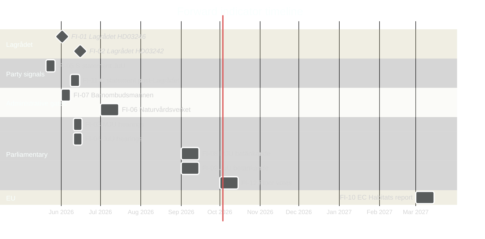

# Forward Indicators: Opposition Motions 2026-05-05

**Author**: James Pether Sörling | **Date**: 2026-05-05 | **Confidence**: HIGH [B2]

## Monitoring dashboard — 12 dated indicators

| # | Indicator | Type | Monitoring source | Expected date | PIR link |
|---|-----------|------|------------------|---------------|----------|
| FI-01 | Lagrådet publishes yttrande on HD03246 (youth crime) | Regulatory trigger | riksdagen.se/sv/lagstiftning/lagradets-yttranden | ~2026-06-01 | LAGRÅDET-246 |
| FI-02 | Lagrådet publishes yttrande on HD03242 (forestry) | Regulatory trigger | riksdagen.se/sv/lagstiftning/lagradets-yttranden | ~2026-06-15 | EU-HABITATS-SE |
| FI-03 | MJU committee hearing dates announced (skogsbruk) | Parliamentary | riksdagen.se/sv/dokument-och-lagar/utskottens-arbete | T+4–6w (~2026-06-10) | — |
| FI-04 | JuU committee hearing dates announced (straffmyndighet) | Parliamentary | riksdagen.se/sv/dokument-och-lagar/utskottens-arbete | T+4–6w (~2026-06-10) | COALITION-C-JuU |
| FI-05 | S press statement on JuU/straffmyndighetsålder | Party signal | socialdemokraterna.se press releases | T+2–4w (~2026-05-20) | S-CRC-JOIN |
| FI-06 | Naturvårdsverket opinion on HD03242 Habitats compliance | Environmental gate | naturvardsverket.se/remissvar | T+6–10w (~2026-07-01) | EU-HABITATS-SE |
| FI-07 | Barnombudsmannen statement on criminal age cut | Rights monitoring | barnombudsmannen.se/publikationer | T+2–6w (~2026-06-01) | LAGRÅDET-246 |
| FI-08 | MJU betänkande publication (forestry) | Parliamentary gate | riksdagen.se/sv/betankanden | Autumn 2026 (~Sept) | — |
| FI-09 | JuU betänkande publication (youth crime) | Parliamentary gate | riksdagen.se/sv/betankanden | Autumn 2026 (~Sept) | COALITION-C-JuU |
| FI-10 | European Commission annual Habitats monitoring report | EU legal trigger | ec.europa.eu/environment/nature/legislation | T+9–12m (~2027-03) | EU-HABITATS-SE |
| FI-11 | C riksdag group statement following Lagrådet yttrande | Cross-bloc signal | centerpartiet.se/riksdagsgruppen | T+2–4w after FI-01 | COALITION-C-JuU |
| FI-12 | Riksdag floor votes on MJU + JuU betänkanden | Decision gate | riksdagen.se/sv/riksdagen-i-arbete/omrostningar | Autumn 2026 (~Oct) | — |

## Critical path

