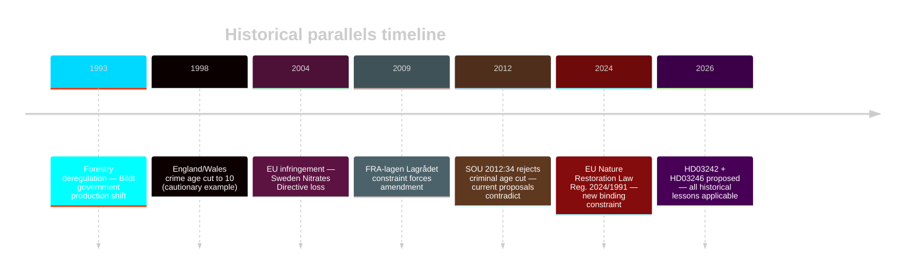

# Historical Parallels: Opposition Motions 2026-05-05

**Author**: James Pether Sörling | **Date**: 2026-05-05 | **Confidence**: MEDIUM [C2]

## Forestry deregulation historical parallels

### 1. Skogspolitikens omläggning 1993–94 (the production-priority shift)

Sweden's 1993 forestry policy reform under the Bildt government (1991–94) abolished the previous "even-aged forest" requirement and reduced state oversight of private forestry. Key parallels to HD03242:

- **Then**: Reduced mandatory consultation requirements for large private forest owners
- **Now**: HD03242 further reduces samrådsplikten and decouples avverkningsanmälan from species survey obligation
- **Outcome of 1993**: Biodiversity decline measurable by 2000s; Artdatabanken Red Lists expanded significantly 2000–2020
- **Political lesson**: Successive deregulation has accumulated without cumulative assessment — exactly what S's HD024144 is demanding now

### 2. EU Nitrates Directive implementation 2002–05 — environmental law resistance

Sweden resisted full EU Nitrates Directive implementation for Swedish coastal agriculture, resulting in Commission infringement proceedings (Case C-485/02) concluded 2004. Sweden lost, amended regulations. 

**Parallel**: The EU infringement risk (R-01) for HD03242 follows a similar trajectory — national deregulatory impulse colliding with binding EU environmental obligations. The previous infringement took ~2 years from triggering action to formal judgment.

## Criminal justice age historical parallels

### 3. Ungdomspåföljdsutredningen 2012–15 (Youth Sanctions Review)

The Reinfeldt government (2010–14) commissioned SOU 2012:34 examining juvenile justice. The review specifically considered and REJECTED lowering the criminal responsibility age below 15, citing CRC compliance and BRÅ evidence on recidivism.

**Parallel**: The same evidence base (BRÅ juvenile recidivism data, CRC) that the 2012 review used to reject age reduction is being invoked by V (HD024142) and C (HD024146) now. The proposing government is explicitly contradicting its own previous official review (SOU 2012:34).

**Political lesson**: SOU 2012:34 was under a right-wing government — the current government is taking a position to the right of its own prior review. This is the strongest evidence that HD03246 is driven by coalition politics (SD and KD demands) rather than evidence.

### 4. England and Wales Crime and Disorder Act 1998 — age 10

**Parallel**: England/Wales cut criminal responsibility to 10 in 1998 under Tony Blair's "tough on crime" positioning. The outcome — successive UN CRC criticism, no measurable reduction in youth crime rates, increased recidivism among the 10–14 cohort (UK Ministry of Justice research 2018) — is the international cautionary example V cites (HD024142).

### 5. Lagrådet blocking a government measure — Signalspaning 2009

The Signalspaning bill (FRA-lagen) in 2008 was passed over significant opposition and later amended in 2009 following constitutional and rights concerns raised by Lagrådet and civil society. The parallel to the CRC challenge on HD03246:

- **Then**: Government pushed surveillance legislation over rights objections; then had to amend
- **Scenario J-B**: Government pushes age cut over CRC objections; Lagrådet forces amendment

**Political lesson**: Lagrådet has historically been a more effective constraint on rights violations than floor opposition alone. If PIR LAGRÅDET-246 resolves with a CRC finding, history suggests government retreat is likely.

