# Implementation Feasibility: Opposition Motions 2026-05-05

**Author**: James Pether Sörling | **Date**: 2026-05-05 | **Confidence**: MEDIUM [C2]

## Forestry proposition (HD03242) — implementation feasibility

### Skogsstyrelsen capacity impact

**Change**: HD03242 decouples samrådsplikten from avverkningsanmälan, reducing pre-notification consultation requirements for certain forest areas.

**Statskontoret cross-source evidence** (proxy — Statskontoret has not yet published a 2026 report on this specific measure, but prior assessments from 2023–24 provide indicators):
- Skogsstyrelsen 2024 annual report: samrådsprocessen requires ~3 FTE in Norrland regional offices
- Reduction in mandatory consultation will reduce Skogsstyrelsen workload but also reduce their ability to flag species protection concerns pre-avverkning
- HD024141 (V) and HD024144 (S) both invoke concerns about Skogsstyrelsen capacity to enforce post-hoc rather than pre-notification

**Implementation risk**: MEDIUM. The administrative burden reduction is real (forest owners benefit from faster notification timelines) but the species-survey capacity reduction increases post-avverkning legal risk (artskyddsbrott prosecutions may increase). Net feasibility: IMPLEMENTABLE but with legal risk.

**Lead time**: Implementation estimated 6–12 months from riksdag adoption. Regulatory amendments required under Skogsvårdsförordningen.

### EU compliance risk

HD03242 requires compatibility opinion from Naturvårdsverket confirming Habitats Directive Art. 6 compliance. No such opinion has been publicly issued as of 2026-05-05. This is a critical implementation gate. If Naturvårdsverket cannot provide a positive opinion, implementation is legally blocked pending amendment.

## Youth crime proposition (HD03246) — implementation feasibility

### Kriminalvården capacity impact

**Change**: Lowering criminal responsibility age to 13 increases the population eligible for criminal prosecution from ~15-year-olds to 13–14 year olds.

**BRÅ data** (cited in HD024142 full text): Approximately 30–50 juveniles per year in the 13–14 age cohort are currently suspected of crimes serious enough that criminal responsibility would theoretically be triggered. However:
- LVU (social care) currently handles this cohort effectively
- Kriminalvården has NO dedicated secure facilities for 13–14 year olds; would require new construction or contract places
- Estimated cost of new juvenile detention capacity for 13–14 age group: SEK 50–100 million (based on comparable SiS construction costs, 2024 estimates)

**Implementation risk**: HIGH. The practical capacity gap (no secure facilities for 13–14 year olds) makes the policy difficult to implement without significant investment. LVU-hybrid alternatives (HD024146 C motion implicitly suggests) may be more feasible.

**Statskontoret cross-source evidence row**: No Statskontoret review has been commissioned for HD03246 as of 2026-05-05. This is itself a procedural gap — major juvenile justice reforms should be Statskontoret-reviewed before implementation.

### CRC/Lagrådet legal gate

The most significant implementation barrier for HD03246 is the pending Lagrådet review. If Lagrådet finds CRC Art. 40(3)(a) incompatibility, the proposition cannot be adopted without amendment. Even a "note and proceed" response from Lagrådet (legal advice ignored) would expose Sweden to immediate international scrutiny and near-certain ECHR challenge.

```mermaid
%%{init: {'theme': 'dark', 'themeVariables': {'primaryColor': '#00d9ff', 'primaryTextColor': '#e0e0e0', 'primaryBorderColor': '#ff006e', 'lineColor': '#ffbe0b', 'secondaryColor': '#1a1e3d', 'tertiaryColor': '#0a0e27'}}}%%
flowchart LR
    F[HD03242\nForestry] --> GF1[Skogsstyrelsen\ncapacity: OK]
    F --> GF2[Naturvårdsverket\nEU opinion: PENDING]
    GF2 -->|positive opinion| FI[Implementation\nfeasible]
    GF2 -->|negative opinion| FB[Implementation\nblocked]
    J[HD03246\nYouth crime] --> GJ1[Kriminalvården\ncapacity: GAP]
    J --> GJ2[Lagrådet\nCRC review: PENDING]
    GJ1 -->|new facilities| JI[Implementation\nfeasible — costly]
    GJ2 -->|CRC violation| JB[Implementation\nblocked/amended]
    style FB fill:#1a1e3d,stroke:#ff006e
    style JB fill:#1a1e3d,stroke:#ff006e
    style FI fill:#1a1e3d,stroke:#00d9ff
    style JI fill:#1a1e3d,stroke:#ffbe0b

```

