# Intelligence Assessment: Opposition Motions 2026-05-05

**Author**: James Pether Sörling | **Date**: 2026-05-05 | **Confidence**: HIGH [B2]

## Key Judgments

### KJ-1: The government will pass both propositions with its 175-seat majority [HIGH CONFIDENCE]
Source reliability: B (established parliamentary record). Information reliability: 2 (verified majority arithmetic). Unless Lagrådet issues a blocking opinion on CRC grounds, the government coalition's structural majority is sufficient to defeat all 8 opposition motions. The probability of a government defeat on the floor is assessed at ≤15% for the youth crime cluster and ≤5% for the forestry cluster.

### KJ-2: The CRC challenge to criminal responsibility age cut represents a genuine cross-bloc coalition with long-term legal salience [HIGH CONFIDENCE]
Source reliability: B. Information reliability: 2. V+C+MP (69 seats) opposition based on CRC lag (2018:1197) is legally coherent. The pending Lagrådet review (~2026-06-01) is the most significant near-term political leverage point. If Lagrådet flags CRC incompatibility, the probability of government retreat increases from ~15% to ~30–40%. PIR: LAGRÅDET-246.

### KJ-3: Sweden's forestry deregulation trajectory creates medium-term EU infringement risk [MEDIUM CONFIDENCE]
Source reliability: B. Information reliability: 3 (assessed from open sources — Habitats Directive monitoring, NRL implementation tracker). The combination of prop. HD03242 with prior deregulation since 2022 cumulatively threatens Sweden's Habitats Directive Article 6 compliance and NRL 30% restoration target. EU infringement proceedings horizon: T+12–24 months. This is not an imminent risk but is a structured long-term constraint. PIR: EU-HABITATS-SE.

### KJ-4: Both motion clusters serve as 2026 election mobilisation platforms for V and MP [MEDIUM CONFIDENCE]
Source reliability: C. Information reliability: 3 (assessed from party polling trajectories). V and MP are at or near threshold risk. Total-rejection motions (HD024141, HD024142, HD024147, HD024148) serve mobilisation purposes even when expected to fail. This is rational opposition strategy, not evidence of cynicism — the legal substance is valid regardless.

### KJ-5: S's position on both clusters is strategically ambiguous, preserving maximum 2026 options [MEDIUM CONFIDENCE]
Source reliability: C. Information reliability: 3. S demands procedural accountability on forestry (HD024144) without taking a total-rejection position, and has NOT joined the CRC coalition on youth crime. This preserves S's ability to either (a) campaign on "we warned you" if policies fail, or (b) negotiate with a post-2026 coalition from a position of legitimate concern-raising rather than principled opposition.

## PIR Status

| PIR ID | Status | Next Indicator | Horizon |
|--------|--------|---------------|---------|
| LAGRÅDET-246 | ACTIVE — awaiting | Lagrådet publication of yttrande on HD03246 | ~2026-06-01 |
| EU-HABITATS-SE | ACTIVE — monitoring | EC DG ENV annual forest monitoring report | T+12m |
| COALITION-C-JuU | ACTIVE — monitoring | C riksdag statement on Lagrådet outcome | T+2–4m |
| S-CRC-JOIN | MONITORING | S press release on JuU committee position | T+2–4m |

## Confidence indicators

- PRIMARY SOURCES: All 8 motions from data.riksdagen.se; parent propositions HD03242, HD03246
- SECONDARY SOURCES: BRÅ research, Artdatabanken Red List, Naturvårdsverket assessments, Barnombudsmannen CRC reports
- MISSING DATA: IMF API unavailable (not material to political analysis); prior voteringar not indexed for 2025/26 (normal — new riksmöte)
- CAVEATS: C motion HD024145 and HD024146 retrieved as summaries only; possible additional argumentation in full text

## Intelligence requirement forward

The most significant intelligence gaps are:
1. **Lagrådet outcome on HD03246** (PIR: LAGRÅDET-246) — highest leverage point
2. **S's internal deliberation on CRC/JuU** — whether S will join the cross-bloc coalition
3. **EU Commission monitoring trigger** — next annual Habitats report date

```mermaid
%%{init: {'theme': 'dark', 'themeVariables': {'primaryColor': '#00d9ff', 'primaryTextColor': '#e0e0e0', 'primaryBorderColor': '#ff006e', 'lineColor': '#ffbe0b', 'secondaryColor': '#1a1e3d', 'tertiaryColor': '#0a0e27'}}}%%
flowchart LR
    KJ1[KJ-1\nGovernment\nprevails\nHIGH] --> W[Watch:\nLagrådet]
    KJ2[KJ-2\nCRC coalition\ngenuine\nHIGH] --> W
    KJ3[KJ-3\nEU infringement\nrisk MEDIUM] --> W2[Watch:\nEC annual report]
    KJ4[KJ-4\nElection\nmobilisation\nMEDIUM] --> W3[Watch:\n2026 poll data]
    KJ5[KJ-5\nS ambiguous\nMEDIUM] --> W4[Watch:\nS committee vote]
    style KJ1 fill:#1a1e3d,stroke:#00d9ff
    style KJ2 fill:#1a1e3d,stroke:#00d9ff
    style KJ3 fill:#1a1e3d,stroke:#ffbe0b
    style KJ4 fill:#1a1e3d,stroke:#ffbe0b
    style KJ5 fill:#1a1e3d,stroke:#ffbe0b

```

## Pass 2 enhancement: Confidence calibration update

### Revised KJ confidence after Pass 2 full review

**KJ-1 government prevails**: Maintained HIGH. The 192 vs 136 forestry margin and 165 vs 69 youth crime base margin are not seriously threatened by any current signals. The conditional scenarios (J-B, J-C) remain below 45% combined.

**KJ-2 CRC coalition genuine**: Maintained HIGH. C's decision to file HD024146 despite being a coalition-adjacent party is the most costly political signal in this batch — it is not explained by electoral opportunism alone (C has more to lose than gain from opposing government crime measures in the short term). The BRÅ evidence and Nordic comparative context give V's HD024142 independent empirical standing.

**KJ-3 EU infringement**: MAINTAINED MEDIUM. The NRL Reg. 2024/1991 was only passed in 2024; the Commission is in early implementation monitoring phase. Infringement proceedings are not imminent but are on a trajectory that prop. HD03242 accelerates.

**KJ-4 electoral mobilisation**: UPGRADED to MEDIUM-HIGH. Review of Norway/Finland/Germany comparators confirms that Sweden's direction in BOTH clusters is an outlier relative to comparable states. This strengthens V and MP's mobilisation narrative with empirical backing beyond domestic opposition framing.

**KJ-5 S ambiguity**: MAINTAINED MEDIUM. The procedural consequence-analysis demand (HD024144) is consistent with S's pattern of forensic accountability demands. S's silence on youth crime CRC is also consistent — S typically waits for institutional validation (Lagrådet, Barnombudsmannen) before joining rights challenges.

### Net assessment (post-Pass-2)
The 2026-05-04 motion batch represents a credible, legally grounded opposition challenge to two flagship government measures. The motions will fail on the floor under current political conditions, but the legal machinery they have activated (Lagrådet CRC review, EU Habitats monitoring, CBD 30×30 accounting) creates durable political leverage that will shape the 2026 election campaign regardless of floor outcomes.
