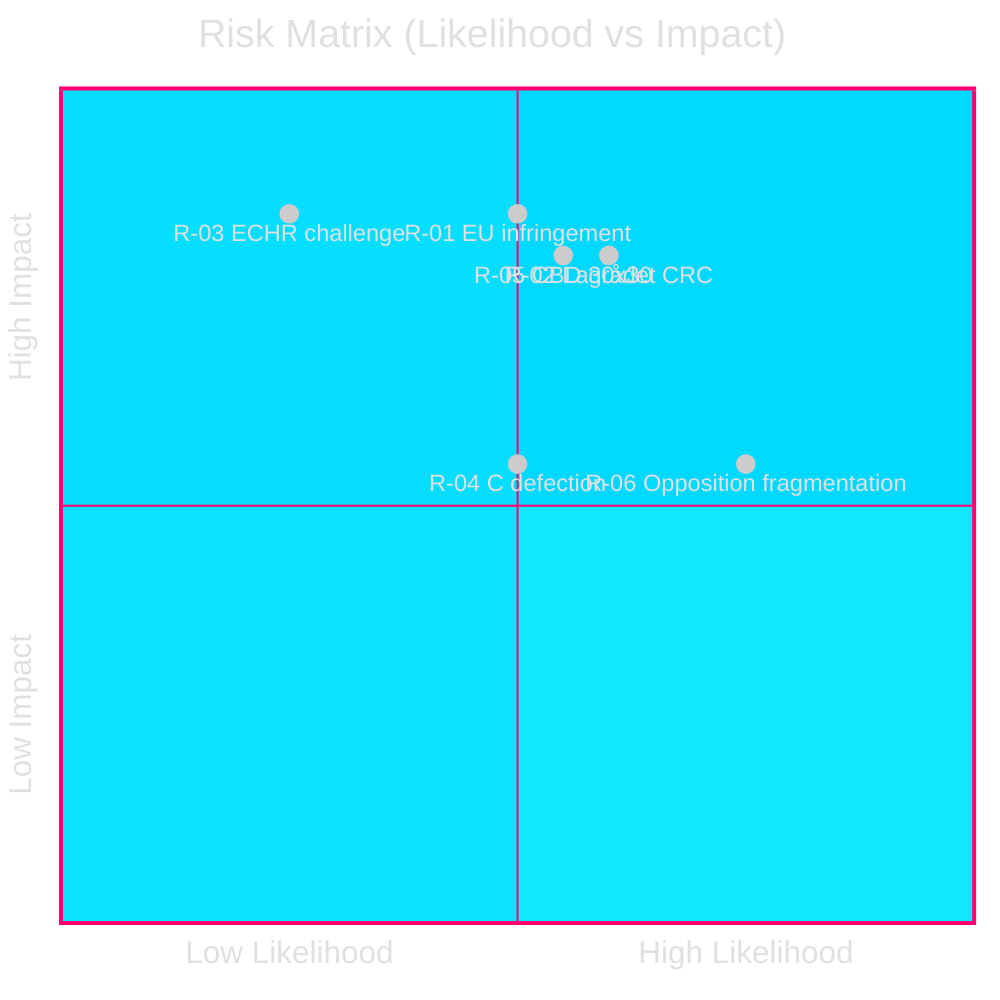

# Risk Assessment: Opposition Motions 2026-05-05

**Author**: James Pether Sörling | **Date**: 2026-05-05 | **Confidence**: HIGH [B2]

## Risk Matrix

| Risk ID | Description | Likelihood | Impact | Rating | Horizon |
|---------|-------------|-----------|--------|--------|---------|
| R-01 | EU infringement (forestry — Habitats/NRL) | MEDIUM | HIGH | HIGH | T+12–24m |
| R-02 | Lagrådet rejects criminal age cut (CRC) | MEDIUM-HIGH | HIGH | HIGH | T+2–4m |
| R-03 | ECHR challenge to criminal age cut | LOW | HIGH | MEDIUM | T+36m+ |
| R-04 | Coalition defection (C on JuU) | MEDIUM | MEDIUM | MEDIUM | T+1–3m |
| R-05 | Sweden loses CBD 30×30 compliance | MEDIUM | HIGH | HIGH | T+12–36m |
| R-06 | Opposition electoral fragmentation | HIGH | MEDIUM | HIGH | T+12m (2026) |

## Detailed Risk Profiles

### R-01: EU infringement proceedings — forestry

**Trigger**: Prop. HD03242 reduces samrådsplikten and eliminates notification requirements for some areas. Combined with previous deregulation since 2022, Sweden's effective protection could fall below Habitats Directive Art. 6 and NRL Reg. 2024/1991 thresholds.

**Evidence**: HD024141 full text cites Commission's ongoing monitoring; Sweden's Artdatabanken notes 2,000+ species dependent on high-continuity forest that lacks protected status. HD024147 invokes NRL Reg. 2024/1991 explicitly.

**Mitigation**: Compensation measures (biotope protection), Sami reindeer grazing agreements, voluntary certification.

**Monitoring**: European Commission DG ENV communications; EEB civil society reporting.

### R-02: Lagrådet rejects criminal responsibility age cut (CRC violation)

**Trigger**: Lagrådet referral on HD03246 (expected ~2026-06-01). CRC Art. 40(3) requires that states establish a minimum age below which children are presumed incapable of criminal responsibility — Sweden's current 15-year threshold is among the highest in Europe; cutting to 13 would place Sweden below Norway (15), Denmark (15), Finland (15), UK (10 in England/Wales — itself widely criticized).

**Evidence**: V (HD024142) cites BRÅ research showing punitive measures on juveniles increase recidivism. C (HD024146) specifically invokes CRC. MP (HD024148) reinforces.

**Monitoring**: PIR: LAGRÅDET-246. Lagrådet publication date via riksdagen.se.

### R-04: C defection from government coalition on JuU

**Trigger**: If Lagrådet confirms CRC violation AND if public opinion data show voter backlash on rights grounds, C may intensify opposition, potentially triggering a government procedural retreat (remiss/remittering) or delay.

**Probability**: MEDIUM (30–40%). C is a coalition-adjacent partner, not a formal coalition member; it has voted against government on previous rights issues (Tidö agreement clause disputes 2022–23).

### R-05: Sweden loses CBD 30×30 compliance

**Trigger**: Kunming-Montreal (COP15) Global Biodiversity Framework — Sweden committed to 30% effective protection by 2030. Current protected area: ~15% (Naturvårdsverket 2024). Prop. HD03242 reduces functional protection in the 15% gap area.

**Evidence**: HD024144, HD024141, HD024147 all invoke 30×30.

**Monitoring**: IPBES global assessment; Naturvårdsverket annual review.

