# Scenario Analysis: Opposition Motions 2026-05-05

**Author**: James Pether Sörling | **Date**: 2026-05-05 | **Confidence**: HIGH [B2]

## Forestry cluster scenarios (prop. 2025/26:242 / HD03242)

### Scenario F-A: Government prevails, all motions rejected [Probability: 60%] T+6–12m

**Conditions**: Lagrådet finds no EU law violation sufficient to trigger mandatory amendment; M+KD+SD+L hold together (175 seats); S does not force remiss.

**Outcome**: Prop. HD03242 adopted. Samrådsplikten decoupled from avverkningsanmälan. SD demands (HD024143) rejected as exceeding coalition mandate. S demand for impact analysis (HD024144) noted in committee protocol but not adopted.

**Consequence**: V and MP use defeat as campaign material. EU Commission monitoring intensifies. Risk R-01 (infringement) moves from MEDIUM to MEDIUM-HIGH. Opposition credibility: S retains procedural credibility; V+MP gain mobilisation leverage.

### Scenario F-B: Government offers procedural concession to S [Probability: 25%] T+3–6m

**Conditions**: S forces demand for joint remiss with Naturvårdsverket and Artdatabanken. Government prefers S's cooperative framing over a floor confrontation that also features SD wanting more. Government agrees to time-limited consequence analysis review before implementation of §X.

**Outcome**: Prop. partially delayed or amended. V+MP still reject; C+SD positions absorbed as minority reservations. S avoids floor vote by brokering post-legislative monitoring.

**Consequence**: S gains governing credibility; V+MP maintain purity positions. Government gains legitimacy shield.

### Scenario F-C: EU infringement triggers mandatory amendment [Probability: 15%] T+18–36m

**Conditions**: European Commission initiates infringement proceedings under Habitats Directive Art. 6 or NRL Reg. 2024/1991 following annual report. Government required to amend implementation regulations.

**Outcome**: Post-adoption course correction. Opposition motion analysis (HD024141, HD024147) validated retrospectively.

## Youth crime cluster scenarios (prop. 2025/26:246 / HD03246)

### Scenario J-A: Government prevails, criminal age cut to 13 adopted [Probability: 55%] T+6–12m

**Conditions**: Lagrådet referral does NOT block on CRC grounds; M+KD+SD+L hold (175 seats); C's objections (HD024146) noted but outweighed.

**Outcome**: BrB chap. 1 §6 amended; criminal responsibility age lowered to 13. Implementation via specialized detention facilities or LVU hybrid. Sweden becomes an outlier in Nordic CRC compliance.

**Consequence**: ECHR challenge predictable in medium term (T+36m+). UNICEF, Barnombudsmannen international monitoring. C faces internal pressure on 2026 rights platform.

### Scenario J-B: Lagrådet flags CRC conflict — government delays or amends [Probability: 30%] T+3–6m

**Conditions**: Lagrådet review of HD03246 identifies CRC Art. 40(3)(a) incompatibility requiring legislative amendment. Government retreats to interim solution (e.g., age 14 rather than 13, or an LVU-first mandatory screening before criminal liability).

**Outcome**: Modified proposition or remiss. C opposition (HD024146) vindicated; C gains 2026 positioning. V (HD024142) and MP (HD024148) can still oppose but at reduced intensity.

**Consequence**: This is the highest-impact scenario for opposition — cross-bloc rights coalition achieves partial win. S's abstention becomes less significant.

### Scenario J-C: Cross-bloc majority blocks — criminal age cut fails [Probability: 15%] T+3–6m

**Conditions**: S publicly endorses CRC argument, joining V+C+MP to form 163-seat coalition against 175. Coalition under pressure from Lagrådet + Barnombudsmannen + international opinion. Government cannot hold all 175 (L wavers on rights grounds).

**Outcome**: Floor defeat or withdrawal of HD03246. Historic opposition cross-bloc achievement. Government faces coalition management crisis.

**Consequence**: Major 2026 election narrative for opposition; government recalibrates crime-tough positioning.

```mermaid
%%{init: {'theme': 'dark', 'themeVariables': {'primaryColor': '#00d9ff', 'primaryTextColor': '#e0e0e0', 'primaryBorderColor': '#ff006e', 'lineColor': '#ffbe0b', 'secondaryColor': '#1a1e3d', 'tertiaryColor': '#0a0e27'}}}%%
flowchart TD
    F{Forestry\nHD03242}
    F --> FA[F-A: Government\nprevails 60%]
    F --> FB[F-B: Procedural\nconcession 25%]
    F --> FC[F-C: EU\ninfringement 15%]
    J{Youth crime\nHD03246}
    J --> JA[J-A: Age cut\nadopted 55%]
    J --> JB[J-B: Lagrådet\nblocks/amends 30%]
    J --> JC[J-C: Cross-bloc\nmajority 15%]
    JA --> |ECHR risk| JA1[Medium-term\nchallenge]
    JB --> |C vindicated| JB1[C 2026 positioning]
    JC --> |Historic| JC1[Coalition crisis]
    style FA fill:#1a1e3d,stroke:#ffbe0b
    style JA fill:#1a1e3d,stroke:#ffbe0b
    style JB fill:#1a1e3d,stroke:#00d9ff
    style JC fill:#1a1e3d,stroke:#00d9ff
    style FB fill:#1a1e3d,stroke:#00d9ff

```

