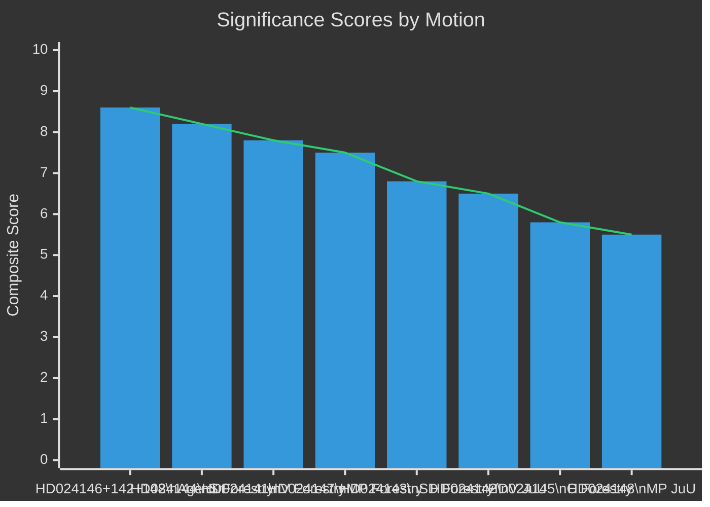

# Significance Scoring: Opposition Motions 2026-05-05

**Author**: James Pether Sörling | **Date**: 2026-05-05 | **Confidence**: HIGH [B2]

## Scoring Methodology

DIW framework: Democratic Impact (D), Institutional Weight (I), Welfare Effect (W). Scale 1–10 per dimension; composite = (D×2 + I×1 + W×2) / 5.

## Ranked Significance

### 1. HD024146 + HD024142 + HD024148 — Cross-bloc rejection of criminal responsibility age cut [COMPOSITE: 8.6]

| Dimension | Score | Evidence |
|-----------|-------|----------|
| Democratic Impact | 9 | C's defection (27 seats, HD024146) from government-adjacent position on flagship measure; unprecedented V+C+MP coalition on a law-and-order issue — data.riksdagen.se |
| Institutional Weight | 8 | CRC (lag 2018:1197) creates legal obligation binding on all branches; Lagrådet referral pending for prop. HD03246 |
| Welfare Effect | 9 | Criminal responsibility age affects children 13-14 years old; CRC Art. 40(3) violations carry ECHR challenge risk; BRÅ research on recidivism cited (HD024142) |

**Why this ranks first**: The combination of cross-bloc parliamentary opposition (V+C+MP = 69 seats), a legally robust CRC challenge, pending Lagrådet review, and strong empirical counter-evidence makes this the most politically consequential motion cluster.

### 2. HD024144 — S demands comprehensive forestry consequence analysis [COMPOSITE: 8.2]

| Dimension | Score | Evidence |
|-----------|-------|----------|
| Democratic Impact | 9 | S (94 seats) demanding cumulative impact assessment of all forestry deregulation since 2022; HD03242 (riksdagen.se) |
| Institutional Weight | 8 | Invokes Kunming-Montreal 30×30 (CBD COP15), EU Nature Restoration Law Reg. 2024/1991 — binding international frameworks |
| Welfare Effect | 8 | Forest ecosystems cover 57% of Sweden's land area; regulatory changes affect biodiversity, carbon sequestration, reindeer husbandry, and water quality at national scale |

### 3. HD024141 — V demands total rejection of forestry deregulation [COMPOSITE: 7.8]

| Dimension | Score | Evidence |
|-----------|-------|----------|
| Democratic Impact | 7 | V (24 seats) positions as environmental constitutional opposition; total rejection signals mobilisation intent (HD024141, data.riksdagen.se) |
| Institutional Weight | 8 | EU Habitats Directive Art. 6, EU Nature Restoration Law compliance risk explicitly named; Sami Parliament opposition cited |
| Welfare Effect | 9 | Decoupling samrådsplikten from avverkningsanmälan removes primary species-protection trigger in Swedish law; HD024141 full text cites Naturvårdsverket and Artdatabanken opposition |

### 4. HD024147 — MP demands total rejection of forestry deregulation [COMPOSITE: 7.5]

| Dimension | Score | Evidence |
|-----------|-------|----------|
| Democratic Impact | 8 | MP (18 seats) needs threshold-clearing differentiation; total forestry rejection is signature 2026 election position (HD024147, data.riksdagen.se) |
| Institutional Weight | 7 | Paris Agreement Art. 5 (forests as carbon sinks), EUNRL Reg. 2024/1991, CBD 30×30 all invoked |
| Welfare Effect | 8 | Climate carbon-sink loss from intensified production forestry; biodiversity collapse risk for 2000+ red-listed species dependent on old-growth forest |

### 5. HD024143 — SD demands further forestry deregulation [COMPOSITE: 6.8]

| Dimension | Score | Evidence |
|-----------|-------|----------|
| Democratic Impact | 7 | SD (62 seats) as government coalition partner pushing for more than government proposed; signals coalition management challenge (HD024143, data.riksdagen.se) |
| Institutional Weight | 6 | SD's habitat exemption demands risk Habitats Directive conflict |
| Welfare Effect | 7 | Higher notification thresholds and habitat-exemptions reduce species survey opportunities |

### 6. HD024142 — V demands rejection of criminal responsibility age cut [COMPOSITE: 6.5]

| Dimension | Score | Evidence |
|-----------|-------|----------|
| Democratic Impact | 7 | V's CRC legal argument is detailed and well-sourced (HD024142, full text, data.riksdagen.se) |
| Institutional Weight | 7 | CRC directly applicable in Swedish law since 2018 |
| Welfare Effect | 6 | Affects small number of 13-14 year olds per year (BRÅ estimates <50/year in the relevant age-severity category) |

### 7. HD024145 — C demands production enhancement package [COMPOSITE: 5.8]

| Dimension | Score | Evidence |
|-----------|-------|----------|
| Democratic Impact | 6 | C (27 seats) representing forest owner constituency; relatively low political controversy given alignment with government direction (HD024145, data.riksdagen.se) |
| Institutional Weight | 5 | Production-focused — lower international law exposure |
| Welfare Effect | 6 | Rural economic dimension; forest-owner income affected by policy |

### 8. HD024148 — MP rejects criminal responsibility age cut [COMPOSITE: 5.5]

| Dimension | Score | Evidence |
|-----------|-------|----------|
| Democratic Impact | 6 | MP (18 seats) amplifies the cross-bloc CRC opposition coalition (HD024148, data.riksdagen.se) |
| Institutional Weight | 6 | CRC dimension; reinforces V and C (HD024142, HD024146) |
| Welfare Effect | 5 | Similar to HD024146 — narrow affected population but high rights-impact per individual |

