# Stakeholder Perspectives: Opposition Motions 2026-05-05

**Author**: James Pether Sörling | **Date**: 2026-05-05 | **Confidence**: HIGH [B2]

## Parliamentary Parties

### Government coalition

**Moderaterna (M)** — *Framing: deregulation as competitive neutrality and forest-owner rights*
Prop. HD03242 aligns with M's economic liberalism agenda. On youth crime, M supports the age cut as part of the Tidö agreement's "tougher crime" messaging. M will resist procedural retreats.

**Kristdemokraterna (KD)** — *Framing: family responsibility and rule-of-law order*
KD supported Tidö crime measures; on forests, KD balances rural constituency with environmental values. Unlikely to break on either cluster.

**Sverigedemokraterna (SD) — HD024143** — *Framing: forest industry competitiveness and property rights*
Explicitly demands MORE deregulation than government proposed; habitat exemptions and higher thresholds. EU law compliance is not a primary concern. SD (62 seats) will support both propositions on the floor.

**Liberalerna (L)** — *Framing: evidence-based reform*
L's official position aligns with the coalition. On youth crime, L has historically been more cautious on civil liberties; possible quiet pressure on Lagrådet referral timing.

### Opposition

**Socialdemokraterna (S) — HD024144** — *Framing: procedural accountability and impact analysis*
S (94 seats) is not rejecting forestry reform in principle — demanding consequence analysis. This is a low-risk, high-credibility position. S has NOT yet joined the CRC opposition on youth crime; key swing actor.

**Vänsterpartiet (V) — HD024141, HD024142** — *Framing: environmental constitutionalism and children's rights*
V (24 seats) takes the most principled positions: total rejection of both clusters on legal grounds. V is well-positioned for left-flank mobilisation ahead of 2026.

**Centerpartiet (C) — HD024145, HD024146** — *Framing: rural liberal; pro-production but rights-protective on criminal law*
C's position is a classic centre-liberal split: support forestry production (HD024145) while rejecting criminal justice age cut on CRC grounds (HD024146). This creates C's strongest 2026 differentiation from both the left (environment) and the government (rights).

**Miljöpartiet (MP) — HD024147, HD024148** — *Framing: climate emergency and child rights*
MP (18 seats; 4% threshold survival at risk) uses these motions as signature environmental and rights positions. Total rejection on forestry; CRC on youth crime.

## Civil Society and Administrative Stakeholders

**Naturvårdsverket (Swedish Environmental Protection Agency)**
Responsible for implementing species protection. Prop. HD03242 reduces their samråd authority. Internal opposition likely (official consultation process 2025–26). Evidence in HD024141.

**Skogsstyrelsen (Swedish Forest Agency)**
Dual mandate: production AND environmental protection. Avverkningsanmälan reform directly affects their operational capacity. Possible implementation constraint.

**Artdatabanken (Swedish Species Information Centre)**
Publishes Red List; 2000+ species at risk from old-growth loss. Primary evidence source for V and MP motions (HD024141, HD024147).

**Sametinget (Sami Parliament)**
Reindeer grazing affected by intensified forestry. HD024141 (V) cites Sami Parliament opposition to prop. HD03242. International human rights dimension (ILO 169, UNDRIP).

**Barnombudsmannen (Children's Ombudsman)**
Statutory CRC guardian. Expected to submit remiss response criticising criminal age cut below 15. Critical evidence source for C (HD024146), V (HD024142), MP (HD024148).

**Kriminalvården (Swedish Prison and Probation Service)**
Capacity implications of more juvenile detainees. BRÅ evidence on recidivism and re-socialisation programmes relevant.

**UNICEF Sverige**
International CRC monitoring; likely media engagement on age cut.

**Skogsägarföreningarna (Forest Owners' Associations)**
Supports deregulation; C and SD constituencies. HD024145 C motion reflects their interests.

```mermaid
%%{init: {'theme': 'dark', 'themeVariables': {'primaryColor': '#00d9ff', 'primaryTextColor': '#e0e0e0', 'primaryBorderColor': '#ff006e', 'lineColor': '#ffbe0b', 'secondaryColor': '#1a1e3d', 'tertiaryColor': '#0a0e27'}}}%%
flowchart LR
    A[Naturvårdsverket] -->|evidence| V[V — HD024141]
    B[Artdatabanken] -->|Red List| V
    B -->|Red List| MP[MP — HD024147]
    C[Barnombudsmannen] -->|CRC| Ce[C — HD024146]
    C -->|CRC| Va[V — HD024142]
    C -->|CRC| MPc[MP — HD024148]
    D[Sametinget] -->|ILO 169| V
    E[BRÅ research] -->|recidivism| Va
    F[Skogsägarföreningarna] -->|production| Ct[C — HD024145]
    F -->|deregulation| SD[SD — HD024143]
    style V fill:#1a1e3d,stroke:#8b0000
    style MP fill:#1a1e3d,stroke:#228b22
    style Ce fill:#1a1e3d,stroke:#00d9ff
    style Va fill:#1a1e3d,stroke:#8b0000
    style MPc fill:#1a1e3d,stroke:#228b22
    style Ct fill:#1a1e3d,stroke:#00d9ff
    style SD fill:#1a1e3d,stroke:#ffbe0b

```

