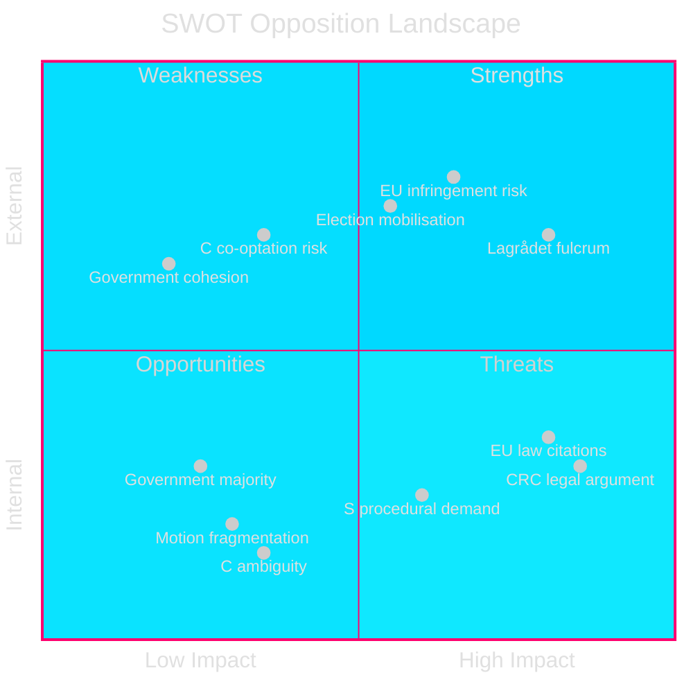

# SWOT Analysis: Opposition Motions 2026-05-05

**Author**: James Pether Sörling | **Date**: 2026-05-05 | **Confidence**: HIGH [B2]

Subject: Opposition motion landscape response to prop. 2025/26:242 (forestry) and prop. 2025/26:246 (youth crime)

## Strengths (Opposition position)

**S1 — Legal robustness of CRC argument** [HIGH]
- V (HD024142), C (HD024146), MP (HD024148) invoke CRC (lag 2018:1197), directly applicable in Swedish law since 2018. The Lagrådet referral pending for HD03246 creates a formal legal chokepoint. CRC Art. 40(3) prohibits criminal responsibility below an internationally accepted minimum — Sweden's current age (15) is already above most countries; cutting to 13 would be among the lowest in Europe.
- Evidence: CRC lag 2018:1197 §2; BRÅ research on juvenile recidivism cited in HD024142

**S2 — International environmental law citations** [HIGH]
- V (HD024141), MP (HD024147) cite EU Nature Restoration Law Reg. 2024/1991, Habitats Directive, Kunming-Montreal 30×30 target, and Paris Agreement Art. 5 (forests as carbon sinks) — all binding obligations. Sweden's existing forest protection falls below the 17% Aichi Target (Artdatabanken).
- Evidence: HD024141 full text, HD024147 full text; Artdatabanken Red List 2020

**S3 — Unified S consequence-analysis procedural demand** [MEDIUM-HIGH]
- S (HD024144) demands a comprehensive impact review — a procedurally conservative position that is hard for government to reject without appearing to oppose evidence-based policymaking.
- Evidence: HD024144 (data.riksdagen.se)

## Weaknesses (Opposition position)

**W1 — Fragmentation**: 8 motions from 5 parties across 2 different committees means no unified opposition front. V+MP+S positions differ significantly (total rejection vs procedural challenge) making a coordinated floor strategy difficult.

**W2 — Government majority**: M+KD+SD+L = 175 seats; all 8 motions will very likely be rejected in committee. The CRC-based coalition (V+C+MP = 69) cannot block the criminal justice reform without S (94 seats), which has not publicly backed the CRC argument.

**W3 — C's ambiguity on forestry**: C supports MORE forestry production (HD024145) but opposes criminal law age cut (HD024146) — internally coherent but creates cross-cutting coalition risks if government uses forestry to placate C on crime.

**W4 — SD overreach risk**: SD's demand for additional deregulation (HD024143) beyond the proposition could be used by government to argue opposition is incoherent (some want more, some want less).

## Opportunities (Opposition position)

**O1 — Lagrådet review as political fulcrum** [HIGH probability, T+3 to T+6 months]
- If Lagrådet identifies CRC violations in HD03246 (youth crime), C could legitimately intensify opposition, raising the chance S follows. This is the most significant near-term political leverage point.
- PIR: LAGRÅDET-246

**O2 — EU infringement proceedings risk on forestry** [MEDIUM probability, T+12 to T+24 months]
- European Commission has already issued reasoned opinions on Sweden's forest management (Habitats Directive). Further deregulation from HD03242 could trigger formal infringement. Opposition can use this as a credibility pressure point.

**O3 — 2026 election mobilisation** [MEDIUM-HIGH strategic value]
- V and MP need 4% threshold. Forest and climate issues are key to their voter base. A high-profile opposition stance on HD024141 and HD024147 serves mobilisation purposes even if the motions fail.

**O4 — International attention** [MEDIUM]
- IPBES, IUCN, Sami Parliament opposition can generate international press, increasing domestic salience before 2026 election.

## Threats (Opposition position)

**T1 — Government coalition cohesion**: If M+KD+SD+L hold together (likely), all motions fail in committee and floor vote. The 175-seat majority is structurally stable.

**T2 — C co-optation**: Government may offer side payments (forest-owner subsidies, Sami compensation) to neutralise C's forestry objections and secure their acquiescence on criminal justice.

**T3 — Lagrådet declining to flag CRC concern**: If Lagrådet review of HD03246 does not identify an explicit CRC violation, the main legal lever for C's CRC opposition weakens.

**T4 — Media framing favouring government**: Crime-tough messaging tends to dominate in Swedish media; "age of criminal responsibility" is a government-friendly frame that marginalises CRC/rights arguments.

