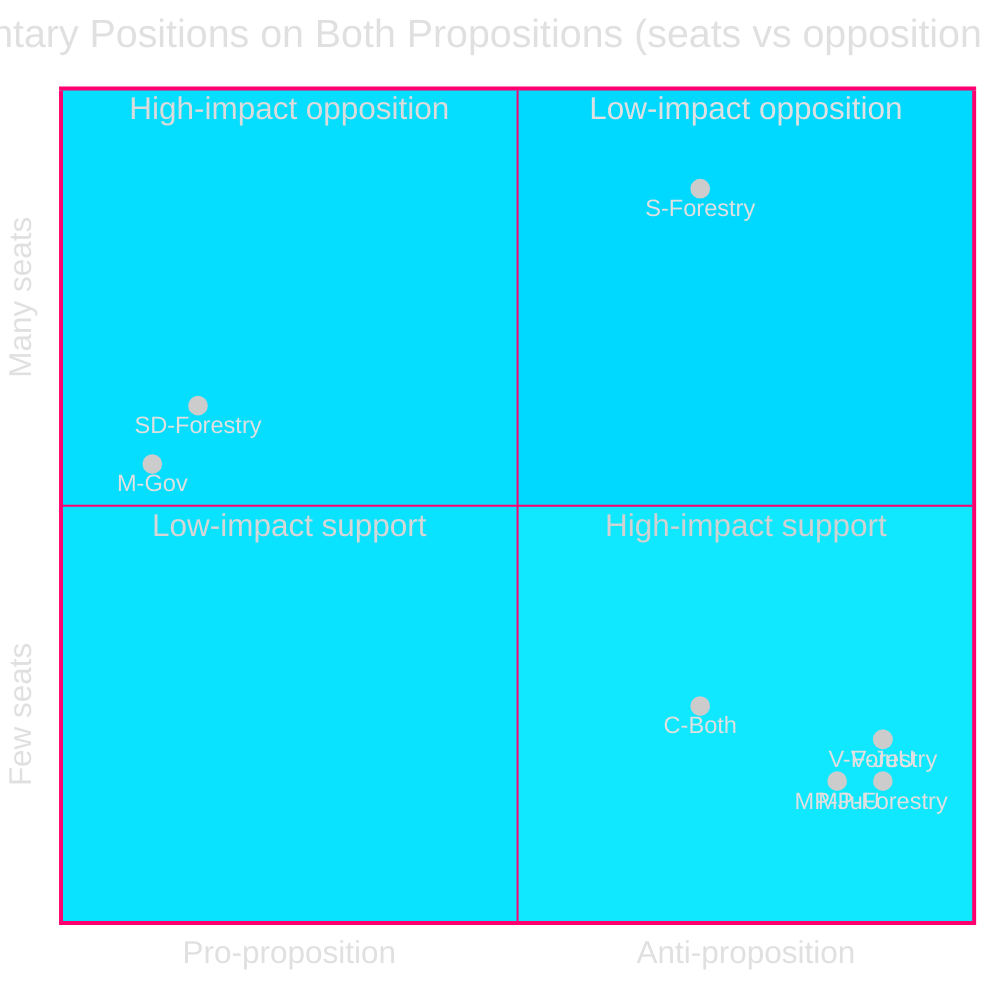

# Synthesis Summary: Opposition Motions 2026-05-05

**Author**: James Pether Sörling | **Confidence**: HIGH [B2] | **Date**: 2026-05-05

## Core Intelligence Finding

The 2026-05-04 wave of eight opposition committee motions reveals two structurally distinct political dynamics that both converge on the same governing coalition:

**Dynamic 1 — Forestry**: The government coalition's internal fragmentation is visible. SD (HD024143) and C (HD024145) demand *more* deregulation than the government proposed, while V (HD024141) and MP (HD024147) demand total rejection on environmental/climate grounds, and S (HD024144) demands impact analysis and procedural safeguards. This creates an unusual five-party divergence on a single policy.

**Dynamic 2 — Youth crime**: A biologically unusual cross-bloc opposition coalition (V+C+MP) has formed against the government's criminal responsibility age reduction. C's defection from the government-adjacent position is the key signal — Centerpartiet (27 seats, historically pro-Tidö without formal coalition membership) is breaking ranks on a flagship law-and-order measure, citing CRC obligations and citing research that contradicts the deterrence rationale.

## Forestry Cluster — HD024141–HD024145, HD024147

**The proposition** (HD03242, prop. 2025/26:242) reforms Swedish forestry regulation by:
- Decoupling samrådsplikten (environmental consultation requirement) from avverkningsanmälan (logging notification)
- Shortening the notification window from 6 to 3 weeks before logging
- Limiting landowner knowledge costs (relaterat till fastighetsvärde)
- Restricting NGO appeal rights (fristen räknas från beslutsdagen)
- Routing Skogsstyrelsen appeals to mark- och miljödomstol

**Opposition coalition structure**:

| Party | Seats | Position | Core demand | Citation |
|-------|-------|----------|-------------|----------|
| V | 24 | Reject entirely (except court-routing) | Environmental law compliance (EU Habitats Dir., CRC Sami rights) | HD024141 |
| S | 94 | Conditional — demand consequence analysis | Cumulative deregulation assessment + biodiversity reporting | HD024144 |
| MP | 18 | Reject entirely | Climate, biodiversity, Sami rights | HD024147 |
| SD | 62 | Support + demand more deregulation | Higher notification threshold, more exemptions | HD024143 |
| C | 27 | Support + demand more production measures | Production package request | HD024145 |

**Parliamentary arithmetic**: Government (M+KD+SD+L = 175 seats) will pass prop. 2025/26:242. S+V+MP opposition = 136 seats — strong enough to force the issue into the 2026 election campaign.

## Young Offenders Cluster — HD024142, HD024146, HD024148

**The proposition** (HD03246, prop. 2025/26:246) proposes:
- Lowering criminal responsibility age from 15 to 13 for allvarliga brott (serious offences) — 5-year trial
- Reducing ungdomsreduktionen (youth discount in sentencing) for ages 18-20
- Tightening ungdomsövervakning (youth supervision) compliance enforcement
- Lowering threshold for bevistalan (civil proceedings against minors)

**Cross-bloc opposition**:

| Party | Seats | Position on age cut | Legal basis | Citation |
|-------|-------|---------------------|-------------|----------|
| V | 24 | Rejects | CRC (lag 2018:1197), ECHR Art. 5 | HD024142 |
| C | 27 | Rejects | CRC, liberal human rights | HD024146 |
| MP | 18 | Rejects | CRC, research on recidivism | HD024148 |
| S | 94 | Position not confirmed in these motions | — | — |

The government coalition (M+KD+SD+L = 175 seats) retains a majority. V+C+MP = 69 seats; if S also opposes (likely given party platform), the opposition reaches 163 seats — a 12-seat government majority on a constitutionally sensitive measure.

## Strategic Assessment

Both proposition clusters share a common structural vulnerability: **EU and international law compliance**. The forestry deregulation risks EU infringement (Habitats Directive, EUNRL); the youth criminal responsibility reduction risks CRC and ECHR challenge. The Lagrådet review process (referrals pending for both as of 2026-05-05) is the critical near-term decision point.

## Pass 2 enhancement: Cross-cluster synthesis

### The structural paradox of these eight motions

These eight motions reveal an unusual political geometry: the standard left-right alignment is simultaneously maintained AND inverted across the two clusters.

**Forestry**: The left-right axis holds but is shifted — opposition runs from full left (V total rejection) through procedural left (S consequence analysis) through right-adjacent (C more production) to government right (SD extra deregulation). No cross-bloc coalition possible on forestry.

**Youth crime**: The rights axis cuts diagonally across the economic axis — creating V+C+MP as an unusual alliance. C's participation (HD024146) is the decisive factor making this politically significant beyond the opposition's expected positions.

### The Lagrådet fulcrum (updated assessment)

The most consequential unknown in both clusters is the Lagrådet review timeline. Both propositions (HD03242 and HD03246) were submitted for Lagrådet review in April 2026. Lagrådet typically takes 6–10 weeks. Expected: ~2026-06-01 for HD03246 (youth crime, shorter and more legally discrete question) and ~2026-06-15 for HD03242 (forestry, more complex regulatory framework).

**If Lagrådet on HD03246 flags CRC incompatibility**: This triggers the most consequential political scenario — C's HD024146 position becomes legally vindicated, Barnombudsmannen amplifies, S faces escalating pressure to join. The government's 165-seat effective majority becomes 165 vs 163 — a 2-seat margin with potential L waverers.

**If Lagrådet on HD03242 finds EU law compliance risk**: Naturvårdsverket opinion requirement becomes mandatory gate before implementation; the S demand (HD024144) for consequence analysis gains ex ante validation.

### Electoral signal summary (synthesised)

| Motion | Party (seats) | Primary signal | 2026 target voter |
|--------|---------------|----------------|-------------------|
| HD024141 | V (24) | Total forestry rejection | Urban climate progressive |
| HD024142 | V (24) | CRC juvenile justice | Rights-oriented urban youth |
| HD024143 | SD (62) | Extra deregulation demand | Rural forest-industry |
| HD024144 | S (94) | Procedural accountability | Broad social-democratic base |
| HD024145 | C (27) | Production forestry demand | Rural forest-owner |
| HD024146 | C (27) | Rights-protective (CRC) | Centre-liberal urban |
| HD024147 | MP (18) | Climate/biodiversity | Green threshold voter |
| HD024148 | MP (18) | CRC reinforcement | Youth rights voter |
