# Threat Analysis: Opposition Motions 2026-05-05

**Author**: James Pether Sörling | **Date**: 2026-05-05 | **Confidence**: HIGH [B2]

## STRIDE-adapted democratic process threat model

| Threat | STRIDE category | Actor | Asset threatened | Likelihood | Counter |
|--------|----------------|-------|-----------------|-----------|---------|
| T-01 | Tampering | Government coalition | Lagrådet referral process | LOW | Lagrådet independence; constitutional convention |
| T-02 | Repudiation | Government | EU law compliance commitment | MEDIUM | Commission monitoring; EP resolutions |
| T-03 | Information Disclosure | None identified | Parliamentary deliberation | LOW | Public debate; media coverage |
| T-04 | Denial of Service | Parliamentary clock | Committee time budget | MEDIUM | Double committee referral (MJU+JuU) increases scrutiny load |
| T-05 | Elevation of Privilege | SD (HD024143) | Government coalition management | MEDIUM | Government can reject SD add-ons without coalition crisis |
| T-06 | Spoofing | None identified | Opposition coordination | LOW | Parties acting independently is legitimate |

## Key Democratic Process Threats

### T-04 — Committee time pressure
Both propositions referred simultaneously to MJU (forestry) and JuU (youth crime). If government uses compressed committee schedule, detailed scrutiny of CRC compliance and EU law compliance is reduced. HD024141 and HD024142 both benefit from thorough Lagrådet review.

**Counter-measure**: Opposition parties requesting extended utskottsutfrågning (committee hearings) with Naturvårdsverket, Artdatabanken (forestry) and UNICEF Sweden, Barnombudsmannen (youth crime).

### T-05 — SD coalition leverage
SD (HD024143) demanding higher notification thresholds and habitat exemptions creates pressure on government to accommodate beyond what HD03242 already proposes. This threatens EU Habitats compliance.

**Spoofed signal**: SD is not simply supporting the government — they want MORE than the proposition, signalling the coalition's right flank is competing with the opposition's left flank for policy differentiation.

### T-02 — Government repudiation of international commitments
Simultaneous weakening of nature protection (CBD 30×30, NRL) and criminal justice reform (CRC) risks reputational damage in UN and EU bodies. HD024141, HD024147 both document Sweden's international obligations explicitly.

```mermaid
%%{init: {'theme': 'dark', 'themeVariables': {'primaryColor': '#00d9ff', 'primaryTextColor': '#e0e0e0', 'primaryBorderColor': '#ff006e', 'lineColor': '#ffbe0b', 'secondaryColor': '#1a1e3d', 'tertiaryColor': '#0a0e27'}}}%%
flowchart TD
    A[Government propositions\nHD03242 + HD03246] --> B{Lagrådet review}
    B -->|CRC violation found| C[C+V+MP intensify\nopposition — 69+ seats]
    B -->|No violation| D[Government majority\nprevails — 175 seats]
    C --> E{S joins coalition?}
    E -->|Yes — 163 seats| F[Possible government retreat\nor amendment]
    E -->|No| D
    A --> G{EU Commission review}
    G -->|Infringement initiated| H[Legal obligation\nto amend NRL/Habitats]
    G -->|No infringement| I[Policy proceeds]
    style A fill:#1a1e3d,stroke:#ff006e
    style C fill:#1a1e3d,stroke:#00d9ff
    style F fill:#1a1e3d,stroke:#00d9ff
    style H fill:#1a1e3d,stroke:#ff006e

```

