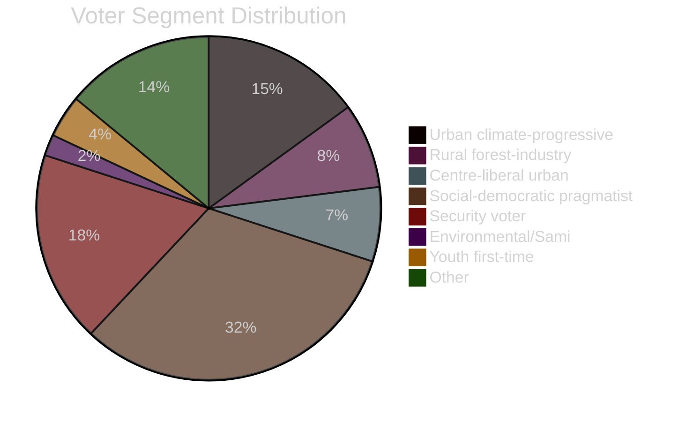

# Voter Segmentation: Opposition Motions 2026-05-05

**Author**: James Pether Sörling | **Date**: 2026-05-05 | **Confidence**: MEDIUM [C2]

## Segmentation framework

Seven voter segments defined by values matrix (environment × rule of law × economic priority × rural/urban geography).

## Segment profiles

### Segment 1: Urban climate-engaged progressive (V+MP base, ~15% of electorate)

**Profile**: Urban, 18–45, highly educated, environment as primary voting issue, pro-EU, feminist, rights-oriented.

**Motion salience**: HD024141 (V), HD024147 (MP) — total forestry rejection — extremely salient. HD024142 (V) — CRC juvenile justice — secondary salience.

**Electoral implication**: If MP fails 4% threshold, these voters "useful-vote" to V or S. The forestry motions are a direct retention mechanism for MP. V's total-rejection stance (HD024141) is a direct transfer bid.

### Segment 2: Rural forest-industry dependent (~8% of electorate, concentrated in Norrland, Värmland, Dalarna)

**Profile**: Rural, 35–65, employed in or adjacent to forestry industry, property-rights oriented, skeptical of EU regulation.

**Motion salience**: HD024145 (C), HD024143 (SD) — both support deregulation. Opposed to V/MP/S positions.

**Electoral implication**: SD has been gaining in this segment since 2018. C is losing ground here. HD024145 is C's last-ditch rural signal. SD's HD024143 (more deregulation) is a direct rural voter bid.

### Segment 3: Centre-liberal urban professional (C base, ~7% of electorate)

**Profile**: Urban, 30–55, business-oriented but rights-protective, pro-EU, anti-corruption, economic liberal.

**Motion salience**: HD024146 (C) — CRC against age cut — HIGH salience. This segment values rule of law and rights compliance above crime-tough positioning.

**Electoral implication**: This is C's core retention segment. HD024146 is a direct signal: "we are not SD on civil liberties." If C fails here, it risks losing urban professionals to L.

### Segment 4: Social-democratic pragmatist (S base, ~32% of electorate)

**Profile**: Broad demographic, municipal employment, welfare state supporters, graduated environmental concern.

**Motion salience**: HD024144 (S) — consequence analysis — MEDIUM salience. Procedural accountability is a valued S brand attribute. Low direct concern for youth justice CRC angle.

**Electoral implication**: S's careful positioning (neither total rejection nor government acquiescence) is designed to retain this segment.

### Segment 5: Tough-on-crime security voter (~18% of electorate, overlapping SD+M)

**Profile**: Suburban and rural, 40–70, crime as primary voting issue, skeptical of "liberal" rights arguments.

**Motion salience**: Government proposition HD03246 (age cut to 13) SUPPORTED. Opposition motions on youth crime (V, C, MP) viewed negatively. HD024143 (SD) and government position are resonant.

**Electoral implication**: Government coalition's base. Opposition CRC arguments are likely to reinforce rather than persuade this segment.

### Segment 6: Environmental farmer and Sami (niche, ~2% of electorate, high geographic concentration)

**Profile**: Sami reindeer herders, organic farmers, biodiversity farmers in Norrland and highland regions.

**Motion salience**: HD024141 (V) explicitly invokes Sami Parliament opposition. Directly salient. ILO 169 (cited in HD024141) is a rights-based claim with strong resonance in this segment.

**Electoral implication**: Small segment but geographically concentrated in C and V strongholds in northern Sweden.

### Segment 7: Youth and first-time voter (18–22, ~4% of electorate)

**Profile**: New voters, digitally native, climate and rights dual concern, MP and V as primary consideration.

**Motion salience**: Both CRC (HD024142, 146, 148) and climate/forestry (HD024141, 147) motions are highly salient. This segment is being directly told that 13-year-olds could face criminal prosecution — a visceral CRC argument.

**Electoral implication**: Primarily benefits V and MP mobilisation. If MP crosses 4% threshold, this segment is a significant driver.

