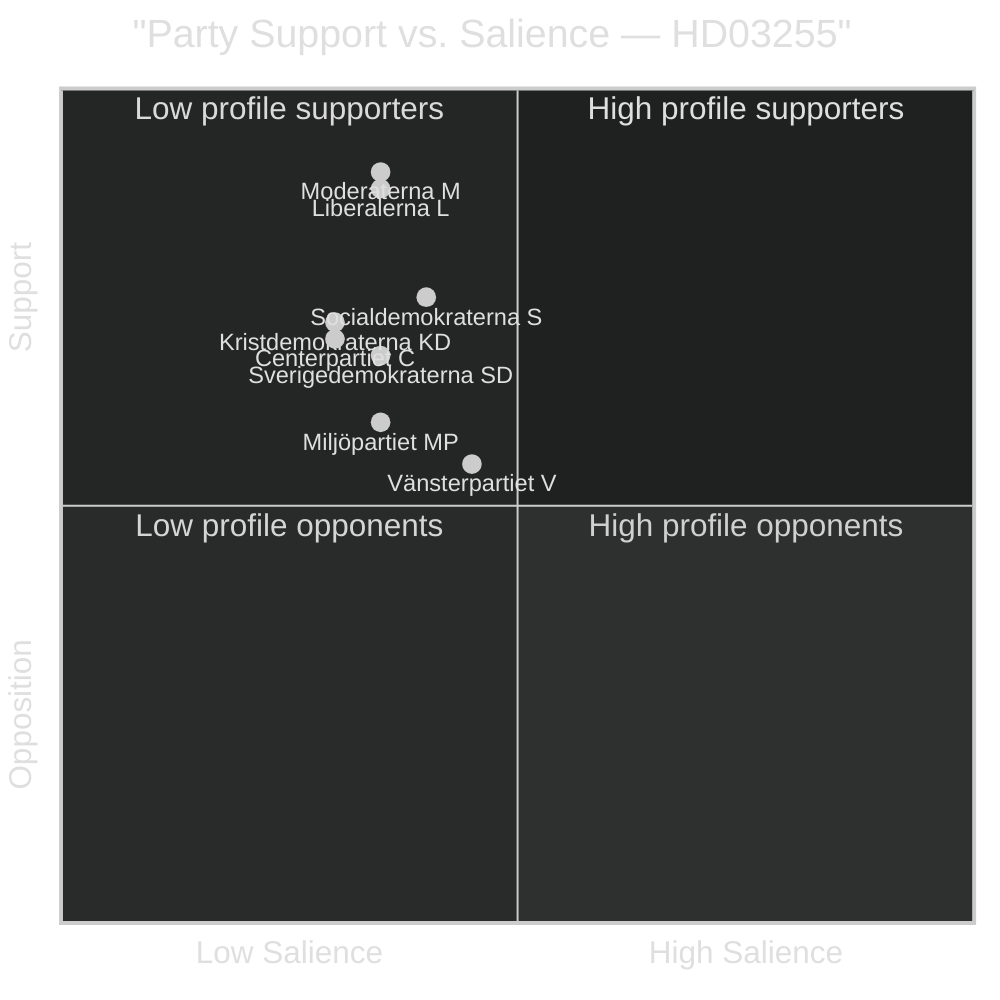

# Classification Results — Propositions 2026-05-05

**Author**: James Pether Sörling  
**Date**: 2026-05-05  

---

## Political Classification

### HD03255 — "Stickprovsinsamling av uppgifter om hushållens skulder"

| Dimension | Classification | Evidence |
|-----------|---------------|----------|
| **Policy Domain** | Financial Stability / Macro-prudential regulation | HD03255 mottagare=FiU; titel references household debt data |
| **Legislative Type** | Government Proposition (Prop.) | doktyp=prop; intressent=Lotta Edholm + Niklas Wykman |
| **Parliamentary Track** | Standard committee referral → FiU45 | H6D1plan planeringsdokument; scheduled 2026-06-15 |
| **EU Alignment** | EU-aligned (ESRB gap-fill) | Macro-prudential data mandates; ESRB framework |
| **Constitutional Sensitivity** | MEDIUM | RF 2:6 privacy; Lagrådet review triggered |
| **Political Salience** | LOW-MEDIUM | Technical financial regulation; limited public controversy |
| **Urgency** | MEDIUM | Vote scheduled June 2026; FI needs authority before autumn |
| **Conflict Level** | LOW | Cross-party financial stability consensus likely |

### Issue-Position Map

### Signal Intelligence Classification

**PIR Assignment**: PIR-2 (Financial Stability Governance)  
**Collection Priority**: L1 (high-priority, scheduled vote within 45 days)  
**Dissemination Level**: PUBLIC — no personal data, parliamentary public records  
**Information Quality**: A2 (reliable source; single-document verification)
